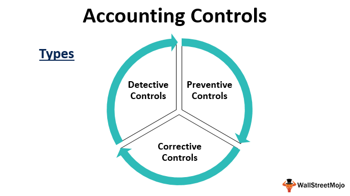

## Table of Contents

## What is accounting control?

Accounting control refers to the methods and procedures that businesses use to make sure their financial information is accurate, reliable, and secure. These controls help prevent mistakes, fraud, and mismanagement of money. They include things like keeping detailed records, checking transactions regularly, and separating duties among different employees to reduce the risk of errors or dishonest behavior.

These controls are important because they help a business run smoothly and follow the law. For example, by having strong accounting controls, a company can make sure that all its financial reports are correct and that it can be trusted by investors and regulators. Without these controls, a business might face financial losses or even legal problems.

## Why are accounting controls important for businesses?

Accounting controls are really important for businesses because they help keep the money safe and the records correct. They stop mistakes from happening and make sure no one can cheat or steal money. This is good because it means the business can trust its own numbers and make good decisions based on them. If a business doesn't have good accounting controls, it might lose money or make bad choices without even knowing it.

These controls also help businesses follow the rules and laws about money. When a business has strong accounting controls, it can show everyone, like investors and the government, that it is doing things the right way. This makes people trust the business more. Without these controls, a business could get into trouble with the law or lose the trust of people who might want to invest in it.

## What are the main types of accounting controls?

There are two main types of accounting controls: preventive controls and detective controls. Preventive controls are like safety measures that stop problems before they happen. They include things like having different people handle different parts of a financial transaction, so no one person can do everything and maybe cheat. Another example is having rules about who can approve spending, which stops people from spending money they shouldn't.

Detective controls, on the other hand, are like detectives that find problems after they happen. They help catch mistakes or fraud that might have slipped through. These controls include things like regular checks of the financial records to see if everything adds up correctly. Another example is having surprise audits, where someone comes in unexpectedly to look at the [books](/wiki/algo-trading-books) and make sure everything is okay.

Both types of controls are important for a business. Preventive controls help stop problems before they start, while detective controls help find and fix any issues that do happen. Together, they make sure the business's money is safe and its records are accurate.

## Can you explain preventive controls in accounting?

Preventive controls in accounting are like safety guards that stop mistakes or fraud before they happen. They work by setting up rules and checks that make it hard for someone to do something wrong. For example, a business might have a rule that says one person can't handle all parts of a financial transaction. Instead, different people are in charge of different steps, like one person approves the spending, another person does the actual spending, and a third person checks the records. This way, no one person can cheat the system because they need others to help complete the process.

Another way preventive controls work is by setting limits on who can do what with the company's money. For instance, only certain people might be allowed to approve big purchases, and they might need to get permission from someone higher up. This helps stop people from spending money they shouldn't or making decisions that could hurt the business. By having these rules in place, a business can protect its money and make sure everyone follows the right steps when handling finances.

## What are detective controls and how do they work?

Detective controls in accounting are like detectives that find problems after they happen. They help catch mistakes or fraud that might have slipped through the preventive controls. These controls work by checking the financial records to see if everything adds up correctly. For example, a business might do regular checks where they look at all the numbers and make sure they match up with what should be there. If something doesn't add up, they can find it and fix it before it causes bigger problems.

Another way detective controls work is by having surprise audits. This means someone comes in unexpectedly to look at the books and make sure everything is okay. They check to see if the money is being handled correctly and if the records are right. If they find something wrong, like someone stealing money or making mistakes, they can report it and the business can take action to fix it. This helps keep the business's money safe and its records accurate, even if something goes wrong.

## How do corrective controls help in accounting?

Corrective controls in accounting are like fixing a problem after it's been found. They help businesses make things right when mistakes or fraud happen. Once a problem is discovered, corrective controls step in to fix it. For example, if an audit finds that some money is missing, corrective controls would involve figuring out what went wrong, getting the money back if possible, and making sure it doesn't happen again.

These controls are important because they help a business recover from mistakes and improve its processes. After fixing the problem, the business might change its rules or add new checks to prevent the same issue in the future. This way, corrective controls not only solve the current problem but also make the whole accounting system stronger and more reliable.

## What is the difference between manual and automated accounting controls?

Manual accounting controls are the ones where people do the work by hand. They involve things like checking numbers on paper, having people sign off on transactions, and doing regular reviews of the books. These controls can be good because they let people use their judgment and catch things that might be hard for a computer to see. But they can also be slow and more likely to have mistakes because people can get tired or distracted.

Automated accounting controls use computers and software to keep an eye on things. They can check numbers really fast and make sure everything adds up without someone having to do it by hand. This can make things more accurate and save time. But sometimes, these controls might miss things that need a human touch, like understanding why a number looks strange. Also, they need to be set up right, or they might not work as well as they should.

Both manual and automated controls have their place in accounting. Manual controls are good for detailed checks and understanding the context, while automated controls are great for speed and accuracy. Using both together can make a business's accounting system strong and reliable.

## Can you provide examples of internal accounting controls?

Internal accounting controls are rules and checks a business uses to keep its money safe and its records right. One example is separation of duties. This means different people handle different parts of a money transaction. For instance, one person might order something, another person might pay for it, and a third person might check the records. This way, no one person can do everything and maybe cheat. Another example is authorization controls. These are rules about who can approve spending. Only certain people can say yes to big purchases, and they might need to get permission from someone higher up. This helps stop people from spending money they shouldn't.

Another kind of internal control is physical controls. These are ways to keep important papers and money safe. For example, a business might lock up its checks and cash in a safe, and only a few people might have the key. This stops people from taking money or changing records without being noticed. There are also information processing controls. These are checks to make sure the computer systems are working right. A business might use software that automatically checks numbers and makes sure they add up correctly. If something looks wrong, the software can alert someone to look at it more closely. These controls help catch mistakes or fraud early.

## How do segregation of duties act as an accounting control?

Segregation of duties is an important accounting control that helps keep a business's money safe. It works by making sure that no one person can do everything related to a financial transaction. For example, in a company, one person might be in charge of ordering supplies, another person might handle the payment, and a third person might check the records to make sure everything is correct. By splitting these tasks up, it's harder for someone to cheat or make mistakes without others noticing. If someone tried to order something they shouldn't and pay for it themselves, they would need help from others, which makes it more likely that the problem will be caught.

This control is really helpful because it adds an extra layer of safety to the business's money. It stops one person from having too much power over the finances, which can lead to fraud or errors. When different people are involved in different parts of a transaction, it's easier to keep everything honest and correct. This way, the business can trust its financial records and make sure that its money is being used the right way.

## What role do reconciliations play in accounting controls?

Reconciliations are a big part of accounting controls because they help make sure the numbers in the books match up with what's really happening. Think of it like checking your homework answers with the answer key. In a business, this means comparing the money in the bank with what the records say should be there. If there's a difference, it could mean there's a mistake or maybe even fraud. By doing reconciliations regularly, a business can find these problems early and fix them before they get bigger.

Reconciliations also help keep the business's records accurate and trustworthy. When a company does its financial reports, it needs to be sure that all the numbers are right. By checking and double-checking through reconciliations, the business can make sure its reports are correct. This is important because it helps the business follow the law and keeps investors and other people who care about the company's money happy and trusting. Without reconciliations, a business might miss mistakes or fraud, which could lead to big problems down the road.

## How can businesses implement effective accounting controls?

Businesses can implement effective accounting controls by first setting up clear rules and processes for handling money. This means deciding who can do what with the company's money and making sure different people are in charge of different parts of financial transactions. For example, one person might approve spending, another might actually spend the money, and a third might check the records. This way, no one person can do everything and maybe cheat. It's also important to use both manual and automated checks to catch mistakes or fraud. Manual checks let people use their judgment, while automated checks can quickly find errors in numbers.

Another key part of implementing effective accounting controls is doing regular checks and audits. Businesses should look at their financial records often to make sure everything adds up correctly. If something looks wrong, they can fix it before it becomes a big problem. Surprise audits can also help find issues that might be missed in regular checks. By combining these different kinds of controls, a business can keep its money safe and its records accurate. This helps the business follow the law and keeps everyone who cares about the company's money, like investors, happy and trusting.

## What are some advanced techniques for monitoring and improving accounting controls?

Businesses can use advanced techniques like data analytics to monitor and improve their accounting controls. Data analytics means using computers to look at a lot of numbers quickly and find patterns or strange things that might show mistakes or fraud. For example, a business might use software to check all its transactions and see if there are any that don't fit the usual pattern. If the software finds something odd, it can alert someone to look at it more closely. This helps catch problems early and keeps the business's money safe.

Another advanced technique is using continuous monitoring systems. These systems keep an eye on the business's money all the time, not just when someone does a check. They can automatically look for things like unusual spending or changes in the records. If something looks wrong, the system can send an alert right away. This way, the business can fix problems as soon as they happen, which makes the accounting controls even stronger. By using these advanced techniques, a business can make sure its money is always safe and its records are always right.

## References & Further Reading

[1]: Bergstra, J., Bardenet, R., Bengio, Y., & Kégl, B. (2011). ["Algorithms for Hyper-Parameter Optimization."](https://dl.acm.org/doi/10.5555/2986459.2986743) Advances in Neural Information Processing Systems 24.

[2]: ["Advances in Financial Machine Learning"](https://www.amazon.com/Advances-Financial-Machine-Learning-Marcos/dp/1119482089) by Marcos Lopez de Prado

[3]: ["Evidence-Based Technical Analysis: Applying the Scientific Method and Statistical Inference to Trading Signals"](https://www.amazon.com/Evidence-Based-Technical-Analysis-Scientific-Statistical/dp/0470008741) by David Aronson

[4]: ["Machine Learning for Algorithmic Trading"](https://github.com/stefan-jansen/machine-learning-for-trading) by Stefan Jansen

[5]: ["Quantitative Trading: How to Build Your Own Algorithmic Trading Business"](https://www.amazon.com/Quantitative-Trading-Build-Algorithmic-Business/dp/1119800064) by Ernest P. Chan