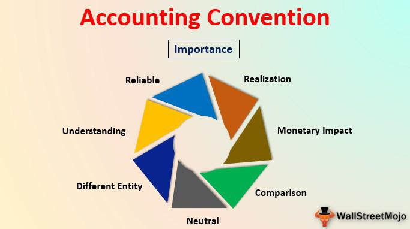

Algorithmic trading, often referred to as 'algo trading', represents a sophisticated approach to executing trades where computer algorithms dictate the timing, price, and volume of stock orders. This methodology is becoming increasingly prominent in contemporary financial markets, characterized by its ability to conduct trades with speed and precision beyond human capacity. In today's financial landscape, these complex algorithms are not just augmenting but gradually replacing human decision-making processes. This transition introduces a unique set of challenges and opportunities, particularly in the domain of accounting methods.

As the trading process becomes more automated and efficient, the intersection of accounting and algorithmic trading becomes an area of significant interest. This article will examine how conventional accounting principles are adapted to meet the needs of this dynamic and automated trading environment. Traditional accounting methods, such as accrual accounting and cash accounting, play an essential role in ensuring accurate financial reporting and compliance with ever-evolving regulatory standards. Understanding how these methods are applied in algorithmic trading is crucial for maintaining the integrity and transparency of financial operations.

Moreover, specific accounting conventions and principles provide the framework necessary for capturing the financial performance of firms engaged in algorithmic trading. This comprehensive overview will address both the advantages and the challenges associated with implementing these accounting methods within algo trading. The article aims to offer insights pertinent to finance professionals, investors, and those interested in automated trading systems, detailing the impact of robust accounting practices on decision-making, transparency, and operational efficiency. By examining these aspects, the article underscores the pivotal role of accounting in supporting algorithmic trading within modern financial markets.

## Table of Contents

## Understanding Algorithmic Trading

Algorithmic trading, often referred to as "algo trading," utilizes pre-programmed rules to execute trades that are typically too intricate and rapid for human traders. These algorithms systematically consider variables such as timing, price, and trading volume to make split-second decisions. The infusion of financial technology into traditional trading strategies has resulted in an unprecedented level of precision and speed, unmatched by manual methods.

The genesis of algorithmic trading can be traced back to the 1970s, with the expansion of computerized trading systems accelerating its development. Initially, algorithms were employed for simple tasks such as rebalancing indices, but advances in computing power and data analytics have allowed for much more sophisticated strategies. By the late 1990s and early 2000s, high-frequency trading (HFT) had emerged as a pivotal strategy within the algorithmic trading landscape. HFT aims to capitalize on minute price discrepancies that exist only for fleeting moments, translating them into profit through a rapid succession of orders.

Arbitrage is another well-established strategy in algorithmic trading. This technique involves the simultaneous purchase and sale of an asset in different markets to exploit price differences. For example, if a stock is sold for $100 in one market and $100.5 in another, an algorithm might automatically buy the stock in the first market and sell it in the second, earning a profit from the price differential.

Mean reversion strategies assume that stock prices will revert to their historical averages over time. Algorithms employing these strategies identify stocks that have significantly deviated from their historical average prices and execute trades that anticipate a reversion to these norms.

Investment banks, pension funds, mutual funds, and hedge funds have increasingly leveraged [algorithmic trading](/wiki/algorithmic-trading) to enhance efficiency and facilitate the execution of sizable orders rapidly, achieving reduced transaction costs and optimizing portfolio management. The impact on financial markets has been profound, leading to increased market [liquidity](/wiki/liquidity-risk-premium) and narrower bid-ask spreads, but also raising concerns about market [volatility](/wiki/volatility-trading-strategies) and systemic risks due to the high speeds and volumes of trading.

In summary, algorithmic trading represents a significant era of financial market evolution, characterized by rapid execution, sophisticated strategies, and a substantial influence on market dynamics. Its continued growth and integration into traditional financial systems illustrate the transformative power of technology in modern trading ecosystems.

## Accounting Methods in Algorithmic Trading

Accounting methods play a crucial role in accurately capturing and representing the financial performance of firms involved in algorithmic trading. Two primary accounting methods of relevance are accrual accounting and cash accounting, each possessing unique characteristics that influence their applicability to trading activities.

Accrual accounting is widely adopted in algorithmic trading due to its comprehensive nature. It records financial transactions as they occur, irrespective of cash flow changes. This method provides a more accurate representation of a firm's financial position by including all financial events in the accounting period they happen. Consequently, accrual accounting aligns more closely with the nature of algorithmic trading, where transactions can involve future payables and receivables that impact the overall financial standings of the trading entity.

On the other hand, cash accounting recognizes transactions only when cash is exchanged. While straightforward, this method may not adequately reflect the financial state of companies engaged in high-frequency and complex trading activities, where numerous transactions may not immediately result in cash flows.

The advent of automated trading systems further underscores the need for robust accounting methods. As these systems execute trades rapidly and in high volumes, accounting frameworks must ensure accurate financial reporting. This necessity is heightened by the regulatory standards imposed on financial market participants. Accurate financial documentation underpins regulatory compliance, enabling firms to meet the stringent demands of financial authorities and stakeholders.

In managing algorithmic trading operations, accounting methods facilitate critical financial oversight. They assist in tracking the performance and profitability of trading strategies, ensuring that firms can adapt and optimize their approaches. The chosen accounting method must not only capture real-time trading activities but also provide transparency and accountability in financial reports.

In summary, the application of suitable accounting methods in algorithmic trading is fundamental to ensuring accurate and transparent financial reporting. The preference for accrual over cash accounting, driven by the complexity of trading transactions within automated systems, highlights the method's importance. It empowers firms to achieve compliance with regulatory requirements and maintain a true representation of their financial health, thereby supporting informed strategic decisions in an evolving financial landscape.

## Applications and Benefits of Accounting in Algorithmic Trading

The integration of accounting methods with algorithmic trading offers several advantages, particularly in terms of transparency and effective management of financial data. Algorithmic trading, characterized by high speed and [volume](/wiki/volume-trading-strategy), generates vast quantities of financial data that require precise accounting to ensure clarity and reliability. This integration withstands the pressures of high-frequency trading environments and maintains the integrity of financial data.

Key accounting conventions, such as consistency and full disclosure, play a crucial role in maintaining high standards of financial reporting for trading firms. Consistency in accounting practices ensures that financial statements are comparable over different periods, allowing stakeholders to accurately assess the performance and financial position of a trading entity. Full disclosure, on the other hand, mandates the comprehensive reporting of all relevant financial information, thereby reducing the risk of misunderstandings or misrepresentations in financial reports. These conventions are particularly important in algorithmic trading where rapid decision-making based on accurate data is critical.

Proper accounting applications are essential for better financial oversight. They help in evaluating the economic impacts of various trading strategies by providing a methodical way to record, analyze, and interpret financial transitions. Such oversight allows firms to fine-tune their trading algorithms based on profitability and risk evaluations, ultimately guiding strategic planning and performance assessment.

Incorporating accounting principles into trading operations enhances decision-making processes by bridging the gap between financial data and strategic goals. With access to accurate financial reports, traders can make informed decisions that align their algorithmic strategies with broader financial objectives. This alignment is pivotal as it directs algorithmic adjustments and trading activity to reflect the desired financial outcomes.

Moreover, robust accounting practices assist trading firms in attaining regulatory compliance, which is critical in the highly regulated financial markets. By adhering to standardized accounting procedures, firms ensure they meet the financial and reporting requirements set by regulatory bodies. This compliance not only mitigates legal risks but also bolsters the firm’s credibility among investors and stakeholders.

In sum, the integration of accounting methods within algorithmic trading streamlines operational efficiency. The thorough and precise nature of accounting practices reduces errors and inefficiencies, ultimately enhancing the overall effectiveness of trading operations. As such, accounting serves as an indispensable tool in managing the complexities and demands of algorithmic trading environments, providing a framework for transparency, efficiency, and regulatory compliance.

## Challenges and Considerations

Algorithmic trading introduces complexities that challenge traditional accounting practices, necessitating both adaptations and innovations to maintain financial accuracy and integrity. One of the primary challenges is ensuring accuracy and consistency in financial reporting amidst the rapid pace of trading activities. Algorithmic systems can execute thousands of trades per second, generating a vast amount of transactional data. This [high frequency](/wiki/high-frequency-trading) makes it difficult for traditional accounting methods, which often rely on manual data entry and periodic reconciliations, to keep up.

To address this, accounting systems must be integrated with trading platforms, enabling real-time data capture and processing. This enables accurate financial reporting and reduces the likelihood of discrepancies. Advanced software solutions that employ [machine learning](/wiki/machine-learning) and data analytics can further enhance the speed and accuracy of financial transaction processing, ensuring consistency across multiple trades and positions.

Regulatory compliance is another pressing concern. The global nature of financial markets means that algorithmic trading firms must adhere to a variety of international standards and local regulations. These regulations are continually evolving, particularly in response to technological advancements and market events. Thus, firms must allocate resources to stay informed about regulatory changes and implement them promptly. This requires collaboration between accounting professionals, compliance officers, and IT departments to ensure that the financial reporting systems reflect current regulatory requirements.

Additionally, integrating and securing the vast amounts of financial data generated by automated trading systems is a significant challenge. Data security is paramount, as any breach could result in severe financial losses and legal repercussions. Implementing robust cybersecurity measures, such as encryption, secure access controls, and regular security audits, is crucial. Furthermore, data integration requires ensuring compatibility between diverse systems and data formats, which can be addressed by adopting standardized data protocols and employing data transformation tools.

For accounting professionals involved in algorithmic trading, adopting best practices is essential. Developing expertise in financial software systems and staying informed about technological advancements can enhance their ability to manage these challenges effectively. Continuous professional development and cross-disciplinary collaboration are also vital, as they enable accounting experts to contribute to the development of innovative solutions that address the unique demands of algorithmic trading environments.

## Conclusion

As algorithmic trading continues to grow, the importance of robust accounting methods cannot be overstated. These practices provide the essential framework and oversight necessary to maintain the financial integrity and ensure the regulatory compliance of automated trading systems. By applying rigorous accounting standards, firms are able to verify the accuracy of financial data, adhere to statutory requirements, and mitigate risks associated with increasingly complex trading activities.

The integration of accounting with algorithmic trading fosters improved decision-making, transparency, and financial outcomes. Informed by reliable financial data and comprehensive reports, traders can fine-tune their strategies to align with broader economic objectives and investor goals. This integration assists in assessing the performance of algorithms in real-time, thereby enhancing the agility and responsiveness of trading operations.

Throughout this article, we have outlined the crucial role of accounting methods in supporting the dynamic activities of algorithmic trading. Such methods not only facilitate operational efficiency but also promote trust among stakeholders by ensuring that all transactions are recorded accurately and disclosures are made transparently.

In closing, the collaboration between finance and accounting disciplines remains pivotal for navigating the complexities of modern financial markets. By leveraging advancements in both fields, organizations can achieve a balanced approach to innovation and compliance, maintaining a competitive edge while upholding high standards of financial stewardship. This partnership is key in creating resilient financial systems capable of adapting to the evolving landscape of global markets.

## References & Further Reading

[1]: ["Advances in Financial Machine Learning"](https://www.amazon.com/Advances-Financial-Machine-Learning-Marcos/dp/1119482089) by Marcos Lopez de Prado

[2]: ["Quantitative Trading: How to Build Your Own Algorithmic Trading Business"](https://www.amazon.com/Quantitative-Trading-Build-Algorithmic-Business/dp/1119800064) by Ernest P. Chan

[3]: ["Evidence-Based Technical Analysis: Applying the Scientific Method and Statistical Inference to Trading Signals"](https://books.google.com/books/about/Evidence_Based_Technical_Analysis.html?id=MeoJAQAAMAAJ) by David Aronson

[4]: ["Machine Learning for Algorithmic Trading"](https://github.com/stefan-jansen/machine-learning-for-trading) by Stefan Jansen

[5]: Hendricks, D., Patel, J., & Zeckhauser, R. (1993). ["Hot Hands in Mutual Funds: Short-Run Persistence of Relative Performance, 1974-1988."](https://onlinelibrary.wiley.com/doi/abs/10.1111/j.1540-6261.1993.tb04703.x) Journal of Finance, 48(1), 93-130.

[6]: Purnanandam, A. (2005). ["Interest Rate Derivatives at Commercial Banks: An Empirical Investigation."](https://www.sciencedirect.com/science/article/pii/S0304393206002285) The Journal of Finance, 60(3), 1423-1456.