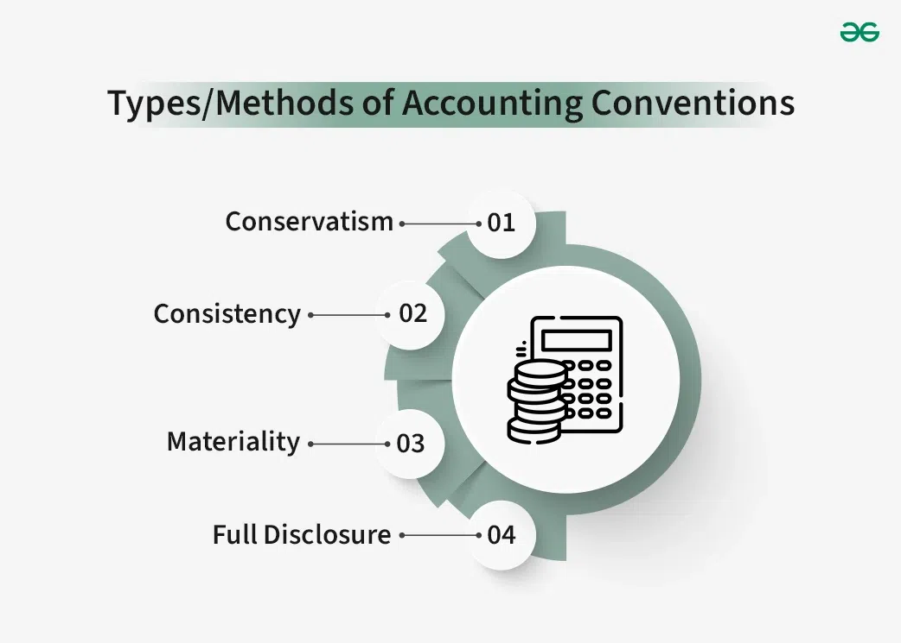

## Table of Contents

## What are accounting conventions?

Accounting conventions are the rules and practices that accountants follow when they prepare financial statements. These conventions help make sure that the financial information is clear and easy to understand for everyone who looks at it. They are like guidelines that help keep accounting consistent and reliable, so people can trust the numbers they see.

Some common accounting conventions include the consistency principle, which says that businesses should use the same accounting methods from one period to the next. This helps people compare financial statements over time. Another convention is the conservatism principle, which tells accountants to be careful and not to overstate assets or income. This helps protect against being too optimistic and making mistakes that could mislead people who use the financial statements.

## Why are accounting conventions important in financial reporting?

Accounting conventions are important in financial reporting because they help make sure that the numbers and information in financial statements are clear and easy to understand. When everyone follows the same rules, it's easier for people to compare financial information from different companies or from the same company over time. This consistency helps people make better decisions about where to invest their money or how to run their business.

These conventions also help keep financial reporting honest and trustworthy. For example, the conservatism principle tells accountants to be careful and not to overstate how much money a company has or how much it has earned. This helps prevent mistakes or even fraud that could mislead investors or other people who use the financial statements. By following these conventions, accountants can give a fair and accurate picture of a company's financial health.

## Can you list the main types of accounting conventions?

Accounting conventions are like rules that help accountants make sure the numbers in financial reports are clear and fair. Some common conventions include the consistency principle, which means a company should use the same accounting methods each year so people can compare the numbers easily. Another important convention is the conservatism principle, which tells accountants to be careful and not to make the company look richer than it really is. This helps keep the financial reports honest.

There's also the materiality principle, which says that accountants should focus on the big, important numbers and not worry too much about small details that don't make a big difference. The full disclosure principle is another convention that says companies should tell everything important about their finances, so people have all the information they need to make good decisions. These conventions help everyone trust the financial reports and make better choices with their money.

## How does the consistency convention apply in accounting?

The consistency convention in accounting means that a company should use the same accounting methods and practices from one period to the next. This is important because it helps people who look at the financial statements understand them better. If a company keeps changing how it does its accounting, it can be confusing and hard to compare the numbers from one year to another. For example, if a company always uses the same way to figure out how much its inventory is worth, people can see if the company is getting better or worse at managing its stock over time.

Sometimes, a company might need to change its accounting methods, but if it does, it has to explain why and show how the change affects the numbers. This way, people can still trust the financial reports and make good decisions. The consistency convention helps keep things clear and fair, so everyone can rely on the financial statements to get a true picture of how the company is doing.

## What is the materiality convention and how is it used?

The materiality convention in accounting says that companies should focus on the big, important numbers and not worry too much about small details that don't make a big difference. It's like saying, "Don't sweat the small stuff." If something is material, it means it's big enough to matter and could change someone's decision about the company. For example, if a company made a small mistake that only changed its total earnings by a tiny amount, it might not be worth mentioning because it's not material.

Accountants use the materiality convention to decide what to include in financial reports. They look at how big an error or a piece of information is compared to the whole picture of the company's finances. If it's big enough to affect someone's view of the company, then it's material and should be included. This helps keep financial reports clear and focused on what really matters, so people can make good decisions without getting bogged down by tiny details that don't make a difference.

## Explain the conservatism convention and its impact on financial statements.

The conservatism convention in accounting tells accountants to be careful and not to make the company look richer than it really is. It's like saying, "When in doubt, go with the option that shows less profit or fewer assets." This helps keep financial statements honest and prevents people from being too optimistic about how well the company is doing. For example, if a company is not sure if it will get paid for a sale, the conservatism convention says it should not count that money as income until it's sure.

This convention has a big impact on financial statements because it can make a company's profits look smaller than they might be if the accountants were more optimistic. It also means that the company's assets might be shown as less valuable. This can affect how investors and other people see the company's financial health. They might think the company is doing worse than it really is, but it's better to be safe and honest than to risk overstating how well the company is doing.

## How does the full disclosure convention affect the transparency of financial reports?

The full disclosure convention means that companies should tell everything important about their finances in their reports. This makes the financial reports more transparent because it gives people all the information they need to understand how the company is doing. When a company follows this convention, it shares details about things like big contracts, lawsuits, or changes in how it does its accounting. This helps people trust the financial reports and make better decisions about investing or running their own businesses.

By following the full disclosure convention, companies make sure that nothing important is left out of their financial reports. This means that even if there are risks or problems, they are shared openly. This transparency helps everyone get a true picture of the company's financial health. It's important because it keeps the financial information honest and helps people make choices based on all the facts.

## What role does the matching convention play in income statement preparation?

The matching convention is a rule in accounting that helps make sure the income statement shows a fair picture of a company's earnings. It says that when a company makes money from selling something, it should also show the costs of making that sale in the same time period. This helps match up the money coming in with the money going out, so people can see if the company really made a profit or not.

For example, if a company sells a product in January, the matching convention says it should also count the cost of making that product in January's income statement. This way, the income statement will show the true profit from that sale, not just the money coming in. By following the matching convention, the income statement becomes more accurate and helpful for people who want to understand how well the company is doing.

## How can the going concern convention influence business decisions?

The going concern convention is a rule in accounting that says a company will keep operating and not go out of business soon. This idea helps people make decisions about the company. If people believe the company will keep going, they might decide to invest money in it or do business with it. But if there's a worry that the company might not last, people might be more careful and not want to take the risk.

This convention can change how a company plans its future. If the company thinks it will keep going, it might make long-term plans like buying new equipment or starting new projects. But if there's a chance the company might not survive, it might focus on short-term goals and try to save money instead. So, the going concern convention is important because it affects how people see the company and how the company makes its plans.

## What are the challenges of applying the historical cost convention in inflationary economies?

The historical cost convention says that companies should record the cost of their assets at the price they paid for them. This works well when prices stay the same, but it can cause problems in economies where prices are going up a lot because of inflation. When prices rise, the value of money goes down, so the old prices recorded on the [books](/wiki/algo-trading-books) don't show what things are worth now. This can make a company's financial reports look like it has less value than it really does, because the numbers don't keep up with inflation.

For example, if a company bought a building years ago, the price they paid might be much lower than what the building is worth now because of inflation. If they keep using the old price on their financial statements, it can make their assets look smaller than they really are. This can affect decisions people make about the company, like whether to invest in it or lend it money. So, in inflationary economies, it's hard to use the historical cost convention because it doesn't show the true value of things as prices change over time.

## How do accounting conventions vary across different international accounting standards?

Accounting conventions can be different depending on which country you're in because each place might have its own rules for how to do accounting. For example, in the United States, they use a set of rules called Generally Accepted Accounting Principles (GAAP). These rules tell companies how to record their money and make their financial reports. In other countries, like those in the European Union, they might use a different set of rules called International Financial Reporting Standards (IFRS). These rules can be different from GAAP in how they handle things like how to value assets or when to count income.

Even though the basic ideas of accounting conventions, like being consistent or careful, are the same everywhere, the details can be different. For instance, the way the conservatism convention is applied might be stricter in one country than in another. This means that a company might show lower profits in one country compared to another, just because of the different rules they have to follow. It's important for people who look at financial reports from different countries to know about these differences so they can understand the numbers correctly.

## Can you discuss a case study where the application of a specific accounting convention significantly impacted a company's financial reporting?

A good example of how an accounting convention can impact a company's financial reporting is the case of Enron in the early 2000s. Enron used a lot of complicated accounting tricks, but one key issue was how they applied the conservatism convention. Instead of being careful and not overstating their profits, Enron did the opposite. They used aggressive accounting methods to make their profits look much bigger than they really were. This went against the idea of conservatism, which says companies should be cautious and not overstate their financial health. By not following this convention, Enron was able to hide its real financial problems and mislead investors into thinking the company was doing much better than it actually was.

When the truth came out, it turned out that Enron was in much worse shape than its financial reports had shown. The company had to declare bankruptcy, and many people lost a lot of money. This case showed how important it is for companies to follow accounting conventions like conservatism. If Enron had been more honest and careful with its numbers, it might have been able to fix its problems before they got too big. Instead, by breaking these rules, Enron caused a huge scandal that hurt a lot of people and shook trust in financial reporting.

## References & Further Reading

[1]: ["Advances in Financial Machine Learning"](https://www.amazon.com/Advances-Financial-Machine-Learning-Marcos/dp/1119482089) by Marcos Lopez de Prado

[2]: ["Quantitative Trading: How to Build Your Own Algorithmic Trading Business"](https://www.amazon.com/Quantitative-Trading-Build-Algorithmic-Business/dp/1119800064) by Ernest P. Chan

[3]: ["Evidence-Based Technical Analysis: Applying the Scientific Method and Statistical Inference to Trading Signals"](https://books.google.com/books/about/Evidence_Based_Technical_Analysis.html?id=MeoJAQAAMAAJ) by David Aronson

[4]: ["Machine Learning for Algorithmic Trading"](https://github.com/stefan-jansen/machine-learning-for-trading) by Stefan Jansen

[5]: Hendricks, D., Patel, J., & Zeckhauser, R. (1993). ["Hot Hands in Mutual Funds: Short-Run Persistence of Relative Performance, 1974-1988."](https://onlinelibrary.wiley.com/doi/abs/10.1111/j.1540-6261.1993.tb04703.x) Journal of Finance, 48(1), 93-130.

[6]: Purnanandam, A. (2005). ["Interest Rate Derivatives at Commercial Banks: An Empirical Investigation."](https://www.sciencedirect.com/science/article/pii/S0304393206002285) The Journal of Finance, 60(3), 1423-1456.