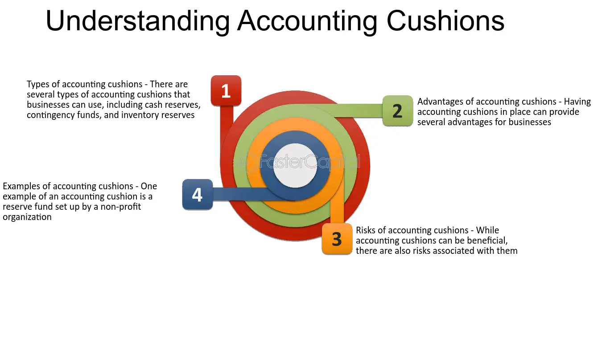

## Table of Contents

## What is an accounting cushion?

An accounting cushion is like a safety net for a company's finances. It's extra money that a business sets aside to cover unexpected costs or losses. This cushion can help a company stay stable even when things don't go as planned, like if a customer doesn't pay a bill or if there's a sudden drop in sales.

Companies often create an accounting cushion by being conservative with their financial estimates. For example, they might predict lower income or higher expenses than they actually expect. This way, if their predictions are wrong, they have extra money saved up to handle the difference. It's a smart way to manage money and keep the business running smoothly.

## Why is an accounting cushion important in financial management?

An accounting cushion is really important in financial management because it helps a company stay safe and stable. Think of it like having an extra umbrella when it might rain. If a company faces unexpected problems, like a big customer not paying on time or a sudden drop in sales, the cushion can help cover those costs without hurting the business too much. This means the company can keep running smoothly even when things go wrong.

Having an accounting cushion also helps a company plan better for the future. By setting aside extra money, a company can be more prepared for surprises. It's like saving up a little extra each month so you're ready if something unexpected happens. This way, the company can focus on growing and improving, instead of always worrying about money troubles.

## How does an accounting cushion affect a company's financial statements?

An accounting cushion can make a company's financial statements look more conservative. When a company sets aside money as a cushion, it might show lower profits on its income statement. This is because the company is saving some of its earnings instead of reporting them as profit. On the balance sheet, this cushion might appear as a reserve or a liability, depending on how the company accounts for it. This makes the company's financial position look safer and more stable, which can be good for investors and creditors.

The cushion can also affect how people see the company's financial health. If a company uses a cushion to prepare for possible losses, it might look like it's being very careful. This can make the company seem more reliable and less risky. But, if the cushion is too big, it might make the company's profits look smaller than they really are. So, it's important for a company to find a good balance so that its financial statements show a true picture of its health.

## What are the common methods to create an accounting cushion?

One common way to create an accounting cushion is by being careful with how a company predicts its money. For example, a company might guess that it will make less money than it really thinks it will. This way, if they actually make more money, they can save the extra as a cushion. They might also guess that they will spend more money than they really expect to. If they spend less than they planned, the difference can go into the cushion. This helps the company be ready for surprises.

Another method is to set aside money from profits. Instead of using all the profits to grow the business or pay shareholders, a company can save some of it as a cushion. This is like putting some money into a savings account each month. It's a simple way to build up a safety net over time. This method can help a company stay strong even if things don't go as planned.

## Can you explain the difference between an accounting cushion and earnings management?

An accounting cushion is like a safety net that a company builds to protect itself from unexpected money problems. It's when a company saves some extra money by being careful with its guesses about how much money it will make or spend. For example, if a company thinks it might earn $100 but guesses it will only earn $90, the extra $10 can go into the cushion. This helps the company stay strong even if things don't go as planned.

Earnings management, on the other hand, is when a company tries to make its financial reports look better than they really are. It's like trying to show off a little more money than the company actually has. Companies might do this to make investors happy or to get better loans. For example, a company might delay reporting some expenses to make its profits look bigger for a while. While an accounting cushion is about being safe and ready for surprises, earnings management is more about trying to look good on paper.

## What are the ethical considerations of using an accounting cushion?

Using an accounting cushion is generally seen as a good and ethical thing to do. It's like saving a little extra money each month to be ready for unexpected problems. When a company does this, it's being careful and responsible with its money. This helps the company stay strong and stable, which is good for everyone involved, like employees, customers, and investors. As long as the company is honest about what it's doing and doesn't hide the cushion in a way that tricks people, using an accounting cushion is ethical.

However, there can be some ethical issues if a company isn't clear about how it's using the cushion. For example, if a company makes its profits look smaller than they really are by setting aside too much money, it might be misleading investors or shareholders. This can make people think the company is doing worse than it actually is. So, it's important for a company to be open and honest about its accounting practices. This way, everyone can trust that the company is being fair and ethical with its money management.

## How do regulatory bodies view the use of accounting cushions?

Regulatory bodies usually see accounting cushions as a good thing. They like it when companies are careful with their money and save some extra to be ready for surprises. It shows that the company is being responsible and trying to stay strong even if things go wrong. As long as the company is honest about what it's doing and follows the rules, using an accounting cushion is okay with regulators.

However, if a company isn't clear about its accounting cushion, regulators might get worried. They don't like it when companies hide things or make their financial reports look different from what's really happening. If a company uses the cushion to trick people into thinking it's doing worse than it is, that could be a problem. So, it's important for companies to be open and follow the rules when they use an accounting cushion.

## What are the potential risks associated with maintaining an accounting cushion?

Keeping an accounting cushion can sometimes make a company's profits look smaller than they really are. If a company saves too much money as a cushion, it might show lower earnings on its financial reports. This could make investors and shareholders think the company is not doing well, even if it's actually doing okay. It's important for the company to find a good balance so that it doesn't scare people away by making its profits look too small.

Another risk is that if a company isn't clear about its accounting cushion, it might get in trouble with regulators. Regulators want companies to be honest and follow the rules. If a company hides its cushion or uses it to trick people, it could face fines or other penalties. Being open and clear about the cushion helps the company avoid these problems and keeps everyone's trust.

## How can an accounting cushion be detected in financial reports?

You can spot an accounting cushion in financial reports by looking at how a company guesses its money. If a company says it will make less money or spend more than it really does, that difference might be going into a cushion. For example, if a company thinks it will earn $100 but says it will only earn $90, the extra $10 could be the cushion. This makes the company's profits look smaller on paper, but it's actually saving some money for surprises.

Another way to see an accounting cushion is by checking the company's balance sheet. If there's a big reserve or a special account set aside for unexpected costs, that might be the cushion. Companies usually explain these reserves in their financial reports, so reading the notes can help you understand if they're using a cushion. Being open about this helps everyone trust the company more.

## What impact does an accounting cushion have on a company's tax obligations?

An accounting cushion can affect a company's tax obligations because it might make the company's profits look smaller than they really are. When a company sets aside money as a cushion, it doesn't count that money as profit right away. This means the company might pay less in taxes for that year because its reported income is lower. However, this is okay as long as the company follows the tax rules and is honest about what it's doing.

If the company uses the cushion to cover unexpected costs later, it won't change the taxes it already paid. But if the cushion is never used and just stays as savings, it could affect future taxes when the company decides to use or report that money. The key is for the company to be clear with the tax authorities about its accounting practices so that it stays on the right side of the law.

## How should investors interpret the presence of an accounting cushion in a company's financials?

When investors see an accounting cushion in a company's financials, it's usually a good sign. It means the company is being careful with its money and saving some extra for unexpected problems. This can make the company more stable and less risky, which is good for investors. It shows that the company is thinking ahead and trying to protect itself and its investors from surprises.

However, investors should also be careful. If the accounting cushion makes the company's profits look smaller than they really are, it might seem like the company is not doing as well as it actually is. Investors need to look at the whole picture and understand why the company is using a cushion. As long as the company is open about what it's doing and follows the rules, an accounting cushion can be a smart way to manage money and keep the business strong.

## What advanced strategies can companies employ to manage their accounting cushion effectively?

Companies can manage their accounting cushion effectively by using a strategy called scenario planning. This means they think about different things that could happen in the future, like a big drop in sales or a sudden increase in costs. By planning for these different situations, they can figure out how much money they need to save in their cushion. It's like packing an extra sweater when you're not sure if it will be cold. This way, the company can be ready for surprises and keep its financial reports honest and clear.

Another strategy is to use a rolling forecast. Instead of guessing their money for a whole year at once, companies can update their guesses every few months. This helps them see if they need to change the size of their cushion. If things are going better than expected, they might not need as big of a cushion. But if things are going worse, they might need to save more. By keeping their forecasts up to date, companies can make sure their cushion is just the right size to keep them safe without making their profits look too small.

## References & Further Reading

Investopedia provides a wealth of information that can deepen the understanding of financial buffers and reserves, offering insights into how these instruments function within companies to ensure financial stability and mitigate risks. Articles on this platform cover various aspects of financial reserves, from basic definitions and types to their practical applications in business settings.

For those interested in the technical side of financial markets, numerous academic papers explore [algorithmic trading](/wiki/algorithmic-trading) and financial management strategies. These papers cover the development and implementation of trading algorithms, risk management strategies, and the integration of financial buffers to maintain operational efficiency in volatile markets. Notable research often addresses the mathematical and statistical models underpinning algorithmic trading, highlighting the importance of financial reserves in maintaining market positions.

Regulatory bodies, such as the U.S. Securities and Exchange Commission (SEC), provide comprehensive guidelines on financial reporting standards. These guidelines are crucial for ensuring transparency and ethical practices in financial reporting, particularly concerning the use of accounting reserves and cushions. The SEC's regulations help prevent misleading financial statements and promote integrity in the financial markets. Businesses and financial professionals can consult these regulatory frameworks to align their practices with legal standards and build credibility with stakeholders.

