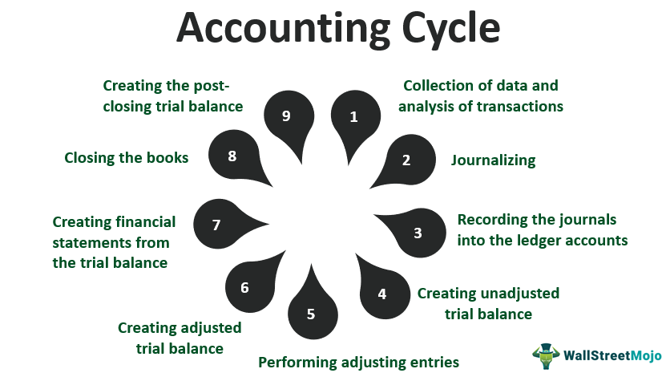

The modern financial landscape is a rapidly evolving field where accounting, technology, and strategy converge. This dynamic environment requires businesses to continually adapt to changing conditions and leverage technological advancements to maintain competitiveness. One of the core elements of modern finance is the understanding and strategic application of financial timing and the accounting cycle. Financial timing involves the scheduling of transactions to optimize profitability and cash flow, aligning closely with market behaviors and business cycles. It plays a crucial role in enhancing a company’s financial health and operational efficiency.

Furthermore, the accounting cycle serves as the backbone of financial record-keeping, ensuring accurate financial reporting and compliance with regulatory standards. These systematic processes are essential for providing insights into a company’s financial position, supporting strategic decision-making, and fostering transparency.



Simultaneously, advancements in algorithmic trading introduce new opportunities and challenges within financial markets. Algorithmic trading utilizes computer programs to execute trades at speeds and efficiencies far beyond human capacity, exploiting market inefficiencies and executing complex trading strategies. As the adoption of algorithmic trading expands across various asset classes, integrating these strategies with robust accounting processes becomes increasingly important. This integration allows for the precise monitoring, evaluation, and refinement of trading strategies, linking trading performance with broader financial management objectives.

This article explores the intersection of financial timing, accounting processes, and algorithmic trading, offering insights into how these elements work cohesively to optimize financial performance. By examining these components, businesses can better harness technology and strategic processes to achieve sustained competitive advantage in today’s fast-paced financial markets.

## Table of Contents

## Understanding Financial Timing

Financial timing is a strategic approach to scheduling financial transactions to enhance a firm's profitability and financial health. This strategy is pivotal in synchronizing financial operations with prevailing market trends and business cycles, thereby optimizing the financial outcomes for businesses.

At its core, financial timing involves making calculated decisions on when to execute transactions such as investments, payments, and sales to maximize benefits. This requires a detailed understanding of market behavior and economic cycles, as different phases can present unique opportunities or challenges. For instance, purchasing raw materials during periods of price lulls can significantly reduce costs, while selling products in high-demand phases can enhance revenue.

An essential component of effective financial timing is cash flow optimization. By aligning inflows and outflows, companies can ensure they have sufficient [liquidity](/wiki/liquidity-risk-premium) to meet obligations, avoid unnecessary borrowing costs, and capitalize on investment opportunities. Strategic timing of accounts receivable and payable, for instance, is critical. Companies may expedite collections (accounts receivable) and delay disbursements (accounts payable) without breaching terms to maintain a positive cash flow. 

Moreover, financial timing can contribute to cost reduction. For example, businesses may time capital investments to take advantage of tax breaks or subsidies that can significantly reduce net costs. Similarly, timing debt repayment during periods of lower interest rates can decrease the financial burden on a company.

Increasing revenues through timing involves well-timed market entries or exits, product launches, and setting optimal pricing strategies. For instance, launching a product just before a major holiday season can result in higher sales due to increased consumer spending during such times.

Technological advancements have equipped businesses with sophisticated tools to enhance the precision of their timing strategies. These tools often include algorithms and predictive analytics, capable of analyzing massive datasets to detect patterns and trends indicative of favorable timing for various financial decisions. For instance, [machine learning](/wiki/machine-learning) algorithms in Python can be employed to predict stock price movements, aiding in the timing of buy and sell orders:

```python
import numpy as np
from sklearn.model_selection import train_test_split
from sklearn.svm import SVR

# Example: Predicting stock prices using Support Vector Regression
def predict_stock_prices(dates, prices):
    # Reshape dates to fit model requirements
    dates = np.reshape(dates, (len(dates), 1))

    # Initialize and fit the Support Vector Regression Model
    svr_rbf = SVR(kernel='rbf', C=1e3, gamma=0.1)
    svr_rbf.fit(dates, prices)

    # Predict based on model
    return svr_rbf.predict(dates)

# Example data
dates = np.array([1, 2, 3, 4, 5])  # hypothetical dates
prices = np.array([100, 102, 104, 106, 110])  # hypothetical stock prices

# Predict future price
predicted_prices = predict_stock_prices(dates, prices)
print(predicted_prices)
```

The application of such technology not only improves decision-making but also enhances the speed and accuracy with which these timing strategies are executed. By leveraging data-driven insights, businesses can better predict market shifts, enabling precise and decisive financial actions aligned with their strategic objectives.

## Exploring the Accounting Cycle

The accounting cycle is a fundamental framework for systematically recording and managing a company's financial transactions over a given period. It begins with transaction analysis, which involves identifying and examining economic events that affect the financial statements. This is followed by the creation of journal entries, where these transactions are recorded chronologically in a journal using the double-entry bookkeeping system. Each entry typically includes a debit and a credit, ensuring that the accounting equation, Assets = Liabilities + Equity, remains balanced.

After journal entries are recorded, the data is transferred to ledgers, a process known as posting. Ledgers organize transactions by account, providing a comprehensive view of financial activity within specific accounts. This organization sets the stage for the preparation of trial balances, a critical step that verifies the balance of debits and credits at the end of an accounting period. 

The cycle culminates in the preparation of financial statements, which include the income statement, balance sheet, and cash flow statement. These documents provide stakeholders with insights into the company's financial position and performance.

Adhering to the accounting cycle is vital for ensuring transparency in financial reporting and maintaining compliance with policies and regulations. It helps prevent errors and fraud, promoting investor confidence. With advancements in technology and automation, phases of the accounting cycle have become more efficient and accurate. Accounting software now expedites tasks such as journal entry, ledger posting, and trial balance preparation, minimizing human error and freeing up time for strategic financial analysis. 

In conclusion, understanding and effectively implementing the accounting cycle is crucial for companies to maintain clear, accurate financial records that facilitate informed decision-making and compliance with regulatory standards.

## The Role of Accounting Processes in Financial Management

Accounting processes form the backbone of a company's financial management structure, providing essential insights into various aspects of business performance. These processes are fundamental in analyzing profitability, managing costs, and ensuring financial stability. By systematically recording, analyzing, and reporting financial transactions, businesses can develop a comprehensive understanding of their financial health.

Effective accounting processes are vital for strategic decision-making. They provide reliable financial data necessary for evaluating business performance and making informed decisions. This data-driven approach enables management to allocate resources efficiently, explore new investment opportunities, and manage risks effectively. Accounting processes help in the preparation of budgets and forecasts, enabling businesses to predict future financial conditions and align their strategies accordingly.

Automation has revolutionized accounting by enhancing data analysis and financial forecasting capabilities. Automated systems streamline tasks such as data entry, invoice processing, and reconciliation, reducing the likelihood of errors and freeing up resources for more strategic activities. These systems use algorithms to analyze financial data rapidly, providing real-time insights that are crucial for timely decision-making.

Transparent and robust accounting practices are critical for maintaining stakeholder confidence. Stakeholders, including investors, creditors, and regulators, rely on financial reports to make decisions regarding their involvement with a company. Transparent accounting practices enhance credibility and trust, ensuring that stakeholders have a clear picture of a company's financial position. Moreover, robust accounting practices are essential for regulatory compliance, reducing the risk of financial misreporting and associated penalties.

In conclusion, accounting processes are integral to a company's financial management framework, enabling businesses to effectively manage resources, plan strategically, and maintain transparency. As businesses continue to face complex financial environments, leveraging advanced accounting technologies will be crucial in sustaining growth and competitiveness.

 to Algorithmic Trading

Algorithmic trading uses computer programs to execute financial trades based on pre-set criteria. This technological approach offers significant advantages in terms of speed and precision, allowing traders to capitalize on market inefficiencies that may occur within milliseconds. The core of [algorithmic trading](/wiki/algorithmic-trading) revolves around the formulation and implementation of complex mathematical models, which analyze historical data to identify profitable trading opportunities.

At its essence, algorithmic trading relies on a set of predefined rules or conditions that prompt the purchase or sale of assets. For instance, a simple algorithm might be programmed to buy a stock when its 50-day moving average exceeds the 200-day moving average, a common technical indicator known as a golden cross. The use of historical data is imperative in this process, aiding in back-testing strategies to ensure they are both viable and robust before being deployed in live trading environments.

Python has emerged as a favored programming language within the algorithmic trading community due to its extensive libraries and tools that simplify data analysis and model development. Tools like NumPy and pandas facilitate efficient data manipulation, while libraries like TA-Lib provide technical analysis capabilities. Consider the following simple example of a moving average crossover strategy implemented in Python:

```python
import pandas as pd
import talib

# Load your data
data = pd.read_csv("historical_prices.csv")

# Calculate moving averages
data['50_MA'] = talib.SMA(data['Close'], timeperiod=50)
data['200_MA'] = talib.SMA(data['Close'], timeperiod=200)

# Define trading signals
data['signal'] = 0
data.loc[data['50_MA'] > data['200_MA'], 'signal'] = 1
data.loc[data['50_MA'] < data['200_MA'], 'signal'] = -1

# Print signals
print(data[['Close', '50_MA', '200_MA', 'signal']])
```

The adoption of algorithmic trading is expanding across various asset classes, including equities, fixed income, commodities, and foreign exchange, spurred by advancements in trading technology and an increased focus on leveraging historical data and quantitative methods.

Importantly, integrating algorithmic trading strategies with accounting and finance systems is crucial for monitoring and evaluating their performance accurately. This integration allows traders not only to exploit market opportunities but also to ensure compliance with financial regulations and improve strategic financial planning. It is imperative for financial managers to verify that data consistency and accuracy are maintained between the systems to support effective decision-making and optimize financial performance.

## Integrating Accounting Processes with Algorithmic Trading

Integrating accounting processes with algorithmic trading is essential for enhancing the efficiency of financial operations. By bridging these two domains, businesses can gain a comprehensive view of their financial activities, optimize performance, and improve strategic decision-making. Modern accounting systems now include robust features to track and report on algorithmic trading activities. These systems facilitate the detailed analysis of trading outcomes, allowing firms to assess the effectiveness of different strategies.

Compliance tracking is another critical aspect that benefits from this integration. Regulations often require detailed documentation of trading activities, and accounting systems can automatically generate the necessary reports, ensuring adherence to industry standards and regulatory frameworks. This capability not only aids in compliance but also supports strategic financial planning by providing valuable insights into trading performance and market conditions.

For effective integration, financial managers must ensure data accuracy and consistency between trading and accounting systems. Discrepancies in data can lead to erroneous conclusions and suboptimal decision-making. Therefore, data synchronization mechanisms are vital. These can include real-time data feeds and automated reconciliation processes that match trading records with accounting entries.

Leveraging technology to integrate finance, accounting, and trading platforms is crucial for optimizing financial timing and performance. Technological solutions, such as application programming interfaces (APIs) and middleware, facilitate seamless communication between disparate systems. This interconnectedness allows for faster data processing, enabling more responsive financial strategies.

Here's an example of how Python can be used to reconcile data between trading and accounting systems:

```python
import pandas as pd

# Load trading and accounting data
trading_data = pd.read_csv('trading_records.csv')
accounting_data = pd.read_csv('accounting_entries.csv')

# Merge data on transaction ID
merged_data = pd.merge(trading_data, accounting_data, on='transaction_id', how='inner')

# Identify discrepancies
discrepancies = merged_data[merged_data['trading_amount'] != merged_data['accounting_amount']]

# Output discrepancies
discrepancies.to_csv('discrepancies_report.csv')
```

In this code snippet, trading and accounting data are imported and merged based on unique transaction IDs. Discrepancies in transaction amounts between the two systems are identified and exported to a report for further analysis. Such tools and techniques are integral in maintaining data integrity across integrated platforms, ultimately enhancing financial performance and strategic outcomes. By embracing these integrations, businesses can better navigate the complexities of modern financial markets, positioning themselves for sustained growth and success.

## Challenges and Opportunities in the Integration

The integration of financial timing, accounting, and algorithmic trading embodies a complex landscape of both challenges and opportunities that companies must navigate to enhance their financial operations. 

One of the primary challenges is data security and privacy. As financial systems become increasingly interconnected, the [volume](/wiki/volume-trading-strategy) and sensitivity of data exchanged between accounting systems and trading platforms increase. This demands robust cybersecurity measures to protect against data breaches and unauthorized transactions. Implementing strong encryption protocols and regular security audits are essential practices to safeguard financial data.

Opportunities arise from the ability to improve decision-making processes, achieve operational efficiencies, and gain competitive advantages. By leveraging integrated technologies, firms can utilize real-time data analytics to make informed decisions swiftly and accurately. For instance, machine learning algorithms can be used to analyze transaction patterns, predict market trends, and optimize trade execution strategies. This can lead to increased profitability and a sharper competitive edge in the market.

To fully capitalize on these opportunities, firms need a cohesive strategy that aligns risk management with the insights gleaned from financial technologies. A comprehensive approach involves integrating risk assessment tools with trading algorithms and accounting systems to monitor and mitigate potential risks. This not only protects financial assets but also enhances the firm's capability to respond effectively to market volatilities.

Continued investment in both technology and skill development is crucial to maximizing the potential benefits offered by this integration. Firms should allocate resources for training programs to upskill employees, ensuring that they are proficient in using advanced trading and accounting technologies. Moreover, staying abreast with technological advancements will enable firms to adopt cutting-edge solutions that streamline operations and enhance their strategic positioning.

Ultimately, the integration offers a transformative path for firms willing to address the inherent challenges with innovative solutions and embrace the opportunities for enhanced financial performance. By doing so, businesses can ensure sustained growth and success in the ever-evolving financial landscape.

## Conclusion

The convergence of financial timing, accounting processes, and algorithmic trading offers a transformative opportunity for businesses seeking a competitive edge. By effectively integrating these elements, companies can optimize strategies to enhance financial performance and operational efficiency. The synergy between precise financial timing and structured accounting processes enables businesses to seize market opportunities swiftly and maintain financial health. Algorithmic trading further augments this integration by providing the speed and precision required to capitalize on market inefficiencies, leading to potentially increased profitability.

To thrive in this dynamic financial environment, businesses must prioritize ongoing education and adaptation. The rapid evolution of financial technologies necessitates a commitment to continuous learning and flexibility. Staying informed about emerging trends and advances in financial software, algorithmic models, and accounting tools is essential for maintaining a competitive stance.

As businesses look to the future, trends suggest a trajectory towards further automation and integration, which promises new possibilities for financial innovation. The implementation of advanced technologies such as [artificial intelligence](/wiki/ai-artificial-intelligence) and machine learning in financial systems is likely to streamline processes, enhance predictive capabilities, and facilitate real-time decision-making.

Success in this integrated financial landscape demands a deep understanding of the complex interactions between financial timing, accounting, and trading systems. Businesses must strategically leverage these relationships to align with their goals, ensuring data consistency and accuracy across all platforms. By doing so, organizations can unlock their full financial potential, maximizing returns while minimizing risks. This comprehensive approach not only bolsters financial performance but also strengthens stakeholder confidence, paving the way for sustained growth and innovation in competitive markets.

## References & Further Reading

[1]: Bergstra, J., Bardenet, R., Bengio, Y., & Kégl, B. (2011). ["Algorithms for Hyper-Parameter Optimization."](https://papers.nips.cc/paper/4443-algorithms-for-hyper-parameter-optimization) Advances in Neural Information Processing Systems 24.

[2]: ["Advances in Financial Machine Learning"](https://www.amazon.com/Advances-Financial-Machine-Learning-Marcos/dp/1119482089) by Marcos Lopez de Prado

[3]: ["Evidence-Based Technical Analysis: Applying the Scientific Method and Statistical Inference to Trading Signals"](https://www.amazon.com/Evidence-Based-Technical-Analysis-Scientific-Statistical/dp/0470008741) by David Aronson

[4]: ["Machine Learning for Algorithmic Trading"](https://github.com/stefan-jansen/machine-learning-for-trading) by Stefan Jansen

[5]: ["Quantitative Trading: How to Build Your Own Algorithmic Trading Business"](https://www.amazon.com/Quantitative-Trading-Build-Algorithmic-Business/dp/1119800064) by Ernest P. Chan