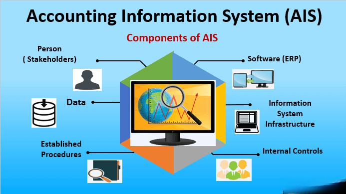

The integration of accounting data into algorithmic trading represents a significant advancement in the financial technology arena. By incorporating detailed financial metrics into automated trading strategies, traders can gain a more comprehensive understanding of market dynamics and improve their decision-making processes. This combination of accounting data and algorithmic trading not only enhances the precision of executing trades but also augments the capacity to forecast market trends and risks in a more informed manner.

As algorithmic trading continues to grow in popularity, it has become increasingly evident that relying solely on technical data may not be sufficient for maximizing trading performance. The inclusion of accounting data, such as financial statements, profit margins, and cash flow information, infuses a layer of fundamental analysis that aids in constructing robust trading algorithms. This data can be particularly useful in forming predictions about price movements following quarterly earnings announcements or other financial disclosures which significantly impact market sentiment and stock prices.

This article investigates the critical role accounting data plays in enriching trading strategies and outcomes. By exploring how accounting data is utilized in algorithmic trading, the article delineates the benefits, challenges, and future prospects of this integration. Investors and traders who seek to employ advanced data analytics will find valuable insights into harnessing accounting data to achieve a competitive advantage. Through this exploration, the article provides a strategic framework for utilizing accounting data to optimize algorithmic trading and enhance financial performance.

## Table of Contents

## Understanding Accounting Data and its Relevance

Accounting data is a critical component of financial analysis, encompassing the systematic collection, classification, and presentation of financial information derived from a company's business activities. These data are primarily structured in the form of financial statements—namely, balance sheets, income statements, and cash flow statements—each serving a distinct role in illustrating the financial health and performance of a business.

The balance sheet provides a snapshot of a company's assets, liabilities, and equity at a specific point in time. This statement reveals what a company owns and owes, as well as the invested capital from shareholders. The basic equation governing the balance sheet is:

$$
\text{Assets} = \text{Liabilities} + \text{Equity}
$$

This equation ensures that the financial statement remains balanced, offering a comprehensive view of the company's net worth.

The income statement, alternatively known as the profit and loss statement, details the company's financial performance over a specified period, capturing revenue, expenses, and profits or losses. The primary formula guiding the income statement is:

$$
\text{Net Income} = \text{Revenue} - \text{Expenses}
$$

Through this, stakeholders can assess how efficiently a company generates profit relative to its expenses and revenue generation.

The cash flow statement is another vital component, tracking the inflows and outflows of cash within a business. It segments cash activities into operating, investing, and financing categories, providing insights into a company's [liquidity](/wiki/liquidity-risk-premium) and financial flexibility.

The integration of accounting data into [algorithmic trading](/wiki/algorithmic-trading) systems enables traders to apply [fundamental analysis](/wiki/fundamental-analysis) in a systematic and automated manner. By leveraging this data, algorithms can analyze financial metrics such as earnings per share, return on equity, and debt-to-equity ratios to inform trading decisions. Such integration enhances the depth of market analysis, moving beyond mere price trends to include underlying financial performance.

This incorporation is crucial for traders seeking to make informed decisions, as it aligns trading strategies with the true financial health of entities involved. The utilization of accounting data in trading algorithms not only boosts the robustness of the trading models but also aids in predicting market movements more accurately based on the company’s actual financial condition. Consequently, this leads to optimized decision-making processes, potentially improving investment outcomes and risk management.

In summary, accounting data plays an indispensable role in understanding a company's financial status and prospects, thereby supporting informed decision-making in algorithmic trading strategies.

## The Role of Accounting Data in Algo Trading

Algorithmic trading, often referred to as algo trading, is the process of executing trades using pre-defined sets of rules and parameters derived from market data. Traditionally, these algorithms primarily relied on technical analysis, which focuses on historical market data like price movements and trading volumes. However, by integrating accounting data into these algorithms, traders can significantly enhance the depth and quality of their trading strategies by incorporating a company’s financial health into decision-making processes.

Accounting data encompasses information from financial statements such as balance sheets, income statements, and cash flow statements. This data provides vital insights into a company's operational efficiency, profitability, liquidity, and overall financial stability. By integrating such information, trading algorithms can account for fundamental financial metrics, which results in more informed and grounded trading decisions. Consider, for instance, an algorithm designed to trade stocks based on quarterly earnings reports. The integration of accounting data allows the algorithm to assess not just the immediate market reaction to an earnings report, but also underlying financial metrics such as profit margins, debt levels, and asset valuations.

One significant advantage of incorporating accounting data is the ability to develop sophisticated trading strategies aimed at predicting price movements based on financial disclosures. For instance, if a company's latest cash flow statements indicate a robust increase in net cash from operating activities, a trader might anticipate a favorable market reaction, leading to a potential increase in the stock's price. By embedding such financial metrics into trading algorithms, traders leverage a blend of technical and fundamental analysis, enhancing both risk management and decision-making.

Risk management in algo trading can be greatly improved with the use of accounting data. For example, by factoring in a company's financial ratios, such as the current ratio or debt-to-equity ratio, a trading algorithm can better assess the risk profile of a security. This can help in setting more accurate stop-loss limits or in adjusting position sizes based on the assessed financial stability of the company.

Moreover, the systematic nature of algorithmic trading allows for the consistent application of trading strategies that incorporate accounting data. Unlike human traders, algorithms can process vast quantities of financial data at high speeds, ensuring that trading decisions are made quickly and without emotional bias. This enhances the overall decision-making process and can lead to more efficient market operations.

Ultimately, the integration of accounting data into algorithmic trading heralds a new era of financial analysis and trading strategy development. By combining the detailed insights offered by financial data with the precision and speed of technology-driven trading, traders can craft more resilient and profitable trading approaches while effectively managing risk.

## Benefits of Using Accounting Data in Algorithmic Trading

Incorporating accounting data into algorithmic trading strategies presents several advantages that can significantly enhance the effectiveness and profitability of trading models. By combining technical analysis with fundamental insights derived from accounting data, traders can develop a more robust understanding of market dynamics.

One primary benefit is the ability to conduct a comprehensive analysis. While technical analysis focuses on price and [volume](/wiki/volume-trading-strategy) data to predict market movements, fundamental analysis digs deeper into a company's financial health, using information from financial statements such as income statements, balance sheets, and cash flow statements. Accounting data provides quantitative measurements of a company’s performance, thus allowing traders to assess whether a stock is under or overvalued, which is crucial for making informed trading decisions.

For example, incorporating earnings surprises—a metric derived from accounting data—into trading algorithms can improve predictive accuracy. An earnings surprise occurs when a company's reported earnings differ significantly from analysts' expectations. Historical data suggests that stocks with positive earnings surprises often outperform the market, at least in the short term. By integrating these occurrences into algorithmic models, traders can potentially enhance their trade timing and selection, leading to better outcomes.

Another advantage is the enhancement of predictive capabilities. By utilizing [machine learning](/wiki/machine-learning) algorithms trained on historical accounting data, traders can uncover patterns or anomalies that are not immediately evident through traditional analysis. For instance, an algorithm could analyze trends in a company's revenue growth, profitability ratios, or debt levels to predict future stock performance more accurately. Such data-driven insights can lead to increased trading precision and profitability.

Moreover, the integration of accounting data into algorithmic trading supports improved risk management. Understanding the fundamental strengths or weaknesses of a company allows traders to make more informed decisions about asset allocation and portfolio management. By focusing on financially sound companies, traders can reduce the likelihood of significant losses during market downturns.

In conclusion, the incorporation of accounting data into algorithmic trading provides traders with a multidimensional analytical framework, combining technical and fundamental factors. This approach not only increases trading accuracy and potential profitability but also enhances risk management, providing a significant edge in the trading landscape.

## Challenges and Considerations

Integrating accounting data into algorithmic trading poses several challenges that must be meticulously addressed to ensure the development of effective trading strategies. One significant challenge is maintaining the accuracy and timeliness of the accounting data. Traders depend heavily on precise data to formulate robust algorithms. Any errors or outdated information can disrupt trading signals, which can lead to significant financial losses. This precision is particularly critical when using quarterly earnings reports or other financial disclosures as inputs in trading models.

The quality of data directly affects the reliability of algorithmic outputs. Data inaccuracies may arise from manual entry errors, inconsistent data formats, or delays in financial reporting. A crucial aspect of addressing this challenge involves implementing rigorous data validation systems. These systems could include automated checks for anomalies, cross-referencing multiple data sources, and using machine learning algorithms to identify outliers.

Computational complexity represents another challenge. The sheer volume and variety of accounting data can overwhelm conventional data processing systems, particularly when dealing with real-time data integrations. This issue necessitates robust computational frameworks that can handle large datasets efficiently while providing analytical insights promptly. Techniques such as parallel processing and cloud computing can be employed to manage these complexities and ensure agility in data handling.

Robust data processing systems are imperative. Implementing a structured data pipeline that smoothly transitions from data collection to processing and analysis is critical. Using open-source tools like Apache Kafka or proprietary data platforms can facilitate the seamless movement and transformation of data. Furthermore, maintaining the infrastructure to support these systems is essential; employing redundancy and failover mechanisms can prevent data loss and ensure consistent operation.

To mitigate these challenges, traders can adopt strategies such as using high-quality and verified data sources, employing real-time data feeds, and regularly updating algorithms to accommodate new data points. Additionally, leveraging [artificial intelligence](/wiki/ai-artificial-intelligence) and machine learning can enhance the adaptability and accuracy of trading models. For instance, machine learning models can learn from historical data to predict and adjust for potential inaccuracies intuitively.

In conclusion, while integrating accounting data into algorithmic trading systems presents challenges related to data accuracy, computational complexity, and robust processing, these hurdles can be effectively managed with the implementation of strategic data systems and advanced technologies. Traders focused on these areas can ensure reliable data-driven decisions that optimize their trading performance.

## Case Studies and Real-World Applications

Integrating accounting data into algorithmic trading has shown promising results across various firms, effectively enhancing their trading models. Several case studies illustrate the practical application and benefits of this innovative approach.

One notable example is the integration of accounting data by Renaissance Technologies, a renowned [quantitative trading](/wiki/quantitative-trading) firm. By incorporating detailed financial metrics from companies' balance sheets and income statements into their algorithms, Renaissance Technologies developed models that better predict stock price movements. This approach allowed them to capture subtle market inefficiencies that purely technical models might overlook. Their success highlights the importance of combining fundamental financial data with technical indicators to improve decision-making accuracy.

Another case involves Two Sigma Investments, a [hedge fund](/wiki/hedge-fund-trading-strategies) known for its data-driven strategies. They utilized accounting data to refine their algorithms, focusing on quarterly earnings and financial ratios such as the price-to-earnings (P/E) and debt-to-equity (D/E) ratios. By analyzing historical financial data, Two Sigma could identify patterns and trends indicative of future price changes. Their models proved effective in predicting stock performance, leading to increased profitability and enhanced risk management.

Goldman Sachs, a major player in the investment banking sector, also embraced the integration of accounting data into their trading strategies. They utilized machine learning techniques to process vast amounts of financial data, extracting valuable insights for trading decisions. This approach allowed them to construct more comprehensive models that consider a company's financial health, leading to informed trading strategies and better risk assessment.

These firms have learned several key lessons through their successes and challenges. Firstly, the quality and timeliness of accounting data are crucial. Ensuring the accuracy of this data is essential, as outdated or incorrect information can adversely affect model performance. Secondly, computational complexity poses a significant challenge. Processing large volumes of accounting data requires robust systems, prompting many firms to invest in advanced data processing infrastructure.

In terms of outcomes, integrating accounting data into algorithmic trading systems has led to improved predictive accuracy, better risk management, and increased profitability. By effectively utilizing financial data, firms can develop sophisticated models that outperform traditional trading strategies, demonstrating the transformative potential of this integration in financial markets.

## Future Prospects of Accounting Data in Algo Trading

As technology continues to evolve, the integration of accounting data into algorithmic trading is poised to become increasingly sophisticated and seamless. One of the emerging trends in this field is the use of machine learning models, which offer enhanced capabilities for analyzing vast datasets. These models can delve deeply into accounting data, identifying patterns and correlations that might be missed by traditional analysis methods. For instance, machine learning algorithms can be trained to predict stock price movements based on historical financial data, including nuances found in balance sheets and cash flow statements.

The application of machine learning in this context often involves techniques such as natural language processing (NLP) to interpret and analyze qualitative data from financial reports. This approach not only aids in sentiment analysis but also enhances the depth of fundamental analysis by extracting meaningful insights from large volumes of textual data.

Moreover, the fusion of big data technologies with algorithmic trading is expected to enhance real-time data processing capabilities. This advancement will enable traders to react more swiftly to market changes, incorporating up-to-the-minute accounting data into their trading strategies. The ability to process and analyze real-time data streams is crucial for maintaining a competitive edge, as it allows traders to minimize risks and maximize opportunities.

However, as the integration of accounting data into algorithmic trading becomes more prevalent, it is likely that regulatory frameworks will need to adapt. Regulatory bodies may introduce guidelines to ensure the ethical use of data and to protect market integrity. Traders and firms will need to remain vigilant to potential regulatory changes that could impact their data usage practices.

In conclusion, the future of integrating accounting data into algorithmic trading looks promising with the advent of advanced technologies. By leveraging machine learning and real-time data processing, traders can enhance their predictive capabilities and strategic decision-making. However, staying abreast of regulatory developments will be essential to ensure compliant and effective use of accounting data in trading activities.

## Conclusion

Accounting data fundamentally reshapes algorithmic trading by offering profound insights into a company's financial health and market conditions. The incorporation of detailed financial statements allows traders to refine their strategies, improving decision-making processes and risk management through a more nuanced understanding of financial trends. As technology evolves, the integration of accurate and timely accounting data becomes increasingly crucial, providing a distinct competitive edge to traders and investors who can skillfully leverage this data in their algorithms.

While integrating accounting data into trading systems presents challenges, including the need for high-quality data and complex data processing systems, these hurdles are surmountable. The key lies in deploying robust data management strategies that ensure data accuracy and timeliness. For those who address these challenges, the integration offers significant benefits, such as enhanced predictive capabilities and a more holistic trading approach that combines both fundamental and technical analyses.

Traders who successfully integrate accounting data can expect increased accuracy in their trading models and potentially higher profitability. This integration not only supports smarter trading decisions but also sets the stage for more sophisticated strategies that can adapt to rapidly changing market dynamics. As we look to the future, the role of accounting data in algorithmic trading is expected to grow, propelled by advancements in machine learning and predictive analytics, highlighting its importance in the continued evolution of trading strategies.

## References & Further Reading

[1]: Bergstra, J., Bardenet, R., Bengio, Y., & Kégl, B. (2011). ["Algorithms for Hyper-Parameter Optimization."](https://papers.nips.cc/paper/4443-algorithms-for-hyper-parameter-optimization) Advances in Neural Information Processing Systems 24.

[2]: ["Advances in Financial Machine Learning"](https://www.amazon.com/Advances-Financial-Machine-Learning-Marcos/dp/1119482089) by Marcos Lopez de Prado

[3]: ["Evidence-Based Technical Analysis: Applying the Scientific Method and Statistical Inference to Trading Signals"](https://www.amazon.com/Evidence-Based-Technical-Analysis-Scientific-Statistical/dp/0470008741) by David Aronson

[4]: ["Machine Learning for Algorithmic Trading"](https://github.com/stefan-jansen/machine-learning-for-trading) by Stefan Jansen

[5]: ["Quantitative Trading: How to Build Your Own Algorithmic Trading Business"](https://books.google.com/books/about/Quantitative_Trading.html?id=j70yEAAAQBAJ) by Ernest P. Chan