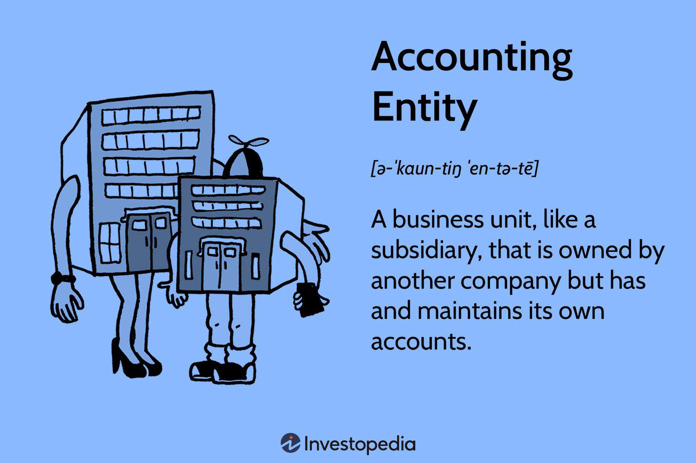

In the rapidly evolving world of finance, understanding different entities is pivotal for both accounting and algorithmic trading. An entity in this context refers to any organization or individual that engages in economic activities and is recognized in accounting and financial systems. This article investigates accounting entities, including their distinct types and examples. Additionally, it addresses the application of entity theory within algorithmic trading, a technique that utilizes computer algorithms to make trading decisions. By examining how these entities function, their dynamics, and their influence on financial markets, this guide offers a comprehensive perspective. The importance of entities extends to their role in maintaining accountability, ensuring regulatory compliance, and facilitating strategic planning and decision-making processes in finance. This knowledge is crucial for finance professionals, traders, and those interested in understanding how entities shape financial strategies and market interactions. By the conclusion of this article, a clearer comprehension of how accounting and algorithmic trading entities influence finance will be achieved, enhancing decision-making and strategic overview capabilities in these fields.

## Table of Contents



## What is an Accounting Entity?

An accounting entity is a distinct and separate economic unit utilized for the purpose of measuring financial transactions. This concept ensures that the financial activities of the entity are accounted for independently from those of its owners or any other entities. Accounting entities can take various forms, such as corporations, sole proprietorships, subsidiaries, and special purpose vehicles (SPVs). Each of these entities maintains its own set of financial records, which are critical for accurate financial tracking and reporting.

The distinction between an accounting entity's financial records and those of its owner is a fundamental principle known as the business entity concept. This principle ensures that financial statements reflect the entity's true economic performance and position, devoid of any personal transactions of the owner. For instance, in a sole proprietorship, even though the business and the owner are legally the same, the business activities are recorded separately from the owner's personal financial activities for accounting purposes.

The primary function of maintaining separate financial records is to ensure clarity, transparency, and accountability in financial reporting. This separation facilitates a precise understanding of the entity’s financial health, assisting in decision-making and strategic planning. In corporations, for example, this separation is vital for providing shareholders with an accurate portrayal of the company's financial performance.

The use of accounting entities extends beyond traditional businesses. Special purpose vehicles (SPVs) are created for specific projects or financial structures, functioning as separate entities to provide legal and financial insulation from the parent company. This allows for the isolation of financial risk related to a particular project, thereby protecting the parent company from potential liabilities.

Overall, the concept of an accounting entity is foundational to financial accounting, promoting accuracy and reliability in financial reporting. By maintaining distinct financial records, businesses and organizations can effectively manage their economic activities and fulfill their financial obligations.

## Types of Accounting Entities

Accounting entities are diverse, and their categorization is crucial for understanding their financial and legal characteristics. The main types include corporations, partnerships, sole proprietorships, and special purpose vehicles (SPVs).

Corporations are legally recognized entities that exist independently of their owners, typically referred to as shareholders. This independent legal status grants corporations certain benefits, such as limited liability, where shareholders are not personally liable for the debts and obligations of the corporation beyond their investment. This structure enables corporations to raise capital efficiently and sustain perpetual existence, which can be critical for long-term strategic projects.

Partnerships, on the other hand, are business entities formed by two or more individuals who share ownership responsibilities. Similar to corporations, partnerships can be structured to provide limited liability to the partners, depending on the partnership type—general or limited partnership. In a general partnership, all partners share unlimited liability, while in a limited partnership, at least one partner maintains limited liability. Partnerships offer flexibility in management and profit-sharing arrangements but might face challenges in raising capital and maintaining continuity if ownership changes.

Sole proprietorships are the simplest form of accounting entities. In this structure, the business is owned and operated by a single individual, who is personally liable for all business debts and obligations. While sole proprietorships provide complete managerial control and ease of formation, they do not offer the same level of liability protection as corporations or partnerships, posing a higher financial risk to the owner.

Special Purpose Vehicles (SPVs) are unique accounting entities designed for specific projects or transactions. SPVs are legally separated from their parent companies, providing an additional layer of financial and legal insulation. This separation is advantageous for managing risks associated with the specific objectives of the SPV, particularly in complex financial structures or when isolating financial risk is crucial. SPVs can be strategic tools in finance, often used in securitization, project finance, and risk management in large-scale transactions.

## Examples of Accounting Entities

Examples of accounting entities are widespread within diverse industries, each serving to provide transparency and accountability in financial reporting. Corporations like Apple Inc. and Google LLC (a subsidiary of Alphabet Inc.) are quintessential models of accounting entities. These corporations maintain separate financial records, not only to comply with regulatory requirements but also to ensure clear accountability to shareholders and the public. For instance, their financial statements—comprising balance sheets, income statements, and cash flow statements—reflect their financial health, performance, and strategic decisions. 

A local bakery operating as a sole proprietorship also qualifies as an accounting entity. Despite its simplicity and smaller scale compared to large corporations, the sole proprietor must maintain distinct financial records. This separation is crucial for accurate taxation and to gauge the business's profitability and financial position independent of the owner's personal finances. 

Special Purpose Vehicles (SPVs) represent another critical example of accounting entities. They are often established to isolate financial risk associated with specific projects or transactions from the parent company. Enron famously used SPVs to obscure financial liabilities and manipulate financial reports, underscoring the importance of ethical governance in the use of such entities. While SPVs can aid in risk management and financial structuring, their potential misuse, as seen in Enron's case, has prompted stricter regulatory scrutiny.

Trusts and clubs also form part of the landscape of accounting entities. Trusts, set up to manage assets on behalf of beneficiaries, operate with separate financial records to ensure legal and fiduciary responsibilities are met. Whether managing investment portfolios, real estate, or other assets, trusts track their financial activities distinctly from trustees. Similarly, clubs—ranging from sports to social groups—maintain separate financial statements, allocating resources and budgeting for operational costs while ensuring fiscal responsibility to their members.

In all these instances, the separation of financial activities into distinct accounting entities is foundational to maintaining clarity and integrity in financial reporting. By delineating boundaries between the financial transactions of an entity and those of individuals or parent companies, accounting entities enhance transparency and support effective financial management.

## Entity Theory in Algorithmic Trading

Entity theory provides a crucial framework for understanding the multitude and interactions of market participants in [algorithmic trading](/wiki/algorithmic-trading). This theory models the behaviors and decision-making processes of various entities, such as traders, financial institutions, and high-frequency trading firms, each of which plays a vital role in the dynamics of financial markets. By understanding these entities, algorithm designers can create more accurate models for predicting market movements and optimizing trading strategies.

Algorithmic trading systems employ entity theory to differentiate the strategic behaviors of distinct market participants. For instance, an algorithm might need to recognize patterns typical of high-frequency traders, who execute numerous trades at rapid speeds, contrasting with institutional investors, who may focus on larger trades over extended periods. Such distinctions enable algorithms to tailor responses and strategies in a way that aligns with an entity’s specific operational model and goals.

Entity theory also takes into account the influence of regulatory bodies and trading platforms, essential components in defining how algorithms operate. Regulatory entities can impose limitations and provide guidelines that shape market behavior, affecting everything from transaction costs to permissible trading volumes. Consequently, an effective algorithm must incorporate these regulatory considerations to ensure compliance and maintain integrity within legal frameworks.

Moreover, trading platforms provide the technological infrastructure necessary for algorithmic trading, where latency, order types, and the availability of data can significantly influence trading performance. Algorithms must adapt to these conditions, optimizing execution based on the features and limitations of the employed platform.

Understanding entity theory is essential for algorithm designers to accommodate diverse strategies and market conditions. By considering the unique attributes and objectives of different entities, algorithms can enhance risk management processes. Testing trading strategies against different conceivable scenarios that involve varied market participant behaviors can reveal potential vulnerabilities, allowing traders to refine algorithms for improved resilience and reliability.

To encapsulate these insights, Python can be utilized to simulate market behaviors and algorithmic strategies that incorporate entity theory principles. For example:

```python
import numpy as np

def simulate_trading_strategy(entity_behavior, market_conditions):
    """
    Simulates a trading strategy based on entity behavior and market conditions.

    Parameters:
    - entity_behavior: Dict containing entity attributes such as speed, volume.
    - market_conditions: Dict representing market parameters like volatility, liquidity.

    Returns:
    - performance_metrics: Dict containing results of the strategy simulation.
    """
    # Example parameters
    trading_speed = entity_behavior.get('speed', 1.0)
    trade_volume = entity_behavior.get('volume', 100)

    # Market impact model
    market_impact = market_conditions.get('volatility', 0.2) * np.random.randn()

    # Simulate trading outcome
    profit_loss = (trading_speed * trade_volume) - market_impact

    performance_metrics = {
        'profit_loss': profit_loss,
        'adjusted_for_volatility': profit_loss / (1 + market_conditions['liquidity'])
    }

    return performance_metrics

# Example usage
entity_behavior = {'speed': 2.0, 'volume': 200}
market_conditions = {'volatility': 0.3, 'liquidity': 0.8}
performance = simulate_trading_strategy(entity_behavior, market_conditions)
print(performance)
```

This example demonstrates how entity-specific behaviors and market conditions can be programmed to evaluate the efficacy of a trading strategy, reinforcing the value of entity theory in the strategic planning and execution of algorithmic trades.

## Types of Entities in Financial Markets

Financial markets are populated by a diverse array of entities, each playing distinct roles that collectively contribute to the functioning and stability of these markets. These entities include individual traders, institutional investors, high-frequency traders, market makers, regulatory bodies, trading platforms, and infrastructure providers. Each type has its operational model and significance.

**Individual Traders**: These market participants engage in buying and selling financial instruments for personal accounts. They typically operate on a smaller scale compared to institutional investors and may use brokerage platforms to execute trades. Despite their smaller size, the collective activity of individual traders can influence market trends and liquidity.

**Institutional Investors**: Institutions such as mutual funds, pension funds, insurance companies, and hedge funds manage substantial pools of capital. Their trades often have a significant impact on the markets due to their large volumes. Institutional investors generally pursue long-term strategies aimed at asset growth, risk management, and portfolio diversification.

**High-Frequency Traders (HFTs)**: High-frequency trading firms utilize sophisticated algorithms to execute trades at extremely high speeds, often within microseconds. These entities capitalize on minimal price discrepancies, providing liquidity but potentially contributing to market volatility. The operational model relies on advanced technology and requires significant financial investment in infrastructure.

**Market Makers**: Market makers are crucial in providing liquidity and stability to financial markets. They do so by continuously quoting buy and sell prices for financial instruments, thereby facilitating smoother and more efficient trading. By maintaining a presence in the market, they reduce the bid-ask spread and enhance overall market depth.

**Regulatory Bodies**: Organizations such as the Securities and Exchange Commission (SEC) in the United States establish and enforce rules to ensure fairness, transparency, and integrity in financial markets. These bodies oversee market activities, protect investors, and cater to systemic risk by imposing regulations that market participants must comply with.

**Trading Platforms**: Trading platforms, such as the New York Stock Exchange (NYSE) and the Nasdaq, serve as marketplaces where buyers and sellers meet to conduct trades. Such platforms provide the technological interface that supports the matching of orders and the dissemination of market data.

**Infrastructure Providers**: These entities ensure the technical and operational support required for effective market functioning. They include companies involved in data provision, network connectivity, and software solutions. Infrastructure providers play a pivotal role in enabling the real-time processing of trades and the dissemination of market information.

Each entity type brings unique attributes to the market ecosystem. Individual and institutional activities often set market trends, while HFTs and market makers influence [liquidity](/wiki/liquidity-risk-premium) and pricing. Regulatory bodies and infrastructure providers ensure market order and efficiency, respectively. The interplay of these entities sustains market dynamics, contributing to the broader stability and resilience of financial systems.

## Implications for Algorithmic Trading

Understanding entity theory is crucial in enhancing the performance of algorithmic trading systems. By examining the behaviors and interactions of various market entities, algorithms can more accurately forecast market trends. This predictive capability is achieved by modeling the strategies and activities of diverse market participants, allowing algorithms to adjust trading strategies dynamically in response to market movements.

Risk management within algorithmic trading systems can also be significantly improved by factoring in the strategic objectives and limitations of different market entities. For instance, recognizing the intentions and risk appetites of institutional investors versus high-frequency traders enables algorithms to anticipate potential market shifts and adjust risk profiles accordingly. This approach helps in minimizing exposure to adverse price movements and enhances the robustness of trading strategies.

Compliance with regulatory frameworks is essential to ensure that trading strategies are both effective and lawful. Algorithms designed with adherence to these regulations can mitigate legal risks, offering a safeguard against potential regulatory breaches. Compliance mechanisms can be built into algorithmic models, automatically adjusting trading activities to align with current legal standards.

The effectiveness of algorithmic trading systems is demonstrated through optimized trade execution, reduced costs, and improved market performance. Algorithms equipped with a comprehensive understanding of market entities can achieve lower transaction costs by executing trades more efficiently. This results in narrower bid-ask spreads and decreased market impact, ultimately enhancing returns. Moreover, by optimizing algorithm performance through entity-focused strategies, traders can achieve significant improvements in market outcomes.

Incorporating these elements not only enhances the efficacy of algorithmic trading systems but also positions traders to capitalize on market opportunities while managing risks effectively. This strategic advantage is crucial in an increasingly complex and fast-paced financial environment.

## Conclusion

The study of accounting entities and entity theory in algorithmic trading reveals crucial financial dynamics that are pivotal for both sectors. In accounting, understanding entities ensures accurate financial reporting and compliance, which facilitates informed decision-making and strategic management. For instance, recognizing the unique characteristics of various accounting entities such as corporations, partnerships, and special purpose vehicles enables more effective financial planning and risk assessment.

In algorithmic trading, entity theory is essential for modeling and predicting market behaviors. By understanding the diverse entities in financial markets—ranging from individual traders to large institutional investors—financial analysts and algorithm designers can develop more sophisticated trading strategies. This knowledge enables algorithms to incorporate the interaction between market participants, thus improving risk management and compliance with regulatory norms.

As financial markets undergo continuous transformation driven by technological advancements, leveraging knowledge of accounting and trading entities becomes even more crucial. Professionals who understand the intricacies of these entities are better equipped to address market [volatility](/wiki/volatility-trading-strategies) and emerging challenges, providing them with a strategic advantage. Mastery of entities in both domains empowers these individuals to navigate complexities with heightened proficiency and achieve desired outcomes efficiently.

Ultimately, a comprehensive understanding of accounting and algorithmic trading entities positions professionals for success in today’s intricate financial landscape. Such expertise not only enhances decision-making but also propels strategic initiatives, ensuring sustainable growth and competitive edge in an increasingly complex market environment.

## References & Further Reading

[1]: Bergstra, J., Bardenet, R., Bengio, Y., & Kégl, B. (2011). ["Algorithms for Hyper-Parameter Optimization."](https://dl.acm.org/doi/10.5555/2986459.2986743) Advances in Neural Information Processing Systems 24.

[2]: ["Advances in Financial Machine Learning"](https://www.amazon.com/Advances-Financial-Machine-Learning-Marcos/dp/1119482089) by Marcos Lopez de Prado

[3]: ["Evidence-Based Technical Analysis: Applying the Scientific Method and Statistical Inference to Trading Signals"](https://www.amazon.com/Evidence-Based-Technical-Analysis-Scientific-Statistical/dp/0470008741) by David Aronson

[4]: ["Machine Learning for Algorithmic Trading"](https://github.com/stefan-jansen/machine-learning-for-trading) by Stefan Jansen

[5]: ["Quantitative Trading: How to Build Your Own Algorithmic Trading Business"](https://www.amazon.com/Quantitative-Trading-Build-Algorithmic-Business/dp/1119800064) by Ernest P. Chan