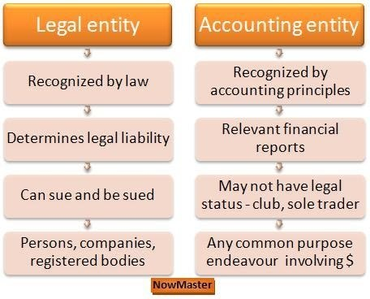

## Table of Contents

## What is an accounting entity?

An accounting entity is a concept that helps keep financial records separate and organized. It means that a business or organization is treated as a separate unit from its owners or other businesses. This separation is important because it makes sure that the financial activities of the business are tracked accurately, without mixing them up with personal finances or the finances of other entities.

For example, if you own a small bakery, the accounting entity principle means that you would keep the bakery's income and expenses separate from your personal bank account. This helps in preparing clear financial statements and understanding the true financial health of the bakery. By treating the bakery as its own entity, you can make better business decisions and comply with legal and tax requirements more easily.

## What are the basic types of accounting entities?

There are three basic types of accounting entities: sole proprietorships, partnerships, and corporations. A sole proprietorship is a business owned by one person. The owner's personal finances and the business finances are separate, but the owner is personally responsible for any business debts. A partnership is a business owned by two or more people. They share the profits and losses, and like a sole proprietorship, the partners are personally responsible for the business's debts.

A corporation is a more complex type of accounting entity. It is a legal entity separate from its owners, who are called shareholders. This means the corporation can own property, enter contracts, and be sued in its own name. Shareholders are not personally responsible for the corporation's debts, which is a big difference from sole proprietorships and partnerships. Corporations have to follow more rules and regulations, like holding meetings and keeping detailed records.

These types of accounting entities help businesses keep their financial records clear and organized. Each type has its own advantages and responsibilities, so choosing the right one depends on the needs and goals of the business.

## Can you explain the difference between a sole proprietorship and a partnership?

A sole proprietorship is a business owned by just one person. In this type of business, the owner and the business are seen as the same thing for tax and legal reasons. This means the owner has to report all the business's income and expenses on their personal tax return. The owner is also personally responsible for any debts the business might have. If the business can't pay its debts, the owner's personal money and things they own could be used to pay them.

A partnership is different because it's owned by two or more people. These owners share the profits and losses of the business. Like a sole proprietorship, the partners have to report their share of the business's income on their personal tax returns. Also, the partners are personally responsible for the business's debts. If the business can't pay, each partner's personal money and things they own could be used to pay the debts. The main difference is that in a partnership, the responsibility and the profits are shared among the partners.

## What is a corporation and how does it differ from other types of accounting entities?

A corporation is a type of business that is separate from its owners, who are called shareholders. This means the corporation can own things, sign contracts, and even be sued, all on its own. Shareholders own parts of the corporation called shares, but they are not personally responsible for the corporation's debts. If the corporation can't pay its debts, the shareholders' personal money and things they own are safe. This is different from a sole proprietorship or a partnership, where the owners are personally responsible for the business's debts.

Corporations have to follow more rules and regulations than sole proprietorships and partnerships. They need to hold meetings, keep detailed records, and file separate tax returns. This can make running a corporation more complicated and expensive, but it also offers more protection for the owners. Unlike sole proprietorships and partnerships, where the business's income is reported on the owners' personal tax returns, a corporation pays its own taxes on its profits. Then, if the corporation pays out money to shareholders, they might have to pay taxes on that money too. This is called double taxation, and it's something to think about when choosing the type of business entity.

## How do non-profit organizations fit into the accounting entity types?

Non-profit organizations are another type of accounting entity, different from sole proprietorships, partnerships, and corporations. A non-profit is set up to do something good for the community, like helping people or protecting the environment, instead of making money for its owners. It can be a separate legal entity, like a corporation, but it doesn't have owners or shareholders. Instead, it has a board of directors who make sure the organization is doing what it's supposed to do.

The main difference between a non-profit and other types of accounting entities is that a non-profit doesn't pay taxes on the money it makes if it uses that money for its mission. This is called tax-exempt status. But, non-profits still have to keep good records of their money and follow special rules to keep their tax-exempt status. They need to show that they are using their money the right way, and they usually have to share reports with the public about what they're doing and how they're spending their money.

## What are limited liability companies (LLCs) and how are they treated in accounting?

A limited liability company, or LLC, is a type of business that mixes parts of a corporation and a partnership. It's easier to set up and run than a corporation, but it still gives its owners, called members, protection from the business's debts. If the LLC can't pay its debts, the members' personal money and things they own are usually safe. This is similar to a corporation, but LLCs don't have to follow as many rules and don't have to pay taxes twice like corporations do.

In accounting, an LLC is treated like a separate entity from its members, just like a corporation. But, for taxes, it can be treated differently. By default, a single-member LLC is taxed like a sole proprietorship, and a multi-member LLC is taxed like a partnership. This means the LLC's income is reported on the members' personal tax returns. But, an LLC can choose to be taxed like a corporation if that's better for them. This flexibility in how they are taxed is one reason why many people like to start an LLC.

## Can you provide examples of sole proprietorships in different industries?

A sole proprietorship can be found in many different types of businesses. For example, a freelance graphic designer who works from home and takes on projects for different clients is running a sole proprietorship. They use their own name or a business name to do their work, and they keep all the money they make after paying for things like software and other expenses. Another example is a local handyman who fixes things around people's homes. They might advertise their services in the neighborhood and use their own tools to do the work. They are responsible for everything in the business, from finding customers to paying taxes on what they earn.

In the food industry, a sole proprietorship could be a food truck owned and operated by one person. They buy the truck, get the permits, and cook and sell the food themselves. All the money they make goes to them after they pay for ingredients and other costs. In the retail world, a small bookstore run by one person is another example. The owner buys the [books](/wiki/algo-trading-books), sets up the store, and handles everything from sales to customer service. They keep all the profits but also have to pay for everything out of their own pocket, including any debts the business might have.

## What are some well-known corporations and how do their accounting practices differ from smaller entities?

Well-known corporations include companies like Apple, Microsoft, and Coca-Cola. These big companies have to follow strict rules and keep very detailed records of their money. They have whole teams of accountants who make sure everything is done right. They have to report their financial information to the public and to the government, which means they need to be very clear and accurate. They also have to do audits, which are checks to make sure their numbers are correct. This is different from smaller businesses, which might not need to share as much information and might not have big teams of accountants.

Big corporations have to deal with more complicated things like international taxes and rules from different countries. They have to keep track of money in different currencies and follow the rules for each place they do business. Smaller businesses usually just have to worry about the rules in their own country or state. Also, big corporations often use special software and systems to handle their money, while smaller businesses might use simpler tools or even just spreadsheets. This makes the accounting practices of big corporations more complex and detailed than those of smaller entities.

## How does the choice of accounting entity affect financial reporting?

The choice of accounting entity affects financial reporting because each type has different rules and requirements. For a sole proprietorship, the owner's personal and business finances are separate but reported together on the owner's personal tax return. This means the financial reports are simpler and focus on the owner's total income and expenses. Partnerships are similar, but the financial reports show how the profits and losses are shared among the partners. Both types don't need to share their financial reports with the public.

Corporations and LLCs, on the other hand, have to follow more strict rules. Corporations need to file separate tax returns and share detailed financial reports with the public and the government. These reports show the company's income, expenses, and how much money shareholders get. LLCs can choose how they want to be taxed, which affects their financial reporting. If they choose to be taxed like a sole proprietorship or partnership, their financial reports are simpler. But if they choose to be taxed like a corporation, their reports become more detailed and public. So, the choice of entity really changes how a business handles its financial reporting.

## What are the tax implications for different types of accounting entities?

The tax implications for different types of accounting entities can be quite different. For a sole proprietorship, the business's income is reported on the owner's personal tax return. This means the owner pays personal income tax on all the business's profits. There's no separate business tax return, which makes things simpler but means the owner is personally responsible for all the taxes. Partnerships work in a similar way, but the profits and losses are divided among the partners based on their agreement. Each partner then reports their share on their personal tax return and pays personal income tax on it.

Corporations have a more complex tax situation. They file their own tax returns and pay corporate income tax on their profits. If the corporation then pays out money to its shareholders as dividends, the shareholders have to pay personal income tax on that money too. This is called double taxation because the same money is taxed twice. LLCs have more flexibility. By default, a single-member LLC is taxed like a sole proprietorship, and a multi-member LLC is taxed like a partnership. But, LLCs can also choose to be taxed like a corporation if that's better for them. This choice can change how much tax they pay and how they handle their tax reporting.

## How do international accounting standards impact the classification of accounting entities?

International accounting standards, like those set by the International Financial Reporting Standards (IFRS), help make sure businesses around the world report their financial information in a similar way. This can affect how different types of accounting entities are classified and how they report their finances. For example, under IFRS, a business might need to show more detailed information about its financial health than it would under local rules. This means that corporations, which often work in many countries, have to follow these standards closely to make sure their reports are clear and correct for everyone who looks at them.

For smaller entities like sole proprietorships and partnerships, the impact of international standards might be less direct. These businesses usually don't have to share their financial reports with the public, so they might just follow the local rules where they operate. But if they grow bigger or start working in other countries, they might need to start following international standards too. This can make their accounting practices more complicated but also more transparent and easier to understand for people in different countries.

## What advanced considerations should be taken into account when choosing an accounting entity type for a multinational corporation?

When choosing an accounting entity type for a multinational corporation, it's important to think about how the business will be taxed in different countries. A corporation is usually the best choice for a big business that works in many places because it gives the owners, called shareholders, protection from the business's debts. But, corporations have to pay taxes on their profits in each country where they do business. This can be complicated because tax rules are different everywhere. The corporation also has to think about double taxation, where the same money is taxed twice - once as corporate profit and again when it's paid out to shareholders as dividends. Choosing the right entity type can help lower these taxes and make things easier.

Another thing to consider is how the corporation will follow the rules and regulations in each country. Corporations have to share detailed financial reports with the public and the government, which means they need to use international accounting standards like IFRS. These standards help make sure the reports are clear and easy to understand for people all over the world. But following these rules can be hard and might need special software and teams of accountants. The corporation also needs to think about how it will manage its money in different currencies and follow the local laws in each country. Picking the right entity type can help the corporation deal with these challenges and keep everything running smoothly.

## References & Further Reading

[1]: Bergstra, J., Bardenet, R., Bengio, Y., & Kégl, B. (2011). ["Algorithms for Hyper-Parameter Optimization."](https://dl.acm.org/doi/10.5555/2986459.2986743) Advances in Neural Information Processing Systems 24.

[2]: ["Advances in Financial Machine Learning"](https://www.amazon.com/Advances-Financial-Machine-Learning-Marcos/dp/1119482089) by Marcos Lopez de Prado

[3]: ["Evidence-Based Technical Analysis: Applying the Scientific Method and Statistical Inference to Trading Signals"](https://www.amazon.com/Evidence-Based-Technical-Analysis-Scientific-Statistical/dp/0470008741) by David Aronson

[4]: ["Machine Learning for Algorithmic Trading"](https://github.com/stefan-jansen/machine-learning-for-trading) by Stefan Jansen

[5]: ["Quantitative Trading: How to Build Your Own Algorithmic Trading Business"](https://www.amazon.com/Quantitative-Trading-Build-Algorithmic-Business/dp/1119800064) by Ernest P. Chan