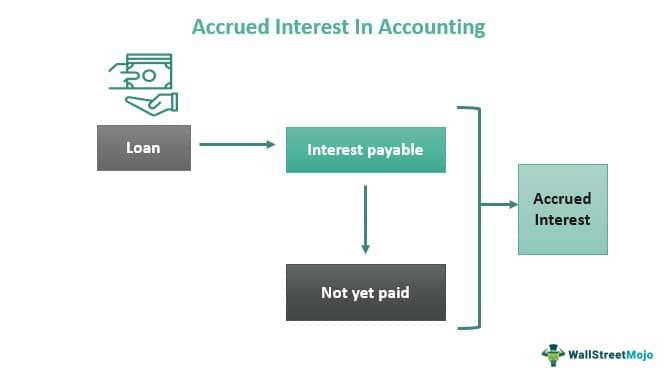

Financial accounting is a vital aspect of any trading strategy, particularly in algorithmic trading, where precision and accuracy play crucial roles. As the speed and volume of transactions increase, understanding and accurately managing financial elements becomes imperative. One such critical financial concept is accrued interest, which refers to the interest that has accumulated on a financial instrument since the last payment period but has not yet been paid.

Accruing interest accurately reflects a company's financial position and performance. Management of accrued interest involves creating accurate accounting entries that ensure the financial statements present a true and fair view of the business's financial performance. In algorithmic trading, this becomes even more important as the automated nature of trading demands real-time and precise data integration.



The management of accrued interest through continuous and automated accounting processes is essential in algorithmic settings. This automation helps align the speed of accounting entries with the rapid nature of trades, thus ensuring that the financial data remains synchronized with market activities. By automating these accounting processes, traders can enhance their strategy's accuracy, allowing them to respond to market changes efficiently and effectively.

This article explores how accrued interest is accounted for within financial accounting and its implications for algorithmic trading strategies. Through a focus on automation and system integration, we highlight the importance of synchronizing accounting processes to support the dynamic nature of algorithmic trading.

## Table of Contents

## Understanding Accrued Interest

Accrued interest is a key concept in financial accounting, particularly relevant to assets such as bonds and loans. It represents the interest that has been accumulated since the last payment date but remains unpaid. This interest accrues daily and must be accounted for to ensure that financial statements present an accurate measure of a company's financial position. In the accounting context, accrued interest must be recorded simultaneously as both an income on the income statement and a liability on the balance sheet. This dual recording ensures the financial integrity of statements, reflecting the company's true revenue-generating capability and existing financial obligations.

For traders, understanding accrued interest is pivotal as it influences the overall cost and revenue computations of trading strategies. Failure to accurately account for accrued interest can lead to distorted financial metrics, which affects strategy evaluation and decision-making. Regular adjustments, known as periodic reconciliations, are necessary to align individual accounts with established accounting standards and maintain the accuracy of financial data.

The calculation of accrued interest typically involves the formula:

$$
\text{Accrued Interest} = \frac{\text{Annual Interest Rate} \times \text{Principal Amount} \times \text{Number of Days}}{360 \text{ or } 365}
$$

This formula assumes the use of either a 360-day or 365-day year depending on the specific financial instrument and market conventions.

For instance, in Python, calculating accrued interest for a bond might look like this:

```python
def calculate_accrued_interest(annual_interest_rate, principal_amount, days_accrued, day_count_convention=360):
    return (annual_interest_rate * principal_amount * days_accrued) / day_count_convention

# Example usage:
annual_rate = 0.05  # 5% annual interest rate
principal = 1000  # Principal amount of $1000
days = 30  # Interest accrued for one month

accrued_interest = calculate_accrued_interest(annual_rate, principal, days)
print(f"Accrued Interest: ${accrued_interest:.2f}")
```

Grasping the concept of accrued interest enables traders to fine-tune their strategies for enhanced profitability and precision in financial reporting. Proper management of accrued interest reduces discrepancies in financial interpretations, ensuring that all trading measures are reflective of true economic activities.

## Accounting Entries for Accrued Interest

The accounting entries for accrued interest involve the recognition of interest income and the establishment of an interest liability on the balance sheet. This dual-entry procedure ensures that the financial statements accurately mirror the realities of receivables and payables tied to interest. 

**Recognition of Interest Income and Liabilities:**
Accrued interest represents the amount of interest that has accumulated but has not yet been paid or received. In accounting terms, it must be recognized as an income for the recipient while simultaneously setting up a corresponding liability for the party expected to pay. Let's consider a bond that pays interest semi-annually. Assuming an entity holds this bond, at any given point between payment dates, the accrued interest is recorded as:

1. **Accrued Interest Income**: This is recorded as an increase in interest income in the profit and loss statement. 
2. **Accrued Liability**: Concurrently, a liability is recorded on the balance sheet reflecting the amount the entity owes until payment is rendered.

For example, if the accrued interest is $1,000, the journal entry at the end of the period would typically include:
- **Debit**: Interest Receivable (Asset) $1,000
- **Credit**: Interest Income (Revenue) $1,000

**Impact on Financial Reporting:**
These entries are crucial for ensuring the financial statements reflect an organization's actual financial position, particularly in distinguishing between current assets and liabilities. By adjusting accounts for accrued income and expenses at the end of an accounting period, companies maintain financial transparency and compliance with accounting standards.

**Automation of Accounting Processes:**
Automating these entries can mitigate errors and relieve the tediousness inherent in complex financial calculations. Modern accounting systems often include modules that can calculate accrued interest automatically, ensuring precision and consistency. This is particularly beneficial in high-frequency trading environments where speed and accuracy are paramount. By integrating these systems, companies can synchronize real-time interest calculations with their broader strategic objectives, reducing the manual workload and potential for human error in financial reporting.

In summary, accounting entries for accrued interest serve to balance the income statement and balance sheet, and when automated, they enhance the reliability and accuracy of financial records. This is not only essential for internal control but also for meeting external reporting requirements such as tax obligations.

## The Role of Financial Accounting in Algorithmic Trading

Algorithmic trading, often referred to as algo trading, is a domain where precision and data accuracy are critical. One of the supporting pillars in this environment is financial accounting, which offers a robust framework for recording, classifying, and summarizing financial transactions. This framework is pivotal in an automated trading environment where quick and efficient handling of large volumes of transactions, including interest calculations, is crucial.

In the context of algo trading, the integrity of financial data hinges on the accurate accounting of accrued interest. Accrued interest, representing the interest on financial instruments that has accumulated but not yet paid, affects the cost and revenue calculations critical to trading strategies. Without precise accounting entries, trading algorithms might derive insights from flawed data, leading to suboptimal decision-making.

The integration of accounting systems with trading algorithms presents the opportunity to enhance operational efficiency significantly. Such integration allows for real-time data processing whereby accrued interest and other financial transactions are automatically updated within the system. This reduces the reliance on manual processes, thereby minimizing errors and ensuring that trading decisions are based on up-to-date and accurate financial information.

The following Python snippet demonstrates how one might programmatically calculate and update accrued interest in a trading system:

```python
def calculate_accrued_interest(principal, annual_rate, days_elapsed, days_in_year=365):
    return principal * (annual_rate / days_in_year) * days_elapsed

# Sample transaction data
transactions = [
    {'principal': 100000, 'annual_rate': 0.05, 'days_elapsed': 30},
    {'principal': 200000, 'annual_rate': 0.04, 'days_elapsed': 45},
]

# Compute accrued interest for each transaction
for transaction in transactions:
    interest = calculate_accrued_interest(
        transaction['principal'],
        transaction['annual_rate'],
        transaction['days_elapsed']
    )
    print(f"Accrued interest: {interest:.2f}")
```

This form of integration facilitates a seamless flow of financial data necessary for strategic decision-making in the fast-paced world of algo trading. Ensuring the compatibility and capability of the software stack to handle complex accounting processes automatically gives traders a competitive edge. The integration of precise financial accounting with [algorithmic trading](/wiki/algorithmic-trading) systems lays the foundation for enhanced accuracy, better financial control, and more reliable trading strategies.

## Integrating Accounting Software with Trading Algorithms

Modern trading platforms are pivotal to the seamless and accurate processing of financial transactions, including accrued interest. Integrating accounting software with these platforms facilitates the automation of accounting entries, significantly reducing manual intervention and the risk of errors. This integration is beneficial for several reasons, especially as the [volume](/wiki/volume-trading-strategy) and complexity of transactions increase in algorithmic trading environments.

One primary advantage of integrating accounting software with trading algorithms is the ability to process financial data in real time. This capability enhances not only the speed of transaction processing but also improves data accuracy, crucial for generating reliable financial reports. These reports underpin strategic decision-making by providing up-to-date financial information, thereby granting traders a competitive edge in fast-paced trading arenas.

Modern accounting software often includes Application Programming Interface (API) capabilities, allowing direct connectivity with trading systems. Through APIs, these software solutions can automatically retrieve and record transaction data, ensuring that accounting entries for accrued interest and other financial activities are precise and timely. The automated nature of this integration minimizes human errors and ensures consistent adherence to accounting standards.

When selecting or developing a trading platform, it is essential for traders to ensure compatibility with accounting software. This compatibility extends to handling complex accounting processes, such as multi-currency transactions and tax considerations, without manual intervention. A reliable software stack that supports such intricate tasks not only streamlines operations but also fortifies the reliability of financial statements.

Furthermore, the integration of accounting software with trading algorithms supports real-time reporting capabilities. For traders, this means having access to immediate insights into trading performance and financial status, facilitating swift adjustments to trading strategies. As a result, traders can respond more agilely to market changes, enhancing their strategic decision-making capabilities and overall trading efficiency.

In conclusion, integrating accounting software with trading algorithms is fundamental to achieving operational efficiency and accuracy in financial accounting. Traders leveraging this technology can ensure that their trading strategies are underpinned by precise and timely financial data, enhancing their performance in increasingly competitive markets.

## Conclusion

The management of accrued interest through precise accounting entries is pivotal in the financial accounting landscape of algorithmic trading. As algorithmic trading strategies become increasingly complex, the demand for automated and integrated accounting solutions becomes crucial. This evolution ensures that financial data, particularly concerning accrued interest, is processed with real-time accuracy—an essential aspect for sound decision-making and effective strategic planning.

Incorporating technology to automate the tracking and management of accrued interest allows algorithmic traders to gain enhanced financial control and operational efficiency. For instance, by using Python's pandas library, traders can automate the calculation and reconciliation of accrued interests efficiently. A simple code snippet for calculating accrued interest could look like this:

```python
import pandas as pd
from datetime import datetime, timedelta

# Example data: bonds with last payment date and annual coupon rate
bonds_data = {
    'bond_id': ['B1', 'B2', 'B3'],
    'last_payment_date': ['2023-01-01', '2023-02-15', '2023-03-01'],
    'annual_coupon_rate': [0.05, 0.045, 0.06],
    'face_value': [1000, 2000, 1500]
}

# Current date
current_date = '2023-03-31'

# Create DataFrame
bonds_df = pd.DataFrame(bonds_data)

# Function to calculate accrued interest
def calculate_accrued_interest(last_payment_date, annual_coupon_rate, face_value, current_date):
    last_payment = datetime.strptime(last_payment_date, '%Y-%m-%d')
    current = datetime.strptime(current_date, '%Y-%m-%d')
    days_accrued = (current - last_payment).days
    accrued_interest = (annual_coupon_rate / 365) * face_value * days_accrued
    return accrued_interest

# Apply the function to each bond
bonds_df['accrued_interest'] = bonds_df.apply(lambda row: calculate_accrued_interest(
    row['last_payment_date'], row['annual_coupon_rate'], row['face_value'], current_date), axis=1)

print(bonds_df[['bond_id', 'accrued_interest']])
```

Ultimately, the synergy between accounting and algorithmic trading boosts the overall reliability and effectiveness of trading strategies. Through the intelligent integration of accounting systems with trading algorithms, traders not only automate labor-intensive accounting tasks but also set up robust systems that enhance real-time data accuracy. This advancement secures a decisive edge in the hyper-competitive and rapidly evolving landscape of financial markets.

## References & Further Reading

[1]: Morris, D., & Thayler, J. V. R. (2018). ["The Accrual Anomaly: Information Uncertainty or Statement Credibility?"](https://onlinelibrary.wiley.com/doi/abs/10.1111/sjoe.12313) SSRN Electronic Journal.

[2]: ["Financial Reporting and Analysis"](https://www.wallstreetmojo.com/financial-reporting/) by Lawrence Revsine, Daniel W. Collins, W. Bruce Johnson, Fred Mittelstaedt, and Leonard C. Soffer

[3]: ["Bond Math: The Theory Behind the Formulas"](https://www.amazon.com/Bond-Math-Theory-Formulas-Finance/dp/1576603067) by Donald J. Smith

[4]: ["Accounting for Dummies"](https://www.youtube.com/watch?v=yYX4bvQSqbo) by John A. Tracy

[5]: ["Automate the Boring Stuff with Python"](https://automatetheboringstuff.com/) by Al Sweigart

[6]: ["Financial Accounting: An Introduction to Concepts, Methods and Uses"](https://www.amazon.com/Financial-Accounting-Introduction-Available-CengageNOW/dp/0324651147) by Clyde P. Stickney, Roman L. Weil, Katherine Schipper, and Jennifer Francis