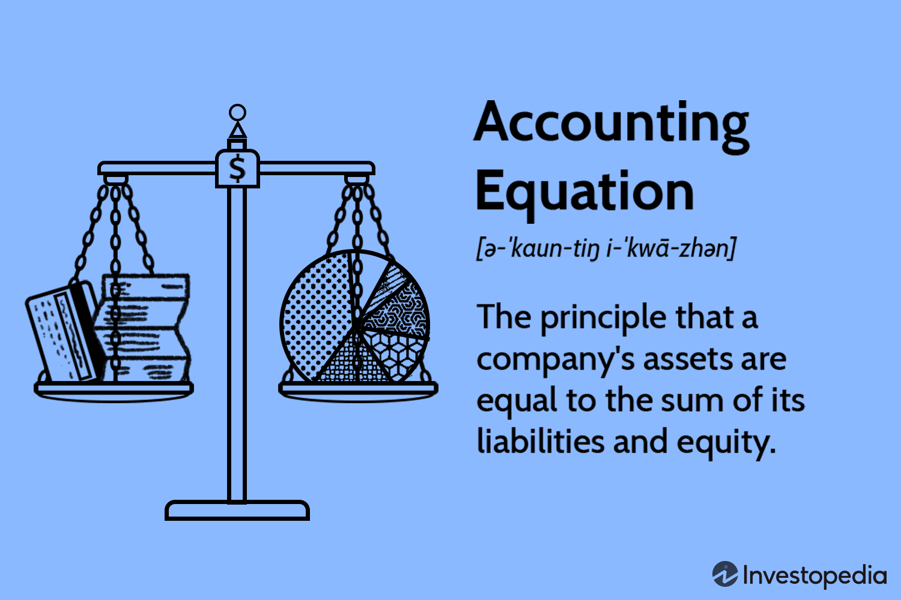

In the rapidly evolving world of financial markets, understanding core concepts, such as the accounting equation, is crucial for accurate analysis and decision-making. The accounting equation, expressed as $\text{Assets} = \text{Liabilities} + \text{Equity}$, is a fundamental principle in financial accounting and serves as the basis for double-entry bookkeeping systems. This equation ensures that financial statements remain balanced and accurately reflect a company's financial position.

This article explores the fundamental principles of the accounting equation, its application in financial accounting, and its integration with algorithmic trading strategies. Algorithmic trading, which uses automated and complex mathematical models to make trading decisions, relies heavily on accurate financial data. The accounting equation plays a significant role in ensuring that this data is reliable and consistent.



Additionally, we will examine how different accounting methods affect financial reporting and tax optimization within the context of algorithmic trading. Various accounting methods, such as cash-basis and accrual-basis accounting, can influence the way financial data is interpreted and reported, impacting the strategic decisions made by traders and financial professionals.

Our discussion will offer insights for both financial professionals and algorithmic traders seeking to optimize their practices. By understanding the interplay between accounting equations, financial accounting, and algorithmic trading, these professionals can enhance their analysis, decision-making, and overall efficiency.

Let us embark on a journey to uncover the relationship between these crucial components, providing a comprehensive understanding that will equip financial analysts and traders with the knowledge needed to navigate the complexities of modern financial markets effectively.

## Table of Contents

## Understanding the Accounting Equation

The accounting equation, expressed as Assets = Liabilities + Equity, serves as the foundation for double-entry accounting systems. This core principle ensures that a company's financial statements remain balanced, providing an accurate depiction of its financial standing. Each element of the equation plays a distinct role:

1. **Assets**: These are the resources owned by a company, encompassing everything from cash and inventory to property and equipment. Assets are critical as they represent the means through which a business can generate income and sustain operations.

2. **Liabilities**: Liabilities reflect the company's obligations or debts, including loans, accounts payable, and other financial commitments. Understanding liabilities is crucial as they influence cash flow and financial strategy decisions.

3. **Equity**: Equity signifies the residual interest in the assets of the company after deducting liabilities. It represents the owners' stake in the business and can be influenced by factors such as retained earnings and investment by shareholders.

The balance inherent in the equation is perpetually maintained through the dual-entry system. This process requires that every financial transaction impacts at least two of the three components (assets, liabilities, and equity), thereby ensuring the equation remains in equilibrium. For example, when a company takes out a loan to purchase new equipment, both the asset (equipment) and the liability (loan) components increase by the same amount, keeping the equation balanced:

$$
\text{Assets: Equipment Purchase} + \text{Liabilities: Loan Increase} = \text{Equity (Unchanged)}
$$

This methodical approach provides a transparent and accurate framework for recording business transactions, facilitating reliable financial analysis and reporting, which is essential for decision-making and strategic planning.

## The Role of the Accounting Equation in Financial Statements

The accounting equation, represented as Assets = Liabilities + Equity, is the cornerstone of financial statements and ensures that they present an accurate representation of a company's financial position. This equation forms the basis for double-entry accounting, which mandates that each financial transaction affects at least two accounts, maintaining the balance of the equation.

The balance sheet utilizes the accounting equation explicitly. It provides a snapshot of a company's financial standing at a particular moment by listing all assets, liabilities, and equity. Assets are the resources owned by the company, such as cash, inventory, and property. Liabilities comprise obligations like loans and accounts payable, while equity represents the owner's residual interest after liabilities have been deducted from assets. The equation ensures that the balance sheet always remains balanced, with total assets equaling the sum of liabilities and equity:

$$
\text{Assets} = \text{Liabilities} + \text{Equity}
$$

The income statement impacts the accounting equation indirectly. This financial statement records revenues and expenses over a period, determining the net income or loss. The net income generated is then transferred to the equity component of the balance sheet. As revenues increase, they contribute to higher net income, which boosts equity. Conversely, expenses reduce net income and, subsequently, equity. Adjustments in net income due to operational performance are reflected in the equity portion through retained earnings, thereby reinforcing the equation's reliability.

The cash flow statement illustrates the dynamic nature of the accounting equation by detailing the inflows and outflows of cash through operating, investing, and financing activities. While the balance sheet offers a static view of financial position, the cash flow statement reveals how transactions modify the company's financial structure over time. Operational activities affect both assets and equity by influencing net income and cash reserves. Investing activities involve the acquisition or sale of long-term assets, impacting asset levels directly. Financing activities, such as issuing or repaying debt, alter liabilities, and equity by modifying the capital structure. Each cash flow transaction ultimately affects the balance sheet as per the accounting equation, ensuring comprehensive financial reporting.

## Accounting Methods and Their Impact on Financial Calculations

Choosing the right accounting method is crucial for accurate financial reporting, particularly in the context of [algorithmic trading](/wiki/algorithmic-trading). The selection of an accounting method influences how financial performance is measured and reported, subsequently affecting strategic decision-making. Among the commonly used methods are cash basis, accrual basis, and mark-to-market accounting, each offering distinct advantages and challenges.

Cash basis accounting is straightforward, recognizing revenues and expenses only when cash transactions occur. This simplicity makes it suitable for small enterprises. However, in algorithmic trading, where transactions are frequent and the timing of cash flows may not align with the economic events they represent, cash basis accounting might not provide the most reliable picture of financial performance. This misalignment can lead to inaccurate reflections of a firm's financial position and performance over time.

Accrual basis accounting presents a more comprehensive view by recording revenues and expenses when they are earned or incurred, regardless of when cash is exchanged. This method aligns financial reporting with the economic activities driving those figures, offering a clearer depiction of profitability and financial health. For firms involved in algorithmic trading, where transactions occur rapidly and frequently, accrual accounting ensures a consistent representation of financial outcomes, facilitating more precise analysis and reporting.

Mark-to-market accounting, or fair value accounting, evaluates assets and liabilities at their current market value. This approach is particularly significant for trading firms, as it provides a real-time reflection of the portfolio's value, thereby aiding in assessing risk and exposure. By offering an up-to-date valuation, mark-to-market accounting can enhance decision-making processes in trading strategies where market conditions fluctuate.

The choice of accounting method hinges on the specific needs and objectives of a trading firm. Each method has unique implications for financial calculations and reporting, influencing how firms evaluate performance and plan strategic initiatives. The accurate and effective integration of these accounting methods into financial systems is essential for optimizing trading operations and maintaining competitive advantage in complex market environments.

## Algorithmic Trading and the Importance of Accurate Financial Reporting

Algorithmic trading strategies are predicated on the availability and accuracy of financial data, as these inform trading decisions and enhance portfolio management. The use of algorithmic trading involves executing orders using automated and pre-programmed trading instructions, accounting for variables such as time, price, and [volume](/wiki/volume-trading-strategy). Precise financial reporting is indispensable to the successful implementation of these strategies.

The bedrock of reliable financial data in algorithmic trading is the double-entry system, which is grounded in the accounting equation: 

$$
\text{Assets} = \text{Liabilities} + \text{Equity}
$$

This fundamental principle ensures that all financial transactions are recorded with precision and accuracy, which is paramount for correctly appraising a company's financial standing. By maintaining balanced [books](/wiki/algo-trading-books), the double-entry system provides an inherent check-and-balance, offering algorithmic traders a robust framework for evaluating financial data. 

Accurate accounting reports are also crucial for effective risk management in algorithmic trading. By ensuring precision in financial reporting, traders can more easily identify potential risks and financial exposures. This ability to pinpoint and subsequently mitigate financial risk is vital in maintaining the stability and success of a trading strategy. Inaccurate financial reporting can lead to misinformed decisions, which may cause significant financial losses.

Furthermore, the choice of accounting methods plays a crucial role in shaping portfolio management decisions, including asset allocation and trading strategies. The three primary accounting methods—cash basis, accrual basis, and mark-to-market—each have distinct advantages and implications. For instance, mark-to-market accounting is particularly important for trading firms, as it reflects the real-time value of a portfolio. This real-time valuation helps traders assess risk and exposure more dynamically, adjusting strategies promptly based on current market conditions.

In summary, accurate financial reporting ensured by accounting methods and principles like the double-entry system, critically supports algorithmic trading strategies. This underscores the need for traders to align their accounting practices with their trading strategies to optimize decision-making and risk management.

## Regulatory Compliance and Accounting Standards in Algo Trading

Compliance with national and international accounting standards, such as the Generally Accepted Accounting Principles (GAAP) and the International Financial Reporting Standards (IFRS), plays a vital role in algorithmic trading. These frameworks establish the guidelines for acceptable accounting methods, significantly impacting how financial data is reported and analyzed across trading activities. Understanding and adhering to these standards ensures that financial statements are both accurate and comparable, fostering transparency and enhancing investor confidence.

GAAP, primarily used in the United States, outlines a comprehensive set of accounting principles that dictate various aspects of financial reporting including revenue recognition, balance sheet item classification, and the measurement of assets and liabilities. Conversely, IFRS is employed globally, offering a more principles-based approach to financial reporting that emphasizes the economic substance of transactions. Although both standards aim to ensure consistency and transparency, differences in their accounting treatments can influence the financial outcomes reported by algorithmic trading firms.

Firms engaged in algorithmic trading operate within a challenging regulatory environment that requires not only compliance with these accounting principles but also adherence to the regulations set forth by financial supervisory agencies like the U.S. Securities and Exchange Commission (SEC). For instance, trading entities that participate in the U.S. markets must align their reporting with the SEC's stringent disclosure standards, which also integrate GAAP guidelines.

These regulatory frameworks necessitate the accurate and timely reporting of financial information, which is pivotal for risk management and decision-making in algorithmic trading. By ensuring adherence to GAAP or IFRS, algorithmic trading firms support a level of data reliability that is crucial for algorithm-driven strategies which rely on precise financial data inputs.

Furthermore, the implementation of correct accounting standards promotes operational transparency, thereby increasing investor confidence. In a rapidly evolving market landscape, investors are more likely to engage with firms that demonstrate clear financial integrity and accountability. This transparency also aids firms in attracting capital by reassuring stakeholders of the entity's commitment to rigorous reporting practices.

As a result, algorithmic trading firms must prioritize the integration of these accounting standards into their internal processes, often necessitating the development of robust compliance frameworks and continuous monitoring systems. By doing so, they ensure the accuracy of their financial reports, which is essential not only for regulatory compliance but also for optimizing trading strategies and sustaining a competitive edge.

## Integrating the Accounting Equation into Algo Trading Strategies

To effectively integrate accounting practices into algorithmic trading, utilizing the accounting equation provides significant strategic insights. The accounting equation, $\text{Assets} = \text{Liabilities} + \text{Equity}$, forms the structural basis for analyzing and recording financial transactions. This equation not only ensures the accuracy of financial statements but also supports the development and refinement of trading algorithms.

Analyzing transactions through the lens of the accounting equation enables firms to maintain the integrity of their financial statements. By ensuring that every transaction is accurately recorded and that the equation remains balanced, algorithmic trading firms can rely on a precise financial foundation. This helps prevent discrepancies in reported data, which is crucial for algorithm development that relies on historical and real-time financial information for decision-making.

Incorporating insights derived from the accounting equation into algorithmic models can significantly enhance trading accuracy and profitability. For instance, detailed analysis of asset movements, changes in liabilities, and fluctuations in equity can inform risk management strategies and asset allocation decisions. By programming algorithms to [factor](/wiki/factor-investing) in these changes, traders can optimize their portfolios to respond to market conditions dynamically.

Case studies from leading algorithmic trading firms illustrate the importance of advanced accounting practices. For example, firms that implement real-time monitoring of their accounting equation components can adapt more swiftly to market [volatility](/wiki/volatility-trading-strategies). Python, with its extensive libraries for financial analysis, is frequently employed to process and interpret complex data sets, linking accounting insights directly to algorithm adjustments:
```python
# Sample Python code to monitor asset, liability, and equity changes

import pandas as pd

# Example financial data
data = {'assets': [100000, 150000, 180000],
        'liabilities': [50000, 70000, 90000],
        'equity': [50000, 80000, 90000]}
df = pd.DataFrame(data)

# Check integrity of the accounting equation
df['balanced'] = df['assets'] == df['liabilities'] + df['equity']

print(df)
```
This simple framework can be expanded to incorporate [machine learning](/wiki/machine-learning) techniques predictive of market trends, allowing algorithms to make informed decisions based on the solid foundation of balanced financial statements.

Firms that harness the power of the accounting equation within their algorithmic frameworks benefit not only by achieving accurate financial reporting but also by driving strategic trading decisions. The synergy between accounting practices and algorithmic models ensures robust, responsive, and resilient trading strategies that capitalize on precise financial data analysis.

## Conclusion

The accounting equation, expressed as $\text{Assets} = \text{Liabilities} + \text{Equity}$, remains a fundamental element of financial accounting, crucial for maintaining the integrity and accuracy of financial records. Its utility extends beyond traditional accounting practices, playing a vital role in the domain of algorithmic trading. The selection of appropriate accounting methods, adherence to regulatory standards, and leveraging comprehensive financial insights are essential components for developing effective trading strategies. Accurate financial reporting, supported by the accounting equation, ensures that algorithmic trading systems operate with reliable data, which is paramount for making informed decisions and optimizing trading outcomes.

Understanding and applying the principles discussed can significantly enhance the operational efficiency and strategic decision-making capabilities of both accountants and traders. The accounting equation helps maintain balanced financial statements, which are integral to assessing an organization's financial health accurately. This alignment between accurate accounting practices and algorithmic trading strategies facilitates robust risk management and optimized asset allocation.

As financial markets advance with technology, the integration of accounting standards and algorithmic trading techniques becomes increasingly important for gaining a competitive advantage. Ensuring transparency and investor confidence through compliance with accounting regulations, such as GAAP or IFRS, further supports the credibility and reliability of financial reporting. Hence, the continuous evolution of these practices and standards will be central to thriving in the rapidly transforming financial landscape.

## References & Further Reading

[1]: ["Fundamentals of Financial Accounting"](https://www.coursera.org/learn/uva-darden-financial-accounting) by Fred Phillips, Robert Libby, and Patricia Libby

[2]: ["Financial Accounting: Tools for Business Decision Making"](https://www.wiley.com/en-us/Financial+Accounting%3A+Tools+for+Business+Decision+Making%2C+10th+Edition-p-9781394184910) by Paul D. Kimmel, Jerry J. Weygandt, and Donald E. Kieso

[3]: ["Accounting for Investments, Equities, Futures and Options"](https://www.wiley.com/en-us/Accounting+for+Investments%2C+Volume+1%3A+Equities%2C+Futures+and+Options-p-9781118179611) by R. Venkata Subramani

[4]: ["Algorithmic Trading and DMA: An Introduction to Direct Access Trading Strategies"](https://www.semanticscholar.org/paper/Algorithmic-trading-%26-DMA-%3A-an-introduction-to-Johnson/aa5de1ab883d5e23b6651faa7c1807586d688e4b) by Barry Johnson

[5]: ["GAAP: Generally Accepted Accounting Principles (U.S.) - Includes FASB Accounting Standards Codification"](https://fasb.org/standards) by AICPA 

[6]: ["IFRS and US GAAP: A Comprehensive Comparison"](https://www.wiley.com/en-us/IFRS+and+US+GAAP%3A+A+Comprehensive+Comparison%2C+with+Website-p-9781118144305) by Steven E. Shamrock

[7]: ["International Financial Reporting Standards (IFRS)"](https://www.ifrs.org/content/dam/ifrs/publications/pdf-standards/english/2021/issued/part-a/ifrs-7-financial-instruments-disclosures.pdf) by IFRS Foundation

[8]: ["Python for Finance: Mastering Data-Driven Finance"](https://www.amazon.com/Python-Finance-Mastering-Data-Driven/dp/1492024333) by Yves Hilpisch