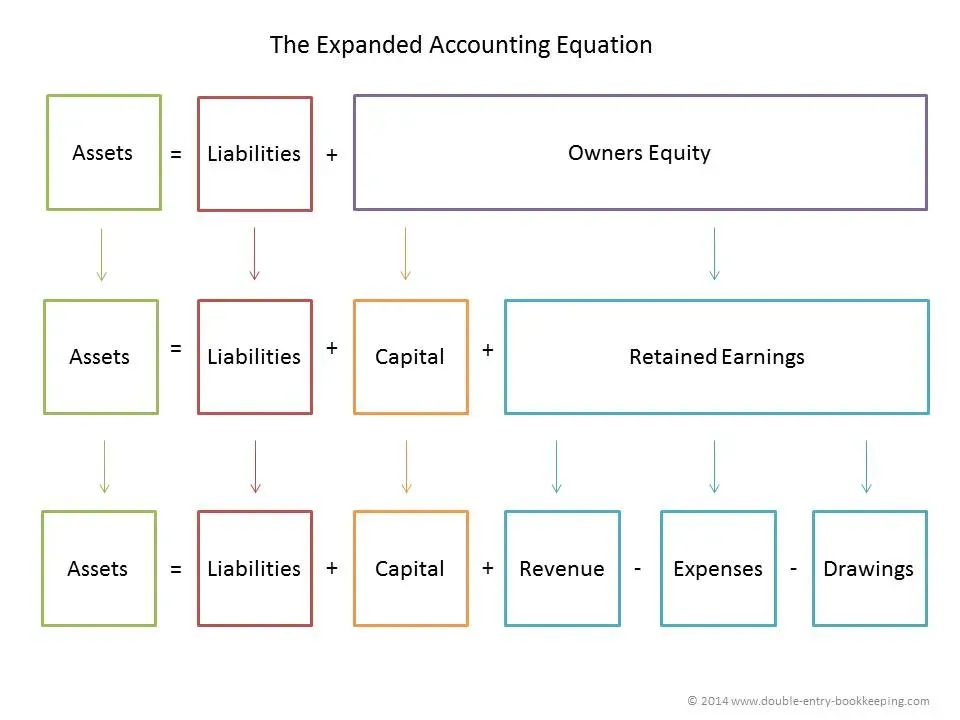

## Table of Contents

## What is the accounting equation?

The accounting equation is a simple formula that shows the relationship between a company's assets, liabilities, and owner's equity. It is written as: Assets = Liabilities + Owner's Equity. This equation is the foundation of the double-entry bookkeeping system, which means that every financial transaction affects at least two accounts to keep the equation balanced.

In simple terms, assets are what a company owns, like cash, inventory, and equipment. Liabilities are what a company owes, such as loans and accounts payable. Owner's equity represents the owner's investment in the business plus any profits that have been kept in the company. The equation must always balance, so if one side changes, the other side must change too to keep everything equal. This helps businesses keep track of their financial health and make sure their records are accurate.

## What are the three elements of the accounting equation?

The three elements of the accounting equation are assets, liabilities, and owner's equity. Assets are things that a business owns, like money in the bank, products they have to sell, and equipment they use to work. Liabilities are what the business owes to others, like loans they need to pay back or bills they haven't paid yet. Owner's equity is the money that the owner has put into the business, plus any profits that the business has made and kept.

These three elements work together to show how a business is doing financially. The equation says that everything the business owns (assets) is equal to what it owes (liabilities) plus what the owner has invested and earned (owner's equity). If the business buys something new, like a computer, the assets go up, but so do the liabilities if they used a loan to buy it, or the owner's equity if they used their own money. This keeps the equation balanced and helps everyone understand the financial health of the business.

## How does the accounting equation balance?

The accounting equation balances because every financial transaction affects at least two parts of the equation in a way that keeps the total equal on both sides. If a business buys a new piece of equipment, for example, the value of its assets goes up because it now owns more stuff. But if the business paid for the equipment with a loan, its liabilities also go up by the same amount because it now owes more money. This keeps the equation balanced because the increase in assets is matched by an increase in liabilities.

On the other hand, if the business used cash to buy the equipment, the assets would still go up, but the cash part of the assets would go down by the same amount. This means the total value of the assets stays the same, so the equation remains balanced. The key is that every change to one side of the equation must be matched by a change on the other side, whether it's an increase in liabilities or a change within the assets themselves. This double-entry system ensures that the accounting equation always balances, giving a clear picture of the business's financial health.

## Can you provide a simple example of the accounting equation in action?

Imagine a small business called "Sam's Bakery." Sam starts his business with $10,000 of his own money. At the beginning, Sam's Bakery has assets of $10,000 (the cash Sam put in), no liabilities (because he doesn't owe anyone money yet), and owner's equity of $10,000 (the money Sam invested). The accounting equation for Sam's Bakery is: Assets ($10,000) = Liabilities ($0) + Owner's Equity ($10,000).

Now, Sam decides to buy an oven for his bakery. The oven costs $5,000, and Sam pays for it with the cash he has. After buying the oven, Sam's Bakery now has assets of $15,000 (the $5,000 oven plus the remaining $5,000 in cash), still no liabilities, and owner's equity remains at $10,000. The accounting equation still balances: Assets ($15,000) = Liabilities ($0) + Owner's Equity ($10,000). This shows how the equation stays balanced even when the business makes a purchase.

## What happens to the accounting equation when a business takes out a loan?

When a business takes out a loan, it affects the accounting equation by increasing both the assets and the liabilities. Let's say Sam's Bakery takes out a loan of $2,000 to buy more baking supplies. The cash in the business goes up by $2,000, so the assets increase to $17,000. At the same time, because the business now owes $2,000 to the bank, the liabilities also go up to $2,000. The owner's equity stays the same at $10,000. So, the new accounting equation is: Assets ($17,000) = Liabilities ($2,000) + Owner's Equity ($10,000).

This example shows how the accounting equation stays balanced even when a business takes on debt. Every change to one side of the equation must be matched by a change on the other side. In this case, the increase in assets (cash from the loan) is exactly matched by the increase in liabilities (the loan itself). This keeps the equation balanced and helps the business keep track of its financial situation accurately.

## How does the accounting equation change when a company pays dividends?

When a company pays dividends, it gives money to its shareholders. This action decreases the company's cash, which is an asset. At the same time, it also reduces the owner's equity because dividends are a way of sharing the company's profits with the owners. So, if a company pays out $1,000 in dividends, its cash (an asset) goes down by $1,000, and its owner's equity also goes down by $1,000. The accounting equation stays balanced because both sides decrease by the same amount.

For example, let's say Sam's Bakery decides to pay out $500 in dividends to its owner, Sam. Before paying the dividends, Sam's Bakery has assets of $17,000, liabilities of $2,000, and owner's equity of $15,000. After paying the dividends, the cash (an asset) decreases to $16,500, and the owner's equity decreases to $14,500. The liabilities stay the same at $2,000. The new accounting equation is: Assets ($16,500) = Liabilities ($2,000) + Owner's Equity ($14,500). This shows how the equation remains balanced even when dividends are paid out.

## What is the difference between assets, liabilities, and equity in the context of the accounting equation?

In the accounting equation, assets are things that a business owns and that have value. This can include money in the bank, products ready to sell, and equipment used to run the business. Assets are important because they help the business operate and make money. Liabilities, on the other hand, are what the business owes to others. This can be loans from a bank, money owed to suppliers, or any other debts. Liabilities are important to track because they show how much the business needs to pay back in the future.

Equity, also known as owner's equity, represents the owner's investment in the business plus any profits that have been kept in the company. It's what's left over after you subtract the liabilities from the assets. Equity shows how much of the business actually belongs to the owner. The accounting equation, Assets = Liabilities + Equity, helps keep track of these three elements and ensures that the business's financial records are always balanced. When something changes in one part of the equation, something else must change to keep everything equal.

## How do transactions affect the accounting equation?

Every time a business does something with money, like buying something, paying a bill, or getting a loan, it changes the accounting equation. The equation says that everything the business owns (assets) is equal to what it owes (liabilities) plus what the owner has put in and earned (equity). So, if the business buys a new computer with cash, the cash part of the assets goes down, but the computer part of the assets goes up by the same amount. This keeps the total assets the same, so the equation stays balanced.

If the business gets a loan to buy the computer instead, the cash goes up because of the loan, so the assets go up. But now the business owes money, so the liabilities go up by the same amount as the loan. This keeps the equation balanced because the increase in assets is matched by an increase in liabilities. Every change to one side of the equation must be matched by a change on the other side to keep everything equal.

## What are some common errors that can unbalance the accounting equation?

Common errors that can unbalance the accounting equation often happen when people make mistakes in recording transactions. For example, if someone forgets to record a purchase or a sale, the assets or liabilities might not match up with the owner's equity. Another mistake could be recording the same transaction twice, which would make the numbers too high on one side of the equation. Also, if someone puts a number in the wrong account, like putting a loan in the assets instead of the liabilities, it can mess up the balance.

To fix these errors, it's important to double-check all the numbers and make sure every transaction is recorded correctly. Using software can help catch mistakes, but it's still important for people to understand how the accounting equation works. By keeping a close eye on the records and making sure every change to one side of the equation is matched by a change on the other side, businesses can keep their financial records accurate and balanced.

## How can the expanded accounting equation provide more detailed financial insights?

The expanded accounting equation gives a more detailed look at a business's finances by breaking down the owner's equity into smaller parts. Instead of just saying "Assets = Liabilities + Owner's Equity," it shows that owner's equity can be made up of things like the owner's original investment, any profits the business has made and kept, and any money the owner has taken out of the business. This helps people see where the money in the business is coming from and going to, making it easier to understand how the business is doing.

For example, if a business owner puts in $10,000 to start the business, makes $5,000 in profit, and then takes out $2,000 for personal use, the expanded equation would show this as: Assets = Liabilities + (Owner's Investment + Revenues - Expenses - Dividends). This gives a clearer picture of the business's financial health because it shows not just the total owner's equity, but also how it has changed over time. By looking at these details, business owners and investors can make better decisions about how to manage and grow the business.

## What role does the accounting equation play in double-entry bookkeeping?

The accounting equation is really important in double-entry bookkeeping because it helps keep everything balanced. In double-entry bookkeeping, every time a business does something with money, like buying something or paying a bill, it has to record it in at least two different places. This makes sure that the accounting equation, which says that everything the business owns (assets) is equal to what it owes (liabilities) plus what the owner has put in and earned (owner's equity), stays balanced. If one side of the equation changes, the other side has to change too, so the equation always stays equal.

For example, if a business buys a new computer with cash, the cash part of the assets goes down, but the computer part of the assets goes up by the same amount. This keeps the total assets the same, so the equation stays balanced. If the business gets a loan to buy the computer instead, the cash goes up because of the loan, so the assets go up. But now the business owes money, so the liabilities go up by the same amount as the loan. This keeps the equation balanced because the increase in assets is matched by an increase in liabilities. By using the accounting equation, double-entry bookkeeping makes sure that all the numbers add up correctly and the business's financial records are accurate.

## How can advanced accounting software help in maintaining the accuracy of the accounting equation?

Advanced accounting software helps keep the accounting equation accurate by automatically recording every transaction in the right places. When a business does something with money, like buying something or paying a bill, the software makes sure that the change is recorded in at least two accounts. This is called double-entry bookkeeping, and it helps keep the equation balanced. If the software sees that one side of the equation changes, it makes sure the other side changes too, so everything stays equal. This means the business's financial records are always correct and up-to-date.

The software also has tools to check for mistakes. It can look for things like numbers that don't add up or transactions that were recorded twice. If it finds a problem, it can tell the user right away, so they can fix it before it causes bigger issues. This helps the business keep its financial records accurate and makes it easier to see how the business is doing. By using advanced accounting software, businesses can make sure their accounting equation stays balanced and their financial information is always right.

## What is the Accounting Equation and how can it be understood?

The accounting equation, expressed as Assets = Liabilities + Equity, serves as the foundation for double-entry accounting systems. This core principle ensures that a company's financial statements remain balanced, providing an accurate depiction of its financial standing. Each element of the equation plays a distinct role:

1. **Assets**: These are the resources owned by a company, encompassing everything from cash and inventory to property and equipment. Assets are critical as they represent the means through which a business can generate income and sustain operations.

2. **Liabilities**: Liabilities reflect the company's obligations or debts, including loans, accounts payable, and other financial commitments. Understanding liabilities is crucial as they influence cash flow and financial strategy decisions.

3. **Equity**: Equity signifies the residual interest in the assets of the company after deducting liabilities. It represents the owners' stake in the business and can be influenced by factors such as retained earnings and investment by shareholders.

The balance inherent in the equation is perpetually maintained through the dual-entry system. This process requires that every financial transaction impacts at least two of the three components (assets, liabilities, and equity), thereby ensuring the equation remains in equilibrium. For example, when a company takes out a loan to purchase new equipment, both the asset (equipment) and the liability (loan) components increase by the same amount, keeping the equation balanced:

$$
\text{Assets: Equipment Purchase} + \text{Liabilities: Loan Increase} = \text{Equity (Unchanged)}
$$

This methodical approach provides a transparent and accurate framework for recording business transactions, facilitating reliable financial analysis and reporting, which is essential for decision-making and strategic planning.

## What is the role of the accounting equation in financial statements?

The accounting equation, represented as Assets = Liabilities + Equity, is the cornerstone of financial statements and ensures that they present an accurate representation of a company's financial position. This equation forms the basis for double-entry accounting, which mandates that each financial transaction affects at least two accounts, maintaining the balance of the equation.

The balance sheet utilizes the accounting equation explicitly. It provides a snapshot of a company's financial standing at a particular moment by listing all assets, liabilities, and equity. Assets are the resources owned by the company, such as cash, inventory, and property. Liabilities comprise obligations like loans and accounts payable, while equity represents the owner's residual interest after liabilities have been deducted from assets. The equation ensures that the balance sheet always remains balanced, with total assets equaling the sum of liabilities and equity:

$$
\text{Assets} = \text{Liabilities} + \text{Equity}
$$

The income statement impacts the accounting equation indirectly. This financial statement records revenues and expenses over a period, determining the net income or loss. The net income generated is then transferred to the equity component of the balance sheet. As revenues increase, they contribute to higher net income, which boosts equity. Conversely, expenses reduce net income and, subsequently, equity. Adjustments in net income due to operational performance are reflected in the equity portion through retained earnings, thereby reinforcing the equation's reliability.

The cash flow statement illustrates the dynamic nature of the accounting equation by detailing the inflows and outflows of cash through operating, investing, and financing activities. While the balance sheet offers a static view of financial position, the cash flow statement reveals how transactions modify the company's financial structure over time. Operational activities affect both assets and equity by influencing net income and cash reserves. Investing activities involve the acquisition or sale of long-term assets, impacting asset levels directly. Financing activities, such as issuing or repaying debt, alter liabilities, and equity by modifying the capital structure. Each cash flow transaction ultimately affects the balance sheet as per the accounting equation, ensuring comprehensive financial reporting.

## What is the relationship between Algorithmic Trading and the Importance of Accurate Financial Reporting?

Algorithmic trading strategies are predicated on the availability and accuracy of financial data, as these inform trading decisions and enhance portfolio management. The use of [algorithmic trading](/wiki/algorithmic-trading) involves executing orders using automated and pre-programmed trading instructions, accounting for variables such as time, price, and [volume](/wiki/volume-trading-strategy). Precise financial reporting is indispensable to the successful implementation of these strategies.

The bedrock of reliable financial data in algorithmic trading is the double-entry system, which is grounded in the accounting equation: 

$$
\text{Assets} = \text{Liabilities} + \text{Equity}
$$

This fundamental principle ensures that all financial transactions are recorded with precision and accuracy, which is paramount for correctly appraising a company's financial standing. By maintaining balanced [books](/wiki/algo-trading-books), the double-entry system provides an inherent check-and-balance, offering algorithmic traders a robust framework for evaluating financial data. 

Accurate accounting reports are also crucial for effective risk management in algorithmic trading. By ensuring precision in financial reporting, traders can more easily identify potential risks and financial exposures. This ability to pinpoint and subsequently mitigate financial risk is vital in maintaining the stability and success of a trading strategy. Inaccurate financial reporting can lead to misinformed decisions, which may cause significant financial losses.

Furthermore, the choice of accounting methods plays a crucial role in shaping portfolio management decisions, including asset allocation and trading strategies. The three primary accounting methods—cash basis, accrual basis, and mark-to-market—each have distinct advantages and implications. For instance, mark-to-market accounting is particularly important for trading firms, as it reflects the real-time value of a portfolio. This real-time valuation helps traders assess risk and exposure more dynamically, adjusting strategies promptly based on current market conditions.

In summary, accurate financial reporting ensured by accounting methods and principles like the double-entry system, critically supports algorithmic trading strategies. This underscores the need for traders to align their accounting practices with their trading strategies to optimize decision-making and risk management.

## References & Further Reading

[1]: ["Fundamentals of Financial Accounting"](https://www.coursera.org/learn/uva-darden-financial-accounting) by Fred Phillips, Robert Libby, and Patricia Libby

[2]: ["Financial Accounting: Tools for Business Decision Making"](https://www.wiley.com/en-us/Financial+Accounting%3A+Tools+for+Business+Decision+Making%2C+10th+Edition-p-9781394184910) by Paul D. Kimmel, Jerry J. Weygandt, and Donald E. Kieso

[3]: ["Accounting for Investments, Equities, Futures and Options"](https://www.wiley.com/en-us/Accounting+for+Investments%2C+Volume+1%3A+Equities%2C+Futures+and+Options-p-9781118179611) by R. Venkata Subramani

[4]: ["Algorithmic Trading and DMA: An Introduction to Direct Access Trading Strategies"](https://www.semanticscholar.org/paper/Algorithmic-trading-%26-DMA-%3A-an-introduction-to-Johnson/aa5de1ab883d5e23b6651faa7c1807586d688e4b) by Barry Johnson

[5]: ["GAAP: Generally Accepted Accounting Principles (U.S.) - Includes FASB Accounting Standards Codification"](https://fasb.org/standards) by AICPA 

[6]: ["IFRS and US GAAP: A Comprehensive Comparison"](https://www.wiley.com/en-us/IFRS+and+US+GAAP%3A+A+Comprehensive+Comparison%2C+with+Website-p-9781118144305) by Steven E. Shamrock

[7]: ["International Financial Reporting Standards (IFRS)"](https://www.ifrs.org/content/dam/ifrs/publications/pdf-standards/english/2021/issued/part-a/ifrs-7-financial-instruments-disclosures.pdf) by IFRS Foundation

[8]: ["Python for Finance: Mastering Data-Driven Finance"](https://www.amazon.com/Python-Finance-Mastering-Data-Driven/dp/1492024333) by Yves Hilpisch