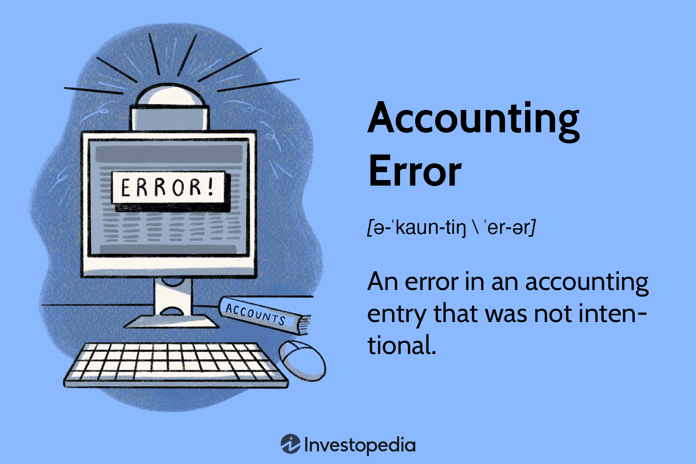

Accounting errors, often perceived as negligible slip-ups, can have profound effects on financial outcomes, especially in high-stakes environments like algorithmic trading. These errors can lead to significant financial discrepancies, affect market confidence, and even result in substantial legal liabilities. With automated trading systems heavily reliant on accurate financial data, any error in accounting records can cascade through trading algorithms, potentially leading to erroneous trades, financial losses, and disrupted market operations.

Algorithmic trading requires precise data inputs to execute trades effectively and efficiently. Inaccuracies arising from accounting errors, such as data entry mistakes or misclassifications, can skew trading algorithms' decision-making processes. This is particularly critical as algorithms conduct transactions at high speeds, often without human intervention. The ability to detect and correct accounting errors swiftly is thus paramount to maintaining trading integrity and minimizing potential adversities.



This article investigates into several critical areas. It begins with defining accounting errors, exploring their types and how they differ from fraudulent activities. It then examines the extensive impact of these errors within the context of algorithmic trading. Following this, various methodologies for detecting such errors are discussed, from traditional audits to cutting-edge technologies like artificial intelligence (AI) and machine learning (ML).

Preventative measures are equally crucial, and the article outlines best practices for avoiding these mistakes. This includes robust internal controls and staff training. Real-world case studies further illustrate the considerable effects and potential lessons learned from past incidents involving accounting errors. Lastly, the role of emerging technologies like blockchain and robotic process automation (RPA) in reducing the incidence of errors will be considered, offering insights into future directions for ensuring data accuracy and integrity.

In conclusion, fostering a culture of accuracy and accountability is not just beneficial but necessary, with continuous improvement and adoption of advanced technologies at its core.

## Table of Contents

## Understanding Accounting Errors

Accounting errors refer to mistakes or inaccuracies that occur in the recording, classification, or summarization of financial data. These errors can significantly impact financial statements, leading to misinformed decision-making and potential legal implications. Understanding and addressing these errors is crucial for maintaining the integrity and reliability of financial information, particularly in areas such as algorithmic trading, where precision and accuracy are paramount.

### Definition and Significance of Accounting Errors

An accounting error is an unintentional mistake in the financial records of an organization. These errors can arise from various factors such as human oversight, incorrect application of accounting principles, or flawed data entry processes. The significance of accounting errors lies in their potential to misrepresent a company's financial position, affecting stakeholders' decisions and potentially leading to regulatory sanctions. For instance, an understatement of liabilities may present a more favorable financial health than the reality, while an overstatement of revenues can inflate per-share earnings, misleading investors.

### Differentiating Between Unintentional Errors and Fraud

To effectively manage accounting errors, it is essential to differentiate between unintentional mistakes and fraudulent activities. Unintentional errors typically result from human error or system failures and lack the intent to deceive. Examples include arithmetic errors, transposition errors, or accidental duplication of entries. In contrast, fraud involves deliberate manipulation of financial data to mislead stakeholders for personal or corporate gain. Detecting the difference often requires forensic accounting techniques, thorough audits, and a robust understanding of both accounting and business operations.

### Common Types of Accounting Errors

1. **Data Entry Errors**: These occur when numerical or textual data is incorrectly entered into accounting systems. A common example is the transposition error, where digits are reversed (e.g., entering 84 instead of 48).

2. **Omission Errors**: This type of error occurs when a financial transaction is completely or partially omitted from the records. For example, failing to record a sale can lead to understated revenue figures.

3. **Duplication Errors**: Duplication errors involve recording the same transaction more than once, leading to inflated numbers. Such errors can distort expenses, revenues, and overall financial results.

4. **Principle Errors**: These arise when accounting principles are incorrectly applied, leading to the misrepresentation of financial data. An example would be capitalizing an expense that should have been recorded as an operating expense.

Addressing these errors requires implementing stringent internal controls, enhancing audit processes, and fostering a culture of accuracy and accountability within organizations.

## Impact of Accounting Errors in Algo Trading

Accounting errors can significantly impact [algorithmic trading](/wiki/algorithmic-trading), as these trades rely heavily on accurate data to execute orders appropriately. Errors can manifest in several detrimental ways, affecting both short-term financial performance and long-term strategic outcomes.

**Effects on Trading Algorithms and Financial Outcomes**

Algorithmic trading systems depend on precise financial data to automate trading decisions. When accounting errors, such as incorrect valuation of assets or misreported earnings, occur, they can distort the algorithms' decision-making processes. For instance, an error in stock price data might lead an algorithm to execute a trade based on false information, resulting in unexpected financial losses. Mathematically, one can view the problem as follows:

$$
T = f(D)
$$

where $T$ represents the trading decision, and $D$ is the dataset involved. An error in $D$ would disrupt the function $f$, leading to incorrect outputs.

For example, a small data entry mistake might look inconsequential in large datasets, but in a high-frequency trading environment where decisions occur within microseconds, even minimal discrepancies can lead to substantial financial losses. Incorrect data concerning transaction fees or exchange rates can result in miscalculations that affect trading outcomes significantly, eroding profit margins or leading to costly trades.

**Consequences in a Fast-Paced Trading Environment**

In fast-paced trading environments, accounting errors can lead to order execution errors, where trades are placed at incorrect prices or volumes. Such actions can destabilize a trading strategy and lead to considerable financial shortfalls. An illustrative case is the 2012 Knight Capital Group incident, where a software error led to a loss of approximately $440 million in just 45 minutes due to erroneous trades.

Moreover, in a volatile market, even a minor accounting error can provoke automated trading algorithms to initiate a cascade of trades based on false market signals, amplifying losses across portfolios and potentially altering market conditions.

**Regulatory and Compliance Risks**

Accounting errors pose severe regulatory and compliance risks, which can be very costly for trading firms. Financial regulatory bodies mandate strict compliance with reporting standards, and any deviation caused by inaccurate accounting can lead to fines and reputational damage. For instance, misreporting of financial statements due to accounting errors can lead to investigations by bodies such as the Securities and Exchange Commission (SEC) in the United States.

Non-compliance with financial regulations due to accounting errors can also result in legal penalties and suspension of trading licences. Companies must adhere to the Sarbanes-Oxley Act, which mandates rigorous internal controls and accuracy in financial record-keeping. Failure to do so not only leads to financial penalties but also tarnishes investor confidence, damaging a firm's market reputation in the long term. Consequently, preventing accounting errors becomes crucial to maintaining compliance and avoiding legal repercussions.

In summary, accounting errors can severely impact not just the operational efficacy of trading algorithms but also pose significant regulatory and compliance challenges. Ensuring data accuracy is paramount to minimizing these risks and safeguarding financial outcomes.

## Error Detection Techniques

Error detection in accounting, particularly within the context of algorithmic trading, is vital to maintain the integrity and reliability of financial systems. Traditional methods of error detection in accounting include audits and reconciliations. Audits involve a thorough examination of financial records to ensure accuracy and compliance with established standards. They can identify errors through systematic verification of transactions, account balances, and financial statements. Audits can be conducted internally or by external parties and are an essential mechanism for error detection and prevention.

Reconciliations, another traditional method, involve comparing different sets of records, such as bank statements and accounting records, to ensure consistency and correctness. This process helps identify discrepancies such as omissions, duplications, or incorrect entries, allowing for timely corrections.

Advanced techniques for error detection have emerged with the advent of [artificial intelligence](/wiki/ai-artificial-intelligence) (AI) and [machine learning](/wiki/machine-learning) (ML). These technologies enhance error detection capabilities by automatically analyzing vast datasets for anomalies that might indicate errors or fraudulent activities. Machine learning models can be trained on historical data to recognize patterns of typical transactions, thus flagging irregularities. For example, unsupervised learning algorithms can cluster similar transactions and highlight those that significantly deviate from established patterns, indicating potential errors.

Python, a programming language widely used in data analysis and AI, can be employed to implement anomaly detection algorithms. For instance, the scikit-learn library offers various models for detecting anomalies, such as Isolation Forests and One-Class SVMs. Below is a simple Python code snippet demonstrating anomaly detection using the Isolation Forest method:

```python
from sklearn.ensemble import IsolationForest
import numpy as np

# Sample data with features
data = np.array([[10, 2], [12, 3], [11, 2.5], [20, 20]])  # Includes an outlier

# Initialize the Isolation Forest model
isolation_forest = IsolationForest(contamination=0.1)

# Fit the model
isolation_forest.fit(data)

# Predict anomalies
predictions = isolation_forest.predict(data)

# Output predictions (-1 indicates anomaly)
print(predictions)
```

Advanced algorithms provide the ability to monitor financial transactions in near real-time, a crucial capability given the rapid pace of algorithmic trading. Real-time data analysis involves continuously processing transaction data to detect and address inconsistencies immediately. This dynamic approach is facilitated by technologies such as stream processing frameworks (e.g., Apache Kafka, Apache Flink) that ingest, process, and analyze data at high velocities, thus empowering organizations to react swiftly to any errors detected.

Together, these traditional and advanced techniques bolster the robustness of financial systems, ensuring that errors are detected and mitigated effectively in algorithmic trading. As technology continues to evolve, the integration of these tools into accounting practices will likely become more sophisticated, further enhancing financial accuracy and security.

## Preventing Accounting Errors

Implementing robust internal controls and procedures is essential to prevent accounting errors in algorithmic trading. Internal controls serve as the backbone of a company's financial management system, ensuring accuracy, reliability, and timeliness in financial reporting. Key components include segregation of duties, access controls, and regular reconciliations. Segregation of duties mitigates the risk of errors and fraud by dividing responsibilities among different individuals. Access controls limit the potential for unauthorized data manipulation, while regular reconciliations help identify discrepancies promptly.

Training staff and employing updated financial software play a crucial role in maintaining data integrity. Continuous education programs ensure that employees are aware of the latest accounting principles, software functionalities, and the importance of accuracy in financial data handling. Training should cover recognizing potential sources of errors, using financial software efficiently, and understanding error reporting mechanisms.

Updating financial software is vital in adapting to the dynamic nature of algorithmic trading. Modern software solutions can automate many error-prone processes, reducing the likelihood of human mistakes. Cloud-based accounting tools offer real-time data processing and analytics, enabling swift identification and correction of anomalies. Organizations should regularly update their software to incorporate the latest technological advancements and cybersecurity measures.

Best practices for ensuring data accuracy in algorithmic trading involve a strategic combination of technology and protocol. Firstly, firms should adopt real-time data validation and verification processes. Utilizing machine learning algorithms can enhance the detection of unusual patterns that may indicate errors. For example, anomaly detection models can flag transactions deviating significantly from historical norms, prompting further review. Python libraries like Scikit-learn provide robust tools for developing these models:

```python
from sklearn.ensemble import IsolationForest

# Example of using Isolation Forest for anomaly detection
data = [...]  # Load trading data here
model = IsolationForest(contamination=0.1)  # Set contamination level based on expected outliers
model.fit(data)
anomalies = model.predict(data)
```

Additionally, maintaining a comprehensive audit trail ensures a clear record of all trading activities, facilitating the traceability of errors post-occurrence. Regular internal audits and process reviews can help identify vulnerabilities in the error prevention framework and provide actionable insights for improvement.

In summary, preventing accounting errors in algorithmic trading requires a multifaceted approach that combines stringent internal controls, continuous staff training, updated technology, and a proactive stance on data validation. Such measures collectively fortify an organization's defenses against the potential financial and reputational repercussions of accounting errors.

## Case Studies and Real-World Implications

Accounting errors in trading can have severe consequences, often leading to significant financial losses, reputational damage, and regulatory scrutiny. Examining case studies can offer valuable insights into the ramifications of such errors and the effective strategies companies have employed to mitigate these risks.

One notable incident involved a leading financial services firm that experienced substantial losses due to a data entry error. The error involved the misplacement of a decimal point, which led to the execution of trades at incorrect prices. This mishap cost the firm millions of dollars and highlighted the critical need for stringent checks and balances in trading processes. The lesson learned emphasized the importance of establishing comprehensive verification mechanisms to ensure accuracy in data entry.

Another case involved a trading firm where duplication errors in the accounting system resulted in double counting of assets. This led to inaccurate financial statements and overvaluation of the firm's holdings. The error went unnoticed until a routine audit revealed the discrepancy, causing a significant hit to the firm's credibility. The management response involved implementing automated reconciliation tools to compare and validate data consistency across multiple systems, significantly reducing the chance of future duplication errors.

A third example can be drawn from a global trading firm that suffered losses due to principle errors, where transactions were recorded in incorrect accounts. This misallocation of trades led to inaccurate reporting and compliance challenges. To address this, the firm adopted a strategy of real-time data monitoring, integrating machine learning algorithms to detect anomalies and flag potential errors. This proactive approach not only minimized the risk of principle errors but also improved overall operational efficiency.

In analyzing these cases, it becomes evident that successful firms employ a mix of strategies to mitigate accounting error risks effectively. These strategies include the implementation of robust internal controls, investment in advanced technology such as artificial intelligence for anomaly detection, and fostering a culture that prioritizes data accuracy and accountability.

Through these historical incidents and the subsequent responses, it is clear that continuous investment in error detection and prevention mechanisms is imperative. Firms that proactively adapt to evolving technological solutions and incorporate lessons learned from past failures into their operational frameworks are better positioned to safeguard against the detrimental impacts of accounting errors in trading.

## The Role of Technology in Error Prevention

Technology plays a crucial role in preventing accounting errors, particularly in the fast-paced environment of algorithmic trading. Through the integration of blockchain, robotic process automation (RPA), and application programming interfaces (APIs), firms can significantly enhance the accuracy and reliability of their financial operations.

### Blockchain and Robotic Process Automation (RPA)

Blockchain technology provides a decentralized and immutable ledger system that can reduce the incidence of accounting errors. Its transparency and security features ensure that once data is recorded, it cannot be altered without a consensus, thus preventing unauthorized changes. This capability is vital in preserving data integrity and ensuring that all transactions are accurately captured and reported.

Robotic Process Automation (RPA) automates repetitive tasks, such as data entry and reconciliation, that are traditionally prone to human errors. RPA bots can process transactions more quickly and with greater precision than humans, reducing the likelihood of errors. Furthermore, RPA can operate across different systems and platforms, ensuring consistent data synchronization and validation.

### API Integrations for Seamless Data Flow

APIs facilitate seamless data flow and validation across disparate systems within a firm. By allowing systems to communicate directly, APIs ensure that data is transferred accurately and in real-time, minimizing the risk of discrepancies. For example, an API can automatically update a firm’s accounting software with trading data from an exchange platform, eliminating the need for manual data entry.

Python code, using APIs, might involve libraries such as `requests` to pull data from an exchange platform:

```python
import requests

def get_trading_data(api_url):
    response = requests.get(api_url)
    if response.status_code == 200:
        return response.json()
    else:
        raise Exception("API request failed with status code {}".format(response.status_code))

# Example usage
api_url = "https://api.exchangeplatform.com/v1/trade_data"
trading_data = get_trading_data(api_url)
```

This code snippet demonstrates how an API call can be used to fetch trading data automatically, thus ensuring the data is current and reducing the scope for human error.

### Future Trends in Error Prevention Technology

Several emerging technologies hold promise for further reducing accounting errors in trading environments. Artificial Intelligence (AI) and Machine Learning (ML) are increasingly used to detect anomalies in transaction data, identifying potential errors before they can impact financial reporting. These technologies can analyze vast amounts of data to recognize patterns and flag deviations that might indicate errors.

Another potential development lies in the use of Distributed Ledger Technology (DLT) beyond blockchain. DLT could enable real-time auditing of transactions, providing firms and regulators with immediate insight into financial activities and reducing the time and resources required for traditional audits.

In summary, the integration of blockchain, RPA, and APIs in trading operations not only prevents accounting errors but also enhances overall operational efficiency. As technology continues to evolve, new tools and methodologies will arise, offering further opportunities for financial firms to refine their processes and maintain the highest standards of accuracy and accountability.

## Conclusion

Detecting and preventing accounting errors are critical for the financial stability and operational success of algorithmic trading firms. Accounting errors not only jeopardize the accuracy of financial reporting but also pose significant risks to algorithmic trading strategies, potentially leading to substantial financial losses. Effective error detection and prevention are thus paramount in safeguarding against these risks and ensuring the precision required in a fast-paced trading environment.

Fostering a culture of accuracy and accountability within organizations is crucial. This involves emphasizing the importance of meticulous data handling and fostering an environment where staff are encouraged and trained to prioritize accuracy. Incorporating a robust system of checks and balances, including advanced technology solutions, can play a pivotal role in error prevention. Adopting a proactive approach through the use of artificial intelligence (AI) and machine learning (ML) for real-time anomaly detection supports the ability of firms to preemptively address potential discrepancies before they escalate into significant issues.

Furthermore, there is an urgent call to action for continuous improvement and technology adoption. Organizations should actively seek to integrate the latest advancements in blockchain and robotic process automation (RPA), which offer promising capabilities in reducing the incidence of errors through enhanced data integrity and automation of repetitive tasks. Additionally, leveraging application programming interface (API) integrations can facilitate seamless data flow and validation across multiple systems, enhancing the reliability of trading operations.

By embracing these strategies, firms can not only reduce the likelihood of errors but also strengthen their overall competitive position in the market. As the trading landscape evolves, maintaining a commitment to continuous improvement and adopting innovative technologies will be essential for firms aiming to uphold accuracy, accountability, and efficiency in their operations.

## References

1. Christensen, J., & Demski, J. S. (2003). *Accounting Theory: An Information Content Perspective*. This book provides a comprehensive exploration of accounting information systems and error implications, offering insights into theoretical foundations and practical applications.

2. Lybrand, W., & Ross Bros. & Montgomery. (1998). *Algorithmic Trading: Winning Strategies and Their Rationale*. This source investigates into algorithmic trading strategies, with particular sections dedicated to understanding the impacts of errors and how they affect financial outcomes.

3. PWC. (2014). *Accounting Fraud & Error: Detection, Prevention & Analysis*. Available at: [PWC Report](https://www.pwc.com/gx/en/services/forensics.html). This report outlines the methodologies for detecting and preventing accounting errors and fraud within financial institutions.

4. Foulkes, B. (2016). "The Role of Big Data in Error Detection in Algorithmic Trading" in *Journal of Financial Markets*. This article examines advanced error detection techniques using big data analytics in algo trading.

5. Deloitte. (2020). *Finance in a Digital World: Data Integrity and Error Management Practices*. Available at: [Deloitte Report](https://www2.deloitte.com/global/en/pages/technology/articles/finance-digital-world.html). This resource provides a detailed look at best practices for maintaining data integrity in financial operations.

6. IBM. (2019). *AI and Machine Learning for Financial Trading Strategies*. Available at: [IBM Whitepaper](https://www.ibm.com/industries/financial-markets). This whitepaper discusses how AI and ML can be leveraged for error detection and prevention in financial markets.

7. EY. (2021). *Effective Internal Controls for Error Prevention in Financial Trading*. Available at: [EY Report](https://www.ey.com/en_gl/assurance/internal-controls). This document offers insights into implementing robust internal controls to mitigate the risk of accounting errors.

8. Taylor, S. J., & Litterman, R. (2011). "Risk Management in Trading and Valuation of Financial Derivatives" in *Journal of Risk Management*. This journal article explains the importance of risk management, focusing on the identification and correction of accounting errors in derivative trading.

9. KPMG. (2022). *Future of Trading: Leveraging Technology for Enhanced Accuracy and Efficiency*. Available at: [KPMG Insights](https://home.kpmg/xx/en/home/insights.html). This report investigates future trends in technology aimed at minimizing errors in trading operations.

## References & Further Reading

[1]: Bergstra, J., Bardenet, R., Bengio, Y., & Kégl, B. (2011). ["Algorithms for Hyper-Parameter Optimization."](https://dl.acm.org/doi/10.5555/2986459.2986743) Advances in Neural Information Processing Systems 24.

[2]: ["Advances in Financial Machine Learning"](https://www.amazon.com/Advances-Financial-Machine-Learning-Marcos/dp/1119482089) by Marcos Lopez de Prado

[3]: ["Evidence-Based Technical Analysis: Applying the Scientific Method and Statistical Inference to Trading Signals"](https://www.amazon.com/Evidence-Based-Technical-Analysis-Scientific-Statistical/dp/0470008741) by David Aronson

[4]: ["Machine Learning for Algorithmic Trading"](https://github.com/stefan-jansen/machine-learning-for-trading) by Stefan Jansen

[5]: ["Quantitative Trading: How to Build Your Own Algorithmic Trading Business"](https://www.amazon.com/Quantitative-Trading-Build-Algorithmic-Business/dp/1119800064) by Ernest P. Chan