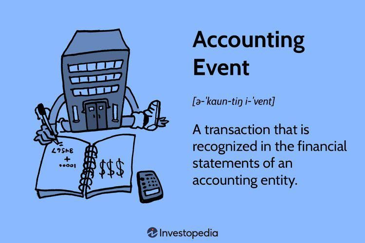

The interconnectedness of financial transactions, accounting events, business accounting, and algorithmic trading forms the backbone of modern financial management. Financial transactions are fundamental activities that involve the exchange of monetary value between businesses and their stakeholders. These transactions serve as essential inputs in accounting systems, encapsulating various activities such as sales, purchases, loans, and investments, and ensuring the financial records accurately reflect a business's economic activities.

Accounting events, on the other hand, are specific occurrences that engender changes in the financial statements of a business. These events are vital for producing timely and accurate financial information. They can be categorized as internal, which occur within the organization, and external, which are influenced by interactions outside the company. This distinction is crucial for maintaining financial accuracy and transparency in the recorded information. The meticulous recording and analysis of these events underpin reliable financial representation, enabling stakeholders to make informed economic decisions.



Business accounting serves as the cornerstone of financial management, employing established principles and standards to classify and report financial data. The significance of accounting methods, such as cash and accrual accounting, is profound as they dictate how and when financial transactions are recorded. Adherence to these methods ensures consistency and comparability in financial reporting across industries and geographical boundaries, thereby fostering transparency and trust among investors and regulators.

In the rapidly evolving world of finance, algorithmic trading stands out as a transformative force. This form of trading leverages complex algorithms to execute trades at speeds and frequencies beyond human capacity. The evolution of algorithmic trading has placed an unprecedented emphasis on the accessibility and precision of financial data. Reliable accounting data is indispensable to this process, providing the critical inputs for developing and refining trading algorithms and strategies. Accurate financial information fuels this machine-driven trading landscape, offering competitive advantages such as enhanced market liquidity, reduced transaction costs, and minimized human biases.

The integration of accounting practices, financial transactions, and algorithmic trading exemplifies a synergistic approach to modern financial operations. Robust accounting frameworks ensure the integrity of financial data that propels algorithmic trading, thus fostering an efficient and competitive market environment. Understanding these interconnected elements is imperative for businesses striving to enhance operational efficiency, adhere to compliance standards, and gain strategic advantages in the global financial ecosystem.

## Table of Contents

## Understanding Financial Transactions and Accounting Events

Financial transactions are the fundamental exchanges of value between two or more parties, signifying the transfer of goods, services, or assets. These transactions are the cornerstone of business accounting, as they serve as the primary inputs into a company's financial records. The accuracy and completeness of recorded financial transactions are crucial, as they directly influence the financial statements, which stakeholders rely upon to assess the economic health and performance of a business. A financial transaction typically involves the exchange of monetary components that are recorded in accounting systems through various methods, including journal entries and ledger postings.

Accounting events, on the other hand, refer to significant occurrences or conditions that impact the financial position or results of operations of an entity, and they must be recorded and reported in the financial statements. These events go beyond routine transactions as they encompass any incidents that require accounting adjustments, such as changes in market interest rates, declarations of dividends, or recognition of depreciation expenses. The accurate reflection of accounting events on financial statements ensures that they present a true and fair view of an organization's financial state, which aids in decision-making for management and external users.

The distinction between internal and external accounting events lies in their origin and scope. Internal accounting events are triggered by activities within the organization itself. Examples include the internal transfer of inventory between departments or the allocation of overhead costs to different production units. These events typically influence a company's internal management reports but can also have implications for external reporting when they alter the aggregate financial data.

External accounting events, in contrast, stem from encounters with outside entities or environmental factors. These include transactions with customers, suppliers, investors, and lenders, such as sales revenue, procurement of goods, issuance of shares, or payment of interest on loans. External events are pivotal in forming financial statements because they frequently dictate an organization’s liabilities and assets, thereby affecting the overall financial outlook of the business.

The role of accounting events in recording business activities ensures that they are accurately captured and classified, maintaining financial accuracy and integrity. This process involves identifying, measuring, and reporting economic events in a coherent manner that aligns with established accounting principles and standards. By doing so, financial records become not only a tool for compliance but also a strategic asset for analyzing past performance and forecasting future growth opportunities.

For instance, if a company sells goods on credit, this generation of a receivable is an accounting event where revenue is recognized at the point of sale, even though the cash is collected later, reflecting the accrual basis of accounting. The event is recorded as:

```python
# Python code illustrating a simple journal entry
# Sale of goods on credit worth $1000 to a customer
accounts_receivable = 0
sales_revenue = 0

# Posting the transaction in financial records
accounts_receivable += 1000  # Debit the receivable account
sales_revenue += 1000  # Credit the revenue account

# Printing the resulting balances
print(f"Accounts Receivable: ${accounts_receivable}")
print(f"Sales Revenue: ${sales_revenue}")
```

This example underlines the importance of recognizing both the timing and the nature of transactions in achieving financial accuracy and transparency, essential for robust financial management and stakeholder trust.

## The Role of Business Accounting

Business accounting serves as the backbone of effective financial management by systematically recording, analyzing, and interpreting financial information crucial for strategic decision-making. At its core, business accounting provides a structured approach to tracking financial transactions, assessing economic performance, and ensuring compliance with regulatory standards.

Accounting methods are pivotal in framing financial reporting and determining the timing of revenue and expense recognition. Two primary accounting methods are cash accounting and accrual accounting. Cash accounting recognizes revenue and expenses only when cash changes hands, making it straightforward and beneficial for small businesses or those operating on a cash basis. However, it may not provide a complete picture of a company's financial status during certain periods. 

Conversely, accrual accounting recognizes income and expenses when they are earned or incurred, irrespective of cash flow. This method offers a more comprehensive view of a company’s financial health and aligns with the generally accepted accounting principles (GAAP). Accrual accounting is particularly important for companies with credit transactions and long-term projects, as it ensures that revenue and expenses are matched, reflecting the true financial performance over a given period. 

By aligning accounting practices with business strategies, firms can enhance their decision-making processes. Accurate accounting provides critical insights into financial trends, resource allocation, and cost-control measures, enabling companies to identify strengths, weaknesses, opportunities, and threats (SWOT analysis). This thorough understanding supports strategic planning and the setting of realistic financial targets, fostering long-term business growth.

Examples abound of how precise accounting underpins business growth and instills investor confidence. For instance, multinational corporations use accrual accounting to present a transparent and accurate financial representation, crucial for securing investor trust. By providing detailed financial statements that reveal a company’s profitability and financial position, businesses can attract and retain investors, providing them with assurance regarding their investments. Moreover, accurate accounting helps in keeping a company compliant with tax obligations and regulations, thereby mitigating risks of legal repercussions.

In conclusion, business accounting is instrumental in financial management by offering a reliable framework for financial reporting and analysis. Through various accounting methods, companies can tailor their financial records to suit their operational needs and strategic goals, ultimately enhancing decision-making and fostering growth.

## Algorithmic Trading: A Transformative Force in Finance

Algorithmic trading, a method of executing orders using automated pre-programmed trading instructions, has reshaped modern financial markets. Originating in the late 20th century, it has grown to account for a significant portion of trading [volume](/wiki/volume-trading-strategy), contributing to increased market efficiency and [liquidity](/wiki/liquidity-risk-premium). The essence of [algorithmic trading](/wiki/algorithmic-trading) lies in its ability to process vast amounts of data at speeds and accuracy levels unattainable by human traders, allowing for the execution of trades that capitalize on market conditions in real-time.

The effectiveness of algorithmic trading is heavily dependent on the precision and timeliness of financial data. Traders utilize historical and real-time data to construct models that predict price movements or identify trading opportunities. Accurate financial data ensures that algorithms can effectively make decisions based on current market trends and historical patterns. Delays or errors in data can lead to significant financial losses, highlighting the need for reliable data sources and advanced data-processing technologies.

Accounting data serves a critical function in algorithmic trading by aiding the development of trading algorithms and strategies. For instance, accounting information such as earnings reports, balance sheets, and cash flow statements can be used to gauge a company's financial health, influencing stock valuations within trading models. Integrating this data allows for more informed algorithms that take into consideration fundamental financial indicators rather than just technical or market flow data.

Algorithmic trading offers several competitive advantages in today’s fast-paced markets. Firstly, it enables traders to execute complex strategies that involve multiple securities or quantities that would be impractical manually. These strategies can capitalize on momentary price discrepancies that otherwise might be overlooked. Moreover, algorithmic trading minimizes human error and emotion-driven trading decisions, contributing to more consistent and rational trade execution. 

By leveraging technology, algorithmic trading also enhances market accessibility, permitting a wider range of participants to engage efficiently. The capability to operate across different markets and time zones without the need for physical presence gives traders an edge in a globalized financial landscape. Furthermore, the scalability of algorithmic systems allows for handling increased trading volumes with minimal additional costs, making them economically advantageous.

In summary, algorithmic trading continues to transform financial markets, heavily relying on exact and timely data to function effectively. Its integration with accounting data enhances strategy formulation, while its competitive advantages, such as speed, precision, and scalability, make it an indispensable tool in modern finance.

## Integration of Accounting and Trading Strategies

The convergence of accounting methods and algorithmic trading strategies represents a dynamic evolution in the finance sector, significantly impacting how businesses strategize and execute trades. This integration leverages robust accounting practices to enhance the precision and effectiveness of algorithmic trading systems, thereby offering competitive advantages in the marketplace.

Accrual accounting, a cornerstone of this integration, plays a critical role by synchronizing trading timelines with financial reporting. Unlike cash accounting, which records transactions only when cash changes hands, accrual accounting recognizes revenues and expenses when they are incurred. This provides a more accurate representation of a company's financial position and performance, crucial for developing effective trading strategies. By aligning financial statements more closely with the economic activities they represent, accrual accounting enables traders to make more informed decisions based on complete and timely information.

Furthermore, businesses increasingly exploit accounting data to fine-tune trading strategies and enhance performance. Detailed financial data, rooted in rigorous accounting practices, serves as the backbone for sophisticated trading algorithms. These algorithms can dissect and analyze financial statements to detect trends, forecast future movements, and optimize portfolio allocations. For instance, traders might employ [machine learning](/wiki/machine-learning) models trained on historical accounting data to predict stock price fluctuations or devise hedging strategies. This data-driven approach ensures that trading decisions are not just reactive but informed by historical performance indicators and forecasts.

Case studies offer compelling evidence of successful integration. Consider a multinational corporation that implemented a trading algorithm incorporating its financial forecasts derived from accrual accounting. By realigning its trading activities with these forecasts, the corporation optimized its currency hedging strategy, leading to a significant reduction in foreign exchange risks and enhanced profitability. Similarly, an investment firm may use its extensive database of financial accounting reports to create a predictive model for credit risk assessment, thereby fine-tuning their investment strategies to maximize returns while minimizing exposure.

These examples highlight the transformative impact of integrating accounting practices with trading strategies in the financial sector. The synergy between accurate financial reporting and advanced trading techniques not only enhances market performance but also strengthens investor confidence by underpinning trades with reliable financial data. As technology advances, the opportunities for deeper integration are likely to expand, promising further efficiencies and innovations in trading and financial management.

## Challenges and Considerations in Financial Reporting for Trading

In the complex landscape of algorithmic trading, financial reporting faces several unique challenges that necessitate diligent attention and compliance with strict accounting standards. Algorithmic trading, characterized by high-frequency and automated strategies, relies heavily on precise data and comprehensive financial reporting to maintain market integrity and regulatory adherence.

One of the primary challenges in financial reporting for algorithmic trading is the speed and volume of transactions. The rapid pace of trades necessitates real-time data collection and reporting capabilities, pushing traditional accounting systems to their limits. Ensuring accuracy in this high-speed environment is crucial, as even minor discrepancies can have significant financial repercussions.

Businesses engaged in algorithmic trading must rigorously comply with established accounting standards and regulatory frameworks. This involves adhering to principles such as the Generally Accepted Accounting Principles (GAAP) or International Financial Reporting Standards (IFRS), which provide guidelines for financial reporting. Compliance is monitored by various regulatory bodies, including the Securities and Exchange Commission (SEC) in the United States and the Financial Conduct Authority (FCA) in the United Kingdom, among others. These standards require that firms document and disclose their financial activities transparently, providing a clear picture of their trading operations.

Ethical considerations are integral to financial reporting in algorithmic trading. Firms must ensure that their reporting practices uphold integrity and transparency, avoiding manipulative or deceptive actions that could mislead stakeholders or market participants. Ethical reporting practices foster trust and confidence in financial markets, essential for the sustained success of trading entities.

Several potential pitfalls can arise in financial reporting for algorithmic trading. First, the use of complex algorithms can obscure the true financial position of a company, making it difficult to ascertain profitability and risk. Second, the sheer volume of data generated by algorithmic systems can lead to data management challenges, resulting in possible errors or omissions in financial statements. Third, the dynamic nature of markets may introduce [volatility](/wiki/volatility-trading-strategies) risks that are not fully captured by traditional reporting metrics.

To mitigate these risks, companies can implement robust internal controls and auditing practices. Advanced data analytics tools can be leveraged to process and verify trading data, ensuring accuracy and consistency. Regular audits by independent bodies can also help identify and rectify discrepancies in financial reporting. Moreover, investment in technology that supports real-time reporting and compliance monitoring can enhance a firm's ability to manage its financial reporting obligations effectively.

In conclusion, while algorithmic trading presents significant challenges to financial reporting, adopting comprehensive compliance practices, maintaining ethical standards, and leveraging technological advancements can help businesses navigate these complexities successfully.

## Conclusion

The interconnected nature of financial transactions, accounting, and trading strengthens modern business operations by ensuring efficiency and accuracy. The synergy between these elements is foundational, allowing businesses to grow and adapt in competitive environments. Financial transactions serve as the primary data sources that feed into accounting systems, establishing a repository of fiscal activity that informs decision-making processes. Proper accounting practices, based on established standards and principles, ensure that this data is accurate, timely, and transparent, thereby supporting informed strategic decisions.

As the core operations of businesses hinge on reliable data, accuracy and transparency become non-negotiable for effective strategic planning. Accurate financial data enables businesses to assess their financial health, identify viable opportunities, and mitigate risks. Transparency in financial reporting not only builds trust with stakeholders but also adheres to regulatory compliance, fostering investor confidence and market integrity.

The integration of accounting practices with algorithmic trading strategies further enhances market performance. Algorithmic trading relies heavily on precise and up-to-date financial information to execute trades at optimal times. By incorporating accounting data into algorithmic models, businesses can better align their trading strategies with broader financial objectives. This fusion of accurate accounting with sophisticated trading techniques provides a competitive advantage, especially in fast-paced markets where millisecond decisions can yield substantial benefits.

Looking ahead, the future of business operations and trading lies in the continuous innovation within these domains. The adoption of advanced technologies and analytics will further refine the integration process, driving efficiencies and uncovering new opportunities. However, this progression must maintain a steadfast commitment to ethical standards, ensuring that transparency and honesty guide all operations. Adherence to ethical practices not only safeguards against financial inaccuracies and potential pitfalls but also strengthens the long-term sustainability of businesses. As industries evolve, the emphasis on ethical considerations and innovation will be crucial to maximizing the synergistic potential of financial transactions, accounting, and trading.

## References & Further Reading

1. **"Financial Accounting Theory" by William R. Scott**  
   This book offers comprehensive insights into accounting theory, providing an understanding of how accounting standards are developed and applied in practice. It focuses on the role of accounting in capturing financial transactions and accounting events accurately.

2. **"Algorithmic Trading: Winning Strategies and Their Rationale" by Ernie Chan**  
   Ernie Chan's book is a staple for those interested in the mechanics and strategies behind algorithmic trading. It explores the importance of precision in financial data and highlights different methodologies that can be employed in creating effective trading algorithms.

3. **"Intermediate Accounting" by Donald E. Kieso, Jerry J. Weygandt, and Terry D. Warfield**  
   This text is essential for understanding the fundamentals and complexities of business accounting. It covers various accounting methods and their implications for financial reporting, making it a valuable resource for aligning accounting with business strategies.

4. **"Quantitative Finance and Risk Management: A Physicist's Approach" by Jan W. Dash**  
   Dash's work discusses the application of quantitative finance techniques, providing valuable insights into the integration of accounting data and trading strategies, essential for risk management in algorithmic trading environments.

5. **Journal Articles from the "Journal of Finance"**  
   This journal publishes peer-reviewed research articles on financial markets, trading strategies, and accounting practices. Articles can provide in-depth analysis and case studies on the synergy between accounting and trading.

6. **"Data Science for Business: What You Need to Know About Data Mining and Data-Analytic Thinking" by Foster Provost and Tom Fawcett**  
   While primarily a book on data science, it offers valuable methodologies for analyzing financial data and developing algorithms, key for financial transactions and business accounting integration.

7. **"The Handbook of Credit Risk Management: Originating, Assessing, and Managing Credit Exposures" by Sylvain Bouteillé and Diane Coogan-Pushner**  
   This book provides insights on managing financial risk, including methods for ensuring financial reporting accuracy and compliance with regulatory standards, crucial for ethical algorithmic trading practices.

8. **"Accounting and Finance for Non-Specialists" by Peter Atrill and Eddie McLaney**  
   Aimed at those without a specialized background, this book covers the essentials of accounting and finance, proving beneficial for understanding foundational principles vital for financial transactions and accounting events.

9. **Online Resources: Investopedia and The Balance**  
   Both platforms offer articles and educational content on finance, accounting, and trading strategies, providing beginner-friendly resources as well as more advanced topics for further study.

Encourage readers to explore these resources to gain deeper insights into the intricate relationships between financial transactions, accounting methods, and algorithmic trading strategies. Each suggested material offers unique perspectives and detailed knowledge, crucial for enhancing business operations and trading efficiency.

