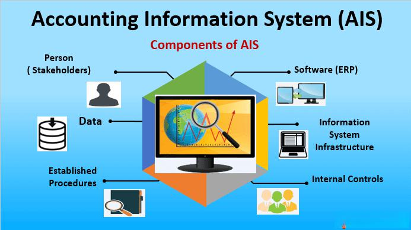

In today's rapidly evolving financial landscape, technology plays an essential role in streamlining operations and enhancing decision-making processes. An Accounting Information System (AIS) emerges as a pivotal tool, merging traditional accounting practices with advanced technology to manage financial data with precision and efficiency. By revolutionizing the way financial information is gathered, processed, and reported, AIS facilitates more robust and informed decision-making.

Organizations are increasingly leveraging AIS to gain a competitive edge, especially when integrated with algorithmic trading systems. These systems demand accurate, timely financial data to execute trades efficiently and strategically. The role of AIS in this context is critical, as it serves not only to automate data handling but also to enhance the speed and accuracy of trading decisions.



This article examines the multifaceted benefits of implementing AIS within an organization's accounting framework, focusing particularly on its synergy with algo trading. We will explore how AIS optimizes financial operations by streamlining communication across departments and enhancing internal controls to safeguard data integrity. Furthermore, the system's ability to provide real-time financial analysis empowers businesses to make quick, effective decisions.

By employing advanced security measures, AIS ensures the protection of sensitive financial data against unauthorized access and potential breaches. The system's adaptability to business growth and the automation of processes further underline its importance in maintaining efficient and scalable financial operations. Ultimately, the integration of AIS promotes both immediate and long-term strategic benefits, enhancing performance and sustainability in the dynamic financial market.

## Table of Contents

## Understanding Accounting Information Systems (AIS)

An Accounting Information System (AIS) is a pivotal component in modern business environments, streamlining the intricate processes involved in managing financial and accounting data. The primary objective of an AIS is to enhance both internal and external financial reporting by automating and improving the collection, storage, and processing of pertinent financial information.

At its core, an AIS integrates traditional accounting practices with advanced information technology resources. This integration facilitates accurate financial management by ensuring that data is processed with speed and precision. Businesses can manage resources more effectively, making informed decisions based on comprehensive data analysis. The precise nature of AIS comes from its ability to handle vast quantities of data accurately and reliably, reducing the potential for human error and increasing the efficiency of financial operations.

Key components of an Accounting Information System include data management, data security, and the capability to generate comprehensive financial reports. Data management within an AIS is critical, as it involves organizing, storing, and retrieving financial data. Efficient data management practices ensure that financial records are kept in an organized manner, allowing for easy access and analysis when needed.

Data security is another vital aspect of AIS. With increasing concerns over data breaches and cyber threats, AIS must incorporate robust security measures to safeguard sensitive financial information. These measures typically consist of encryption protocols, user access controls, and regular security audits to monitor and protect data integrity. Ensuring data security not only helps in maintaining trust with stakeholders but also complies with regulatory standards and prevents significant financial losses from unauthorized access.

Finally, the ability to generate comprehensive financial reports is a fundamental feature of AIS. These reports are essential for decision-making processes within the organization, providing insights that influence strategic planning and operational activities. Accurate report generation requires the AIS to pull relevant data efficiently from various sources, compile it cohesively, and present it in a format that is easy to interpret for stakeholders.

In conclusion, an Accounting Information System is an invaluable tool for businesses seeking to streamline their accounting operations through the sophisticated integration of technology and traditional accounting practices. By focusing on data management, security, and comprehensive reporting, AIS significantly enhances the precision and efficiency of financial management, paving the way for informed decision-making and strategic growth.

## Benefits of AIS in Modern Accounting

An Accounting Information System (AIS) provides numerous benefits that enhance the efficiency and effectiveness of modern accounting practices. One of the significant advantages is the facilitation of interdepartmental interfacing. AIS allows seamless communication between various departments within an organization, which streamlines operations and reduces redundancies. By having a centralized system for financial data, departments can access and share information effortlessly, leading to improved collaboration and better resource management.

AIS also plays a crucial role in maintaining internal controls and enhancing data integrity. The security frameworks embedded within AIS systems are designed to protect sensitive financial information from unauthorized access and potential data breaches. These systems incorporate robust internal controls such as segregation of duties, user access controls, and audit trails to ensure the authenticity and integrity of financial data. Strengthening these controls reduces the risk of fraud and errors, thereby safeguarding the organization's financial assets and reputation.

Moreover, AIS enables real-time financial analysis, providing instant access to financial data crucial for making informed business decisions. The ability to analyze financial information in real time allows organizations to respond swiftly to market changes and optimize their strategies promptly. This real-time analysis is powered by the system's capacity to process large volumes of data quickly, utilizing technologies like cloud computing and data analytics. As a result, businesses can efficiently monitor performance indicators, forecast financial outcomes, and manage budgets proactively, ultimately enhancing their ability to remain competitive and agile in a fast-paced economic environment.

In essence, the integration of AIS in modern accounting frameworks not only streamlines communication and strengthens internal controls but also empowers organizations with timely and actionable financial insights, driving strategic decision-making and operational excellence.

## The Role of AIS in Algo Trading

Algorithms in trading rely heavily on the availability of accurate and timely financial data to make informed decisions and execute trades effectively. Accounting Information Systems (AIS) are integral in supplying this data with high efficiency. By automating the collection and processing of financial information, AIS enhances the speed and accuracy of trading decisions, catering to the rapid pace of financial markets.

One of the primary roles of AIS in [algorithmic trading](/wiki/algorithmic-trading) is its capacity to automate data processing. Through automation, AIS eliminates manual data entry errors and ensures that financial information is consistently updated and ready for use. This automated approach reduces latency in data availability, enabling trading algorithms to respond swiftly to market changes and execute trades at optimal moments. For example, a Python script using real-time financial data could be programmed as follows:

```python
import pandas as pd
import numpy as np

# Assuming 'financial_data' is a DataFrame containing real-time market stats
def process_financial_data(data):
    # Example preprocessing: calculating moving averages
    data['moving_average'] = data['price'].rolling(window=5).mean()
    return data

# Real-time data processing
financial_data = pd.DataFrame({
    'price': np.random.rand(100)  # Simulated price data
})

processed_data = process_financial_data(financial_data)
```

Furthermore, AIS integrates seamlessly with trading platforms, enabling an efficient flow of financial data between systems. This integration supports the execution of trades and contributes to strategic financial analysis. By providing comprehensive data analytics, AIS helps identify trading patterns, assess market [volatility](/wiki/volatility-trading-strategies), and inform risk management strategies. The system's ability to consolidate vast amounts of financial data into accessible insights is invaluable for traders looking for an edge in competitive markets.

In essence, AIS plays a crucial role in algorithmic trading by automating data processes and facilitating seamless integration with trading platforms. These functionalities enhance the accuracy and speed of trading operations, ultimately leading to better-informed decisions and optimized trade execution. As algorithmic trading continues to evolve, the importance of robust and efficient AIS solutions remains pivotal in maximizing trading efficiency and profitability.

## Enhancing Security with AIS

The security of financial data has become a critical focus for organizations, with the increasing prevalence of cyber threats necessitating robust defensive measures. An Accounting Information System (AIS) is specifically engineered to safeguard financial data using advanced cybersecurity protocols. Encryption is central to AIS security, ensuring that data in transit and at rest remains inaccessible to unauthorized users. The encryption process involves transforming plain text data into ciphertext using cryptographic algorithms, which can only be reverted to its original form using a designated decryption key. 

Access control within AIS is another crucial element. It enforces strict user authentication to verify identities before granting system access. Role-based access control (RBAC) systems ensure that users can only access data and perform actions pertinent to their role, thereby minimizing insider threats and data exposure. Here is a simple Python snippet demonstrating a basic concept of role-based access control:

```python
class AccessControl:
    def __init__(self):
        self.user_roles = {}

    def add_user(self, username, role):
        self.user_roles[username] = role

    def check_access(self, username, resource):
        role = self.user_roles.get(username)
        access_dict = {
            'admin': ['view', 'edit', 'delete'],
            'editor': ['view', 'edit'],
            'viewer': ['view']
        }
        if role and resource in access_dict[role]:
            return True
        return False

# Example usage
ac = AccessControl()
ac.add_user('john_doe', 'editor')
can_edit = ac.check_access('john_doe', 'edit')
```

Additionally, AIS performs regular audits and monitoring to quickly identify and rectify any irregularities or unauthorized access attempts. These audits are supplemented by AI-driven security protocols which enhance traditional security measures through continuous learning and adaptability. AI systems analyze vast amounts of data to identify potential threats, offering predictive insights that help in preemptive defense strategies. Machine learning algorithms, for instance, can detect anomalous patterns indicative of fraudulent activities, thereby enhancing system integrity.

In conclusion, the combination of encryption, access control, and advanced AI-driven protocols makes AIS a formidable barrier against cyber threats, thus maintaining the confidentiality, integrity, and availability of financial data.

## Scalability and Automation in AIS

AIS systems are inherently designed to accommodate business growth, offering scalability to manage increasing data volumes and user demands effectively. This scalability is achieved through modular and flexible architecture that accommodates expanding organizational needs, ensuring that the AIS infrastructure can handle larger datasets, higher transaction volumes, and more users as a business grows. 

Automation plays a critical role in AIS by streamlining financial processes, which minimizes manual errors and boosts operational efficiency. Automated systems handle repetitive tasks such as data entry, reconciliation, and report generation, freeing up staff to concentrate on strategic activities that add value to the organization. The deployment of automated processes within an AIS not only accelerates transaction processing but also ensures consistency and accuracy in financial reporting.

Moreover, scalable AIS architectures are built to support multiple standards and currencies, a feature that is particularly beneficial for organizations operating globally. This capability enables seamless integration with international financial systems, facilitating smooth cross-border transactions and compliance with diverse regulatory requirements. For example, an AIS can be configured to accommodate different accounting standards such as GAAP or IFRS, adjusting calculations and reports accordingly.

The combination of scalability and automation in AIS paves the way for more dynamic and responsive financial management. As businesses navigate complex environments, these systems provide a robust foundation to meet both current and future challenges, promoting sustainable growth and enhanced decision-making outcomes.

## Conclusion

The adoption of Accounting Information Systems (AIS) offers significant competitive advantages to organizations by optimizing resource allocation and facilitating strategic decision-making. Integrating AIS with business operations allows firms to achieve enhanced accuracy in financial reporting and data management. This streamlining of processes minimizes errors, ensuring that the financial data and reports are reliable and precise—a crucial aspect for organizations aiming for efficiency and informed decision-making.

Security is another critical aspect improved by AIS. Advanced security measures, such as encryption and AI-driven security protocols, safeguard sensitive financial information from unauthorized access and data breaches. This protection not only secures the data but also maintains the integrity of financial systems, providing peace of mind for both the organization's leadership and stakeholders.

Scalability, a distinguishing feature of modern AIS, ensures that systems can grow alongside the business. Whether dealing with increased data [volume](/wiki/volume-trading-strategy), the complexities of multiple currencies, or adhering to various standards, the scalable architecture of AIS supports long-term growth and adaptability. Automation embedded within AIS further enhances this by reducing manual errors and freeing staff to focus on strategic initiatives—a key to sustainable business growth.

Organizations that integrate AIS with algorithmic trading platforms stand to benefit even more. AIS provides the real-time, accurate financial data necessary for algo trading decisions, optimizing trade execution and risk management. This integration not only enhances financial performance but also provides a robust framework for managing risks associated with rapid and high-volume trade environments.

In conclusion, the strategic implementation of AIS within organizations offers a comprehensive solution that enhances operational efficiency, security, and adaptability. By supporting both day-to-day functions and long-term strategic goals, AIS becomes an indispensable tool for achieving excellence in financial performance and effective risk management.

## References & Further Reading

[1]: ["Accounting Information Systems: The Crossroads of Accounting and IT"](https://books.google.com/books/about/Accounting_Information_Systems_The_Cross.html?id=ZCGpBwAAQBAJ) by Donna Kay and Ali Ovlia

[2]: ["Financial Trading and Investing"](https://www.investopedia.com/ask/answers/12/difference-investing-trading.asp) by John L. Teall

[3]: ["Contemporary Issues in Accounting Information Systems"](https://www.researchgate.net/publication/362806428_Developing_Information_Systems_for_the_Contemporary_Accounting_Profession_Challenges_and_Recommendations) by S. Sutton, V. Arnold, B. Kogan, & M. Vasarhelyi

[4]: ["Information Technology Control and Audit, Fourth Edition"](https://books.google.com/books/about/Information_Technology_Control_and_Audit.html?id=bt8lKQ9qgrMC) by Sandra Senft, Frederick Gallegos, and Aleksandra Davis

[5]: ["Designing User Interfaces for an Accounting Information System"](https://www.researchgate.net/publication/318060618_Analysis_and_Design_of_an_Accounting_Information_System) by Candy Sidner and Chris Staszewski

[6]: ["Algorithmic Trading: Winning Strategies and Their Rationale"](https://www.amazon.com/Algorithmic-Trading-Winning-Strategies-Rationale-ebook/dp/B00CY5HC0U) by Ernie Chan

[7]: ["Cybersecurity in Accounting"](https://heimdalsecurity.com/blog/the-role-of-cybersecurity-in-accounting/) by Dale Adkins