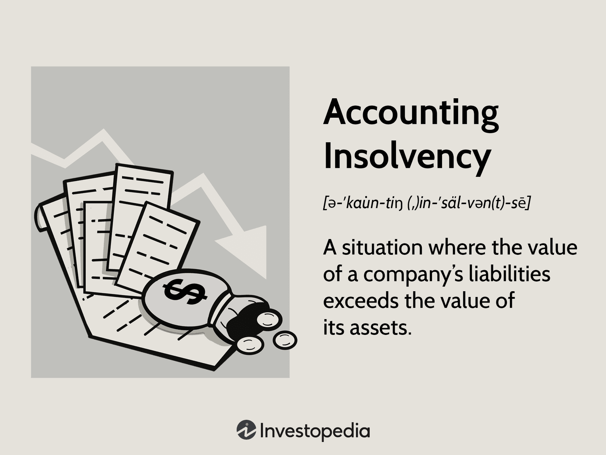

The dynamics of financial markets have experienced substantial transformations due to advancements in technology and financial innovation. The integration of these fields has led to the emergence and adoption of algorithmic trading (algo trading) as a pivotal mechanism for managing financial portfolios. This transformation has occurred alongside an increasing focus on accounting insolvency and financial distress, topics that are essential across various financial disciplines.

Accounting insolvency occurs when a company's liabilities exceed its assets, highlighting a company's precarious financial standing from a balance sheet perspective. This contrasts with cash flow insolvency, where the inability to settle debts as they fall due is the primary issue. Both forms of insolvency reflect significant financial challenges and serve as precursors to potential bankruptcy and asset liquidation.

Meanwhile, algo trading has become a formidable tool by offering enhanced speed, accuracy, and the ability to process complex data, which can potentially stabilize financial portfolios. However, it also presents challenges, such as susceptibility to market volatility, technical failures, and inaccuracies within trading models. The rise of algo trading underscores the need for robust risk management protocols, as errors in algorithms can lead to financial distress and systemic market instability.

This article explores the complexities and interrelationships between accounting insolvency, financial distress, and algo trading by examining real-world case studies. Understanding these interconnections is crucial to mitigate financial risks effectively. By analyzing real examples, we aim to provide insights into strategies that can manage and prevent financial distress and insolvency within dynamic and technologically advanced financial markets.

## Table of Contents

## Understanding Accounting Insolvency

Accounting insolvency is a condition observed when a company's liabilities surpass its assets on the balance sheet. This form of insolvency contrasts with cash flow insolvency, which pertains to an entity's inability to meet debt obligations due to insufficient liquidity. Accounting insolvency provides a snapshot of the company's financial position, focusing exclusively on the technical aspects of its financial statements.

Persisting accounting insolvency is a significant concern as it can precipitate bankruptcy and necessitate the forced liquidation of assets. When liabilities exceed assets, it indicates that the company's present value and potential future income are insufficient to cover its debt obligations. Over time, without corrective action, this imbalance can erode stakeholder confidence, further exacerbating financial difficulties.

A notable case study that elucidates the rapid onset of accounting insolvency is that of XYZ Company. This company experienced an abrupt decline in asset values following a technological shift that rendered its core products obsolete. As market preferences shifted towards more advanced technologies, the company's inventory and fixed assets quickly depreciated. The following balance sheet equation reflects the company’s situation:

$$
\text{Equity} = \text{Assets} - \text{Liabilities}
$$

In XYZ Company's case, depreciating assets led to a negative equity situation:

$$
\text{Liabilities} > \text{Assets}
$$

This condition signified that the value of the company's liabilities outweighed its assets, triggering accounting insolvency. The company faced heightened risk of bankruptcy as stakeholders lost confidence and creditors demanded debt repayments, which outpaced the company's ability to generate revenue or liquidate other assets at fair market value.

XYZ's scenario highlights the importance of proactive asset management and technological adaptability to mitigate risks associated with accounting insolvency. By maintaining a dynamic approach to asset valuation and strategic foresight, companies can buffer against technological disruptions that might otherwise lead to financial collapse.

## Case Studies in Financial Distress

Financial distress occurs when companies are unable to meet or grapple with financial obligations due to poor cash flows, insufficient revenue, or misplaced liabilities. It often acts as a precursor to bankruptcy, which signifies the legal declaration of the inability to pay debts. Effective asset management plays a vital role in either exacerbating or alleviating this distress.

### Case Study 1: Company A's Financial Distress

Company A experienced financial distress primarily due to mismanagement of its liabilities during a period of significant market change. Faced with growing liabilities and a failure to adjust its debt structure in response to shifting market conditions, the company found its financial resources severely strained. A critical [factor](/wiki/factor-investing) in Company A's distress was the accumulation of short-term debts to fund long-term assets, leading to a [liquidity](/wiki/liquidity-risk-premium) mismatch. This misalignment became unsustainable when interest rates rose unexpectedly, increasing the cost of servicing debt and exacerbating the company's cash flow issues.

The mismanagement of liabilities underscores how poor financial decision-making and an inability to adapt to external economic environments can spiral into financial distress. The case of Company A illustrates how vital asset-liability management and timely strategic adjustments are to maintaining financial health.

### The Role of Asset Management in Recovery

Financial distress often serves as a harbinger to bankruptcy, but effective asset management can help avert this outcome by improving liquidity and cash flow. By realigning their debt structures and optimizing asset management strategies, companies can enhance financial stability. This involves not only restructuring existing debts but also actively managing assets to increase their yield or liquidate underperforming assets to stabilize cash flow. 

The proper management of inventory levels, receivables, and other current assets can contribute significantly to improving the liquidity position of a financially troubled company. Additionally, companies can consider debt refinancing to extend maturity profiles, ease cash flow pressure, and potentially lower interest rates.

### Case Study 2: Company B's Restructuring Attempt

In contrast to Company A, Company B proactively engaged in restructuring to overcome its financial distress by leveraging innovation and adapting to market conditions. When confronted with a downturn, Company B recognized the need for strategic transformation. This involved significant investment in technological advancements and a pivot towards emerging markets, which presented new growth opportunities.

Company B's restructuring efforts included: a reduction of operational costs through automation, liquidation of unproductive assets, and enhancement of competitive positioning by expanding product offerings. These measures helped improve the company's revenue streams and cost structure, thereby creating a more adaptable financial model that increased resilience against the downturn.

Furthermore, Company B focused on stakeholder communication, which played a pivotal role in securing the necessary support to implement its strategic changes. The successful restructuring of Company B highlights how innovation and adaptive strategies can offer viable routes out of financial distress, ensuring long-term sustainability and preventing bankruptcy. 

In conclusion, these case studies reveal how financial distress can stem from both internal mismanagement and external pressures and emphasize the importance of proactive asset management and strategic restructuring in maintaining financial stability.

## Algorithmic Trading: Opportunities and Risks

Algorithmic trading, often referred to as algo trading, utilizes computer software to execute trading strategies in financial markets with speed and precision that surpasses human capability. This method involves leveraging algorithms to analyze market data, decide on trades, and execute transactions within milliseconds. With advancements in technology, algo trading has become integral to modern financial markets, offering significant opportunities but also presenting inherent risks.

### Opportunities

One of the primary benefits of [algorithmic trading](/wiki/algorithmic-trading) is its enhanced speed. Algorithms can analyze vast datasets and execute trades faster than any human trader, enabling the capture of favorable market conditions before prices change. This speed advantage is critical when trading in volatile markets, where prices can fluctuate rapidly.

Accuracy is another opportunity presented by algo trading. Algorithms reduce human error by systematically executing trades based on predefined criteria without emotional interference. This precision enhances the reliability of trading outcomes, as algorithms adhere strictly to the programmed rules and logic.

The ability to process complex data is a hallmark of algo trading. Advanced algorithms can incorporate real-time financial data from diverse sources, using sophisticated models to forecast price movements and identify trading opportunities. This capability allows for the deployment of complex strategies that human traders might find challenging to manage manually.

### Risks

Despite its advantages, algorithmic trading is not without risks. One of the significant vulnerabilities is exposure to market [volatility](/wiki/volatility-trading-strategies). In highly volatile markets, algorithms can execute numerous trades rapidly, potentially exacerbating market swings and leading to substantial losses. Additionally, algorithms may not adapt well to market conditions that deviate significantly from historical patterns, resulting in unexpected outcomes.

Technical glitches represent another risk factor. System failures, coding errors, and network issues can lead to unintended trade executions or even market disruptions. For instance, a faulty algorithm might misinterpret market signals, causing rapid, erroneous trades and financial loss.

Model inaccuracies also pose a considerable risk in algorithmic trading. Algorithms are based on models that use historical data to predict future market behavior. If these models do not accurately reflect current market conditions, it can result in poor trading decisions. Ensuring that models are robust and reflective of real-world dynamics is crucial but challenging, as markets are influenced by numerous unpredictable factors.

### Impact on Market Dynamics and Potential Insolvency Scenarios

Algo trading significantly impacts market dynamics, providing liquidity and contributing to tighter bid-ask spreads. However, it can also increase market fragmentation and reduce transparency due to the sheer [volume](/wiki/volume-trading-strategy) and speed of trades.

Potential insolvency scenarios may arise when financial institutions rely heavily on algorithmic strategies without adequate risk controls. For example, rapid, unanticipated losses due to erroneous trades or market volatility can deplete a firm's capital reserves quickly, pushing it toward financial distress. Institutions must integrate comprehensive risk management practices, including stress testing algorithms and monitoring market exposure closely, to mitigate such risks.

In conclusion, while algorithmic trading offers unparalleled opportunities for increased efficiency in financial markets, it necessitates vigilant risk management to prevent systemic instability and potential insolvency. Balancing the use of cutting-edge technology with prudent oversight is vital for maintaining financial stability.

## Case Studies in Algorithmic Trading

Case Study 3 examines the algorithmic trading strategy of a major financial institution that confronted significant financial distress due to inadequate risk management and unforeseen market conditions. In this case, the institution implemented a high-frequency trading algorithm designed to exploit tiny movements in asset prices across multiple exchanges. Although this approach promised higher returns by executing trades at sub-second intervals, it also exposed the institution to amplified risks.

### Key Factors Leading to Financial Distress

1. **Technical Glitches and Model Inaccuracies**: The algorithm employed by the institution encountered multiple technical failures. These glitches resulted in erroneous trades, accumulating significant losses. An integral part of algorithm design is the calibration to real-world conditions, ensuring resilience to market fluctuations and technical errors. However, this institution’s algorithm was overly sensitive to minor market changes, exacerbating losses during volatile periods.

2. **Market Volatility**: The trading strategy heavily relied on stable market conditions. During periods of sudden market volatility, the algorithm's predictive models failed, leading to substantial financial losses. Volatility posed a risk that was inadequately mitigated within their existing risk management structures. The institution underestimated the impact of a rapid market movement, illustrating the importance of incorporating volatility hedges within algorithmic strategies.

3. **Insufficient Risk Management Protocols**: The institution lacked comprehensive risk management protocols to monitor and mitigate the impacts of algorithmic errors in real-time. Effective risk management in algorithmic trading should include automated stop-loss orders, circuit breakers, and thorough backtesting of algorithms against volatile market scenarios. The absence of such measures contributed to the institution’s inability to curtail rapid loss accumulations.

### Lessons Learned

The critical lesson from this experience is the paramount importance of robust risk management frameworks in algorithmic trading. Institutions must integrate advanced risk assessment tools and continuous monitoring systems that can swiftly respond to atypical market movements or unexpected algorithmic behaviors. Furthermore, continuous updates and testing of algorithms against historical and simulated stress scenarios can highlight potential vulnerabilities before deployment in live markets.

### Regulatory Measures

To prevent systemic financial instability potentially induced by such algorithmic trading failures, regulatory bodies have introduced several measures:

- **Market-Wide Circuit Breakers**: These mechanisms automatically halt trading in the event of significant market index drops, providing a cooling-off period to stabilize markets.

- **Algorithm Approval and Testing**: Regulatory frameworks now often require that detailed records of algorithms are maintained, alongside mandatory stress testing and approval prior to deployment.

- **Position Limit Monitoring**: Regulators monitor large position builds through algorithmic trades to mitigate risk concentration that could lead to market manipulation or abrupt market destabilization.

Such regulatory measures aim to shield the market from the cascading effects of individual algorithmic trading failures and encourage financial institutions to develop more resilient trading technologies. The challenge lies in finding a balance between fostering innovation in algorithmic trading and ensuring stringent oversight to protect market integrity.

## Strategies for Managing Financial Distress and Insolvency

Early detection of financial distress and insolvency is paramount in safeguarding a company's longevity and financial health. Identifying warning signals such as declining revenue, increasing debt levels, and diminishing cash flow can enable timely interventions to prevent further deterioration.

Implementing robust accounting practices and risk management systems is crucial. Comprehensive financial reporting, regular audits, and adherence to accounting standards ensure transparency and accuracy in financial statements. Risk management systems should include robust controls for credit, market, and operational risks.

Strategies for restructuring corporate debt are essential in improving financial health. This may involve negotiating with creditors to extend debt maturities, reducing interest rates, or converting debt into equity. Such measures can alleviate immediate financial burdens and improve liquidity.

Integrating algorithmic strategies with traditional financial management can enhance decision-making processes. By leveraging data analytics and predictive models, companies can optimize their financial strategies. However, it's important to carefully assess algorithmic models for reliability and accuracy to mitigate potential risks associated with their implementation.

In summary, a proactive approach encompassing early detection, sound accounting practices, strategic debt restructuring, and intelligent use of algorithmic tools is key to managing financial distress and insolvency effectively.

## Conclusion

Reflecting on the critical lessons from case studies on insolvency and financial distress, it is evident that proactive management and strategic insights are essential to address financial challenges effectively. The convergence of accounting insolvency insights with real-world algo trading incidents underscores the necessity for financial institutions to integrate robust risk management protocols with advanced algorithmic strategies. A balanced approach not only helps in identifying potential vulnerabilities but also aids in implementing corrective measures to mitigate risks.

Algorithmic trading, with its potential for enhanced speed and precision, offers significant opportunities for portfolio management. However, it is crucial for institutions to balance these opportunities with sound financial practices. This involves establishing comprehensive risk management systems that are not only responsive to market dynamics but also capable of accommodating unexpected disruptions. Developing multidimensional strategies that combine algorithmic models with traditional financial principles can offer a more resilient framework for managing assets and liabilities.

As financial systems become increasingly complex, institutions must continue adapting and evolving their strategies to maintain financial stability. Future considerations for these entities include investing in technology that enhances transparency, implementing stricter regulatory compliance, and fostering innovation that aligns with financial health goals. It is important to keep an eye on potential systemic risks that can arise from widespread adoption of untested technologies.

Continuous research and adaptation are vital in navigating the rapidly changing financial landscape. Encouraging a culture of learning and flexibility can provide financial institutions with the tools needed to anticipate changes and devise strategies that ensure sustainability. Engaging with cutting-edge research, fostering collaborative efforts among financial professionals, and remaining vigilant to industry shifts will be indispensable for enduring success. As these practices evolve, they will play a pivotal role in safeguarding not only individual enterprises but also the broader financial ecosystem.

## References & Further Reading

[1]: Bergstra, J., Bardenet, R., Bengio, Y., & Kégl, B. (2011). ["Algorithms for Hyper-Parameter Optimization."](https://dl.acm.org/doi/10.5555/2986459.2986743) Advances in Neural Information Processing Systems 24.

[2]: ["Advances in Financial Machine Learning"](https://www.amazon.com/Advances-Financial-Machine-Learning-Marcos/dp/1119482089) by Marcos Lopez de Prado

[3]: ["Evidence-Based Technical Analysis: Applying the Scientific Method and Statistical Inference to Trading Signals"](https://www.amazon.com/Evidence-Based-Technical-Analysis-Scientific-Statistical/dp/0470008741) by David Aronson

[4]: ["Machine Learning for Algorithmic Trading"](https://github.com/stefan-jansen/machine-learning-for-trading) by Stefan Jansen

[5]: ["Quantitative Trading: How to Build Your Own Algorithmic Trading Business"](https://www.amazon.com/Quantitative-Trading-Build-Algorithmic-Business/dp/1119800064) by Ernest P. Chan