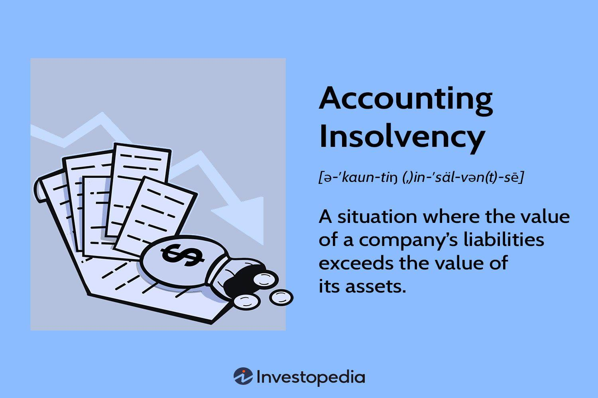

## Table of Contents

## What is accounting insolvency?

Accounting insolvency happens when a company's debts are more than its assets. This means the company cannot pay what it owes using what it owns. It's like if you had a piggy bank with $50, but you owed your friends $100. Your piggy bank (assets) can't cover what you owe (liabilities), so you're insolvent.

When a company is accounting insolvent, it doesn't mean it will stop working right away. It might still be able to keep going for a while by getting more loans or selling things. But if it can't find a way to fix the problem, it might have to close down or go bankrupt. This is a big problem for the company and can affect its employees, customers, and anyone who has money invested in it.

## How does accounting insolvency differ from bankruptcy?

Accounting insolvency and bankruptcy are related but different. Accounting insolvency is when a company's debts are more than its assets. It's like if you owe $100 but only have $50 in your piggy bank. The company is still running, but it's in a tough spot because it can't pay all its bills with what it owns.

Bankruptcy, on the other hand, is a legal process. It happens when a company can't pay its debts and decides to go to court for help. The court can then decide what to do with the company's debts and assets. Bankruptcy is a step a company might take because it's accounting insolvent, but not all insolvent companies go bankrupt. Some might find other ways to fix their money problems without going to court.

## What are the common causes of accounting insolvency?

Accounting insolvency often happens because a company spends more money than it makes. This can happen if the company doesn't sell enough products or services, or if it has to spend a lot on things like rent, salaries, or materials. Sometimes, a company might take out loans to cover these costs, but if it can't pay back the loans, the debt can grow bigger than the company's assets.

Another common cause is bad management. If the people running the company make poor decisions, like investing in projects that don't make money or not keeping track of their finances well, the company can end up in trouble. Economic downturns can also play a role. If the economy is doing badly, customers might not buy as much, which means less money coming in for the company, making it harder to pay off debts.

Sometimes, unexpected events can push a company into insolvency. For example, a natural disaster could damage a company's property or a lawsuit could result in a big fine. These events can quickly increase a company's debts or decrease its assets, leading to insolvency.

## What are the signs that a company might be heading towards accounting insolvency?

There are several signs that a company might be heading towards accounting insolvency. One big sign is if the company keeps losing money. If it's spending more than it's making, its debts can grow bigger than its assets. Another sign is if the company is having trouble paying its bills on time. This could mean it's running out of money and might not be able to keep up with its debts. Also, if the company is always borrowing more money or selling off its assets to pay bills, that's a warning sign. It shows the company might be struggling to stay afloat.

Another sign is if the company's financial reports show that its debts are getting bigger compared to its assets. This can be seen in the balance sheet, where liabilities are growing faster than assets. If the company is also facing a lot of lawsuits or fines, this can add to its debts and push it closer to insolvency. Finally, if the company's customers or suppliers start to lose trust and stop doing business with it, this can make the situation even worse. Without customers, the company won't have enough money coming in to pay its debts, leading to insolvency.

## How is accounting insolvency determined?

Accounting insolvency is determined by looking at a company's balance sheet. The balance sheet shows what the company owns (assets) and what it owes (liabilities). If the total liabilities are more than the total assets, the company is accounting insolvent. It's like if you have $50 in your piggy bank but owe $100 to your friends. Your piggy bank can't cover what you owe, so you're insolvent.

To figure this out, accountants add up all the company's assets, like cash, buildings, and equipment. Then they add up all the liabilities, like loans, bills, and other debts. If the liabilities are bigger than the assets, the company is in trouble. This doesn't mean the company will stop working right away, but it's a big problem that needs to be fixed. If the company can't find a way to pay its debts, it might have to go bankrupt.

## What are the legal implications of accounting insolvency for a business?

When a business is accounting insolvent, it means it owes more money than it has. This can lead to big legal problems. If the company can't pay its bills, its creditors (the people or companies it owes money to) might take it to court. The court could then force the company to pay what it owes or even make it go bankrupt. In some places, the law says that the directors of the company could be held personally responsible if they keep running the business while knowing it's insolvent. This means they might have to pay the company's debts out of their own pockets.

Also, if a company is insolvent, it might have to stop doing business. This is called liquidation, where the company's assets are sold off to pay its debts. The law decides who gets paid first, usually the employees and secured creditors. If there's any money left after that, it goes to other creditors. If the company doesn't follow the rules about insolvency, it could face fines or other legal actions. So, it's really important for a business to deal with insolvency quickly and follow the law to avoid even bigger problems.

## What steps can a company take to avoid accounting insolvency?

A company can avoid accounting insolvency by keeping a close eye on its money. This means making sure it doesn't spend more than it earns. The company should regularly check its financial reports to see if it's making a profit or losing money. If it's losing money, the company needs to find ways to cut costs or increase sales. It can do this by looking for cheaper suppliers, reducing unnecessary expenses, or finding new customers. Good financial planning and budgeting are key to staying out of trouble.

Another important step is to manage debt carefully. A company should avoid taking on too much debt, especially if it's not sure it can pay it back. If the company does need to borrow money, it should make a plan to pay it back on time. This might mean setting aside some of its earnings each month to cover the loan payments. Also, the company should talk to its creditors if it's having trouble paying bills. Sometimes, creditors will agree to change the payment terms or give the company more time to pay. By being proactive and managing its money wisely, a company can avoid the risk of becoming insolvent.

## Can a company recover from accounting insolvency, and if so, how?

Yes, a company can recover from accounting insolvency. The first step is to make a plan to fix the money problems. This might mean cutting costs, like spending less on things the company doesn't really need. It could also mean finding ways to make more money, like selling more products or services. Sometimes, the company might need to talk to the people it owes money to and ask for more time to pay or to pay less. If the company can do these things well, it might be able to get its finances back on track.

Another way to recover is by getting help from outside. This could mean getting a loan from a bank or finding investors who are willing to put money into the company. The company might also need to change how it's run, maybe by bringing in new managers who can make better decisions. If the company can show that it's working hard to fix its problems and has a good plan, it might be able to convince others to help it recover. With time and effort, a company can come back from accounting insolvency and start making money again.

## What are some notable case studies of companies that have faced accounting insolvency?

One famous case of accounting insolvency is the story of Enron. Enron was a big energy company that went bankrupt in 2001. They had a lot of debt and were hiding how bad their finances really were. When people found out, their stock price crashed, and they couldn't pay their bills. This led to one of the biggest corporate scandals in history. Enron's collapse showed how important it is for companies to be honest about their money and how bad things can get if they're not.

Another example is Lehman Brothers, a big bank that went bankrupt in 2008. Lehman Brothers had a lot of risky investments that didn't work out. When the housing market crashed, they lost a lot of money and couldn't pay their debts. Their insolvency helped start the global financial crisis. Lehman Brothers' failure showed how one company's money problems can affect the whole world and how important it is for banks to be careful with their investments.

## How do accounting standards and regulations impact the assessment of insolvency?

Accounting standards and regulations help make sure that a company's financial reports are clear and honest. These rules tell companies how to count their money, like how to add up their assets and liabilities. When a company follows these rules, it's easier for people to see if the company is in trouble. If the company's debts are bigger than its assets, it's insolvent. The rules help everyone understand the company's financial health better.

Sometimes, changes in these standards can affect how a company's insolvency is judged. For example, if the rules change about how to value certain assets, a company might look more or less healthy. Also, different countries might have different rules, which can make it hard to compare companies from different places. But overall, these standards and regulations are important because they help keep things fair and clear, making it easier to spot insolvency early and take action.

## What role do auditors play in identifying and reporting accounting insolvency?

Auditors are like financial detectives who check a company's [books](/wiki/algo-trading-books) to make sure everything is correct. They look at the company's financial statements to see if the numbers add up and if the company is following the rules. If they find that the company's debts are more than its assets, they might say the company is insolvent. Auditors have to report this to the people who own the company and sometimes to the government, so everyone knows the company's true financial situation.

When auditors find signs of insolvency, they have to be careful and honest in their reports. They can't hide the truth or the company could get into even bigger trouble. By pointing out insolvency early, auditors help the company's leaders make plans to fix the problem before it gets worse. This can save the company from going bankrupt and help protect the jobs of its workers and the money of its investors.

## How does accounting insolvency affect stakeholders such as employees, creditors, and shareholders?

Accounting insolvency can be tough on employees. When a company can't pay its bills, it might have to let people go or even close down. This means employees could lose their jobs and have a hard time paying their own bills. It's stressful and scary for them because they depend on their job for money. If the company goes bankrupt, employees might not get all the money they're owed, like their last paycheck or vacation pay. This makes things even harder for them.

Creditors and shareholders also feel the impact of accounting insolvency. Creditors are the people or companies the business owes money to. If the company can't pay them back, creditors might lose money. They might have to wait a long time to get paid or might not get paid at all. Shareholders are the people who own part of the company. When a company is insolvent, the value of their shares can drop a lot. They might lose the money they invested and could even lose everything if the company goes bankrupt. Both creditors and shareholders can end up in a tough spot because of the company's money problems.

## What is Understanding Accounting Insolvency?

Accounting insolvency is a condition observed when a company's liabilities surpass its assets on the balance sheet. This form of insolvency contrasts with cash flow insolvency, which pertains to an entity's inability to meet debt obligations due to insufficient [liquidity](/wiki/liquidity-risk-premium). Accounting insolvency provides a snapshot of the company's financial position, focusing exclusively on the technical aspects of its financial statements.

Persisting accounting insolvency is a significant concern as it can precipitate bankruptcy and necessitate the forced liquidation of assets. When liabilities exceed assets, it indicates that the company's present value and potential future income are insufficient to cover its debt obligations. Over time, without corrective action, this imbalance can erode stakeholder confidence, further exacerbating financial difficulties.

A notable case study that elucidates the rapid onset of accounting insolvency is that of XYZ Company. This company experienced an abrupt decline in asset values following a technological shift that rendered its core products obsolete. As market preferences shifted towards more advanced technologies, the company's inventory and fixed assets quickly depreciated. The following balance sheet equation reflects the company’s situation:

$$
\text{Equity} = \text{Assets} - \text{Liabilities}
$$

In XYZ Company's case, depreciating assets led to a negative equity situation:

$$
\text{Liabilities} > \text{Assets}
$$

This condition signified that the value of the company's liabilities outweighed its assets, triggering accounting insolvency. The company faced heightened risk of bankruptcy as stakeholders lost confidence and creditors demanded debt repayments, which outpaced the company's ability to generate revenue or liquidate other assets at fair market value.

XYZ's scenario highlights the importance of proactive asset management and technological adaptability to mitigate risks associated with accounting insolvency. By maintaining a dynamic approach to asset valuation and strategic foresight, companies can buffer against technological disruptions that might otherwise lead to financial collapse.

## References & Further Reading

[1]: Bergstra, J., Bardenet, R., Bengio, Y., & Kégl, B. (2011). ["Algorithms for Hyper-Parameter Optimization."](https://dl.acm.org/doi/10.5555/2986459.2986743) Advances in Neural Information Processing Systems 24.

[2]: ["Advances in Financial Machine Learning"](https://www.amazon.com/Advances-Financial-Machine-Learning-Marcos/dp/1119482089) by Marcos Lopez de Prado

[3]: ["Evidence-Based Technical Analysis: Applying the Scientific Method and Statistical Inference to Trading Signals"](https://www.amazon.com/Evidence-Based-Technical-Analysis-Scientific-Statistical/dp/0470008741) by David Aronson

[4]: ["Machine Learning for Algorithmic Trading"](https://github.com/stefan-jansen/machine-learning-for-trading) by Stefan Jansen

[5]: ["Quantitative Trading: How to Build Your Own Algorithmic Trading Business"](https://www.amazon.com/Quantitative-Trading-Build-Algorithmic-Business/dp/1119800064) by Ernest P. Chan