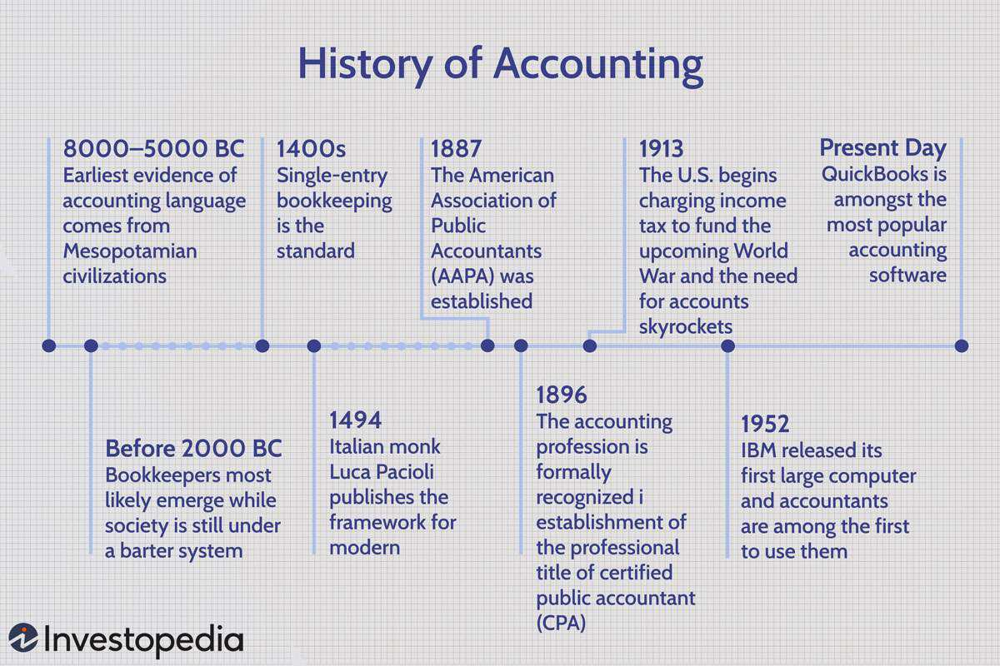

In the current financial landscape, both standardized accounting practices and technological advancements such as algorithmic trading play pivotal roles in promoting transparency and efficiency. Standardized accounting practices, encapsulated by frameworks like the International Financial Reporting Standards (IFRS) and Generally Accepted Accounting Principles (GAAP), provide uniform guidelines essential for managing financial data consistency and comparability. These frameworks enhance the ability of stakeholders—including investors, regulators, and market participants—to trust and interpret the financial health of organizations, fostering informed decision-making. In parallel, algorithmic trading has revolutionized the manner in which securities are traded on financial markets. By leveraging complex algorithms and high-speed data processing, these systems execute trades with precision and speed that surpass human capabilities. Algorithmic trading contributes to increased market liquidity, reduced transaction costs, and an improved ability to rapidly respond to market fluctuations.

This article explores the interplay between these crucial elements: financial reporting standards, accounting interpretations, and algorithmic trading technologies. It aims to illustrate how the integration of transparent accounting practices with advanced trading technologies shapes modern financial markets. These elements collectively enhance information consistency for stakeholders and promote efficient trading strategies. By understanding their interaction, this piece seeks to unravel the complexities of today’s financial systems while highlighting potential areas for improvement and innovation.



## Table of Contents

## Understanding Financial Reporting and Accounting Standards

Financial reporting standards, such as the International Accounting Standards (IAS) and International Financial Reporting Standards (IFRS), are established to provide uniform guidelines for the preparation and disclosure of financial statements. These standards are designed to ensure transparency in financial reporting, allowing stakeholders, including investors, regulators, and market participants, to make informed decisions based on reliable and consistent financial data.

The IAS and IFRS frameworks are developed by the International Accounting Standards Board (IASB), an independent standard-setting body. The standards aim to eliminate discrepancies in financial reporting by setting out clear guidelines that companies must follow when presenting their financial performance and position. This uniformity is vital, especially in an era where globalization allows companies to operate across multiple jurisdictions.

Consistent application of these standards provides a basis for global investors to conduct a comparative analysis of companies, regardless of their country of origin. This harmonization is crucial as it mitigates the risk of financial misstatement and fraud, promoting a level playing field. Financial statements prepared under these standards typically include elements such as the statement of financial position, statement of comprehensive income, statement of changes in equity, and statement of cash flows.

For instance, under IFRS, the recognition of revenue is governed by IFRS 15, which outlines when and how much revenue a company should recognize. This standard is based on the principle of recognizing revenue to depict the transfer of promised goods or services to customers in an amount that reflects the consideration to which the entity expects to be entitled.

The move towards adopting IFRS globally reflects the growing need for a common financial reporting language that enhances the comparability and reliability of financial statements. Many countries, including those in the European Union, have adopted IFRS for publicly traded companies, enhancing cross-border investment and economic integration.

The ability of these standards to bridge gaps between different national accounting practices underscores their importance in today's financial markets. By improving the transparency and credibility of financial information, IAS and IFRS not only support informed decision-making but also build trust among international investors and stakeholders.

## The Role of Accounting Interpretation

Accounting interpretations are essential tools that provide guidance on how to apply existing financial reporting standards, particularly in situations that are novel or not commonly encountered. These interpretations are necessary to address ambiguities that might arise in the practical application of standards, ensuring that financial statements remain comparable and consistent across different entities.

Regulatory bodies such as the Financial Accounting Standards Board (FASB) and the International Accounting Standards Board (IASB) are responsible for issuing these interpretations. By offering clarity and detailed explanations on specific accounting issues, these organizations help to mitigate potential inconsistencies that could lead to significant financial discrepancies. For example, when a new type of financial instrument emerges, an accounting interpretation can guide how it should be reported in financial statements, ensuring uniformity and reliability.

The impacts of these interpretations extend beyond mere compliance. They play a significant role in fostering investor confidence. When investors and stakeholders are assured that companies are adhering to a universally understood and applied set of rules, the information provided in financial reports becomes more dependable. This reliability helps in assessing the financial health and performance of a company, reducing information asymmetry between companies and investors.

Moreover, accounting interpretations serve to bridge the gap between evolving business practices and existing accounting standards. As businesses innovate and introduce new types of transactions, these interpretations adapt existing frameworks to include such changes, adding a layer of robustness and relevance. This adaptability is crucial for maintaining the utility and applicability of financial standards in a constantly changing economic environment.

The process of issuing accounting interpretations involves rigorous procedures, including public consultations and analysis of stakeholder feedback. This participatory approach ensures that interpretations are well-rounded and consider the multiple dimensions of financial reporting challenges. Consequently, the interpretations not only resolve ambiguities but also improve the overall quality of financial reporting.

In summary, accounting interpretations are instrumental in clarifying the application of existing accounting standards to unique or emerging financial transactions. By ensuring comparability and consistency, they enhance investor confidence and mitigate the risks associated with financial reporting discrepancies. These interpretations are vital for maintaining the integrity and transparency of financial markets globally.

## Algorithmic Trading in Modern Markets

Algorithmic trading, or algo trading, leverages the power of computer algorithms to execute trades at speeds and efficiencies beyond human capability. These algorithms are designed to initiate and manage trades according to predefined criteria, which can include timing, price, and quantity. The ability to quickly process large volumes of data and execute trades with precision allows for improved market [liquidity](/wiki/liquidity-risk-premium). This increased liquidity is beneficial as it enables the smoother buying and selling of assets, reducing the spread between bid and ask prices.

Moreover, [algorithmic trading](/wiki/algorithmic-trading) significantly reduces transaction costs. Traditional trading methods often involve higher human intervention and time requirements, leading to increased costs per transaction. In contrast, algo trading minimizes the need for human intervention and accelerates the trading process. This efficiency translates into cost savings for both trading firms and their clients.

Algo trading's ability to respond rapidly to market changes is another significant advantage. Markets can be volatile, with prices fluctuating due to various factors, including economic news, geopolitical events, and changes in market sentiment. Algorithms can quickly analyze financial data, identify patterns, and execute trades within fractions of a second, potentially before markets have adjusted to the new information.

The effectiveness of algorithmic trading is heavily dependent on the availability of precise and timely financial data. Inaccurate or delayed data can lead to suboptimal trading decisions, causing losses or missed opportunities. Therefore, reliable data feeds and advanced analytical tools are essential components of successful algo trading strategies. It’s crucial that the incoming data aligns with standardized financial reporting to allow algorithms to perform more accurate analyses. This synergy enhances the reliability of trading strategies and supports the development of sophisticated models.

In practical terms, consider a basic example in Python for a simple moving average crossover strategy, one of the many strategies employed in algo trading:

```python
import pandas as pd

# Assume 'data' is a DataFrame containing historical price data
def moving_average_strategy(data, short_window, long_window):
    data['Short_MA'] = data['Close'].rolling(window=short_window, min_periods=1).mean()
    data['Long_MA'] = data['Close'].rolling(window=long_window, min_periods=1).mean()

    data['Signal'] = 0.0
    data['Signal'][short_window:] = np.where(data['Short_MA'][short_window:] > data['Long_MA'][short_window:], 1.0, 0.0)
    data['Position'] = data['Signal'].diff()

    return data

# Example usage:
# data = pd.read_csv('historical_price_data.csv')
# strategy_data = moving_average_strategy(data, short_window=40, long_window=100)
```

In this script, the algorithm calculates two moving averages of different periods and generates signals based on their crossover. This Python code is a simplification of what real-world algo trading systems might look like, but it highlights the reliance on timely, accurate data and the sophisticated processing capabilities computers provide.

## Intersection of Accounting Standards and Algo Trading

The intersection of accounting standards and algorithmic trading is pivotal in forming the backbone of modern financial markets. Standardized accounting data serve as the essential inputs for algorithmic trading strategies, ensuring these systems operate with precision and efficiency. With uniform financial reporting standards such as International Financial Reporting Standards (IFRS) and Generally Accepted Accounting Principles (GAAP), financial data from companies across different regions can be consistently compared. This uniformity allows algorithmic trading systems to undertake coherent and reliable comparative analyses, thereby enhancing the strategic decision-making process.

Algorithmic trading, which operates at speeds beyond human capability by processing enormous volumes of data, relies on the consistency and accuracy of financial reporting. By integrating standardized accounting data into trading algorithms, traders can execute strategies that compare valuation metrics, assess financial health, and react swiftly to market developments. This practice reduces human error, minimizes transaction costs, and improves liquidity.

In Python, a simplified example can illustrate how standardized financial data might feed into a trading decision process:

```python
import pandas as pd

# Sample standardized financial data from two companies
data = {
    'Company': ['A', 'B'],
    'PE_Ratio': [15.2, 18.4],
    'EPS': [3.5, 4.0],
    'Revenue_Growth': [0.05, 0.07]
}
df = pd.DataFrame(data)

# Simple algorithmic rule: Go long the company with lower P/E ratio
long_position = df[df['PE_Ratio'] == df['PE_Ratio'].min()]['Company'].values[0]
print(f"Long position on: {long_position}")
```

This snippet exemplifies the use of financial ratios, consistent across firms due to accounting standards, to make trading decisions. Such strategies, when scaled and integrated into comprehensive trading systems, contribute to increased market efficiency.

The consistency in financial reporting enhances the accuracy of algorithmic trading by enabling the use of complex quantitative models that necessitate reliable financial inputs. Further, it supports better-informed decision-making by providing comprehensive datasets that allow traders to evaluate operational metrics, project future performance, and adjust strategies accordingly in a dynamic trading environment.

The harmonious relationship between accounting standards and algorithmic trading indicates an ongoing need for rigorous application and continuous enhancement of these practices. This synergy is crucial for maintaining the stability, transparency, and efficiency essential in today's global financial markets.

## Challenges and Solutions

Inconsistent regulatory adoption of financial reporting standards across countries presents a significant challenge for global trade and investment transparency. Different countries may choose to implement national variations of established standards like IFRS, thereby complicating investors' efforts to compare financial statements of companies operating in diverse jurisdictions. This inconsistency can hinder capital flow and introduce additional risks for international investors seeking to diversify their portfolios. To address this, international regulatory bodies must collaborate more effectively to harmonize these standards globally, promoting a uniform framework that supports transparent and comparable financial reporting.

Algorithmic trading poses its own set of challenges, primarily in terms of market manipulation risks. One notable concern is 'spoofing', a tactic where traders place large orders they intend to cancel before execution to create an appearance of demand or supply, thereby misleading other market participants. The high-speed nature of algorithmic trading amplifies these risks, as sophisticated algorithms can place and cancel orders within fractions of a second, outpacing traditional monitoring systems.

Addressing these challenges requires a multifaceted approach. For financial reporting, enhanced international collaboration and agreement on a singular set of standards are vital. This would involve active participation and commitment from key regulatory agencies such as the International Accounting Standards Board (IASB) and the Financial Accounting Standards Board (FASB), along with national regulators. Aim should be to reduce discrepancies and facilitate easier cross-border investment assessments.

For algorithmic trading, establishing robust compliance frameworks is essential. Regulators must enhance oversight mechanisms to detect and prevent market manipulation strategies like spoofing. This includes leveraging technology such as [artificial intelligence](/wiki/ai-artificial-intelligence) and [machine learning](/wiki/machine-learning) to monitor trading activities in real-time, identifying suspicious patterns that may indicate manipulative behavior. Additionally, imposing strict penalties for violations can act as deterrents against unethical trading practices.

In summary, overcoming the challenges posed by inconsistent financial reporting standards and the complexities of algorithmic trading involves strengthened international regulatory collaboration and the development of sophisticated compliance systems. This dual approach not only fosters transparency and integrity in financial markets but also safeguards them against potential misuse and fraud.

## Future Prospects and Recommendations

The continued adoption of the International Financial Reporting Standards (IFRS) stands to greatly enhance global financial transparency and comparability. As markets become more interconnected, the uniformity provided by IFRS facilitates easier comparison of financial statements across borders, promoting confidence among international investors. Moreover, as businesses increasingly operate on a global scale, adopting a consistent set of financial standards can streamline operations, reduce the burden of differing national requirements, and potentially attract broader investment opportunities.

Regulators face the ongoing challenge of enhancing oversight mechanisms to address the risks associated with algorithmic trading. The high-speed nature of algorithmic trading can potentially lead to market manipulation techniques such as "spoofing," where deceptive orders are placed to manipulate the market. To mitigate such risks, regulators must continue to develop and enforce robust compliance frameworks that ensure ethical trading practices. This includes real-time monitoring systems and stricter punitive measures for unethical behavior, thereby safeguarding market integrity.

Investing in technology is crucial for firms aiming to stay competitive. The rapid pace of technological advancements necessitates ongoing investment in infrastructure that supports both the preparation and analysis of standardized financial data, as well as the execution of sophisticated trading strategies. Firms should focus on integrating advanced data analytics and machine learning techniques into their trading systems. For instance, an algorithm could be set up to analyze financial reports using natural language processing (NLP) techniques, as shown in the Python code snippet below:

```python
import nltk
from nltk.sentiment import SentimentIntensityAnalyzer

# Example financial report snippet
financial_text = "The company's revenue exceeded expectations, showcasing strong growth."

# Sentiment analysis
nltk.download('vader_lexicon')
sia = SentimentIntensityAnalyzer()
sentiment_score = sia.polarity_scores(financial_text)

print("Sentiment Score:", sentiment_score)
```

Remaining updated with international standards, including IFRS, ensures that firms are equipped to navigate the challenges of increasingly complex financial landscapes. This strategic approach is not only about complying with regulations but also about leveraging these standards to enhance strategic decision-making and resource allocation. Companies that proactively align their accounting and trading practices with these evolving standards position themselves for long-term success, helping to stabilize and grow the global market.

## Conclusion

The synergy between accounting standards and algorithmic trading plays a critical role in fostering a robust and well-functioning financial ecosystem. Accounting standards like the International Financial Reporting Standards (IFRS) provide a structured framework for financial disclosure, ensuring consistency, transparency, and comparability across global markets. This uniformity is essential not only for stakeholders making informed decisions but also for the efficient operation of algorithmic trading systems, which rely heavily on accurate and timely financial data.

Algorithmic trading, characterized by its speed and precision, enhances market efficiency by increasing liquidity and reducing transaction costs. However, to function optimally, these automated systems require standardized and reliable data inputs, which accounting standards ensure. The intersection of these two elements—accounting standards and algorithmic trading—thus underpins a stable financial environment where consistent data enables more accurate trading decisions, supporting overall market integrity.

Ongoing adaptation of these standards and regulations is crucial. As financial markets evolve and new technologies emerge, it is vital for regulatory frameworks to keep pace, ensuring that both accounting practices and trading technologies continue to bolster market stability and growth. Enhanced oversight mechanisms are necessary to mitigate potential risks associated with high-frequency trading, such as market manipulation, and to uphold ethical trading practices.

In summation, the strategic leveraging of advanced trading technologies alongside standardized accounting practices can significantly improve market dynamics. This approach not only enhances the trust and confidence of investors but also contributes to a more transparent, stable, and efficient global financial system.

## References & Further Reading

IFRS Foundation: International Financial Reporting Standards (IFRS) outline the framework for consistent financial reporting across different jurisdictions. These standards ensure transparency and comparability for investors and other stakeholders, playing a vital role in maintaining the integrity of global financial markets. More information can be accessed through the IFRS Foundation's website, which provides comprehensive resources and updates on IFRS developments.

Daniel Liberto offers an in-depth analysis of accounting interpretations and their significance in achieving financial clarity. His insights highlight how interpretations issued by bodies like the Financial Accounting Standards Board (FASB) and the International Accounting Standards Board (IASB) resolve ambiguities, enabling more consistent and comparable financial statements. This clarity is crucial for investor confidence and effective decision-making.

"Algorithmic Trading and DMA" by Barry Johnson provides an extensive look at the mechanisms and strategies involved in direct market access (DMA) trading. The book examines the impact of algorithmic trading on market efficiency, liquidity, and cost reduction, offering valuable perspectives for both practitioners and academics interested in advanced trading technologies.

