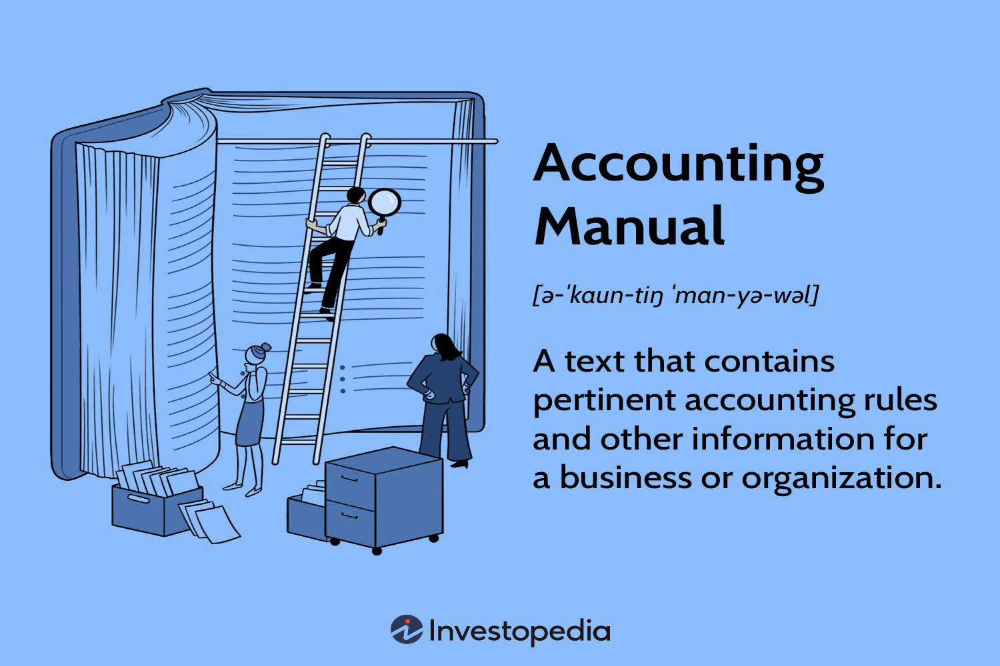

The article explores the intricate relationship between accounting components detailed in an accounting manual and their pivotal role in the domain of algorithmic trading. Accounting principles lay the foundation for financial integrity across all trading activities, ensuring accurate and consistent financial reporting and compliance with regulatory standards. These principles are crucial when involving sophisticated trading algorithms that hinge on precise and transparent financial data. 

Algorithmic trading, characterized by the use of complex algorithms and rapid execution of trades, depends heavily on data-driven decision-making. This dependency necessitates a rigorous accounting framework that can provide real-time insights into financial performance, transaction costs, and profit margins. The accounting data is critical in evaluating and refining trading strategies, ensuring they are financially viable and compliant with market regulations.



The integration of comprehensive accounting practices and algorithmic trading systems fosters operational efficiency and strategic planning in financial markets. A well-structured accounting manual acts as a crucial tool, providing guidelines on financial protocols, roles, and responsibilities within an organization, thus enabling seamless coordination between accounting and trading functions. This synergy not only streamlines operations but also enhances the adaptability and responsiveness of trading strategies to market changes.

In essence, the intersection of accounting processes with algorithmic trading mechanisms supports robust financial strategies and regulatory compliance, which are essential for achieving long-term success in the highly dynamic trading environment.

## Table of Contents

## Understanding Accounting Manuals

An accounting manual serves as a comprehensive guide for the accounting policies and procedures within a business. This document is crucial for maintaining consistency in financial practices and ensuring compliance with legal and regulatory standards. Developed internally, the accounting manual is designed to help employees understand their roles and responsibilities in the accounting process, thus serving as an essential training tool.

The components of an accounting manual typically include several key sections:

1. **Departmental Roles**: This section outlines the responsibilities of various departments in relation to the accounting activities within the organization. It helps clarify how different teams interact in the financial reporting process, ensuring that all parties are aware of their specific tasks and the importance of collaboration.

2. **Account Types and Ledger Maintenance**: This part of the manual specifies the types of accounts used in the financial system, such as asset, liability, equity, revenue, and expense accounts. It also covers the maintenance of ledgers, ensuring that all transactions are recorded accurately and systematically. Proper ledger maintenance is fundamental for creating financial statements and other financial reports.

3. **Policies and Procedures**: The policies section codifies the standardized methods of recording and reporting financial data, including guidelines on transaction entries, adjustments, and reconciliations. Procedures describe the step-by-step processes employees must follow to adhere to these policies, ensuring uniform application across the organization.

4. **Reporting Requirements**: This section defines the standards for internal and external financial reporting. It includes the formats for various financial statements, timelines for report generation, and the criteria for information disclosure. This ensures that financial data is presented consistently and meets the expectations of stakeholders and regulatory bodies.

The purpose of an accounting manual is to provide clear, structured information to help ensure consistency and accuracy in accounting practices. It supports the operational integrity of the business by aligning all accounting activities with strategic financial goals and regulatory requirements. Ultimately, an accounting manual acts as a foundation for creating reliable financial data, which is critical for decision-making and long-term planning within the organization.

## Components of an Accounting Manual

An accounting manual is an essential document that serves as a comprehensive guide for the financial activities of a business. It consolidates all accounting policies and procedures, ensuring standardization and uniformity across the organization. Central to its design are various sections that each play a critical role in the efficient functioning of the business's accounting system. 

Typically, an accounting manual begins with an introduction that provides an overview of its objectives and scope. The introduction helps set the context, explaining the importance of maintaining a structured approach to accounting practices. It lays the groundwork for users to understand the manual’s relevance in achieving financial accuracy and integrity.

Next, departmental structures are articulated. This section details the hierarchical organization of the accounting department, highlighting roles and responsibilities. It ensures clarity on who is accountable for specific tasks and processes, from data entry to final report validation. Clearly defined departmental structures aid in the efficient flow of information and reduce the risk of overlapping duties or neglected responsibilities.

The core of an accounting manual is the detailed documentation of policies and procedures. These are specific guidelines that dictate how various accounting activities should be conducted. Policies set the rules while procedures provide the step-by-step instructions on implementing these rules. Key procedures encompass accounts payable and receivable, payroll processing, budgeting, and transaction recording. Such detailed instructions ensure accurate and consistent financial data management, which is crucial for reliable financial reporting.

Reporting standards form another critical component of the accounting manual. They outline the requirements for generating financial reports in compliance with regulatory standards and internal policies. These standards guide the formatting and presentation of financial statements, ensuring they are both comprehensive and comprehensible. Adhering to established reporting standards helps the organization meet legal and statutory obligations, while also providing stakeholders with transparent and reliable financial information.

Furthermore, the manual includes processes related to internal audits and cash accounting. Internal audits are systematic evaluations of financial records and operations to ensure compliance with internal policies and external regulations. They play an integral role in identifying areas for improvement and mitigating risks of financial misstatements. Cash accounting processes manage cash flow activities, emphasizing accurate recordkeeping of receipts and disbursements. These processes are vital for maintaining [liquidity](/wiki/liquidity-risk-premium) and operational continuity.

The accounting manual’s components collectively support the organization in achieving consistency and compliance in financial reporting. They standardize accounting operations, facilitate training and onboarding of new employees, and streamline communication within the department and across the organization. Ultimately, a well-structured accounting manual is indispensable to securing the financial health and success of a business.

## Accounting in Algorithmic Trading

Accounting in [algorithmic trading](/wiki/algorithmic-trading) plays a crucial role in maintaining the financial health and operational efficiency of trading systems. At its core, accounting ensures meticulous financial record-keeping, which involves the accurate documentation of trading transactions and financial activities. This documentation is vital for performance measurement, where traders assess the profitability and effectiveness of their strategies. Cost accounting further aids in identifying expenses associated with trading activities, enabling transparent financial tracking and analysis.

A significant aspect of accounting in algorithmic trading is regulatory compliance and taxation. Trading activities must align with various financial regulations and standards set by governing bodies. Accounting frameworks help ensure that all transactions adhere to legal requirements, reducing the risk of non-compliance and potential penalties. Moreover, accurate accounting facilitates the calculation of taxes, which is essential for maintaining legal and financial integrity.

Technological advancements have significantly impacted accounting practices within algorithmic trading. Automated accounting systems, equipped with sophisticated analytics and real-time data processing capabilities, support the high-[volume](/wiki/volume-trading-strategy) and rapid trading environment inherent in algorithmic trading. These systems streamline the recording of transactions, manage large datasets efficiently, and provide immediate insights into trading performance.

Integration of accounting frameworks within algorithmic trading systems offers numerous benefits. Firstly, it allows for the seamless synchronization of financial data across various trading operations, enhancing data accuracy and consistency. Secondly, it supports the generation of detailed financial reports, essential for strategic planning and decision-making. Traders can use these reports to evaluate their positions, adjust strategies, and optimize trading algorithms based on financial performance indicators.

Moreover, accounting technology integration aids in risk management by identifying potential financial pitfalls and ensuring that trading practices remain within stipulated risk thresholds. By employing advanced software tools, traders can automate monitoring processes and receive alerts for any financial irregularities or significant deviations from expected performance benchmarks.

In conclusion, accounting in algorithmic trading serves as a backbone for financial transparency and operational efficiency. Through precise record-keeping, compliance management, and technology integration, accounting frameworks support the dynamic and fast-paced nature of algorithmic trading. As the field continues to evolve, embracing cutting-edge accounting technologies will be essential for traders aiming to maintain competitive edge and adhere to regulatory expectations.

## Examples of Accounting Components in Algo Trading

Accounting components play a critical role in algorithmic trading by providing a structured framework for financial data management, performance analysis, and regulatory compliance. These elements are crucial in ensuring that algorithmic trading strategies are both efficient and legally compliant.

**Case Studies in Algorithmic Trading:**

Successful algorithmic trading firms often leverage accounting data to enhance their trading strategies. For instance, one firm might utilize real-time transaction data to adjust their algorithms dynamically, based on current cash flow status. This data, sourced from a well-maintained accounting system, enables traders to make informed decisions, optimize liquidity, and potentially enhance returns.

Another case might involve a trading company using cost accounting data to assess the profitability of different trading algorithms. By analyzing variable and fixed costs associated with each algorithm, the firm can decide whether to scale operations or modify strategies accordingly. This practice helps in identifying high-cost components in trading systems that might erode profit margins, thus optimizing overall strategy performance.

**Impact on Trading Strategy Optimization:**

Accurate accounting is pivotal for risk management and trading strategy optimization. By maintaining precise records, trading firms can analyze historical data to identify trends and outliers, informing decisions about algorithm adjustments. Additionally, having detailed ledgers allows for the [backtesting](/wiki/backtesting) of algorithms under different market conditions, facilitating a better understanding of potential risks and returns.

In a Python implementation scenario, the following pseudocode demonstrates how accounting data might be used to calculate net trading profit and optimize strategies:

```python
import pandas as pd

# Example data import (assumed to be pre-processed and clean)
trading_data = pd.read_csv('trading_data.csv')

# Calculate net profit
trading_data['Net_Profit'] = trading_data['Revenue'] - trading_data['Costs']

# Identify profitable algorithms
profitable_algorithms = trading_data.groupby('Algorithm').sum()
optimal_algorithms = profitable_algorithms[profitable_algorithms['Net_Profit'] > 0]

print(optimal_algorithms)
```

**Regulatory Compliance through Accurate Accounting:**

Algorithmic trading is subject to stringent regulatory standards which necessitate comprehensive accounting. Firms must maintain clear financial records that reflect all transactions, ensuring compliance and facilitating audits. Inadequate accounting can lead to fines and legal challenges, impacting a firm’s reputation and operational capabilities.

In summary, accounting components integrate with algorithmic trading processes to inform decision-making, optimize strategies, and ensure adherence to regulatory frameworks. These elements are indispensable for sustaining the financial health and competitive edge of trading operations.

## Synergies Between Accounts Payable and Algorithmic Trading

Accounts Payable (AP) management plays a significant role in refining trading strategies, especially within algorithmic trading environments. Effective AP oversight provides crucial data that can enhance the predictive accuracy of financial models deployed in trading systems. By analyzing AP data, trading algorithms can integrate more comprehensive insights into financial forecasting, capital management, and liquidity planning.

### Accounts Payable Data in Algorithmic Models

AP data encompasses a wealth of financial information, including payment cycles, credit terms, and cash flow patterns. Incorporating this data into algorithmic trading models can refine financial forecasts by offering predictive insights into short-term and long-term liquidity positions. For instance, historical AP data can be utilized to predict future cash needs, which in turn informs position sizing and execution strategies in trading.

To illustrate, consider a simplified linear regression model that predicts cash flow availability based on historical AP trends:

```python
import numpy as np
from sklearn.linear_model import LinearRegression

# Sample AP data (Days, Cash Flow)
X = np.array([[1, 10], [2, 15], [3, 20], [4, 25], [5, 30]])
y = np.array([100, 150, 200, 250, 300])

# Reshape data
X = X[:, :1]

# Train model
model = LinearRegression().fit(X, y)

# Predict future cash flow availability
future_days = np.array([[6]])
predicted_cash_flow = model.predict(future_days)
```

This prediction can aid in executing trades that align with anticipated cash flows, minimizing liquidity risk and optimizing capital allocation.

### Case Studies and Applications

Real-world applications demonstrate the strategic use of AP insights to enhance liquidity management in trading operations. For example, a trading desk might integrate AP turnover ratios into its risk models to predict periods of high or low liquidity. By aligning trading activities with AP analytics, firms can better manage their cash buffers and avoid scenarios where liquidity constraints could force suboptimal trade executions.

### Future Trends and Advancements

The future of integrating AP management with algorithmic trading lies in advanced analytics and [machine learning](/wiki/machine-learning). Predictive models leveraging large datasets from AP systems can identify patterns not immediately evident, allowing traders to preemptively adjust their strategies to market changes. These advancements can help bridge operational finance and high-frequency trading ([HFT](/wiki/high-frequency-trading-strategies)), creating fluid systems that adjust dynamically to both anticipated and real-time financial demands.

Furthermore, as financial technologies evolve, we can expect greater interoperability between AP software and trading platforms, facilitating seamless data integration. Innovations such as blockchain technology and AI-driven data analysis will continue to transform how AP insights are leveraged, potentially leading to enhanced decision-making frameworks and robust strategies in high-frequency trading environments.

In conclusion, the synergy between Accounts Payable management and algorithmic trading offers substantial potential for refined trading strategies through improved financial forecasting and liquidity management, driving strategic efforts towards greater operational efficiency.

## Conclusion

In conclusion, the integration of accounting procedures within algorithmic trading frameworks highlights their fundamental interconnectedness, reinforcing the importance of robust accounting systems. These systems provide the foundation for sound financial strategies and ensure adherence to regulatory requirements, thereby safeguarding the integrity and reliability of trading operations. Specifically, accurate financial record-keeping and comprehensive cost accounting are essential for performance measurement and strategic decision-making in algorithmic trading.

The use of advanced technological tools offers numerous benefits, allowing businesses and traders to optimize financial and trading operations. Automated accounting systems and sophisticated algorithms can process large volumes of data at high speeds, which is critical in a rapidly evolving trading environment. By reducing manual errors and enhancing data accuracy, these technologies enable more precise financial forecasting and improved capital management.

To maintain competitiveness in this dynamic field, it is crucial for traders and financial managers to stay informed about the latest advancements in both accounting and algorithmic trading technologies. Continuous learning and adaptation to emerging practices can lead to significant improvements in operational efficiency and strategic planning within the financial markets. Embracing innovations in these areas will support organizations in creating more effective, compliant, and resilient trading strategies.

## References & Further Reading

[1]: Bergstra, J., Bardenet, R., Bengio, Y., & Kégl, B. (2011). ["Algorithms for Hyper-Parameter Optimization."](https://dl.acm.org/doi/10.5555/2986459.2986743) Advances in Neural Information Processing Systems 24.

[2]: ["Advances in Financial Machine Learning"](https://www.amazon.com/Advances-Financial-Machine-Learning-Marcos/dp/1119482089) by Marcos Lopez de Prado

[3]: ["Evidence-Based Technical Analysis: Applying the Scientific Method and Statistical Inference to Trading Signals"](https://www.amazon.com/Evidence-Based-Technical-Analysis-Scientific-Statistical/dp/0470008741) by David Aronson

[4]: ["Machine Learning for Algorithmic Trading"](https://github.com/stefan-jansen/machine-learning-for-trading) by Stefan Jansen

[5]: ["Quantitative Trading: How to Build Your Own Algorithmic Trading Business"](https://www.amazon.com/Quantitative-Trading-Build-Algorithmic-Business/dp/1119800064) by Ernest P. Chan