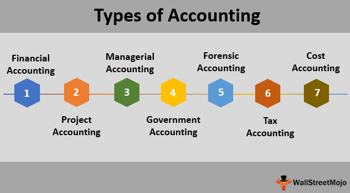

In the era of fast-paced financial markets, the intersection of accounting methods and algorithmic trading holds vital relevance. As algorithmic trading continues to revolutionize financial transactions by executing trades with unprecedented speed and efficiency, it is crucial to understand the integration of different accounting methods within this context. This integration not only ensures accurate financial reporting but also aids in making informed strategic decisions.

Accounting methods, whether traditional or modern, significantly influence trading strategies. In algorithmic trading, where decisions are made in microseconds, knowing how various accounting practices impact trading and financial reporting becomes essential. Different accounting methods—such as cash, accrual, and mark-to-market—can affect how trading results are perceived and reported, influencing tax planning, risk assessment, and overall financial health of a trading firm.



Moreover, the implications of these accounting practices extend to regulatory compliance and financial transparency. As financial markets are highly regulated, adopting the right accounting method ensures that trading activities adhere to legal requirements and avoid potential penalties. Financial transparency is fundamental in fostering trust among investors and stakeholders, making it important for trading firms to choose accounting practices that accurately portray their financial status.

In summary, understanding the intersection of accounting methods and algorithmic trading is not merely an academic exercise, but a necessity for financial market participants. As this article will explore, the selection and implementation of appropriate accounting practices are crucial for enhancing trading strategies, ensuring compliance, and contributing to the sustainable growth of trading firms in today’s complex financial landscape.

## Table of Contents

## Understanding Accounting Methods

Accounting methods play a crucial role in how businesses report their financial transactions, offering structured approaches to understanding and analyzing a company's financial health. The two primary accounting methods used in financial reporting are accrual accounting and cash accounting, each possessing distinct characteristics and applications that cater to different business needs and regulatory environments.

Accrual accounting stands out as the more comprehensive of the two methods, as it records revenues and expenses when they are earned or incurred, regardless of when the cash transactions occur. This method aligns with the matching principle, which ensures that expenses are recorded in the period in which the related revenues are recognized. By adhering to this principle, accrual accounting provides a more accurate representation of a company's financial condition and performance over time. It is commonly used by larger companies and those required to adhere to Generally Accepted Accounting Principles (GAAP) or International Financial Reporting Standards (IFRS), which mandate a more detailed view of financial activities. For instance, under the accrual method, if a company delivers goods in one month but receives payment in the following month, the revenue is recorded in the month the goods were delivered.

In contrast, cash accounting involves recording transactions only when cash physically changes hands. This method is typically simpler and well-suited for smaller businesses or individuals who require straightforward financial tracking without the complexity of accrual entries. Cash accounting offers immediate feedback on a company's cash flows, which can be advantageous for businesses with uncomplicated financial transactions. However, this can also obscure a business's true financial performance since it may not account for outstanding obligations or receivables. For instance, in cash accounting, a business would record revenue when it receives payment and record expenses when it pays them, regardless of when the goods or services were delivered or received.

The choice between accrual and cash accounting significantly influences various business dimensions, including tax implications, financial reporting, and strategic decision-making. For example, businesses using cash accounting may delay receipt of payments to defer income tax liabilities to a subsequent period. Conversely, businesses using accrual accounting could face increased regulatory scrutiny due to the complexity and judgment involved in recognizing revenues and expenses. Additionally, accrual accounting provides more relevant insights into long-term trends and the underlying drivers of financial performance, thereby aiding strategic planning and decision-making.

Ultimately, selecting an appropriate accounting method requires businesses to consider the size and complexity of their operations, along with their regulatory obligations and strategic objectives. Both methods offer distinct advantages and challenges, and the right choice can significantly impact a company’s financial management and operational efficiency.

## Types of Accounting Methods in Algorithmic Trading

Algorithmic trading involves the automated execution of trades, which are often based on complex algorithms processing large volumes of financial data. This high-speed environment necessitates the use of sophisticated accounting methods to ensure accurate financial representation and compliance. Three predominant accounting methods utilized in [algorithmic trading](/wiki/algorithmic-trading) include cash basis, accrual basis, and mark-to-market accounting.

Cash basis accounting records income and expenses when cash is actually received or paid. While this method is straightforward, its application in algorithmic trading poses challenges. The rapid pace and high [volume](/wiki/volume-trading-strategy) of transactions can result in obscured financial standings, as this method does not account for trades that have been executed but not yet settled in cash. Consequently, relying solely on cash basis accounting may provide an incomplete picture of a trading entity's financial health.

Accrual basis accounting, on the other hand, records revenues and expenses when they are earned or incurred, regardless of when the cash transactions occur. This approach offers a more comprehensive view of a firm’s financial status. By accounting for all transactions as they happen, accrual basis accounting provides real-time financial insights essential for managing algorithmic trading operations. This method ensures that all financial commitments and revenues are recorded, thus offering a more accurate representation of the firm's financial health.

Mark-to-market accounting is particularly relevant in environments where real-time portfolio valuation is critical. This method involves valuing assets and liabilities at their current market prices, thus reflecting their real-time market value. In algorithmic trading, where rapid fluctuations in asset prices are common, mark-to-market can provide the most accurate measure of a trading entity's financial position. This approach helps in identifying potential risks or opportunities in the portfolio, thereby supporting more strategic decision-making.

The choice among these accounting methods is crucial in algorithmic trading, impacting tax computations, regulatory compliance, and strategic financial planning. Firms engaged in algorithmic trading must carefully consider these methods to ensure accurate financial reporting and to maintain an efficient and transparent trading environment.

## Applications of Accounting Methods in Algorithmic Trading

In the context of algorithmic trading, accounting methods play a critical role in determining tax liabilities, optimizing portfolio management, and ensuring compliance with regulatory frameworks. The choice of accounting methods has far-reaching implications for trading firms, influencing strategic decisions related to profitability and operational efficiency.

Accurate accounting methods are essential for firms looking to assess and refine their trading strategies. Precise financial reporting allows trading firms to evaluate the performance of their algorithms by providing a clear view of costs, revenues, and profitability. This financial clarity supports the identification of successful strategies and the recalibration of underperforming ones, ultimately enhancing overall profitability.

Robust accounting practices are fundamental in maintaining transparency and adhering to regulatory standards, which is crucial in the highly regulated environment of financial trading. Firms must implement accounting systems that comply with standards such as the International Financial Reporting Standards (IFRS) or the Generally Accepted Accounting Principles (GAAP). Adhering to these frameworks reduces legal risks and fosters trust among stakeholders by ensuring that financial reports are accurate and consistent with industry standards.

Integrating accounting systems with trading platforms is a powerful way to achieve real-time data processing. Such integration ensures that financial data is updated immediately as transactions occur, enabling firms to maintain accurate and consistent financial records. This real-time accounting capability supports firms in making timely decisions by providing up-to-date insights into their financial status. For example, Python or other programming languages can be deployed to automate the updating of financial records by extracting data directly from trading systems:

```python
import pandas as pd

# Simulated trade data
trade_data = {
    'trade_id': [1, 2, 3],
    'amount': [1000, 2000, -1500],
    'price': [50, 60, 55]
}

# Create DataFrame
df = pd.DataFrame(trade_data)

# Calculate total value of trades
df['value'] = df['amount'] * df['price']

# Calculate portfolio value
portfolio_value = df['value'].sum()

print("Real-time Portfolio Value: ", portfolio_value)
```

Advanced accounting practices also facilitate strategic financial planning by offering insights into future trends and supporting predictive analytics. These practices assist firms in navigating complex financial landscapes where market conditions can shift rapidly. Using historical data and financial modeling, firms can forecast cash flows, assess risk exposures, and allocate resources efficiently, enabling them to make informed decisions that align with their long-term strategic goals.

In conclusion, the application of nuanced accounting methods in algorithmic trading ensures both financial transparency and strategic agility, enabling firms to thrive in a highly competitive and regulated market.

## Challenges and Considerations

Algorithmic trading introduces several unique challenges that necessitate adaptations to traditional accounting practices. The [high frequency](/wiki/high-frequency-trading) and volume of trades in algorithmic environments require accounting systems capable of ensuring accuracy across these rapid transactions. Real-time financial monitoring systems must be integrated into trading platforms to provide up-to-date financial data, assisting in precise decision-making and financial reporting.

Compliance with the ever-evolving international standards poses another significant challenge. Algorithmic trading firms must continually update their financial reporting systems to stay compliant with regulations such as the International Financial Reporting Standards (IFRS) and Generally Accepted Accounting Principles (GAAP). This involves constant vigilance and adaptation to new guidelines and rules introduced by regulatory bodies, ensuring both transparency and legality in financial operations.

The security of financial data in algorithmic trading is paramount. The integration of robust cybersecurity measures is essential to protect sensitive financial information from breaches. This involves employing advanced encryption technologies, regular security audits, and the implementation of secure software development practices to safeguard data integrity and prevent unauthorized access.

Cross-disciplinary collaboration is vital for effectively managing the complexities inherent in algorithmic trading. Accountants, traders, data scientists, and IT professionals must work together to develop and maintain systems that support accurate financial monitoring and reporting. Professional development and continuous learning are essential for these teams to stay abreast of technological advancements and regulatory changes, fostering an environment of innovation and compliance.

These challenges highlight the need for sophisticated accounting solutions that are tailored to the fast-paced, technologically-driven landscape of algorithmic trading. Addressing these considerations ensures not only financial accuracy and compliance but also the long-term success and sustainability of trading operations.

## Conclusion

Robust accounting methods are crucial for safeguarding financial integrity and ensuring regulatory adherence in algorithmic trading. The choice of accounting practices significantly influences strategic planning and decision-making within trading operations. Aligning accounting techniques with automated trading systems allows firms to glean insights from financial data, thereby enhancing efficiency and optimizing outcomes.

Accounting plays a vital role in promoting transparency and fostering trust, which are essential for supporting firms in achieving sustainable growth within the trading landscape. Employing advanced accounting methods not only aids in accurate financial reporting but also mitigates potential risks associated with legal and regulatory compliance. For instance, employing accrual accounting in algorithmic trading provides an accurate picture of a firm’s financial status by recording revenues and expenses as they are earned or incurred, regardless of cash flow.

Moreover, integrating mark-to-market accounting with algorithmic systems allows for real-time portfolio valuations, aligning recorded asset values with current market prices. This integration is crucial in the fast-paced trading environment, where asset values can fluctuate rapidly.

Understanding and implementing the appropriate accounting methods is essential for navigating the complexities of modern financial markets. Firms must remain adaptive to evolving financial regulations and technological advancements to maintain their competitive edge. Consequently, accounting methodologies must evolve alongside trading technologies to support robust, transparent, and compliant trading practices. This evolution fosters a secure financial ecosystem, capable of withstanding the dynamic nature of global financial markets.

## References & Further Reading

[1]: ["Advances in Financial Machine Learning"](https://www.amazon.com/Advances-Financial-Machine-Learning-Marcos/dp/1119482089) by Marcos Lopez de Prado

[2]: ["Evidence-Based Technical Analysis: Applying the Scientific Method and Statistical Inference to Trading Signals"](https://www.amazon.com/Evidence-Based-Technical-Analysis-Scientific-Statistical/dp/0470008741) by David Aronson

[3]: ["Machine Learning for Algorithmic Trading"](https://github.com/stefan-jansen/machine-learning-for-trading) by Stefan Jansen

[4]: ["Quantitative Trading: How to Build Your Own Algorithmic Trading Business"](https://www.amazon.com/Quantitative-Trading-Build-Algorithmic-Business/dp/1119800064) by Ernest P. Chan

[5]: Bergstra, J., Bardenet, R., Bengio, Y., & Kégl, B. (2011). ["Algorithms for Hyper-Parameter Optimization."](https://dl.acm.org/doi/10.5555/2986459.2986743) Advances in Neural Information Processing Systems 24.