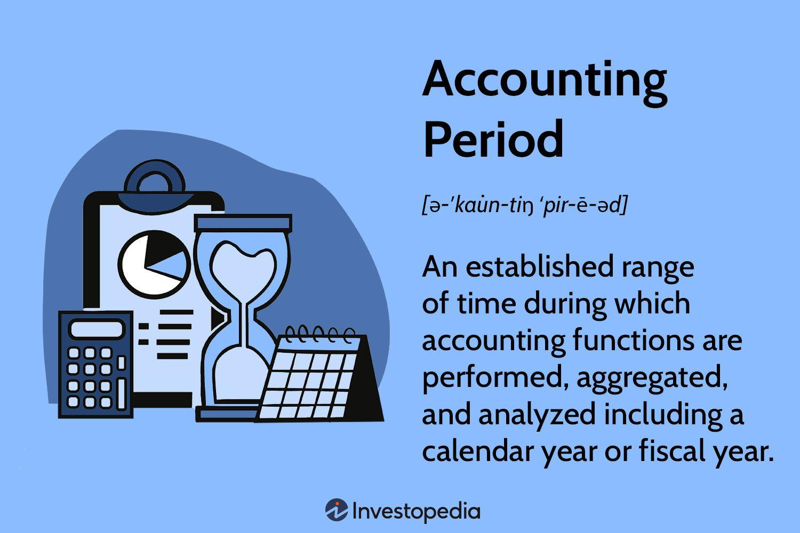

Understanding the fundamentals of financial reporting is critical for businesses aiming to maintain accurate and transparent financial practices. Financial reporting provides a structured framework to present a company’s financial position, performance, and cash flow through standardized financial statements. Central to this process are the concepts of accounting periods, financial reporting, and the accounting cycle, which collectively form the backbone of effective financial management.

Accounting periods are the specific durations, such as fiscal or calendar years, for which financial statements are prepared, allowing businesses to report consistent and comparable financial data over time. This periodicity enables stakeholders to evaluate a company's progress and financial health accurately.



The accounting cycle, consisting of key steps such as transaction analysis, journalizing, and the preparation of financial statements, ensures thoroughness and compliance with generally accepted accounting principles (GAAP) or international financial reporting standards (IFRS). It plays a vital role in transforming raw financial data into meaningful information, supporting decision-making processes, and providing a true and fair view of a company's financial condition.

Moreover, in today's rapidly evolving financial landscape, the integration of algorithmic trading with traditional accounting practices introduces new dimensions to financial reporting. Algorithmic trading utilizes computer algorithms to execute trading orders automatically, presenting challenges in accounting due to transaction complexity, regulatory considerations, and rapid execution speeds. As such, a comprehensive understanding of these elements and their implications is essential for businesses to maintain financial transparency and optimize strategic decisions. 

This article aims to provide an in-depth exploration of these fundamental concepts and showcase their practical applications. By gaining insight into these facets of financial reporting, readers will be better equipped to navigate the intricacies of modern financial environments and enhance their organizations' financial decision-making capabilities.

## Table of Contents

## Understanding Accounting Periods

An accounting period refers to the specific span of time for which an organization prepares its financial statements. This time frame can be structured in various forms, including a calendar year, fiscal year, quarter, month, or even on a weekly basis. The fundamental purpose of these periods is to produce financial statements that are both consistent and comparable over time, thereby facilitating the monitoring of financial performance and strategic planning.

The selection of accounting periods is crucial because it affects both financial reporting and tax obligations. A calendar year follows the standard January to December sequence, which can be beneficial for organizations synchronized with the calendar year for budget planning and annual reporting. Conversely, a fiscal year is a 12-month period that does not necessarily begin in January; it can commence in any month and is often tailored to fit the operational cycle of the business. For instance, retailers may prefer a fiscal year that concludes shortly after the holiday season to encapsulate year-end sales data comprehensively.

Understanding accounting periods is pivotal for sound financial analysis and reporting. These periods allow businesses to track their economic activity efficiently, providing transparent insights into financial health. Furthermore, adherence to standardized accounting periods ensures compliance with regulatory requirements and boosts stakeholders' confidence in the financial disclosures.

Implementing consistent accounting periods aids in the preparation of key financial statements, such as the income statement, which summarizes revenue and expenses, and the balance sheet, detailing assets and liabilities. This harmonization in reporting intervals ensures that an organization's financial statements remain comparable over successive periods, enhancing the reliability of financial analysis and decision-making processes.

In summary, the proper management and understanding of accounting periods form the backbone of systematic financial reporting and regulatory compliance, ultimately contributing to the strategic success of a business.

## The Accounting Cycle: Steps and Importance

The accounting cycle is essential for organizing financial data and ensuring adherence to accounting standards within a given accounting period. It encompasses a series of methodical steps designed to systematically transition raw financial transactions into comprehensive financial statements. Here’s an overview of the key steps involved in the accounting cycle:

1. **Analyzing Transactions**: The process begins with identifying and analyzing each transaction that has occurred during the accounting period. This involves understanding how each transaction affects the financial position of the business, and determining the accounts involved.

2. **Journalizing**: Once transactions are analyzed, they are recorded as journal entries. This step requires applying the double-entry accounting system, where each transaction is entered as debits and credits that balance each other.

   Example of a Python snippet for checking if a journal entry balances:
   ```python
   def is_balanced(debits, credits):
       return sum(debits) == sum(credits)

   # Sample journal entry
   debits = [100, 200]
   credits = [300]
   print(is_balanced(debits, credits))  # Output: True
   ```

3. **Posting to Ledgers**: Journal entries are then transferred to the general ledger. Each ledger account reflects the summarized balance and individual transactions of a specific account type, such as assets, liabilities, or equity.

4. **Preparing Trial Balances**: After posting to ledgers, a trial balance is prepared to ensure that total debits equal total credits. This step helps in identifying any discrepancies that need rectification before financial statements are drafted.

5. **Adjusting Entries**: Adjusting entries are needed to account for accrued and deferred items not captured during the regular transaction recording process. These adjustments ensure that revenues and expenses are recognized in the period they occur, in accordance with the matching principle.

6. **Financial Statement Preparation**: With adjusted trial balances, companies prepare financial statements—the balance sheet, income statement, and cash flow statement—that present a true and fair view of the company’s financial position.

7. **Closing the Books**: The final step involves closing temporary accounts, such as revenues and expenses, transferring their balances to permanent accounts like retained earnings. This process resets the temporary accounts for the next accounting period.

The accounting cycle is pivotal for maintaining financial integrity and supports strategic decision-making. It enhances consistency and transparency, ensuring that financial statements offer stakeholders a reliable picture of the company’s economic standing. Mastery of this cycle is crucial for effective financial reporting and management, thereby enabling companies to align better with regulatory frameworks and financial standards.

## Financial Reporting Essentials

Financial reporting is the systematic process of communicating a company's financial status to interested parties, notably stakeholders such as investors, creditors, and regulators. The three primary financial statements — the balance sheet, income statement, and cash flow statement — serve as the cornerstone of this communication framework.

The balance sheet, or statement of financial position, provides a snapshot of a company's assets, liabilities, and shareholders' equity at a specific point in time. This statement adheres to the fundamental accounting equation:

$$
\text{Assets} = \text{Liabilities} + \text{Equity}
$$

The income statement, also known as the profit and loss statement, summarizes the company's revenues and expenses over a specific period, thus illustrating its operational performance. The equation central to this statement is:

$$
\text{Net Income} = \text{Revenues} - \text{Expenses}
$$

Finally, the cash flow statement tracks the inflows and outflows of cash, segmented into operating, investing, and financing activities. This statement provides insight into the company's [liquidity](/wiki/liquidity-risk-premium) and financial flexibility.

Accurate financial reporting necessitates adherence to crucial principles such as revenue recognition and the matching principle. Revenue recognition dictates that revenue should be recognized when it is earned, regardless of when the payment is received. The matching principle ensures that expenses are recognized in the same period as the revenues they help generate, thereby providing a clear correlation between income and expenses, essential for assessing profitability.

Regular and comprehensive financial reporting is indispensable for monitoring an entity's financial performance and informing strategic investment decisions. It aids stakeholders in making informed evaluations regarding the company's financial health, stability, and future growth prospects. Moreover, maintaining a consistent reporting schedule ensures compliance with regulatory standards, such as those mandated by the International Financial Reporting Standards (IFRS) or Generally Accepted Accounting Principles (GAAP).

The digital transformation in the field of accounting introduces automation as a significant driver of efficiency and accuracy in financial reporting processes. Automated systems reduce the risk of human error, streamline the preparation of complex data sets, and allow real-time financial data management. Firms can employ advanced software tools and enterprise resource planning (ERP) systems to automate report generation, data gathering, and validation tasks.

Automation, coupled with robust data analysis, enhances the reliability and timeliness of financial reports, thereby supporting swift decision-making and strategic planning. As financial environments grow more complex, integrating technological advancements into routine reporting processes assures company stakeholders of transparency and accountability.

## Algorithmic Trading: Integrating with Accounting

Algorithmic trading, a technique using advanced algorithms to execute trades automatically, has gained significant traction in modern financial markets due to its speed and efficiency. This trading method uses predefined criteria to execute trades, necessitating sophisticated accounting frameworks to handle the complexities introduced.

One of the primary accounting challenges in [algorithmic trading](/wiki/algorithmic-trading) is cost accounting. This involves the meticulous tracking of transaction costs, which include fees, taxes, and the bid-ask spread. These costs can directly impact trade profitability and require precise accounting methods to assess accurately. Operational expenses such as data subscription fees and software licenses must also be accounted for diligently to ensure the financial integrity of trading operations.

Performance measurement is another critical aspect that requires attention. Key performance metrics such as Return on Investment (ROI) and the Sharpe Ratio are crucial for evaluating the effectiveness of trading strategies. The ROI measures the gains or losses generated relative to the amount invested, using the formula:

$$
\text{ROI} = \frac{\text{Net Profit}}{\text{Initial Investment}} \times 100
$$

The Sharpe Ratio evaluates the risk-adjusted return, calculated as:

$$
\text{Sharpe Ratio} = \frac{\text{Expected Portfolio Return} - \text{Risk-Free Rate}}{\text{Standard Deviation of Portfolio Return}}
$$

Accurate computation of these metrics is essential for performance evaluation and strategic decision-making in algorithmic trading.

Regulatory compliance is paramount in integrating algorithmic trading with accounting practices. Legislative frameworks such as the Markets in Financial Instruments Directive (MiFID II) in Europe and the Dodd-Frank Act in the U.S. impose stringent reporting requirements. Ensuring accurate tax reporting is another critical component. Algorithmic traders must accurately report gains, losses, and expenses to comply with tax regulations, which requires robust accounting systems capable of handling large volumes of data.

Technological advancements are catalyzing the integration of trading platforms with accounting systems. The development of APIs and real-time data analytics tools facilitates seamless data flow between trading systems and financial management software, enhancing data accuracy and reporting efficiency. Python, with its powerful libraries such as Pandas and NumPy, offers robust solutions for processing large datasets and performing complex calculations critical for automated trading systems.

By harnessing these technologies, firms can improve their algorithmic trading accounting, ensuring financial accuracy, regulatory compliance, and strategic agility in an increasingly competitive market environment.

## Challenges and Solutions in Accounting for Algorithmic Trading

Algorithmic trading, a method that uses computer algorithms to execute trading orders at speeds and frequencies that human traders cannot achieve, poses specific challenges for accountants. The high [volume](/wiki/volume-trading-strategy) and complexity of transactions are at the forefront, necessitating robust accounting systems to handle large datasets effectively.

### Data Security and Real-Time Reporting

Ensuring data security is paramount due to the sensitive nature of financial transactions. With algorithmic trading generating a massive amount of data, safeguarding this information against breaches is critical. Encryption techniques and secure data storage solutions are necessary to protect transaction data.

Real-time reporting is another challenge, as timely financial insights are crucial for decision-making. Traditional batch processing methods are inadequate due to the rapid pace of trading. Instead, real-time data streaming technologies and infrastructure need to be adopted. These technologies allow for the continual updating of financial records, providing stakeholders with up-to-date information.

### Compliance with Multi-Jurisdictional Regulations

Algorithmic trading often operates across multiple geographical regions, each with distinct regulatory requirements. Compliance involves stringent reporting standards and regular audits to ensure adherence to jurisdiction-specific regulations. Implementing a unified system that tracks transactions and generates standardized reports can help meet these diverse regulatory demands.

### Automated Accounting Systems and Advanced Analytics

To manage the immense volume of transactions, automated accounting systems are indispensable. These systems streamline the accounting process by automatically capturing and categorizing transactions, significantly reducing the risk of human error. For example, software solutions such as SAP and Oracle provide comprehensive platforms for integrating trading activities with accounting practices.

Advanced analytics further enhance these systems by enabling predictive analytics and anomaly detection. Predictive models can forecast financial outcomes based on historical data, while anomaly detection algorithms identify unusual transaction patterns that may indicate errors or fraudulent activity. For instance, Python libraries like pandas and scikit-learn can be utilized to develop custom analytics solutions:

```python
import pandas as pd
from sklearn.ensemble import IsolationForest

# Example of anomaly detection in financial transactions

# Load transaction data
df = pd.read_csv('transactions.csv')

# Define features for the model
features = df[['transaction_amount', 'transaction_time']]

# Train Isolation Forest model
model = IsolationForest(contamination=0.01)
df['anomaly'] = model.fit_predict(features)

# Identify anomalous transactions
anomalous_transactions = df[df['anomaly'] == -1]
```

### Engaging Specialized Auditors and Advisors

Engaging specialized auditors and advisors is crucial for optimizing accounting processes and ensuring compliance. These professionals possess in-depth knowledge of both accounting principles and algorithmic trading, aiding firms in navigating the complexities these activities introduce. They assist in implementing best practices and identifying areas for process improvement.

In conclusion, the intersection of algorithmic trading and accounting demands a sophisticated approach involving advanced technology, regulatory knowledge, and expert guidance. Successfully addressing these challenges enables organizations to maintain financial integrity and strategic advantage.

## Conclusion

The integration of traditional accounting principles with modern algorithmic trading practices plays a pivotal role in achieving financial success for organizations. By mastering accounting periods and the accounting cycle, companies can ensure precise financial documentation and reporting. These foundations, when combined with the adaptability to algorithmic trading, facilitate enhanced financial transparency and strategic agility. Algorithmic trading introduces complexities like high transaction volumes and intricate cost analyses, but it also offers unprecedented opportunities for efficiency and speed in trading operations.

To remain competitive in this fast-paced financial landscape, companies must prioritize continued education and the adoption of advanced technologies. Leveraging these technologies helps organizations automate and optimize trading and accounting processes, thus reducing errors and enhancing data management. Tools such as [machine learning](/wiki/machine-learning) algorithms and predictive analytics are increasingly becoming integral for identifying market trends and making informed trading decisions.

For financial professionals, understanding the intersection of traditional and modern practices is critical. This knowledge enables comprehensive financial oversight and robust strategic planning. Engaging with innovations in accounting systems and trading technologies supports not only compliance and accuracy but also positions companies for future growth and success in an ever-evolving financial landscape.

## References & Further Reading

[1]: Financial Accounting Standards Board. (2020). ["Accounting Standards Codification."](https://asc.fasb.org/layoutComponents/getPdf?isSitesBucket=false&fileName=GUID-1DF30804-9F15-40BE-89CB-7CE432C3A1FC.pdf)

[2]: International Financial Reporting Standards (IFRS) Foundation. (2023). ["International Financial Reporting Standards."](https://www.ifrs.org/news-and-events/news/2024/04/ifrs-foundation-publishes-2023-annual-report/)

[3]: Securities and Exchange Commission (SEC). (2021). ["Guide to Financial Statement Preparation."](https://www.sec.gov/about/divisions-offices/division-corporation-finance/financial-reporting-manual)

[4]: Lopez de Prado, M. (2018). ["Advances in Financial Machine Learning."](https://www.amazon.com/Advances-Financial-Machine-Learning-Marcos/dp/1119482089) Wiley.

[5]: Aronson, D. R. (2006). ["Evidence-Based Technical Analysis: Applying the Scientific Method and Statistical Inference to Trading Signals."](https://www.amazon.com/Evidence-Based-Technical-Analysis-Scientific-Statistical/dp/0470008741) Wiley.

[6]: Chan, E. P. (2008). ["Quantitative Trading: How to Build Your Own Algorithmic Trading Business."](https://github.com/ftvision/quant_trading_echan_book) Wiley.

[7]: Jansen, S. (2020). ["Machine Learning for Algorithmic Trading."](https://github.com/stefan-jansen/machine-learning-for-trading) Packt Publishing.

[8]: Montier, J. (2010). ["Behavioural Investing: A Practitioner's Guide to Applying Behavioural Finance."](https://onlinelibrary.wiley.com/doi/book/10.1002/9781118673430) Wiley.

[9]: Hull, J. (2018). ["Options, Futures, and Other Derivatives."](https://www.amazon.com/Options-Futures-Other-Derivatives-9th/dp/0133456315) Pearson.