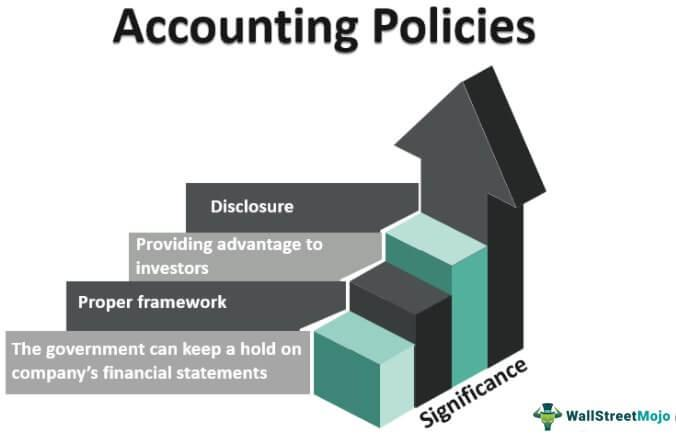

In today’s digital economy, the financial success of companies heavily relies on their ability to maintain accurate and strategic financial reporting. This is particularly important in the fast-paced environment of algorithmic trading, where vast amounts of data are processed instantly to make trading decisions. Here, accounting policies become a foundational element of financial reporting, as they provide structural guidelines that dictate how financial data is collected, analyzed, and reported. These policies play a crucial role not only in ensuring the accuracy of a company’s financial statements but also in helping investors and auditors assess the financial health and operational performance of an organization.

Accounting policies encompass a broad range of principles and methodologies used by firms to prepare financial statements. They guide the recognition of revenue, the valuation of assets, and the treatment of amortization and depreciation, among other things. In the context of algorithmic trading, these policies hold particular significance due to the rapid rate of transactions and the complexity of the financial instruments involved. For instance, the choice of revenue recognition method can significantly affect reported earnings, while asset valuation methods can influence a company’s balance sheet and perceived financial stability.



The correct application of accounting policies is essential for portraying an accurate picture of a company’s operations, impacting key financial outcomes and strategic decisions. For auditors and investors, understanding these policies is crucial to evaluating financial statements, as they inform analyses of profitability, liquidity, and risk. Through this lens, algorithmic trading presents unique challenges and opportunities for accounting practices, requiring adaptations to handle the high-frequency, automated nature of trade executions and data processing.

Financial outcomes in algorithmic trading are not only affected by market strategies but also by the accounting policies that underpin financial reporting. These policies can alter financial indicators which, in turn, affect decision-making processes both internally for companies and externally for stakeholders. Accounting policies in this sector are indispensable for translating complex data into coherent financial insights, ultimately influencing corporate strategy, market perceptions, and investment decisions. As we navigate through the intricacies of accounting policies and financial reporting in algorithmic trading, it becomes clear that they are not merely procedural necessities but strategic tools that drive financial clarity and integrity.

## Table of Contents

## Understanding Accounting Policies

Accounting policies are foundational elements within a company's financial reporting framework, comprising the standards, principles, and procedures utilized to prepare financial statements. These policies play an instrumental role in how a company captures, processes, and reports its financial data, directly impacting the accuracy and comprehension of its financial health and performance. The adoption of certain accounting policies dictates how various financial elements are recognized, measured, and reported.

One of the key aspects dictated by accounting policies is revenue recognition. Companies must determine the precise moment when revenues should be recorded. Approaches may vary; for example, revenue could be recorded when a sale is made, when payment is received, or when goods are delivered, depending on the policy in place. The selected approach has significant implications for financial results and must adhere to regulatory standards like the Generally Accepted Accounting Principles (GAAP) or the International Financial Reporting Standards (IFRS).

Next, accounting policies govern asset valuation. Different methodologies exist for assessing the value of a company's assets. Whether adopting historical cost, fair value, or other evaluation techniques, these decisions affect a company’s balance sheet and asset-related disclosures. Depreciation and amortization practices are also influenced by these policies, providing mechanisms to allocate the cost of tangible and intangible assets over their useful lives. Various methods such as straight-line, declining balance, or units of production may be used, each impacting financial statements differently.

The importance of adopting coherent accounting policies lies in achieving financial consistency and transparency. By establishing guidelines that dictate how financial information is recorded and reported, companies ensure that stakeholders can compare financial outcomes across different reporting periods. This comparability is crucial for accurate analysis and informed decision-making.

Adherence to standardized frameworks like GAAP and IFRS is mandatory, ensuring that the accounting policies employed by an organization meet industry and regulatory norms. These frameworks prescribe detailed directives to maintain consistency across global financial reporting, enabling analysts, investors, and regulators to interpret financial statements with clarity and uniformity.

In summary, accounting policies define the methodologies by which revenue recognition, asset valuation, and depreciation are handled, impacting a company’s financial statements profoundly. Ensuring these policies are aligned with GAAP or IFRS is essential for maintaining integrity and transparency in financial reporting.

## Examples of Accounting Policies in Practice

In the United States, inventory valuation is a critical aspect of accounting policies due to its significant impact on financial statements. Companies often choose among three primary methods: First-In, First-Out (FIFO), Last-In, First-Out (LIFO), and Average Cost, each of which influences financial reporting in distinct ways.

FIFO assumes that the oldest inventory items are sold first. This method is beneficial in periods of rising prices as it results in lower cost of goods sold (COGS) and higher gross income, potentially inflating earnings. Conversely, LIFO presumes the newest inventory is sold first, which can increase COGS and reduce taxable income during inflationary times. This approach can be advantageous for tax-saving purposes. The Average Cost method smooths out price fluctuations by taking the weighted average of all units available for sale during the period.

Beyond inventory valuation, industries differ widely in their depreciation methodologies to accurately reflect asset usage over time. Depreciation is crucial for allocating the cost of tangible assets over their useful lives, affecting both the balance sheet and income statement. In technology sectors, companies often adopt accelerated depreciation methods. This strategy acknowledges the rapid obsolescence of hardware and software, ensuring that financial statements reflect the assets' decreasing value more promptly.

For instance, the double-declining balance method, which is a common accelerated depreciation approach, applies twice the straight-line depreciation rate to the declining book value of the asset each year. It ensures higher depreciation expenses initially, tapering off as the asset ages. Below is a simple Python code snippet demonstrating the double-declining balance method:

```python
def double_declining_balance(cost, salvage, useful_life, year):
    rate = 2 / useful_life
    remaining_value = cost
    for i in range(1, year + 1):
        depreciation = remaining_value * rate
        remaining_value -= depreciation
        if remaining_value < salvage:
            remaining_value = salvage
            break
    return cost - remaining_value

cost = 10000  # Initial cost of the asset
salvage = 1000  # Salvage value of the asset
useful_life = 5  # Useful life in years
year = 3  # Year for which depreciation expense is calculated

depreciation_value = double_declining_balance(cost, salvage, useful_life, year)
print(f"The accumulated depreciation by year {year} is: {depreciation_value}")
```

The choice of accounting policy, whether for inventory or depreciation, significantly impacts a company’s financial portrayal, influencing investor perception and tax obligations. Each policy choice must be carefully aligned with both regulatory standards and strategic business objectives to accurately present financial health.

## Conservative vs. Aggressive Accounting Policies

Conservative accounting policies are characterized by their cautious approach to financial reporting. Companies employing these policies typically recognize expenses immediately and defer revenue recognition, even if financial results could appear more favorable through alternative accounting choices. This approach often leads to higher expenses and lower revenues being reported in the short term. By prioritizing prudence and underreporting financial results, companies can establish a stable earnings base, fostering trust and diminishing the risk of future financial restatements.

Aggressive accounting policies, in contrast, tend to maximize current-period earnings and boost financial statements. This is often achieved by accelerating revenue recognition and deferring expenses. For example, a company might recognize long-term contract revenue upfront or capitalize costs that could otherwise be expensed. While this can improve apparent financial health in the short term, it often carries greater risk due to potential future income [volatility](/wiki/volatility-trading-strategies) or regulatory scrutiny. 

Investors need to assess the quality of earnings with a critical eye on the accounting policies a company adopts. Earnings manipulation through aggressive policies, although compliant with accounting standards, may not reflect the company’s actual financial condition and can obscure operational performance. Evaluating these policies helps investors ensure that earnings quality remains consistent with the company’s operational reality.

The choice between conservative and aggressive policies frequently signals management’s financial strategy and outlook. Conservative policies might indicate a focus on long-term stability and risk aversion, while aggressive policies could suggest an emphasis on growth and performance in shorter periods, albeit sometimes at the expense of long-term credibility. Therefore, understanding a company’s accounting policy selection aligns with recognizing the management's strategic priorities and risk appetite.

## Accounting Policies in Algorithmic Trading

Algo trading companies operate in a financial environment characterized by rapid transactions and sophisticated financial instruments. As a result, their accounting policies must address several unique aspects to ensure accurate financial reporting.

Revenue recognition in [algorithmic trading](/wiki/algorithmic-trading) is critical due to the [high frequency](/wiki/high-frequency-trading) at which trades are executed. Companies must establish clear guidelines on when the income from these transactions is recorded. This involves determining the point at which a transaction is complete and the revenue can be deemed realized or realizable, especially when dealing with derivatives and other complex financial products. Accounting standards such as ASC 606 (Revenue from Contracts with Customers) may provide guidance on recognizing revenue appropriately, although adaptations may be necessary to cater to the nuances of algo trading.

Asset valuation in the context of algo trading is another important consideration. Trading algorithms, proprietary software, and related technological assets often constitute significant investments for algo trading firms. The valuation of these intangible assets must reflect their economic benefits accurately. This can include considering amortization schedules that align with the expected lifecycle of the software or algorithm. Companies may also need to periodically test for impairment, ensuring that the asset values reported in financial statements remain realistic and are not overstated.

Algorithmic trading often involves transactions across multiple geographies, introducing complexities in taxation and foreign currency management. Taxation policies must account for income generated by trades executed in different jurisdictions, each with varying tax implications. Transfer pricing policies may also be necessary to address any intra-company transactions that occur across borders. Furthermore, the management of foreign exchange risks and the correct accounting for currency fluctuations are imperative. Companies may utilize hedging strategies to mitigate these risks, which need to be accurately reported in their financial statements.

In sum, algo trading firms require robust accounting policies that cater to their high-[volume](/wiki/volume-trading-strategy) transaction environment and the complexity of the financial instruments they use. Careful consideration of revenue recognition, asset valuation, taxation, and foreign currency management ensures that these firms can provide transparent, accurate, and regulatory-compliant financial reports.

## Impact of Accounting Policies on Financial Reporting

Accounting policies significantly impact the presentation and interpretation of financial statements, which are integral to stakeholders' decision-making processes. The choices made in adopting specific accounting policies directly influence key financial indicators, necessitating a comprehensive understanding of their application. For instance, revenue recognition policies determine when and how income is recorded, affecting profitability measures such as earnings per share (EPS) and return on equity (ROE).

Corporate transparency and regulatory compliance are highly dependent on the clarity and consistency of accounting policies. When financial statements adhere to standards set by Generally Accepted Accounting Principles (GAAP) or International Financial Reporting Standards (IFRS), they provide a reliable framework for comparing financial health across different periods and companies. This consistency fosters trust among stakeholders, including investors, regulators, and analysts, who rely on accurate financial reporting for evaluating a company’s performance and future prospects.

Informed accounting policy choices allow firms to present a true and fair view of their financial condition. For strategic planning, this accuracy is critical, as management relies on precise financial data to make informed operational and investment decisions. For example, companies often use depreciation methods to match asset costs with revenue generation. This choice affects net income and tax liabilities, thus influencing financial planning and resource allocation.

In the context of investor relations, transparent financial reporting is fundamental. Investors assess a company's health based on its financial statements, influencing their investment decisions. Sound accounting policies signal effective governance and risk management, enhancing a company's reputation in the market. Therefore, maintaining rigorous accounting standards is not merely a regulatory obligation but a strategic imperative that supports long-term financial integrity and stakeholder trust.

## Conclusion

Accounting policies serve as strategic tools within financial reporting, equipping organizations with the means to present complex activities in a transparent and comprehensible manner. In the context of algorithmic trading, these policies are vital. They provide the essential structure needed to translate high-frequency trading data and intricate financial transactions into clear financial insights. As the financial industry continues to evolve rapidly, understanding and effectively applying accounting policies is crucial in maintaining financial clarity and integrity. This application ensures that stakeholders can rely on accurate and truthful representations of a company's financial health.

The ever-changing financial landscape necessitates that businesses and investors stay informed about current accounting standards and their potential impact on financial outcomes. Changes in regulations and standards can significantly influence financial reporting and decision-making processes. Therefore, staying abreast of these developments is essential for effective strategic planning, fostering investor trust, and ensuring compliance with regulatory requirements. As such, accounting policies extend beyond merely fulfilling procedural obligations; they are crucial instruments that influence a firm's financial representation, transparency, and stakeholder engagement.

## References & Further Reading

[1]: ["IFRS and US GAAP: A Comprehensive Comparison"](https://kpmg.com/kpmg-us/content/dam/kpmg/frv/pdf/2023/ifrs-us-gaap-2023-final.pdf) by Deloitte

[2]: ["Advances in Financial Machine Learning"](https://www.amazon.com/Advances-Financial-Machine-Learning-Marcos/dp/1119482089) by Marcos Lopez de Prado

[3]: ["Accounting Policy and Standards"](https://www.investopedia.com/terms/a/accounting-policies.asp) by CFA Institute Research Foundation

[4]: ["Quantitative Trading: How to Build Your Own Algorithmic Trading Business"](https://www.amazon.com/Quantitative-Trading-Build-Algorithmic-Business/dp/1119800064) by Ernest P. Chan

[5]: ["Revenue Recognition: A Framework"](https://www.investopedia.com/terms/r/revenuerecognition.asp) by IFRS Foundation