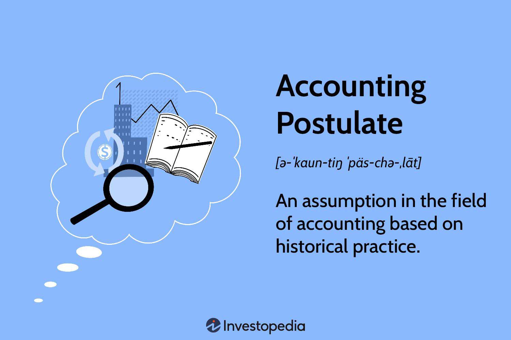

In the evolving financial landscape, accounting assumptions, financial reporting, and accounting principles form the foundation of transparent financial practices. These elements underpin the integrity and clarity of financial statements, guiding stakeholders in their decision-making processes. As financial markets become increasingly complex and technology-driven, the accuracy and reliability of these foundations have gained heightened importance. One notable advancement in this realm is algorithmic trading, where transactions are executed at speeds and volumes that are beyond human capability. This development underscores the need for precision in financial data, as even minor discrepancies can lead to significant financial implications.

Algorithmic trading, characterized by its use of automated systems to execute orders based on predefined strategies and algorithms, necessitates a robust framework of accounting principles. These algorithms rely on historical and real-time financial data to evaluate and capitalize on market opportunities within fractions of a second. Therefore, the underlying accounting processes must provide reliable and timely information. Any deviations or inaccuracies could result in flawed trading outcomes, affecting not only individual firms but also market stability.



This article explores the intersections of accounting assumptions, financial reporting, and accounting principles and their relevance in algorithmic trading. Understanding these concepts enhances decision-making, compliance with regulatory standards, and maintenance of competitive advantages in financial markets. By navigating the intricacies of accounting and its application in technology-driven trading platforms, businesses and traders can uphold the standards required for sustainable financial growth and stability. As the industry continues to advance, embracing these foundational elements ensures resilience and strategic agility in a competitive environment.

## Table of Contents

## Understanding Accounting Assumptions

Accounting assumptions are fundamental principles that provide the foundation for recording and presenting financial information in a standardized manner. These assumptions are vital for ensuring the consistency, comparability, and reliability of financial data, which are critical aspects of coherent financial reporting. 

One of the key accounting assumptions is the Going Concern assumption. This principle posits that a business will continue its operations into the foreseeable future without the intention or necessity to liquidate its assets. This assumption affects asset valuation and depreciation, suggesting that time-dependent valuations can proceed as planned without immediate adjustments for liquidation concerns.

The Monetary Unit assumption is another critical principle. It asserts that financial transactions should be recorded in a stable currency, thus providing a consistent monetary measurement unit across financial statements. This assumption disregards inflation or currency fluctuation effects, focusing instead on nominal currency values. It ensures that the financial data remains unaffected by external economic factors influencing currency value.

The Time Period assumption facilitates financial analysis by dividing operations into specific time intervals, such as quarters or fiscal years. This allows businesses to produce periodic reports that capture the financial performance and position over these defined intervals. By adhering to this assumption, stakeholders can compare financial data over time, enhancing their understanding of a company's operational trends.

Finally, the Business Entity assumption emphasizes treating a business as a separate entity distinct from its owners or other entities. This requires that the financial activities of the business be kept separate from personal expenditures of its owners. Consequently, financial statements reflect only the business activities, providing a clear, undistorted view of corporate performance.

Collectively, these assumptions provide a standardized framework that enhances the utility of financial statements. By applying these principles consistently, businesses can ensure their financial reporting is both reliable and compliant with established accounting standards, such as Generally Accepted Accounting Principles (GAAP) or International Financial Reporting Standards (IFRS). This framework supports effective decision-making by allowing stakeholders to compare and assess financial information on a like-for-like basis.

## The Role of Financial Reporting

Financial reporting serves as a fundamental channel through which a company communicates its financial performance and position to stakeholders, including investors, creditors, and regulatory bodies. This process involves the preparation and presentation of financial statements such as the balance sheet, income statement, and cash flow statement, which together provide a comprehensive view of a company's financial health.

To maintain integrity and uniformity, financial reporting adheres to established standards like the Generally Accepted Accounting Principles (GAAP) and International Financial Reporting Standards (IFRS). GAAP, applicable primarily in the United States, encompasses guidelines that ensure consistency, comparability, and reliability of financial reports. The IFRS, on the other hand, is followed in many countries around the globe, promoting transparency and comparability of financial data across international borders.

Effective financial reporting is pivotal in building and sustaining stakeholder trust. Accurate and transparent financial information allows stakeholders to assess a company’s performance, compare it with industry peers, and make informed decisions. For instance, investors rely on financial reports to evaluate profitability, assess risk, and determine the potential for future growth. Creditors use these reports to assess creditworthiness and the ability of the company to meet its financial obligations.

Moreover, financial reporting aids in compliance with regulatory requirements, minimizing legal risks and potential penalties. Companies are required to regularly disclose their financial activities and outcomes, ensuring all stakeholders have access to timely and relevant information.

In summary, financial reporting, through adherence to GAAP and IFRS, plays a crucial role in fostering transparency and accountability in financial markets. Its effectiveness not only supports stakeholder decision-making but also reinforces the credibility of financial institutions, facilitating a stable and efficient financial ecosystem.

## Accounting Principles and Their Application

Accounting principles form the foundation of financial accounting and reporting, providing a framework that ensures consistency, reliability, and comparability of financial statements. Among these principles, Revenue Recognition, Expense Recognition, and Historical Cost principles play a crucial role in shaping the preparation and presentation of financial data.

Revenue Recognition dictates the conditions under which income is recognized and realized as revenue. This principle ensures that revenue is recorded in the period in which it is earned, regardless of when the cash is received. The fundamental rule is that revenue must be earned and realizable to be recognized. For example, if a company delivers goods or services to a customer in December but receives payment in January, the revenue is recognized in December. This reflects the economic activity more accurately in the financial statements.

Expense Recognition, often referred to as the matching principle, is closely related to Revenue Recognition. It requires that expenses be recorded in the same period as the revenues they help to generate, thus achieving a match between revenues and their related expenses. This principle ensures that financial statements reflect the true economic performance of an entity. For instance, if a company incurs electricity costs in December for production activities that generated revenue in December, these costs should be recorded in December, irrespective of when the actual payment is made.

The Historical Cost principle mandates that assets are recorded at their original purchase price. This approach provides a clear and objective basis for asset valuation, avoiding the subjectivity and potential [volatility](/wiki/volatility-trading-strategies) associated with market value assessments. While historical cost does not reflect current market values, it offers consistency and verifiability, making it a cornerstone of reliable financial reporting.

These principles collectively ensure that financial statements are not only a reflection of past transactions but also a tool for future decision-making. They provide a 'true and fair view' of an entity's financial position by enforcing a structured and principled approach to financial reporting. For instance, the adherence to Revenue and Expense Recognition principles adds predictability to financial reporting, which is critical for stakeholders assessing the company's performance.

Moreover, consistent application of these principles is essential in practicing comparability amongst entities. This means investors and other stakeholders can more reliably compare financial statements from different companies, aiding intelligent investment and economic decisions.

In practice, accounting principles are not static; they evolve with business practices and regulatory environments. This adaptability helps ensure that the principles remain relevant and effective in providing a trustworthy financial portrayal of an entity, crucial for both internal and external stakeholders.

## Integration with Algorithmic Trading

Algorithmic trading, characterized by the use of algorithms to automate trading decisions, hinges on the accuracy and precision of financial data. This trading strategy involves high volumes and speeds, meaning that even minor discrepancies in financial information can lead to significant trading errors. Consequently, integrating accounting systems with trading platforms has become paramount for real-time data accuracy and compliance with accounting standards.

The integration facilitates several crucial functions. Firstly, it ensures that data related to financial transactions is processed and analyzed in real-time, thus providing accurate inputs for algorithmic models. With accurate financial data, algorithms can execute trades with optimized timing and pricing, reducing the risk of slippage and improving trade efficiency.

Moreover, compliance with accounting standards such as Generally Accepted Accounting Principles (GAAP) and International Financial Reporting Standards (IFRS) is essential for minimizing legal risks. The integration of accounting systems ensures that financial data adheres to these standards before being processed for trading.

Advanced accounting software plays a critical role in this integration. Such software is designed to handle real-time data processing and ensure data integrity across various platforms. Its capabilities often extend to the automation of data reconciliation, real-time reporting, and instant cross-checking of financial transactions against accounting standards.

For instance, the use of Python in developing trading algorithms can be further enhanced by leveraging libraries such as Pandas for data manipulation and NumPy for numerical computations. These tools allow for efficient data handling, ensuring that relevant financial data is accurately analyzed and utilized in trading strategies.

```python
import pandas as pd
import numpy as np

# Sample data processing for algorithmic trading
data = pd.read_csv('financial_data.csv')  # Load financial data
standard_compliant_data = data[data['compliance'] == True]  # Filter based on compliance

# Simulate trading model input
price_data = np.array(standard_compliant_data['price'])
volume_data = np.array(standard_compliant_data['volume'])

# Trading signal based on moving average
short_window = 20
long_window = 50
signals = pd.DataFrame(index=standard_compliant_data.index)
signals['signal'] = 0.0
signals['short_mavg'] = price_data.rolling(window=short_window, min_periods=1, center=False).mean()
signals['long_mavg'] = price_data.rolling(window=long_window, min_periods=1, center=False).mean()

signals['signal'][short_window:] = np.where(signals['short_mavg'][short_window:] > signals['long_mavg'][short_window:], 1.0, 0.0)
```

The code snippet above illustrates a basic financial data processing and trading signal generation scenario using Python. By ensuring the data is compliant and accurately processed, traders can enhance their [algorithmic trading](/wiki/algorithmic-trading) strategies' performance.

In conclusion, integrating accounting systems with algorithmic trading platforms is vital for maintaining data accuracy, ensuring regulatory compliance, and evaluating trading performance. As the financial environment continues to evolve with technological advancements, the seamless integration of these systems will be increasingly indispensable for staying competitive and ensuring accurate and reliable trading decisions.

## Challenges and Compliance

The fast-paced nature of algorithmic trading presents significant challenges in maintaining accurate financial records due to its inherent complexity and velocity. At the heart of this challenge is the requirement to adhere to regulatory standards like Generally Accepted Accounting Principles (GAAP) and International Financial Reporting Standards (IFRS). These standards are critical in minimizing legal risks and maintaining transparency. GAAP and IFRS provide a framework that ensures consistency, reliability, and comparability in financial reporting. Compliance with these standards is crucial to avoid financial misstatements that could lead to substantial legal and financial penalties.

Algorithmic trading often involves high-frequency transactions and complex financial instruments, leading to large volumes of data that must be accurately recorded and reported. Robust accounting systems are essential for managing these vast amounts of data, ensuring not only compliance but also operational efficiency. These systems need to be capable of real-time processing and integration with trading platforms to provide up-to-date financial information. This real-time capability supports the rapid decision-making process fundamental to algorithmic trading.

Moreover, evolving financial regulations necessitate continuous updates to accounting systems to ensure they remain compliant. Adapting to these changes requires a dynamic approach that incorporates advanced software capable of handling complex algorithms and managing data at scale. Machine learning and [artificial intelligence](/wiki/ai-artificial-intelligence) are increasingly employed to enhance data accuracy and regulatory compliance. For instance, Python's libraries such as Pandas and NumPy can be utilized to create algorithms that verify the accuracy and consistency of data, ensuring that all transactions adhere to accounting standards. Here's a simple Python example demonstrating how such verification might be coded:

```python
import pandas as pd

# Sample DataFrame of transactions
data = {
    'TransactionID': [1, 2, 3],
    'Amount': [1000, 2000, -500],
    'Description': ['Buy', 'Sell', 'Fee'],
    'Compliant': [True, True, False]  # Placeholder for compliance check
}

df = pd.DataFrame(data)

# Function to check compliance
def check_compliance(row):
    # Hypothetical check for compliance
    return row['Amount'] > 0 and row['Compliant']

# Apply compliance check
df['IsCompliant'] = df.apply(check_compliance, axis=1)

# Print non-compliant transactions
non_compliant = df[~df['IsCompliant']]
print(non_compliant)
```

In this example, transactions are evaluated for compliance based on hypothetical criteria. Such automated processes help ensure high accuracy levels in financial records, essential for maintaining the integrity of financial reporting in algorithmic trading environments. This automation and integration ultimately facilitate adherence to rigorous standards and regulations, thereby supporting the overall transparency and accountability in financial markets.

## Conclusion

The relationship between financial reporting, accounting theory, and algorithmic trading serves as a cornerstone for achieving precision and compliance within the financial sector. Financial reporting, governed by robust accounting principles and assumptions, provides the necessary transparency and reliability required for informed decision-making. When integrated effectively with algorithmic trading systems, these elements allow businesses to harness data-driven insights for strategic advantage.

By aligning financial reporting practices with the rapid advancements in technology that drive algorithmic trading, businesses can ensure real-time data processing and compliance with regulatory standards. This integration facilitates accurate and efficient handling of large volumes of transactions, characteristic of algorithmic trading environments. Moreover, it enhances the capacity to monitor and evaluate trading performance, thus supporting strategic decision-making processes.

To maintain a resilient and competitive position in the evolving financial markets, businesses must continuously adapt to technological innovations and regulatory changes. This involves deploying advanced accounting software capable of real-time data processing and adopting comprehensive internal controls and compliance measures. Embracing these advancements not only supports regulatory compliance but also fosters trust with stakeholders.

The continued intersection of financial reporting, accounting theory, and algorithmic trading will dictate future financial landscapes. Success lies in leveraging these components effectively to sustain competitiveness and resilience in the global marketplace.

## References & Further Reading

1. Charles H. Gibson's "Financial Reporting and Analysis: Using Financial Accounting Information" provides an in-depth examination of how financial information aids decision-making processes, emphasizing the importance of interpreting data correctly to ensure financial transparency and accuracy.

2. "Financial Statement Analysis and Security Valuation" by Stephen H. Penman offers a comprehensive perspective on analyzing and valuing companies through financial statements. The book discusses methodologies for translating financial reports into meaningful insights for investors and business analysts.

3. Barry Johnson's "Algorithmic Trading and DMA: An introduction to direct access trading strategies" explores the technical and strategic aspects of algorithmic trading. It discusses the implementation of trading algorithms and their integration with accounting principles for optimal trade execution and assessment.

4. The International Financial Reporting Standards (IFRS) offer a globally recognized set of accounting standards that ensure consistency, comparability, and transparency in financial reporting across different jurisdictions. The IFRS documentation provides a detailed guideline on the application of these standards.

5. Generally Accepted Accounting Principles (GAAP) resources offer a comprehensive set of accounting rules used primarily in the United States. GAAP ensures consistency and reliability in financial reporting, forming the foundation for regulatory compliance and stakeholder trust.

