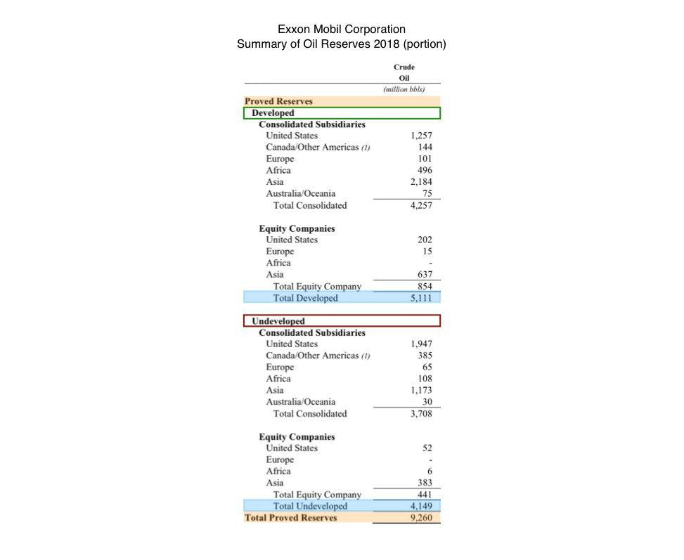

In the rapidly evolving financial landscape, understanding the intersection of balance sheet accounting practices, oil reserves, and algorithmic trading is vital. As global markets continue to integrate advanced technologies and explore sustainable growth models, integrating knowledge of these three areas becomes essential for market participants aiming to maintain a competitive edge. This article explores the crucial aspects of recording oil reserves on a balance sheet, the implications of accounting methods, and how algorithmic trading interacts with these elements.

Accounting practices determine how oil reserves—central to energy-dependent economies and industries—are represented in financial records. This representation profoundly influences financial reporting and shapes investor perceptions and decisions. Oil reserves are not recorded directly as assets until extraction; hence, the accounting approach adopted by a company can significantly impact its financial metrics and valuation, affecting its market position.



Algorithmic trading, which utilizes sophisticated algorithms to automate trade execution based on defined parameters, brings another layer of complexity to this financial equation. It enhances market efficiency by facilitating swift responses to financial data, including those derived from balance sheets and oil reserves disclosures. Traders increasingly rely on automated strategies to interpret economic indicators and financial reports, thereby influencing price volatility and market liquidity.

This article highlights industry practices and key trends affecting global markets, examining the intricate ways in which balance sheet accounting methods and algorithmic trading converge. Investors and companies are encouraged to engage with these dynamics to strategically position themselves in increasingly competitive markets, leveraging insights from accounting practices and technological advancements in trading for better decision-making.

## Table of Contents

## Understanding Oil Reserves on Balance Sheets

Oil reserves play a pivotal role in determining the valuation and performance of oil companies. They are often considered a major part of an oil company's potential assets. However, reserves are not directly counted as assets on the balance sheet until the actual extraction occurs, due to the accounting standards governing their treatment.

To account for oil reserves, companies mainly use two accounting methods: the successful efforts method and the full cost method.

1. **Successful Efforts Method**: This conservative approach mandates that only the costs associated with successful exploration efforts are capitalized. Costs from unsuccessful exploration activities are expensed immediately. As a result, this method reflects lower asset values and higher expenses on the balance sheet, thus potentially depressing short-term financial performance metrics. Investors might view companies using the successful efforts method as having a more cautious risk posture since they demonstrate explicit transparency in cost management.

2. **Full Cost Method**: Under this method, all exploration costs, whether successful or not, are capitalized into the asset base. By aggregating all exploration costs, this approach enables a broader asset base, potentially inflating the company’s apparent profitability and financial health in the short term. However, it can mask the real performance insight as it defers expenses over time, affecting comparability with firms using alternative methods.

The choice between these methods significantly influences the financial statements of oil companies. Under the successful efforts method, financial statements might reveal more [volatility](/wiki/volatility-trading-strategies) due to fluctuating expenses from unsuccessful projects. Conversely, the full cost method presents smoother income streams by spreading costs, even those associated with non-productive activities, over longer periods.

For investors, understanding these accounting practices is crucial. Companies employing the successful efforts method may be viewed as financially prudent with potentially less inflated earnings. Alternatively, those leveraging the full cost method might showcase robust short-term profits, driven by their comprehensive capitalization approach. Thus, the method chosen can impact investor perceptions, especially around the sustainability and accuracy of reported financial performance.

Investors and analysts assessing oil stocks must consider these accounting methods to gauge the underlying financial realities and potential risks within oil companies' reported figures. This understanding is vital for making informed investment decisions and aligning expectations with the genuine operational performance of these companies.

## Accounting Methods: Successful Efforts vs. Full Cost

In the oil industry, accounting methods significantly affect how companies report their financial health and profitability. Two primary methods for accounting in this sector are the Successful Efforts Method and the Full Cost Method. Each carries its implications and can influence investor perception and decision-making.

The Successful Efforts Method is known for its conservative approach. Under this method, only the costs associated with successful exploration efforts are capitalized on the balance sheet. This means that expenses related to failed exploration attempts are immediately expensed, potentially reducing reported income. This approach aligns with prudence, ensuring that only viable resources are reflected as assets, thereby providing a more cautious view of a company's asset base.

Conversely, the Full Cost Method offers a broader perspective by capitalizing all exploration costs, regardless of the outcome. By including both successful and unsuccessful exploration costs as part of the asset base, this method can inflate a company's financial metrics, such as total assets and profitability. While this might lead to a more optimistic depiction of financial health, it may also obscure the efficiency of capital allocation in exploration activities.

The choice between these methods can markedly affect a company's reported profitability. For instance, in periods of extensive unsuccessful exploration, the Successful Efforts Method might depict decreased profitability compared to the Full Cost Method, which spreads exploration costs over a broader base. This discrepancy can have significant implications for investors and analysts who rely on financial statements to guide their investment strategies.

Understanding the differences between these methods is essential for stakeholders evaluating oil company stocks. While the Successful Efforts Method might appeal to those favoring a conservative financial outlook, the Full Cost Method might attract investors seeking potential for higher reported earnings. Analysts must consider these accounting choices when assessing company valuations and making investment recommendations, as they can dramatically shift the perception of a company's financial strength and operational success.

## Algorithmic Trading in the Oil Industry

Algorithmic trading utilizes computer algorithms to execute trades based on predetermined criteria, a practice that has significantly influenced the oil industry. These algorithms are capable of analyzing vast amounts of balance sheet data, enabling traders to adjust their strategies in real-time in response to dynamic market conditions. In the context of the oil market, this capability is crucial due to the complex interplay of factors that influence oil prices, such as geopolitical events, supply-demand dynamics, and financial disclosures.

One of the key aspects where [algorithmic trading](/wiki/algorithmic-trading) impacts the oil market is in price volatility. Algorithms are designed to process information rapidly, allowing them to respond almost instantaneously to news, financial reports, and economic indicators. This response can result in rapid buying or selling, leading to increased price fluctuations. Algorithmic trading strategies, such as statistical [arbitrage](/wiki/arbitrage) or [momentum](/wiki/momentum) trading, exploit these price variations to generate profits. For example, an algorithm might identify a pricing anomaly caused by a sudden market shift and execute trades to capitalize on this short-term inefficiency.

Market [liquidity](/wiki/liquidity-risk-premium) is another area where algorithmic trading exerts influence. By enabling high-frequency trading, these algorithms increase the [volume](/wiki/volume-trading-strategy) of trades and narrow the bid-ask spreads, which generally enhances market liquidity. However, this can also contribute to liquidity crunches if many algorithms decide to withdraw from the market simultaneously, typically in response to adverse market information or high volatility levels.

Traders in the oil industry leverage algorithms not only to analyze real-time data but also to forecast future trends based on historical data patterns and economic indicators. These algorithms parse through financial reports, extracting critical insights about a company's performance, such as production levels, costs, and reserves recorded on their balance sheets. Economic indicators, such as changes in interest rates or GDP, are also factored into these trading models, providing a comprehensive view that helps traders anticipate market movements.

The integration of [machine learning](/wiki/machine-learning) techniques into algorithmic trading has further enhanced its precision and adaptability. Machine learning models can optimize trading strategies by learning from historical data, adapting to new market conditions, and enhancing predictive accuracy over time. Python, a popular programming language in financial modeling, offers libraries such as pandas and scikit-learn, which are extensively used to develop and refine these models. Here is a simple Python example using pandas to analyze historical oil price data:

```python
import pandas as pd
import numpy as np

# Sample historical oil price data
data = {
    'Date': pd.date_range(start='1/1/2020', periods=5, freq='D'),
    'Oil_Price': [50.5, 52.3, 51.7, 53.1, 54.0]
}

df = pd.DataFrame(data)

# Calculate daily returns
df['Return'] = df['Oil_Price'].pct_change()

# Calculate moving average
df['Moving_Avg'] = df['Oil_Price'].rolling(window=2).mean()

print(df)
```

This script calculates daily returns and a moving average, basic elements of momentum-based trading strategies. By employing more advanced models, traders can further enhance their trading algorithms, adapting to the intricate and fast-paced nature of the oil markets.

In conclusion, algorithmic trading in the oil industry plays a pivotal role in shaping market dynamics, influencing both price volatility and liquidity. The ability of algorithms to quickly process and react to financial reports and economic indicators underscores their importance in modern trading environments, offering traders a competitive edge through enhanced market responsiveness and strategic execution.

## The Intersection of Accounting Practices and Algo Trading

Algorithmic trading systems increasingly rely on comprehensive financial data, such as oil reserves information, to guide trading decisions. Accurate accounting of these reserves is pivotal because it shapes market perceptions and triggers automated trading responses. When companies report their financial data, algorithmic systems analyze this information, adjusting strategies based on perceived company performance and market conditions. 

The two predominant accounting methods—successful efforts and full cost—each influence how reserves are recorded, thereby impacting the financial data that algorithms scrutinize. The successful efforts method prioritizes a more conservative financial representation, only capitalizing costs associated with successful exploration efforts. Conversely, the full cost method aggregates all exploration costs, potentially offering a more extensive assessment of financial capabilities. 

For algorithmic trading systems, the choice between these accounting methods can be significant. Algorithms may interpret data from companies using the successful efforts method as indicative of a stable and risk-averse entity, while those using the full cost method might appear more aggressive or robust due to larger apparent asset bases. As algorithms process this information, trading decisions can reflect these perceptions, influencing market dynamics like liquidity and volatility.

Trusted financial reporting is essential in this context, as algorithmic strategies depend heavily on data accuracy. Erroneous or misleading financial statements can lead to substantial deviations in trading outcomes. High-quality financial reporting therefore ensures that algorithmic systems function as intended, supporting efficient market operations.

Understanding this intersection between accounting practices and algorithmic trading offers a competitive edge. Traders and investors who grasp these nuances can anticipate algorithm-driven market movements and adjust their strategies accordingly, optimizing for the best possible financial outcomes.

## Conclusion

Comprehending balance sheet practices, oil reserves accounting, and algorithmic trading holds paramount importance in today's financial market. These elements, though distinct, are intricately linked, significantly influencing investment strategies and financial outcomes. Effective balance sheet practices ensure transparency and reliability in financial reporting, which is crucial for accurately valuing oil reserves. The specific accounting methods employed, such as the successful efforts or full cost method, directly impact how oil reserves are recorded and perceived by investors. This affects a company’s reported profitability and financial health, essential for informed investment decisions.

Algorithmic trading, which relies on precise data points, can be influenced by the financial statements generated through these accounting methods. Algorithms may react to perceived changes in a company’s valuation due to fluctuating oil reserve recordings, thus affecting market dynamics and investor behavior. Understanding these relationships is vital; accurate accounting not only ensures regulatory compliance but also feeds reliable data into trading algorithms, thereby directly affecting market liquidity and volatility.

By mastering these complex areas, companies and investors can refine their decision-making processes. They can leverage accurate balance sheet data and understand its implications on algorithmic trading to craft effective investment strategies. This comprehensive understanding empowers stakeholders to navigate the challenging oil market and financial sector effectively, enhancing their ability to anticipate and respond to market shifts. Embracing these insights allows for more strategic positioning in a competitive environment, ultimately driving more informed and successful financial outcomes.

## References & Further Reading

[1]: Spear, N. A., & Leis, D. (1992). ["Accounting for Oil and Gas: An Overview."](https://www.semanticscholar.org/paper/Artificial-neural-networks-and-the-accounting-in-Spear-Leis/6326cdbfcd690653117fe0e5103a81ecb1817959) Journal of Business & Economic Research, 10(3).

[2]: Boyer, M., & Filion, D. (2007). ["Common and Fundamental Factors in Stock Returns of Canadian Oil and Gas Companies."](https://www.sciencedirect.com/science/article/pii/S0140988305001167) Energy Economics, 29(3), 428-453.

[3]: Koch, N., & Bassen, A. (2013). ["Valuing the Carbon Exposure of European Utilities: The Role of Fuel Mix, Permit Allocation, and Replacement Investments."](https://www.sciencedirect.com/science/article/pii/S0140988312002332) Journal of Business Ethics, 120(4), 533-545.

[4]: Hull, J. (2017). ["Options, Futures, and Other Derivatives."](https://elibrary.pearson.de/book/99.150005/9781292212920) Pearson.

[5]: Fabozzi, F. J., Focardi, S. M., & Jonas, C. (2014). ["Algorithmic and High-Frequency Trading."](https://www.semanticscholar.org/paper/Quantitative-Equity-Investing%3A-Techniques-and-Fabozzi-Focardi/1c49a2a53919f7e65cb96f16691b8ff726fd3cd7) John Wiley & Sons.