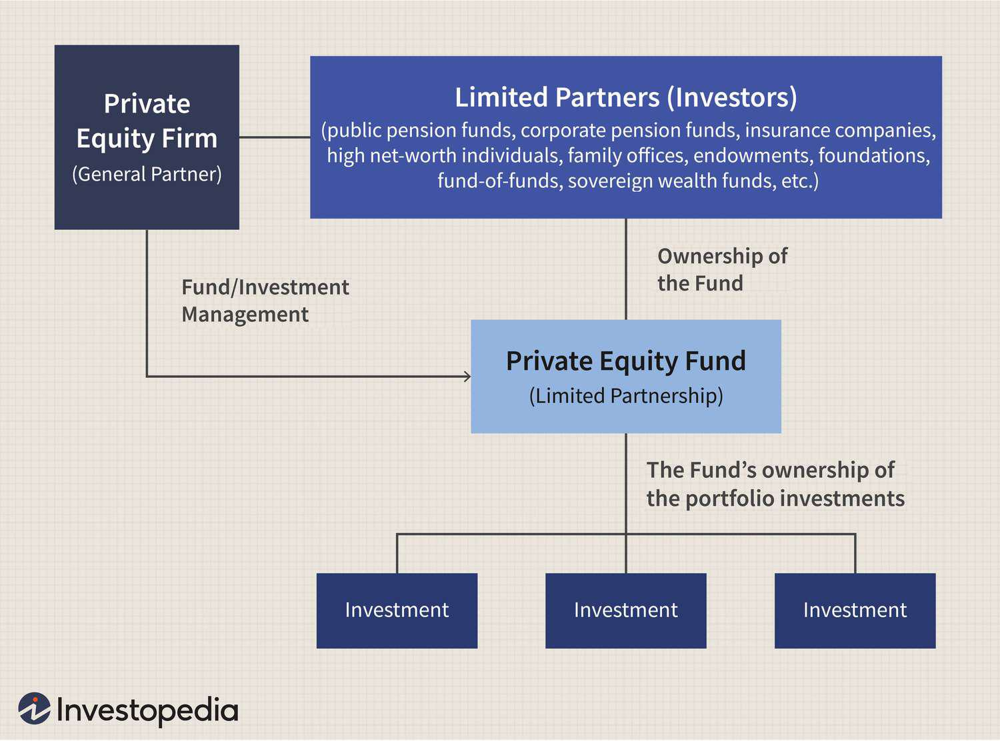

In today's dynamic financial landscape, understanding the intersection of accounting, investment funds, private equity, and algorithmic trading is crucial for both investors and financial professionals. These components play a vital role in shaping investment strategies and financial decision-making. As the financial market evolves, these interconnected sectors form a complex ecosystem that requires careful analysis and strategic integration for effective financial management and growth.

Accounting serves as the backbone, offering transparency and accuracy in financial reporting. It ensures the effective management of investment funds by providing critical insights into asset valuation, income distribution, and compliance with regulatory standards. Meanwhile, investment funds act as pools of capital from multiple investors, aiming to generate returns through diversified portfolios. They contribute to market stability and economic development by channeling resources into various sectors.



Private equity, with its focus on acquiring and managing private companies, fosters innovation and economic restructuring. It provides capital and strategic guidance to foster the growth and competitiveness of enterprises. The transformation driven by private equity is substantial, offering significant returns to investors while encouraging economic dynamism.

Algorithmic trading, on the other hand, revolutionizes investment strategies through the use of advanced algorithms and technology. By automating trading processes, it minimizes human error, processes vast datasets, and responds swiftly to market changes. This technology-driven approach not only enhances trading efficiency but also introduces challenges like increased market volatility and regulatory demands.

Understanding how these components interact allows investors and financial professionals to develop robust strategies and capitalize on emerging opportunities. The convergence of these fields highlights the importance of adapting to technological advancements and maintaining rigorous standards of financial management. As we explore their roles further, it becomes clear that these components are integral to navigating the modern financial landscape, offering insights and opportunities for strategic growth and sustainability.

## Table of Contents

## Understanding Accounting in Investment Funds

Accounting processes form the foundation for effective management of investment funds, offering transparency and integrity to both managers and investors. Accurate financial reporting is instrumental in evaluating fund performance and ensuring compliance with regulatory frameworks, such as the International Financial Reporting Standards (IFRS) and Generally Accepted Accounting Principles (GAAP). 

In investment funds, accounting involves the intricate tasks of asset valuation, income distribution, and expense allocation. Asset valuation requires the determination of the fair value of financial assets, which can be achieved through methods such as mark-to-market or mark-to-model approaches. These methods ensure that the assets of the fund are valued correctly, reflecting their real market value.

Income distribution is another critical area, involving the allocation of returns generated from the fund's investments to its investors. This function has to consider the various classes of shares if the fund comprises multiple classes, each with differing rights to income and capital returns.

Expense allocation involves distributing the costs associated with managing the fund—including management fees, administrative expenses, and transaction costs—proportionately among the investors. This procedure ensures that all costs are accurately reflected in the fund's financial statements and that investors are charged fairly according to the terms of the fund.

Advanced accounting practices empower fund managers to make informed investment decisions. Techniques such as financial modeling and scenario analysis allow for the assessment of potential investment risks and returns, aiding in strategic decision-making. For instance, managers might employ Python to develop models that simulate various market conditions and their potential impact on fund portfolios:

```python
import numpy as np

# Example of a Monte Carlo simulation for portfolio returns
def monte_carlo_simulation(initial_portfolio_value, expected_return, volatility, time_horizon, iterations):
    np.random.seed(42)
    simulated_values = []
    for _ in range(iterations):
        random_walk = np.cumsum(np.random.normal(expected_return / time_horizon, volatility / np.sqrt(time_horizon), time_horizon))
        simulated_values.append(initial_portfolio_value * np.exp(random_walk[-1]))
    return np.mean(simulated_values), np.std(simulated_values)

portfolio_value = 1000000  # Example starting portfolio value
expected_annual_return = 0.07  # Expected annual return
annual_volatility = 0.15  # Annual volatility
years = 10  # Time horizon in years
simulations = 10000  # Number of iterations

mean_simulated_value, std_deviation_value = monte_carlo_simulation(portfolio_value, expected_annual_return, annual_volatility, years, simulations)
```

Such models enhance the ability to predict fund performance, ultimately maintaining investor trust by ensuring transparency. The effective application of these advanced accounting practices builds a solid foundation for the fund's operation, essential for maintaining investor confidence and achieving the fund's investment objectives.

## The Role of Private Equity in Global Markets

Private equity (PE) has become an integral part of the global financial landscape, characterized by investments in private companies or the buyout and delisting of public companies. Through their investment strategies, private equity firms inject capital into businesses, driving innovation, corporate restructuring, and growth across various sectors. The mechanisms of private equity involve acquiring controlling or substantial stakes in businesses, often aiming to improve the financial performance and strategic positioning of these companies.

A key aspect of private equity is the strategic management techniques employed, which frequently lead to substantial returns for investors. These techniques include operational improvements, financial engineering, and market repositioning. For instance, PE firms typically focus on enhancing business efficiencies, cutting costs, and driving revenue growth to improve the valuation of portfolio companies.

Understanding the lifecycle of private equity investments is essential for comprehending their influence on global markets. The lifecycle typically consists of stages such as fundraising, investment phase, monitoring and management, and finally, [exit](/wiki/exit-strategy). Fundraising involves accumulating capital from investors such as institutional investors, high-net-worth individuals, and pension funds. In the investment phase, the firm identifies and acquires target companies. During the monitoring phase, PE firms actively engage with the management of these companies to implement strategic changes.

The exit phase is crucial, as it determines the returns to the investors. Exits can occur through various avenues such as initial public offerings (IPOs), sales to strategic buyers, or secondary sales to other private equity firms. Successful exits lead to capital appreciation and enhance the reputation of the private equity firm, encouraging future investments.

Private equity plays a vital role in economic development by providing a source of finance to businesses that may otherwise struggle to obtain funding through traditional means. By investing in potentially high-growth companies, PE firms facilitate job creation, innovation, and overall economic expansion. However, the sector is not without its challenges. Private equity must navigate regulatory pressures, market competition, and economic fluctuations that affect the valuation and profitability of investments.

Understanding these dynamics is essential for recognizing the role PE firms play in global markets. While they often operate in the background, private equity firms significantly influence the strategic direction and success of numerous industries, thereby shaping the broader economic landscape.

## Algorithmic Trading: Revolutionizing Investment Strategies

Algorithmic trading, often referred to as algo trading, encompasses the use of advanced algorithms and technology to [carry](/wiki/carry-trading) out trades with remarkable speed and efficiency. This methodology has significantly challenged and changed traditional investment strategies by providing pathways to maximize returns through rapid execution and data processing capabilities.

Algo trading systems operate by implementing pre-defined sets of instructions, which can account for variables such as timing, price, quantity, or any mathematical model. As a result, they can execute trades at frequencies unavailable to the human trader. By minimizing human intervention, [algorithmic trading](/wiki/algorithmic-trading) reduces the risk of errors caused by emotional or cognitive biases, thereby enhancing decision-making accuracy.

One of the core benefits of algorithmic trading is its ability to process and analyze vast datasets in real-time. This capability enables traders to make informed decisions by identifying patterns and trends that might not be discernible to the human eye. Such insights empower traders to respond swiftly to market fluctuations, optimizing the timing and outcomes of their trades.

However, the surge in algorithmic trading poses several challenges, notably contributing to market [volatility](/wiki/volatility-trading-strategies). The capacity for executing large volumes of trades in milliseconds can amplify systemic risks, as collective algorithmic responses can lead to rapid market swings. Consequently, this necessitates the development of stringent regulatory frameworks to monitor and control algorithmic trading activities, ensuring market stability and fairness.

The transformative impact of algorithmic trading becomes evident when considering its implications for the financial markets' future. For instance, high-frequency trading ([HFT](/wiki/high-frequency-trading-strategies)), a subset of algo trading, capitalizes on executing a high number of orders at extremely fast speeds, exploiting minute price discrepancies. This practice underscores the shift towards automation and precision in modern finance, altering how [liquidity](/wiki/liquidity-risk-premium) and pricing are understood within the market ecosystem.

Looking ahead, the integration of [artificial intelligence](/wiki/ai-artificial-intelligence) and [machine learning](/wiki/machine-learning) with algorithmic trading holds the promise of even greater sophistication in strategy development. As algorithms evolve to incorporate predictive analytics and adaptive learning, traders will be equipped to forecast and navigate complex market dynamics with enhanced precision.

In essence, algorithmic trading represents a pivotal shift in investment strategies, heralding a new era where technology-driven insights redefine financial operations. As these systems continue to mature, understanding and leveraging their capabilities will become crucial for market participants aiming to remain competitive and relevant in a rapidly changing financial landscape.

## Synergies Between Private Equity and Algorithmic Trading

Private equity (PE) and algorithmic trading, traditionally distinct fields within finance, are increasingly intersecting to yield innovative investment strategies. PE firms, known for their strategic long-term investments in private companies, are beginning to harness algorithmic tools to enhance various operational processes. By integrating advanced data analytics, these firms streamline decision-making processes and optimize deal sourcing, effectively reducing the time and resources traditionally required for these activities.

Algorithms play a crucial role in evaluating potential portfolio companies by processing vast datasets to identify promising investment prospects. Additionally, these tools assist in predicting market trends and managing risk. For instance, by employing predictive analytics, PE firms can foresee industry shifts and adjust their strategies accordingly. This capability is particularly beneficial in volatile market conditions, where timely and informed decisions are imperative.

The incorporation of algorithms enhances the agility of private equity operations, allowing firms to capitalize on market inefficiencies swiftly. For example, machine learning algorithms can identify undervalued assets or industries poised for growth, presenting PE firms with unique investment opportunities that might be overlooked by conventional analysis methods. By automating routine tasks, such as due diligence and financial modeling, algorithmic trading frees up human resources to focus on strategic decision-making and creative problem-solving.

The convergence of private equity and algorithmic trading represents a synergistic advancement that provides a competitive edge in the financial markets. This integration not only improves efficiency and accuracy in investment decisions but also positions PE firms to respond proactively to dynamic market conditions. In an increasingly digitized financial environment, the ability to leverage both traditional private equity expertise and cutting-edge algorithmic tools will likely define successful firms. Embracing this technological intersection presents substantial opportunities for growth and enhanced profitability while maintaining a robust risk management framework.

## The Impact of Accounting on Private Equity and Algo Trading

Accounting serves as a cornerstone in both private equity and algorithmic trading, influencing valuation and financial reporting. Its role is vital in ensuring transparency, accuracy, and compliance, which mitigates risks and enhances decision-making.

In the context of private equity, accounting is fundamental to the evaluation of investment opportunities and acquisition decisions. Precise financial modeling is critical for assessing the viability and potential return of investments. This involves intricate due diligence procedures, where detailed analysis of financial statements unveils the underlying value and risks of target companies. These evaluations often utilize Discounted Cash Flow (DCF) models to estimate the present value of future cash flows, ensuring that investors have a clear understanding of an investment's potential profitability and risk profile.

Algorithmic trading also relies heavily on robust accounting practices. Trading algorithms execute a high [volume](/wiki/volume-trading-strategy) of transactions every second, necessitating meticulous tracking of trades, profits, and losses. Accounting systems in algo trading are designed to handle this data with precision, supporting performance analysis and strategic adjustments. Proper reconciliation processes ensure that discrepancies between trade records and financial statements are promptly identified and addressed, maintaining the integrity of financial reporting.

To illustrate the application of accounting in algorithmic trading, consider the following Python snippet that demonstrates a simplified framework for tracking and analyzing trades. This code is not exhaustive but provides a basic structure for maintaining financial records in algorithmic trading:

```python
class Trade:
    def __init__(self, trade_id, amount, price, trade_type):
        self.trade_id = trade_id
        self.amount = amount
        self.price = price
        self.trade_type = trade_type  # 'buy' or 'sell'
        self.value = amount * price if trade_type == 'buy' else -amount * price

class Account:
    def __init__(self, balance=0):
        self.balance = balance
        self.trades = []

    def execute_trade(self, trade):
        self.trades.append(trade)
        self.balance += trade.value

    def calculate_profit_loss(self):
        return sum(trade.value for trade in self.trades)

# Example usage:
account = Account()
trade1 = Trade(trade_id="001", amount=10, price=100, trade_type='buy')
trade2 = Trade(trade_id="002", amount=5, price=110, trade_type='sell')

account.execute_trade(trade1)
account.execute_trade(trade2)

print("Current Balance:", account.balance)
print("Profit/Loss:", account.calculate_profit_loss())
```

This script tracks a series of trades and calculates the resulting profit or loss, a simplified but illustrative example of the accounting processes needed to manage financial data in algorithmic trading.

In both private equity and algorithmic trading, the integration of sophisticated accounting systems enhances the accuracy and quality of financial data. This is crucial for strategic planning and regulatory compliance, ultimately supporting the resilience and adaptability of financial operations. Through these practices, accounting stands as a pillar that supports the stable and informed growth of investment activities.

## Conclusion: Navigating the Future of Investment and Finance

The convergence of accounting, investment funds, private equity, and algorithmic trading fundamentally influences the contemporary finance landscape. A comprehensive understanding of these components is essential for investors and financial professionals to excel in a competitive market. The integration of technology within finance demands an evolving approach, emphasizing adaptability, innovation, and robust frameworks in accounting and investment practices.

As the financial sector advances, the interplay between these elements—accounting, investment funds, private equity, and algorithmic trading—will continue to shape market dynamics and create varied investment opportunities. Accounting provides the necessary transparency and accuracy, serving as a backbone for all financial decisions, while algorithmic trading introduces speed and efficiency to market transactions. Private equity's role in transforming companies calls for precise financial analysis, made more dynamic with the aid of algorithmic tools.

Future investment strategies are poised to increasingly rely on these advancements, offering substantial potential for growth, profitability, and sustainable investing. Embracing these elements equips stakeholders with the essential insights to navigate the financial landscape effectively, ensuring they stay ahead in a rapidly evolving environment. This paradigm shift not only enhances competitive advantages but also underscores the importance of embracing technology and refined accounting practices to support informed decision-making and enhance financial outcomes. 

In conclusion, the continual collaboration and integration of these financial constituents invite a forward-looking perspective, preparing the sector for emerging challenges and opportunities. The adaptability required in such an interconnected financial ecosystem ensures that investors and professionals are well-equipped for future growth trajectories.

## References & Further Reading

[1]: Purnanandam, A. (2004). ["Volatility and the Gains from Trade."](https://par.nsf.gov/servlets/purl/10383103) The Journal of Finance, 59(3), 1219-1255.

[2]: Moghrabi, I., & Alavi, A. (2014). ["Algorithmic Trading Strategies with MATLAB."](https://www.mathworks.com/matlabcentral/fileexchange/29489-algorithmic-trading-with-matlab-2010) Procedia Computer Science, 36, 124-131.

[3]: Lopez de Prado, M. (2018). ["Advances in Financial Machine Learning."](https://www.amazon.com/Advances-Financial-Machine-Learning-Marcos/dp/1119482089) John Wiley & Sons.

[4]: Metrick, A., & Yasuda, A. (2010). ["The Economics of Private Equity Funds."](https://web.stanford.edu/~piazzesi/Reading/MetrickYasuda2010.pdf) The Review of Financial Studies, 23(6), 2303-2341.

[5]: Grinold, R. C., & Kahn, R. N. (1999). ["Active Portfolio Management: A Quantitative Approach for Producing Superior Returns and Controlling Risk."](https://www.amazon.com/Active-Portfolio-Management-Quantitative-Controlling/dp/0070248826) McGraw Hill.