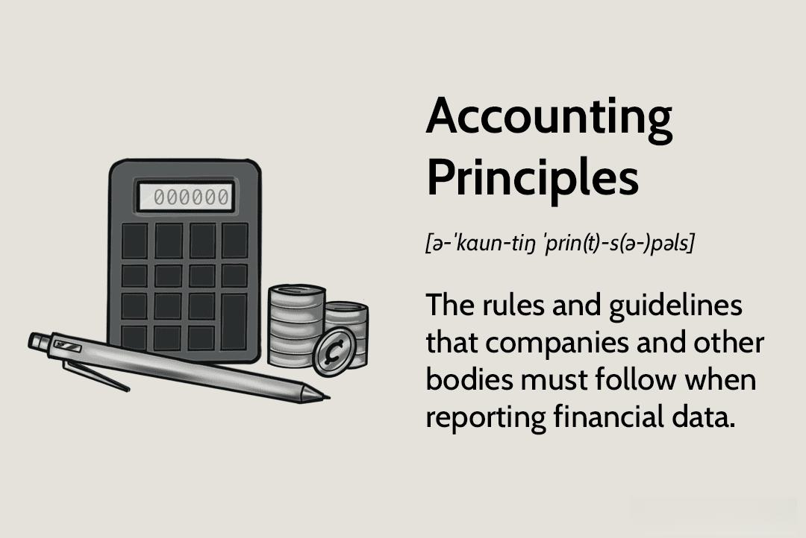

In the complex world of financial markets, accounting principles are fundamental for ensuring transparency and fairness. These principles, mainly structured around Generally Accepted Accounting Principles (GAAP) and International Financial Reporting Standards (IFRS), guide how financial data is documented and reported. As technology reshapes the economic landscape, the field of algorithmic trading has emerged, fundamentally altering how transactions are conducted. This development has made it imperative to comprehend how accounting standards interact with algorithmic trading systems to maintain the precision and reliability of financial reports.

Algorithmic trading utilizes sophisticated algorithms to execute trades at lightning speed, relying heavily on real-time financial information. With markets becoming increasingly swift and technology-driven, the importance of integrating robust accounting frameworks with these trading systems has grown significantly. This integration is pivotal in preventing discrepancies and ensuring the exactitude of financial reporting, even amidst the fast-paced nature of transactions.



A significant distinction between GAAP and IFRS lies in their inventory accounting principles, notably GAAP's allowance of the Last-In-First-Out (LIFO) method, contrasting IFRS's prohibition of it. These differences have tangible implications for algorithmic trading, affecting how companies manage and present inventory in financial statements and influencing investor decision-making.

This article investigates into these areas, assessing the continuing intersection of accounting standards and technological advancements in trading. By analyzing differences in approaches and implications for the world of algorithmic trading, we aim to highlight the need for adaptability in accounting practices to foster transparency and consistency in financial disclosures.

## Table of Contents

## Understanding Accounting Principles

Accounting principles are essential frameworks that govern how financial information is reported and communicated by organizations. They provide a standardized approach to financial reporting, ensuring that the financial statements produced are complete, consistent, and comparable. These principles form the foundation for assessing an organization’s financial performance and position.

Two primary frameworks dominate global financial reporting: Generally Accepted Accounting Principles (GAAP) and International Financial Reporting Standards (IFRS). GAAP, primarily used within the United States, is characterized by its rules-based approach. This framework provides detailed and specific guidelines for every aspect of financial accounting and reporting. Its prescriptive nature ensures a high degree of specificity, which can be advantageous for implementing detailed industry-specific standards.

On the other hand, IFRS is adopted by numerous countries worldwide and is principles-based. This framework offers a broader, more conceptual approach. Instead of detailed rules, IFRS provides overarching principles that prioritize economic substance over strict legal form. This flexible approach allows for the reflection of the true economic realities of transactions, promoting international comparability.

The core objective of both GAAP and IFRS is to improve the transparency and reliability of financial statements, thereby enhancing the usefulness of these reports for decision-making processes by investors, creditors, and other stakeholders. A critical aspect of these frameworks is their role in mitigating errors and increasing the comparability of financial information across different entities and jurisdictions.

Understanding the differences between GAAP and IFRS is crucial for accountants, investors, and financial analysts. These differences can significantly impact how financial results are reported and interpreted. For instance, certain methodologies and treatments of various accounting elements, like revenue recognition, expense matching, and asset valuation, differ between the two systems. This divergence can lead to variations in reported financial performance and position, influencing investment decisions and financial analysis.

In summary, accounting principles such as GAAP and IFRS provide necessary guidelines that ensure financial statements are reliable and useful for stakeholders. Despite their foundational differences in approach and application, both frameworks aim to uphold the integrity of financial reporting. This understanding is paramount for professionals engaged in financial statement analysis, preparation, and decision-making within the increasingly globalized business environment.

## Key Differences Between IFRS and GAAP

GAAP, primarily used in the United States, is characterized by its rules-based framework, offering detailed and prescriptive guidelines for financial reporting. IFRS, on the other hand, is principles-based, providing broader guidelines that allow more interpretive flexibility in financial reporting. A key area where these differences manifest is inventory accounting.

Under GAAP, companies have the option to use the Last-In-First-Out (LIFO) method for inventory valuation. LIFO assumes that the most recently acquired items are sold first, which can be advantageous for tax purposes in times of rising prices as it often results in lower taxable income. However, LIFO can lead to inventory valuations that do not represent current market conditions, which can reduce the representational faithfulness of financial reports. Consequently, IFRS prohibits the use of LIFO, promoting the First-In-First-Out (FIFO) method or the weighted-average cost method, both of which provide a clearer reflection of current inventory values and costs.

Another significant divergence between GAAP and IFRS concerns the treatment of inventory write-downs. IFRS allows for the reversal of inventory write-downs if the circumstances that led to the write-down change and the inventory recovers its value. This policy aligns with IFRS’s principles-based approach, which emphasizes the accurate reflection of an entity's financial position. Conversely, GAAP does not permit the reversal of inventory write-downs, adhering to a more conservative approach that prioritizes consistency and prudence over potential recovery scenarios.

These differences in inventory accounting and write-downs influence how companies report their inventory on financial statements. For example, a company using LIFO under GAAP may report lower inventory values compared to one using FIFO under IFRS during periods of inflation, affecting both its earnings reports and tax liabilities. This can have significant implications for investors and analysts, who rely on these reports to assess the financial health and performance of a company. Understanding these distinctions is crucial for stakeholders who need to interpret financial data within the context of varying accounting standards.

## Algorithmic Trading and Its Impact on Accounting

Algorithmic trading utilizes sophisticated computer algorithms to execute trades in financial markets automatically and at high speed. This trading methodology is heavily reliant on precise and real-time financial data to optimize trading strategies and investment outcomes. As such, accounting principles must evolve to meet the demands of [algorithmic trading](/wiki/algorithmic-trading), challenging traditional periodic reporting frameworks that are typically not designed for continuous real-time updates.

With the rapid execution of trades in algorithmic systems, the need for accurate and instantaneous financial reporting is paramount. Traditional accounting practices emphasize periodic reporting—usually on a quarterly or annual basis—which may not suffice in addressing the real-time data needs of algorithmic trading. Therefore, integrating accounting systems with algorithmic trading platforms is critical to ensuring that financial reporting remains accurate and consistent with the ongoing market transactions.

Effective integration requires leveraging technology to provide seamless connections between trading systems and accounting frameworks. For instance, using Application Programming Interfaces (APIs) allows for real-time data exchange between trading algorithms and accounting software. Here is an example of how such integration might be implemented in Python, demonstrating a basic interface for real-time data synchronization:

```python
import requests
import json

# Define the API endpoint for real-time trading data
trading_data_api = "https://api.tradingplatform.com/realtime"

def get_realtime_trading_data():
    """Fetch real-time trading data from the API"""
    response = requests.get(trading_data_api)
    if response.status_code == 200:
        return json.loads(response.content)
    else:
        raise Exception("Failed to retrieve trading data")

def update_accounting_system(trading_data):
    """Update the accounting system with the latest trading data"""
    for trade in trading_data:
        # Example integration logic: Update inventory and financial records
        print(f"Updating accounting records for trade ID: {trade['id']}")

# Run the synchronization process
try:
    trading_data = get_realtime_trading_data()
    update_accounting_system(trading_data)
except Exception as e:
    print(e)
```

The future of financial reporting in the context of algorithmic trading may also involve advanced data analytics and [machine learning](/wiki/machine-learning) algorithms to forecast financial outcomes and automate accounting tasks. These technologies can analyze trade data and generate reports, thus supporting the accounting system's need for real-time data processing and decision-making.

Overall, integrating algorithmic trading with accounting not only ensures the accuracy of financial reports but also enhances the decision-making process for investors and regulators by providing a transparent and consistent view of financial activities as they occur.

## Integration Challenges and Solutions

Combining GAAP and IFRS with algorithmic trading systems presents significant challenges, particularly in the areas of real-time reporting and maintaining data consistency. One primary issue involves the variation in inventory valuation methods across these accounting standards. Under GAAP, companies can use both the Last-In-First-Out (LIFO) and First-In-First-Out (FIFO) inventory methods, whereas IFRS restricts the use of LIFO due to its potential to distort a company's financial position. This difference can lead to inconsistencies in financial reporting, complicating the real-time data requirements inherent in algorithmic trading.

To address these challenges, organizations are increasingly turning to advanced technologies. Blockchain technology, with its decentralized ledger system, offers a solution for secure data sharing across platforms. By ensuring that data is transparent and immutable, blockchain can assist in maintaining consistency and reliability in financial reporting. For instance, a blockchain-based system could be designed to verify and record every transaction independently, ensuring that all parties have access to the same real-time updates. This can be especially helpful for algorithmic trading, which demands precise and instantaneous data.

Additionally, [artificial intelligence](/wiki/ai-artificial-intelligence) (AI) and machine learning provide substantial benefits by enabling predictive modeling in accounting practices. AI systems can dynamically adjust and analyze large volumes of financial data, spotting trends and anomalies that may impact trading decisions. Here is a basic example of how Python might be used to implement a simple algorithm for predictive analysis in inventory management:

```python
import numpy as np
from sklearn.linear_model import LinearRegression

# Sample data: historical inventory levels and sales figures
inventory_levels = np.array([[500], [450], [400], [350], [300]])
sales_figures = np.array([5, 4, 6, 7, 8])

# Creating and training the model
model = LinearRegression()
model.fit(inventory_levels, sales_figures)

# Predicting future sales based on future inventory level
future_inventory_level = np.array([[250]])
predicted_sales = model.predict(future_inventory_level)

print(f"Predicted sales for inventory level of 250 units: {predicted_sales[0]}")
```

This code snippet demonstrates a linear regression model predicting sales based on inventory levels, which could be a part of a more comprehensive AI strategy for inventory forecasting.

Blockchain and AI technologies are not just theoretical enhancements but are actively being integrated into financial systems to facilitate compliance with both GAAP and IFRS standards. This integration helps synchronize accounting and trading systems, enhancing the accuracy of financial data used in algorithmic trading. Using these technologies enables organizations to better meet the demands of real-time reporting, ultimately leading to more informed trading decisions and improved financial integrity.

## Future Trends and Convergence Efforts

The convergence of International Financial Reporting Standards (IFRS) and Generally Accepted Accounting Principles (GAAP) has been a focal point in the push towards global standardization of financial reporting. This movement aims to enhance comparability and transparency across international borders, thereby facilitating smoother capital flows and investment decisions.

One major discussion point in this convergence effort is the potential removal of the Last-In-First-Out (LIFO) inventory accounting method under GAAP. LIFO is currently prohibited under IFRS due to concerns about its representational faithfulness, as it can result in older inventory costs that are less relevant to current market conditions distorting financial statements. Should GAAP move towards eliminating LIFO, it would mark a significant step towards harmonizing inventory valuation methods across the two frameworks.

Another critical area of potential convergence involves the harmonization of definitions, such as Net Realizable Value (NRV). NRV is a crucial concept in determining the value of inventory and assets, influencing how gains or losses are reported. Aligning its definition across IFRS and GAAP would mitigate discrepancies in reporting that affect cross-border financial analysis and decision-making.

As algorithmic trading continues to gain [momentum](/wiki/momentum), the demands on financial reporting frameworks have increased, specifically regarding the need for real-time data integration and reporting. Algorithmic trading relies on the immediate availability and accuracy of data to function effectively, creating a challenge for traditional reporting frameworks that operate on a periodic basis. Moving towards a unified set of standards that supports technological advancements in real-time reporting would be advantageous. These changes would enable companies to better meet the needs of fast-paced trading environments while complying with both IFRS and GAAP requirements.

Overall, the convergence of IFRS and GAAP is not just about aligning current practices but also about adapting to future needs within the rapidly changing landscape of global finance. By simplifying international financial reporting standards, these efforts promise to provide significant benefits to global investors and companies, aiming for a future where financial information is universally understandable and comparable across international boundaries.

## Conclusion

Understanding the intersection of accounting principles with algorithmic trading is essential for ensuring coherent and transparent financial reporting. The current financial landscape is undergoing significant transformations driven by technological advancements, particularly the proliferation of algorithmic trading systems. These systems demand real-time data and continuous financial reporting, which necessitates new approaches in accounting practices.

The complexities associated with integrating Generally Accepted Accounting Principles (GAAP) and International Financial Reporting Standards (IFRS) within algorithmic frameworks require ongoing adjustments. Each set of standards has its distinct methodologies—GAAP is more rules-based, while IFRS follows a principles-based approach. This divergence necessitates continuous convergence efforts to unify these standards, which could facilitate international transactions and investments.

Organizations must strategically invest in modern technologies that support these evolving accounting requirements. Technologies such as blockchain can ensure secure, transparent data sharing, while artificial intelligence can provide predictive modeling and real-time data analysis. These tools are instrumental in supporting the dynamic needs of algorithmic trading, ensuring that financial data is accurate and timely.

By staying abreast of convergence efforts between GAAP and IFRS, as well as leveraging emergent technologies, companies can improve their financial operations significantly. This proactive approach ensures they maintain a competitive advantage in the fast-paced global market. The future of financial reporting lies in harmonizing accounting standards with technological capabilities, ultimately leading to more efficient, transparent, and reliable financial markets.

## References & Further Reading

[1]: ["Understanding IFRS Fundamentals: International Financial Reporting Standards"](https://www.amazon.com/Understanding-IFRS-Fundamentals-International-Financial/dp/0470399147) by Nandakumar Ankarath, Thomas McLaughlin and Khondkar E. Karim

[2]: ["Financial Accounting Theory and Analysis: Text and Cases"](https://books.google.com/books/about/Financial_Accounting_Theory_and_Analysis.html?id=oVKsDwAAQBAJ) by Richard G. Schroeder, Myrtle W. Clark, and Jack M. Cathey

[3]: ["International Financial Statement Analysis"](https://www.wiley.com/en-us/International+Financial+Statement+Analysis%2C+4th+Edition-p-9781119628057) by Thomas R. Robinson, Paul Munter, and Elaine Henry

[4]: ["Machine Learning for Asset Managers"](https://github.com/emoen/Machine-Learning-for-Asset-Managers) by Marcos Lopez de Prado

[5]: ["International GAAP 2021: Generally Accepted Accounting Practice under International Financial Reporting Standards"](https://www.econbiz.de/Record/international-gaap-2021-generally-accepted-accounting-practice-under-international-financial-reporting-standards-allen-cullum/10012405258) by Ernst & Young LLP