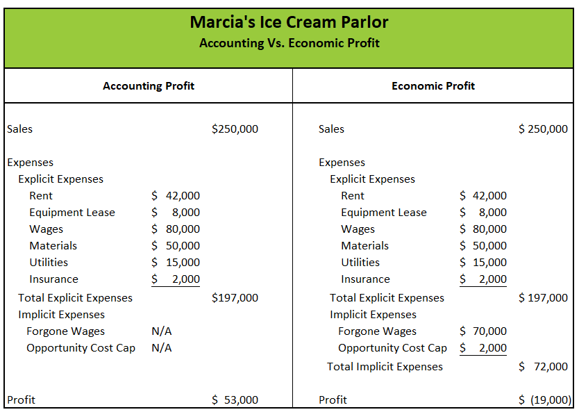

## Table of Contents

## What is accounting profit?

Accounting profit is the total revenue a business earns minus its explicit costs. Explicit costs are the direct, out-of-pocket expenses a business has to pay, like rent, wages, and materials. For example, if a business makes $100,000 in revenue and has $60,000 in explicit costs, its accounting profit would be $40,000. This number is important because it shows how much money the business has made after paying for its necessary expenses.

This type of profit is used in financial statements and is what most people think of when they talk about a company's profit. It's a key figure for business owners, investors, and tax authorities because it helps them understand the financial health of the business. However, accounting profit doesn't include opportunity costs, which are the potential benefits a business misses out on when choosing one option over another. So, while accounting profit is useful, it doesn't give the full picture of a business's profitability.

## How is accounting profit different from economic profit?

Accounting profit and economic profit are two ways to measure how well a business is doing, but they look at different things. Accounting profit is what you get when you take all the money a business makes and subtract the costs it has to pay, like rent, salaries, and supplies. This is the number you see on financial statements and tax returns. It's important because it shows if a business is making money after paying its bills.

Economic profit, on the other hand, goes a step further. It starts with the accounting profit but then subtracts something called opportunity costs. Opportunity costs are the benefits you miss out on by choosing one option over another. For example, if you could have earned more money by investing in something else instead of running your business, that lost potential income is an opportunity cost. So, economic profit shows if a business is truly profitable when you consider all the other things you could have done with your time and money. It's a more complete picture, but it's also harder to calculate and isn't usually shown on financial statements.

## What are the basic components needed to calculate accounting profit?

To calculate accounting profit, you need to know two main things: the total revenue and the explicit costs. Total revenue is all the money a business makes from selling its products or services. Explicit costs are the direct expenses a business has to pay, like rent, wages, and the cost of materials. You find the accounting profit by subtracting the explicit costs from the total revenue.

For example, if a business earns $100,000 from sales and has to pay $60,000 for rent, salaries, and supplies, the accounting profit would be $40,000. This number is important because it shows how much money the business has left after paying for its necessary expenses. It's used in financial statements and helps business owners, investors, and tax authorities understand the financial health of the business.

## Can you provide a simple example of how to calculate accounting profit for a small business?

Imagine you own a small bakery. In one month, you make $5,000 from selling cakes and cookies. This is your total revenue. To run your bakery, you have to pay for things like rent, ingredients, and your staff's salaries. Let's say these costs add up to $3,000 for the month. These are your explicit costs.

To find out your accounting profit, you subtract your explicit costs from your total revenue. So, you take $5,000 (your revenue) and subtract $3,000 (your costs). This leaves you with $2,000. That $2,000 is your accounting profit for the month. It shows how much money your bakery made after paying for all the things it needed to operate.

## What are common revenue sources included in accounting profit calculations?

Revenue sources for accounting profit calculations can come from many places. For a business, the main source is usually the money made from selling products or services. For example, a store makes money by selling clothes, and a restaurant earns revenue from selling meals. Other common sources include income from renting out property, interest earned on savings or investments, and money made from selling assets like equipment or vehicles.

Sometimes, businesses also earn money from less obvious places. They might get royalties from licensing their brand or technology to others. They could also earn from commissions if they help sell someone else's products. All these different types of income are added together to find the total revenue, which is then used to calculate the accounting profit by subtracting the costs of running the business.

## What types of expenses are typically subtracted when calculating accounting profit?

When calculating accounting profit, you subtract the costs that a business has to pay to run its operations. These costs are called explicit costs. They include things like rent for the building where the business operates, salaries for employees, and the cost of materials or supplies needed to make products or provide services. For example, a bakery would include the cost of flour, sugar, and other ingredients in its explicit costs.

Other common explicit costs are utilities like electricity and water, insurance to protect the business, and any fees for services like accounting or legal help. If a business uses vehicles or equipment, the costs to maintain and repair them are also included. Marketing and advertising expenses, like the cost of running ads or creating a website, are another type of explicit cost that businesses subtract when figuring out their accounting profit.

## How does depreciation affect accounting profit?

Depreciation is a way to spread out the cost of big things a business buys, like machines or buildings, over the time they are used. Instead of counting the whole cost of these items in the year they are bought, businesses subtract a smaller amount each year. This smaller amount is called depreciation expense. When you calculate accounting profit, you subtract this depreciation expense from your total revenue, just like you do with other costs.

Including depreciation in the calculation of accounting profit helps show a more accurate picture of how much money the business is making each year. It makes sure that the cost of using big items is spread out over their useful life, rather than all at once. This way, the accounting profit reflects the true cost of running the business over time, not just in the year the big items were bought.

## What role do taxes play in the calculation of accounting profit?

Taxes are not directly subtracted when calculating accounting profit. Accounting profit is found by taking the total revenue a business makes and subtracting the costs it has to pay, like rent, salaries, and supplies. These costs are called explicit costs. Taxes, on the other hand, are calculated based on the accounting profit. So, you figure out the accounting profit first, and then you use that number to find out how much tax the business has to pay.

After calculating the accounting profit, the business will use it to determine its taxable income. The government then applies the tax rate to this taxable income to find out how much tax the business owes. This tax amount is not part of the accounting profit calculation itself, but it is important because it affects the net income, which is the money left after all expenses, including taxes, are paid. So, while taxes don't directly affect the accounting profit, they do impact the overall financial health of the business.

## How can accounting profit be used to assess a company's financial health?

Accounting profit is a key number that helps people see how well a company is doing financially. It shows how much money a company makes after paying for things like rent, salaries, and supplies. If a company has a high accounting profit, it means they are making more money than they are spending, which is a good sign. Business owners, investors, and even banks look at this number to decide if the company is doing well or if it might need help.

But accounting profit is just one part of the picture. It doesn't tell you everything about a company's financial health. For example, it doesn't include the cost of missed opportunities, like what the company could have earned if it had used its money differently. Also, a company might have a high accounting profit but still have a lot of debt or other problems. So, while accounting profit is important, it's best to look at it along with other financial information to really understand how healthy a company is.

## What are some limitations of using accounting profit as a performance metric?

Accounting profit is a good way to see how much money a business makes after paying for things like rent and salaries. But it has some problems. One big problem is that it doesn't count opportunity costs. These are the benefits a business misses out on by choosing one thing over another. For example, if a business owner could have made more money by investing in something else instead of running the business, accounting profit won't show that lost money. So, it might make a business look more profitable than it really is.

Another issue is that accounting profit can be affected by how a business decides to handle its costs. For example, a business might choose to spread out the cost of big items like machines over several years, which is called depreciation. This can make the accounting profit look different from year to year, even if the business is doing the same amount of work. Also, accounting profit doesn't show if a business is growing or if it has a lot of debt. So, while it's useful, it's not the whole story about how well a business is doing.

## How do adjustments for non-cash items impact the calculation of accounting profit?

Adjustments for non-cash items, like depreciation, can change the accounting profit. Depreciation is when a business spreads out the cost of big things it buys, like machines or buildings, over the time they are used. Instead of counting the whole cost in the year the item is bought, the business subtracts a smaller amount each year. This smaller amount is called depreciation expense. When you calculate accounting profit, you subtract this depreciation expense from your total revenue, just like you do with other costs. So, even though no actual money is spent on depreciation, it still lowers the accounting profit.

These adjustments help show a more accurate picture of how much money the business is making each year. By spreading out the cost of big items over their useful life, the accounting profit reflects the true cost of running the business over time, not just in the year the big items were bought. This way, the accounting profit gives a better idea of the business's financial health, even though it's affected by these non-cash items.

## Can you explain how accounting profit is reported in financial statements and its significance for stakeholders?

Accounting profit is shown in a company's financial statements, especially in the income statement. The income statement lists all the money a company makes, called revenue, and all the money it spends, called expenses. When you take the total revenue and subtract the expenses, you get the accounting profit. This number is important because it tells everyone how much money the company made after paying for things like rent, salaries, and supplies. People like business owners, investors, and banks look at this number to see if the company is doing well.

Stakeholders use accounting profit to make decisions about the company. For example, investors might decide to buy or sell the company's stock based on how high or low the accounting profit is. If the profit is high, it might mean the company is doing well and could be a good investment. Business owners use this number to see if their business is making enough money to keep going or if they need to make changes. Banks might look at accounting profit to decide if they should lend money to the company. Even though accounting profit is just one part of the financial picture, it's a key piece of information that helps stakeholders understand the company's financial health.

## What is Understanding Accounting Profit?

Accounting profit is a fundamental measure of a company's financial performance, calculated in accordance with Generally Accepted Accounting Principles (GAAP). It is determined by subtracting explicit costs from total revenue and represents the net income available to stakeholders. Explicit costs include all monetary expenditures necessary for operating the business, such as operating expenses, depreciation, interest, and taxes. Understanding these components is essential for businesses to assess their financial health accurately.

Operating expenses encompass the routine costs incurred during business operations, including salaries, rent, utilities, and administrative expenses. These costs are crucial for the day-to-day functioning of a company and are deducted from revenue to determine operating profit.

Depreciation is the systematic allocation of an asset's cost over its useful life. It reflects the wear and tear of physical assets such as machinery, vehicles, and buildings. Depreciation is a non-cash expense that impacts net income by reducing taxable income while providing a more accurate picture of asset value over time.

Interest expenses arise from borrowed capital. Companies often leverage debt to finance operations or expansions, and the interest on this debt is a deductible expense. Accurate calculation of interest expenses is vital for understanding the true cost of borrowing and its impact on profitability.

Taxes represent obligatory payments to the government based on income, and they significantly influence net income. Accounting profit is calculated post-tax, making it a crucial indicator for comparing profitability across different companies and industries while ensuring compliance with tax regulations.

The formula for calculating accounting profit can be expressed as:

$$
\text{Accounting Profit} = \text{Total Revenue} - (\text{Operating Expenses} + \text{Depreciation} + \text{Interest} + \text{Taxes})
$$

By thoroughly analyzing these components, businesses can gauge their financial health effectively, enabling informed decision-making and strategic planning. Accounting profit serves as a critical benchmark for financial reporting, providing stakeholders with an understanding of a company's profitability and operational efficiency.

## What is the difference between Accounting Profit and Economic Profit?

Accounting profit and economic profit are vital concepts in financial analysis, each serving a distinct purpose. Accounting profit, often referred to as net income, is derived from the traditional accounting framework known as Generally Accepted Accounting Principles (GAAP). It calculates the profit by subtracting explicit costs from the total revenue. These explicit costs include operating expenses, depreciation, interest, and taxes. Accounting profit is used primarily for financial reporting and provides a clear picture of a company's financial performance over a specific period. It is expressed as:

$$
\text{Accounting Profit} = \text{Total Revenue} - \text{Explicit Costs}
$$

In contrast, economic profit takes the analysis a step further by incorporating implicit costs, such as opportunity costs, into the calculation. Opportunity costs represent the potential benefits an entity misses out on when choosing one alternative over another. Economic profit is theoretical and aids in managerial decision-making by showcasing the true profitability of a venture, factoring in all costs, both explicit and implicit. The formula for economic profit is:

$$
\text{Economic Profit} = \text{Total Revenue} - (\text{Explicit Costs} + \text{Implicit Costs})
$$

While accounting profit is crucial for financial statements, economic profit provides insights that can influence strategic decisions, such as entering new markets or discontinuing a product line. For example, a business may report a positive accounting profit while experiencing an economic loss if the implicit costs exceed the net income. Thus, economic profit serves as a critical tool for evaluating the long-term viability and strategic positioning of a business. 

Understanding the distinction between these two types of profit allows businesses and analysts to assess the complete financial picture and make better-informed decisions. By acknowledging both explicit and implicit costs, companies can enhance their strategic planning, resource allocation, and ultimately, their overall efficiency and profitability.

## What is an Example of Accounting Profit Calculation?

Consider a manufacturing company that produces and sells widgets. To calculate the accounting profit, it is essential to first determine the firm's revenue, cost of goods sold (COGS), and operating expenses. These elements form the backbone of the income statement and allow for the computation of net income, which represents the accounting profit.

**1. Determine Revenue**

Revenue is the total income generated from the sale of goods or services. For instance, if the company sells 10,000 widgets at $20 each, the revenue can be calculated as:

$$
\text{Revenue} = \text{Price per widget} \times \text{Number of widgets sold}
$$

$$
\text{Revenue} = 20 \times 10,000 = \$200,000
$$

**2. Calculate Cost of Goods Sold (COGS)**

COGS represents the direct costs attributable to the production of the goods sold. This may include raw materials and direct labor costs. Suppose the COGS for one widget is $8, then:

$$
\text{COGS} = \text{COGS per widget} \times \text{Number of widgets sold}
$$

$$
\text{COGS} = 8 \times 10,000 = \$80,000
$$

**3. Identify Operating Expenses**

Operating expenses are the costs required to run the company that is not directly tied to the production of goods. These typically include salaries, rent, utilities, and administrative expenses. Assume the company incurs $50,000 in operating expenses.

**4. Compute Gross Profit**

Gross profit is calculated by subtracting COGS from revenue.

$$
\text{Gross Profit} = \text{Revenue} - \text{COGS}
$$

$$
\text{Gross Profit} = 200,000 - 80,000 = \$120,000
$$

**5. Calculate Operating Profit (EBIT)**

Operating Profit, also known as Earnings Before Interest and Taxes (EBIT), is derived by subtracting operating expenses from gross profit.

$$
\text{Operating Profit (EBIT)} = \text{Gross Profit} - \text{Operating Expenses}
$$

$$
\text{Operating Profit (EBIT)} = 120,000 - 50,000 = \$70,000
$$

**6. Determine Net Income (Accounting Profit)**

Finally, accounting profit, or net income, can be determined by subtracting any interest and taxes from the operating profit. Suppose there is $5,000 in interest expenses and a corporate tax rate of 30%.

First, calculate taxable income:

$$
\text{Taxable Income} = \text{Operating Profit} - \text{Interest Expenses}
$$

$$
\text{Taxable Income} = 70,000 - 5,000 = \$65,000
$$

Next, calculate taxes:

$$
\text{Taxes} = \text{Taxable Income} \times \text{Tax Rate}
$$

$$
\text{Taxes} = 65,000 \times 0.30 = \$19,500
$$

Finally, calculate net income:

$$
\text{Net Income} = \text{Taxable Income} - \text{Taxes}
$$

$$
\text{Net Income} = 65,000 - 19,500 = \$45,500
$$

Thus, the accounting profit for the manufacturing company is $45,500. This calculation provides insight into the financial health of the business by showing the profit after all costs and taxes have been accounted for, remaining consistent with Generally Accepted Accounting Principles (GAAP).

## What is Algorithmic Trading and how is Profit Measured in it?

Algorithmic trading, also known as algo trading, employs sophisticated algorithms to execute trading decisions systematically and rapidly. This approach leverages advanced mathematical models and computational resources to automate the trading process, allowing for swift calculation of profits or losses.

Gross profit in [algorithmic trading](/wiki/algorithmic-trading) is a crucial metric for evaluating the operational efficiency of a trading strategy. It is defined as the difference between the total revenue from executed trades and the cost of executing these trades, which includes transaction fees, slippage, and other related expenses. In mathematical terms, it can be expressed as:

$$
\text{Gross Profit} = \sum (\text{Selling Price} - \text{Buying Price} - \text{Transaction Costs})
$$

Where each component is carefully calculated across all trades executed by the algorithm.

One of the significant advantages of algorithmic trading is its ability to minimize human emotions in trading, thereby maximizing precision and consistency in trade execution. Human traders are often subject to emotional biases that can influence decision-making, such as fear of losses or the excitement of gains. These emotions can lead to irrational trading decisions, such as closing a position prematurely or holding onto a losing trade in the hope of a reversal.

Conversely, algorithms operate based on predefined rules and criteria, devoid of emotional influence. They can backtest historical data to optimize trading strategies and execute trades based on statistical and mathematical principles. This leads to improved trade execution, as algorithms can respond almost instantaneously to market conditions, making decisions based on data-driven insights rather than gut feeling.

By employing algorithms in trading, practitioners can also perform advanced computations like real-time risk assessment and portfolio rebalancing, providing a more structured approach to trading. These capabilities enable not only rapid profit calculation but also real-time adaptation to market dynamics, enhancing overall trading efficiency and profitability.

## How is profit calculated in algo trading strategies?

In algorithmic trading, evaluating the effectiveness of trading strategies involves the use of various tools and metrics, primarily focusing on historical data [backtesting](/wiki/backtesting). Backtesting is a method where a trading strategy is tested using historical data to assess its viability. This process helps traders understand how a strategy might perform in real-time markets, providing crucial insights before actual capital is placed at risk.

Key metrics utilized in algo trading strategy evaluation include:

1. **Gross Profit**: This metric is the total profit earned from trades before any costs or expenses are deducted. Gross profit helps traders determine the overall profitability of their strategy. It is calculated as follows:
$$
   \text{Gross Profit} = \sum (\text{Selling Price of Assets} - \text{Purchase Price of Assets})

$$

2. **Sharpe Ratio**: This is a measure of risk-adjusted return, indicating how much excess return a trading strategy provides for each unit of risk undertaken. A higher Sharpe Ratio implies better risk-adjusted performance. It is calculated as:
$$
   \text{Sharpe Ratio} = \frac{E[R_p - R_f]}{\sigma_p}

$$

   Where $E[R_p]$ is the expected return of the portfolio, $R_f$ is the risk-free rate, and $\sigma_p$ is the standard deviation of the portfolio's excess return.

3. **Maximum Drawdown**: This metric measures the largest single drop from peak to trough in the portfolio's value, expressed as a percentage. It highlights the potential risk and capital preservation concerns a strategy involves. Calculating maximum drawdown involves identifying the highest peak in portfolio value and the subsequent trough:
$$
   \text{Maximum Drawdown} = \frac{\text{Peak Value} - \text{Trough Value}}{\text{Peak Value}}

$$

Accurate profit calculation plays a pivotal role in refining and optimizing trading strategies. By thoroughly measuring profits and losses with these metrics, traders can adjust their strategies to improve efficiency and minimize adverse risks. Optimization often involves tweaking the strategy parameters, enhancing algorithms based on feedback from backtesting results, and consistently monitoring market conditions to adapt dynamically.

Python is widely used to perform these evaluations due to its robust libraries such as Pandas for data manipulation, NumPy for numerical operations, and specialized libraries like TA-Lib for technical analysis. For instance, calculating the Sharpe Ratio in Python might involve:

```python
import numpy as np

def calculate_sharpe_ratio(returns, risk_free_rate=0.0):
    excess_returns = returns - risk_free_rate
    return np.mean(excess_returns) / np.std(excess_returns)

# Example usage with historical returns data
historical_returns = np.array([0.01, 0.005, -0.002, 0.003, 0.007])
sharpe_ratio = calculate_sharpe_ratio(historical_returns, risk_free_rate=0.001)
print(f"Sharpe Ratio: {sharpe_ratio}")
```

Utilizing these methods and tools allows traders to derive meaningful insights from past performance, which serves as a basis for strategic enhancements and better-informed decision-making in future trades.

## What are examples of profit/loss ratios in algo trading?

Algorithmic trading systems often utilize profit-to-loss ratios, commonly known as the profit [factor](/wiki/factor-investing), as a crucial metric in evaluating trading efficiency. The profit-to-loss ratio is defined as the ratio of gross profit to gross loss over a series of trades. A higher ratio indicates a more favorable balance between successful trades and losing trades, thus serving as a key indicator of the strategy's effectiveness.

### Mathematical Representation
The profit factor can be expressed mathematically as:

$$
\text{Profit Factor} = \frac{\text{Total Profit from Winning Trades}}{\left| \text{Total Loss from Losing Trades} \right|}
$$

### Python Example
To illustrate the calculation and application of profit-to-loss ratios in adjusting trading performance, consider a simple Python example:

```python
def calculate_profit_factor(winning_trades, losing_trades):
    total_profit = sum(winning_trades)
    total_loss = abs(sum(losing_trades))

    if total_loss == 0:
        return float('inf')  # Handle division by zero

    profit_factor = total_profit / total_loss
    return profit_factor

# Example trades
winning_trades = [500, 300, 150]  # Profits from winning trades
losing_trades = [-200, -100]      # Losses from losing trades

profit_factor = calculate_profit_factor(winning_trades, losing_trades)
print(f"The Profit Factor is: {profit_factor}")
```

### Insights from Profit Factor
- **Adjustment of Strategies**: A profit factor greater than one indicates a profitable strategy, while a value less than one suggests the need for strategy reevaluation. Traders can use this feedback to adjust parameters such as entry/exit criteria or stop-loss levels to enhance performance.
- **Comparing Strategies**: By comparing profit factors across different strategies, traders can identify the most, and least, effective approaches. This allows for strategic reallocations of capital to optimize overall returns.
- **Risk Assessment**: The profit factor also aids in assessing the risk associated with a trading strategy by highlighting the balance between profit and potential loss.

By employing profit-to-loss ratios, algorithmic traders can better understand the dynamics of their strategies and make informed adjustments to bolster trading performance.

## References & Further Reading

[1]: ["Advances in Financial Machine Learning"](https://www.amazon.com/Advances-Financial-Machine-Learning-Marcos/dp/1119482089) by Marcos Lopez de Prado

[2]: ["Evidence-Based Technical Analysis: Applying the Scientific Method and Statistical Inference to Trading Signals"](https://www.amazon.com/Evidence-Based-Technical-Analysis-Scientific-Statistical/dp/0470008741) by David Aronson

[3]: ["Machine Learning for Algorithmic Trading"](https://github.com/stefan-jansen/machine-learning-for-trading) by Stefan Jansen

[4]: ["Quantitative Trading: How to Build Your Own Algorithmic Trading Business"](https://www.amazon.com/Quantitative-Trading-Build-Algorithmic-Business/dp/1119800064) by Ernest P. Chan

[5]: Bergstra, J., Bardenet, R., Bengio, Y., & Kégl, B. (2011). ["Algorithms for Hyper-Parameter Optimization."](https://dl.acm.org/doi/10.5555/2986459.2986743) Advances in Neural Information Processing Systems 24.