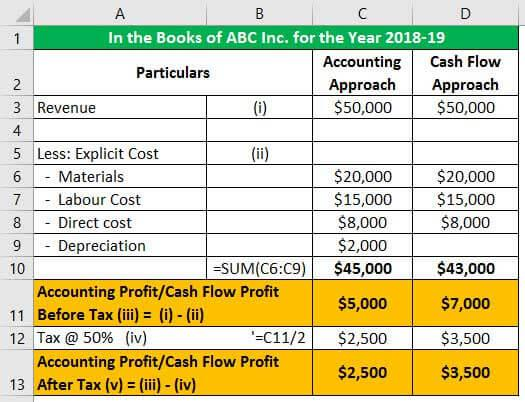

In today's complex financial markets, understanding how to accurately calculate profit is essential for market participants. This is true whether one is engaged in traditional trading or utilizing sophisticated algorithmic trading methods. As financial markets become more competitive and intricate, traders and analysts benefit significantly from a robust comprehension of profit calculation techniques. Effective profit assessment not only aids in evaluating financial health but also guides strategic decision-making, ultimately leading to optimized performance.

This article explores the concept of accounting profit, which is calculated in accordance with the Generally Accepted Accounting Principles (GAAP). Accounting profit is a critical measure used to assess a company's financial performance by considering all explicit costs, such as operating expenses, depreciation, interest, and taxes. For financial analysts and traders, understanding accounting profit is paramount for scrutinizing financial statements and assessing a company's viability.



While accounting profit serves as a fundamental metric for financial reporting, its significance is particularly notable in the context of algorithmic trading strategies. Algorithmic trading, which employs complex algorithms to execute trades based on predefined criteria, necessitates accurate profit calculation to evaluate performance accurately and ensure operational efficiency. With the rapid pace and high stakes associated with algo trading, precise profit measurement can significantly impact trading outcomes by minimizing human error and enhancing strategic precision. Therefore, grasping both accounting and algo trading profit calculations is indispensable for financial analysts in today's evolving market landscape, enabling them to make more informed and strategic trading decisions.

## Table of Contents

## Understanding Accounting Profit

Accounting profit is a fundamental measure of a company's financial performance, calculated in accordance with Generally Accepted Accounting Principles (GAAP). It is determined by subtracting explicit costs from total revenue and represents the net income available to stakeholders. Explicit costs include all monetary expenditures necessary for operating the business, such as operating expenses, depreciation, interest, and taxes. Understanding these components is essential for businesses to assess their financial health accurately.

Operating expenses encompass the routine costs incurred during business operations, including salaries, rent, utilities, and administrative expenses. These costs are crucial for the day-to-day functioning of a company and are deducted from revenue to determine operating profit.

Depreciation is the systematic allocation of an asset's cost over its useful life. It reflects the wear and tear of physical assets such as machinery, vehicles, and buildings. Depreciation is a non-cash expense that impacts net income by reducing taxable income while providing a more accurate picture of asset value over time.

Interest expenses arise from borrowed capital. Companies often leverage debt to finance operations or expansions, and the interest on this debt is a deductible expense. Accurate calculation of interest expenses is vital for understanding the true cost of borrowing and its impact on profitability.

Taxes represent obligatory payments to the government based on income, and they significantly influence net income. Accounting profit is calculated post-tax, making it a crucial indicator for comparing profitability across different companies and industries while ensuring compliance with tax regulations.

The formula for calculating accounting profit can be expressed as:

$$
\text{Accounting Profit} = \text{Total Revenue} - (\text{Operating Expenses} + \text{Depreciation} + \text{Interest} + \text{Taxes})
$$

By thoroughly analyzing these components, businesses can gauge their financial health effectively, enabling informed decision-making and strategic planning. Accounting profit serves as a critical benchmark for financial reporting, providing stakeholders with an understanding of a company's profitability and operational efficiency.

## Accounting Profit vs. Economic Profit

Accounting profit and economic profit are vital concepts in financial analysis, each serving a distinct purpose. Accounting profit, often referred to as net income, is derived from the traditional accounting framework known as Generally Accepted Accounting Principles (GAAP). It calculates the profit by subtracting explicit costs from the total revenue. These explicit costs include operating expenses, depreciation, interest, and taxes. Accounting profit is used primarily for financial reporting and provides a clear picture of a company's financial performance over a specific period. It is expressed as:

$$
\text{Accounting Profit} = \text{Total Revenue} - \text{Explicit Costs}
$$

In contrast, economic profit takes the analysis a step further by incorporating implicit costs, such as opportunity costs, into the calculation. Opportunity costs represent the potential benefits an entity misses out on when choosing one alternative over another. Economic profit is theoretical and aids in managerial decision-making by showcasing the true profitability of a venture, factoring in all costs, both explicit and implicit. The formula for economic profit is:

$$
\text{Economic Profit} = \text{Total Revenue} - (\text{Explicit Costs} + \text{Implicit Costs})
$$

While accounting profit is crucial for financial statements, economic profit provides insights that can influence strategic decisions, such as entering new markets or discontinuing a product line. For example, a business may report a positive accounting profit while experiencing an economic loss if the implicit costs exceed the net income. Thus, economic profit serves as a critical tool for evaluating the long-term viability and strategic positioning of a business. 

Understanding the distinction between these two types of profit allows businesses and analysts to assess the complete financial picture and make better-informed decisions. By acknowledging both explicit and implicit costs, companies can enhance their strategic planning, resource allocation, and ultimately, their overall efficiency and profitability.

## Example of Accounting Profit Calculation

Consider a manufacturing company that produces and sells widgets. To calculate the accounting profit, it is essential to first determine the firm's revenue, cost of goods sold (COGS), and operating expenses. These elements form the backbone of the income statement and allow for the computation of net income, which represents the accounting profit.

**1. Determine Revenue**

Revenue is the total income generated from the sale of goods or services. For instance, if the company sells 10,000 widgets at $20 each, the revenue can be calculated as:

$$
\text{Revenue} = \text{Price per widget} \times \text{Number of widgets sold}
$$

$$
\text{Revenue} = 20 \times 10,000 = \$200,000
$$

**2. Calculate Cost of Goods Sold (COGS)**

COGS represents the direct costs attributable to the production of the goods sold. This may include raw materials and direct labor costs. Suppose the COGS for one widget is $8, then:

$$
\text{COGS} = \text{COGS per widget} \times \text{Number of widgets sold}
$$

$$
\text{COGS} = 8 \times 10,000 = \$80,000
$$

**3. Identify Operating Expenses**

Operating expenses are the costs required to run the company that is not directly tied to the production of goods. These typically include salaries, rent, utilities, and administrative expenses. Assume the company incurs $50,000 in operating expenses.

**4. Compute Gross Profit**

Gross profit is calculated by subtracting COGS from revenue.

$$
\text{Gross Profit} = \text{Revenue} - \text{COGS}
$$

$$
\text{Gross Profit} = 200,000 - 80,000 = \$120,000
$$

**5. Calculate Operating Profit (EBIT)**

Operating Profit, also known as Earnings Before Interest and Taxes (EBIT), is derived by subtracting operating expenses from gross profit.

$$
\text{Operating Profit (EBIT)} = \text{Gross Profit} - \text{Operating Expenses}
$$

$$
\text{Operating Profit (EBIT)} = 120,000 - 50,000 = \$70,000
$$

**6. Determine Net Income (Accounting Profit)**

Finally, accounting profit, or net income, can be determined by subtracting any interest and taxes from the operating profit. Suppose there is $5,000 in interest expenses and a corporate tax rate of 30%.

First, calculate taxable income:

$$
\text{Taxable Income} = \text{Operating Profit} - \text{Interest Expenses}
$$

$$
\text{Taxable Income} = 70,000 - 5,000 = \$65,000
$$

Next, calculate taxes:

$$
\text{Taxes} = \text{Taxable Income} \times \text{Tax Rate}
$$

$$
\text{Taxes} = 65,000 \times 0.30 = \$19,500
$$

Finally, calculate net income:

$$
\text{Net Income} = \text{Taxable Income} - \text{Taxes}
$$

$$
\text{Net Income} = 65,000 - 19,500 = \$45,500
$$

Thus, the accounting profit for the manufacturing company is $45,500. This calculation provides insight into the financial health of the business by showing the profit after all costs and taxes have been accounted for, remaining consistent with Generally Accepted Accounting Principles (GAAP).

## Algorithmic Trading and Profit Measurement

Algorithmic trading, also known as algo trading, employs sophisticated algorithms to execute trading decisions systematically and rapidly. This approach leverages advanced mathematical models and computational resources to automate the trading process, allowing for swift calculation of profits or losses.

Gross profit in [algorithmic trading](/wiki/algorithmic-trading) is a crucial metric for evaluating the operational efficiency of a trading strategy. It is defined as the difference between the total revenue from executed trades and the cost of executing these trades, which includes transaction fees, slippage, and other related expenses. In mathematical terms, it can be expressed as:

$$
\text{Gross Profit} = \sum (\text{Selling Price} - \text{Buying Price} - \text{Transaction Costs})
$$

Where each component is carefully calculated across all trades executed by the algorithm.

One of the significant advantages of algorithmic trading is its ability to minimize human emotions in trading, thereby maximizing precision and consistency in trade execution. Human traders are often subject to emotional biases that can influence decision-making, such as fear of losses or the excitement of gains. These emotions can lead to irrational trading decisions, such as closing a position prematurely or holding onto a losing trade in the hope of a reversal.

Conversely, algorithms operate based on predefined rules and criteria, devoid of emotional influence. They can backtest historical data to optimize trading strategies and execute trades based on statistical and mathematical principles. This leads to improved trade execution, as algorithms can respond almost instantaneously to market conditions, making decisions based on data-driven insights rather than gut feeling.

By employing algorithms in trading, practitioners can also perform advanced computations like real-time risk assessment and portfolio rebalancing, providing a more structured approach to trading. These capabilities enable not only rapid profit calculation but also real-time adaptation to market dynamics, enhancing overall trading efficiency and profitability.

## Profit Calculation in Algo Trading Strategies

In algorithmic trading, evaluating the effectiveness of trading strategies involves the use of various tools and metrics, primarily focusing on historical data [backtesting](/wiki/backtesting). Backtesting is a method where a trading strategy is tested using historical data to assess its viability. This process helps traders understand how a strategy might perform in real-time markets, providing crucial insights before actual capital is placed at risk.

Key metrics utilized in algo trading strategy evaluation include:

1. **Gross Profit**: This metric is the total profit earned from trades before any costs or expenses are deducted. Gross profit helps traders determine the overall profitability of their strategy. It is calculated as follows:
$$
   \text{Gross Profit} = \sum (\text{Selling Price of Assets} - \text{Purchase Price of Assets})

$$

2. **Sharpe Ratio**: This is a measure of risk-adjusted return, indicating how much excess return a trading strategy provides for each unit of risk undertaken. A higher Sharpe Ratio implies better risk-adjusted performance. It is calculated as:
$$
   \text{Sharpe Ratio} = \frac{E[R_p - R_f]}{\sigma_p}

$$

   Where $E[R_p]$ is the expected return of the portfolio, $R_f$ is the risk-free rate, and $\sigma_p$ is the standard deviation of the portfolio's excess return.

3. **Maximum Drawdown**: This metric measures the largest single drop from peak to trough in the portfolio's value, expressed as a percentage. It highlights the potential risk and capital preservation concerns a strategy involves. Calculating maximum drawdown involves identifying the highest peak in portfolio value and the subsequent trough:
$$
   \text{Maximum Drawdown} = \frac{\text{Peak Value} - \text{Trough Value}}{\text{Peak Value}}

$$

Accurate profit calculation plays a pivotal role in refining and optimizing trading strategies. By thoroughly measuring profits and losses with these metrics, traders can adjust their strategies to improve efficiency and minimize adverse risks. Optimization often involves tweaking the strategy parameters, enhancing algorithms based on feedback from backtesting results, and consistently monitoring market conditions to adapt dynamically.

Python is widely used to perform these evaluations due to its robust libraries such as Pandas for data manipulation, NumPy for numerical operations, and specialized libraries like TA-Lib for technical analysis. For instance, calculating the Sharpe Ratio in Python might involve:

```python
import numpy as np

def calculate_sharpe_ratio(returns, risk_free_rate=0.0):
    excess_returns = returns - risk_free_rate
    return np.mean(excess_returns) / np.std(excess_returns)

# Example usage with historical returns data
historical_returns = np.array([0.01, 0.005, -0.002, 0.003, 0.007])
sharpe_ratio = calculate_sharpe_ratio(historical_returns, risk_free_rate=0.001)
print(f"Sharpe Ratio: {sharpe_ratio}")
```

Utilizing these methods and tools allows traders to derive meaningful insights from past performance, which serves as a basis for strategic enhancements and better-informed decision-making in future trades.

## Example of Profit/Loss Ratios in Algo Trading

Algorithmic trading systems often utilize profit-to-loss ratios, commonly known as the profit [factor](/wiki/factor-investing), as a crucial metric in evaluating trading efficiency. The profit-to-loss ratio is defined as the ratio of gross profit to gross loss over a series of trades. A higher ratio indicates a more favorable balance between successful trades and losing trades, thus serving as a key indicator of the strategy's effectiveness.

### Mathematical Representation
The profit factor can be expressed mathematically as:

$$
\text{Profit Factor} = \frac{\text{Total Profit from Winning Trades}}{\left| \text{Total Loss from Losing Trades} \right|}
$$

### Python Example
To illustrate the calculation and application of profit-to-loss ratios in adjusting trading performance, consider a simple Python example:

```python
def calculate_profit_factor(winning_trades, losing_trades):
    total_profit = sum(winning_trades)
    total_loss = abs(sum(losing_trades))

    if total_loss == 0:
        return float('inf')  # Handle division by zero

    profit_factor = total_profit / total_loss
    return profit_factor

# Example trades
winning_trades = [500, 300, 150]  # Profits from winning trades
losing_trades = [-200, -100]      # Losses from losing trades

profit_factor = calculate_profit_factor(winning_trades, losing_trades)
print(f"The Profit Factor is: {profit_factor}")
```

### Insights from Profit Factor
- **Adjustment of Strategies**: A profit factor greater than one indicates a profitable strategy, while a value less than one suggests the need for strategy reevaluation. Traders can use this feedback to adjust parameters such as entry/exit criteria or stop-loss levels to enhance performance.
- **Comparing Strategies**: By comparing profit factors across different strategies, traders can identify the most, and least, effective approaches. This allows for strategic reallocations of capital to optimize overall returns.
- **Risk Assessment**: The profit factor also aids in assessing the risk associated with a trading strategy by highlighting the balance between profit and potential loss.

By employing profit-to-loss ratios, algorithmic traders can better understand the dynamics of their strategies and make informed adjustments to bolster trading performance.

## Challenges in Automated Profit Calculation

Data reliability and real-time updates are critical components for achieving success in algorithmic trading. The ability to access accurate and timely data allows traders to make informed decisions quickly, which is essential in markets where conditions can change rapidly. Poor data quality can lead to incorrect calculations of profits and losses, resulting in significant financial risks.

Data reliability in algorithmic trading refers to the accuracy, consistency, and completeness of the data used in trading algorithms. Inaccurate data can lead to incorrect trading signals, adversely affecting profit calculation. Ensuring data reliability involves using reputable data providers and validating data accuracy before implementing it in trading strategies.

Real-time data updates form another crucial component of successful algorithmic trading. They enable traders to act swiftly on market changes, providing a competitive edge. Algorithmic trading systems must be equipped to handle high-frequency data streams, requiring robust infrastructure and efficient data processing capabilities.

Integrating qualitative factors presents a significant challenge in automated profit calculation. While algorithms excel at processing quantitative data, qualitative factors such as news sentiment, political events, or sudden regulatory changes are more challenging to quantify. Incorporating such factors requires sophisticated [machine learning](/wiki/machine-learning) models capable of interpreting unstructured data from various sources. For example, natural language processing can be employed to analyze news articles or social media posts for sentiment analysis, which can then be factored into trading decisions.

Risk management is an essential aspect of coping with market [volatility](/wiki/volatility-trading-strategies) in algorithmic trading. Automated systems must be designed to identify and respond to potential risks promptly. Strategies such as diversification, stop-loss orders, and real-time risk assessment tools are crucial for effective risk management. Moreover, algorithms should be backtested under various market conditions to ensure they perform well under different scenarios.

To address these challenges, algorithmic traders can implement advanced risk management algorithms. An example in Python may include using machine learning models to predict volatility and adjust trading strategies accordingly:

```python
import numpy as np
from sklearn.model_selection import train_test_split
from sklearn.ensemble import RandomForestRegressor
from sklearn.metrics import mean_squared_error

# Example data for market volatility prediction
features = np.random.rand(1000, 10)  # 10 market indicators
targets = np.random.rand(1000) * 0.1  # Predicted volatility

# Split data into training and testing sets
X_train, X_test, y_train, y_test = train_test_split(features, targets, test_size=0.2, random_state=42)

# Train a Random Forest model
model = RandomForestRegressor(n_estimators=100)
model.fit(X_train, y_train)

# Predict volatility on test data
predictions = model.predict(X_test)

# Evaluate model performance
mse = mean_squared_error(y_test, predictions)
print(f'Mean Squared Error: {mse:.4f}')
```

This model could be further integrated into a trading system to dynamically adjust positions based on predicted volatility, enhancing the strategy's adaptability to market conditions.

In conclusion, ensuring data reliability and real-time updates, integrating qualitative factors, and managing risks effectively are paramount challenges in automated profit calculation. Addressing these challenges enables traders to maximize gains and minimize losses in the ever-evolving landscape of financial markets.

## Conclusion

Understanding and accurately calculating both accounting and algorithmic trading profits are essential for achieving financial success. Both domains require a comprehensive grasp of their respective profit calculations to provide valuable insights for strategic decision-making. Accounting profit, rooted in Generally Accepted Accounting Principles (GAAP), serves as a cornerstone for financial reporting by detailing explicit costs and revenues. On the other hand, algorithmic trading profit measurement emphasizes the speed and precision of digital transactions, offering the ability to rapidly assess performance using real-time data.

With the constant evolution of market dynamics, traders are increasingly compelled to integrate advanced analytics and automation into their strategies. The implementation of sophisticated algorithms and analysis tools enables traders to optimize their strategies and gain a competitive advantage. Such integration aids in identifying financial patterns, predicting market trends, and executing trades with heightened accuracy.

Mastering these concepts not only elevates the competence of traders but also enhances their decision-making capabilities. Through diligent analysis and innovative application of profit calculation techniques, financial analysts can refine their methodologies and adapt to volatile market conditions. Consequently, by leveraging both accounting knowledge and algorithmic proficiencies, traders and analysts position themselves to make more informed decisions, thereby improving operational effectiveness and achieving sustained financial success.

## References & Further Reading

[1]: ["Advances in Financial Machine Learning"](https://www.amazon.com/Advances-Financial-Machine-Learning-Marcos/dp/1119482089) by Marcos Lopez de Prado

[2]: ["Evidence-Based Technical Analysis: Applying the Scientific Method and Statistical Inference to Trading Signals"](https://www.amazon.com/Evidence-Based-Technical-Analysis-Scientific-Statistical/dp/0470008741) by David Aronson

[3]: ["Machine Learning for Algorithmic Trading"](https://github.com/stefan-jansen/machine-learning-for-trading) by Stefan Jansen

[4]: ["Quantitative Trading: How to Build Your Own Algorithmic Trading Business"](https://www.amazon.com/Quantitative-Trading-Build-Algorithmic-Business/dp/1119800064) by Ernest P. Chan

[5]: Bergstra, J., Bardenet, R., Bengio, Y., & Kégl, B. (2011). ["Algorithms for Hyper-Parameter Optimization."](https://dl.acm.org/doi/10.5555/2986459.2986743) Advances in Neural Information Processing Systems 24.