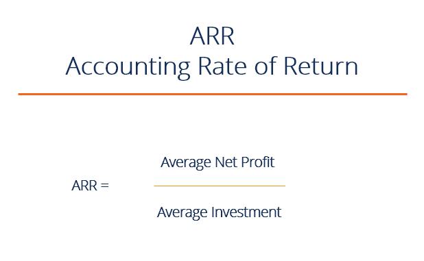

## Table of Contents

## What is the Accounting Rate of Return (ARR)?

The Accounting Rate of Return (ARR) is a way to figure out if an investment is good or not. It looks at the profit an investment makes over time and compares it to the cost of the investment. To find the ARR, you take the average yearly profit from the investment and divide it by the initial cost of the investment. Then, you multiply the result by 100 to get a percentage. This percentage tells you how much profit you make each year for every dollar you spent on the investment.

ARR is useful because it's easy to understand and calculate. Businesses often use it to decide whether to go ahead with a project or buy new equipment. If the ARR is higher than the company's target rate of return, the investment is usually considered good. However, ARR doesn't take into account the time value of money, which means it doesn't consider that a dollar today is worth more than a dollar in the future. Because of this, other methods like Net Present Value (NPV) or Internal Rate of Return (IRR) might be used alongside ARR to make better investment decisions.

## How is the Accounting Rate of Return calculated?

The Accounting Rate of Return (ARR) is calculated by taking the average yearly profit from an investment and dividing it by the initial cost of the investment. To find the average yearly profit, you add up all the profits expected over the life of the investment and then divide by the number of years. Once you have the average yearly profit, you divide it by the initial cost of the investment. Finally, you multiply the result by 100 to turn it into a percentage. This percentage is the ARR, which shows how much profit you make each year for every dollar you spent on the investment.

For example, if you invest $10,000 in a project and expect to make a total profit of $3,000 over 3 years, you would first find the average yearly profit. The total profit of $3,000 divided by 3 years gives you an average yearly profit of $1,000. Then, you divide the average yearly profit of $1,000 by the initial investment of $10,000, which gives you 0.1. Multiplying 0.1 by 100 gives you an ARR of 10%. This means you earn 10% of your initial investment back each year on average.

## What are the key components needed to compute ARR?

To compute the Accounting Rate of Return (ARR), you need to know the total profit expected from the investment and the initial cost of the investment. The total profit is the money you expect to make over the life of the investment. The initial cost is how much you pay at the start to make the investment. These two pieces of information are essential because they help you figure out how much profit you make compared to what you spent.

Next, you need to know the number of years the investment will last. This helps you find the average yearly profit by dividing the total profit by the number of years. Once you have the average yearly profit, you divide it by the initial cost of the investment. The result, when multiplied by 100, gives you the ARR as a percentage. This percentage shows how much profit you make each year for every dollar you spent on the investment.

## Why is ARR important for business decision-making?

ARR is important for business decision-making because it helps companies figure out if an investment is worth it. By calculating the ARR, a business can see how much profit they will make each year compared to what they spent. If the ARR is higher than what the company expects to earn, they might decide to go ahead with the investment. This makes ARR a simple and quick way to compare different projects or investments and choose the best one.

However, ARR has its limits. It doesn't consider the time value of money, which means it treats money earned in the future the same as money earned now. This can make some investments look better than they really are. Because of this, businesses often use ARR along with other methods like Net Present Value (NPV) or Internal Rate of Return (IRR) to make more accurate decisions. Even with its limits, ARR is still a useful tool for a first look at an investment's potential.

## Can you provide a simple example of how to calculate ARR?

Let's say you want to buy a new machine for your business. The machine costs $5,000, and you expect it to make an extra $1,500 in profit each year for the next 5 years. To find the ARR, you first need to figure out the average yearly profit. Since the profit is the same each year, the average yearly profit is $1,500. Now, you divide the average yearly profit by the cost of the machine. So, $1,500 divided by $5,000 gives you 0.3. When you multiply 0.3 by 100, you get an ARR of 30%.

This means that for every dollar you spent on the machine, you earn 30 cents back each year on average. If your business needs to earn at least 20% on investments to consider them good, then this machine looks like a good choice because its ARR of 30% is higher than your target. This simple calculation helps you decide if buying the machine is a smart move for your business.

## What are the advantages of using ARR as an investment appraisal technique?

ARR is a helpful tool for businesses because it's easy to understand and calculate. You just need to know the total profit you expect from an investment and how much it costs at the start. This makes it simple to compare different projects and see which one gives you the best return on your money. If the ARR is higher than what your business aims to earn, you know the investment is likely a good choice.

Another advantage of ARR is that it focuses on the profits you make each year. This can be useful for businesses that need to see regular returns to keep running smoothly. ARR gives you a clear picture of how much money you'll make back each year for every dollar you spend, which helps in planning and budgeting. Even though ARR doesn't consider the time value of money, it's still a good first step in deciding whether an investment is worth it.

## What are the limitations or disadvantages of ARR?

One big problem with ARR is that it doesn't think about the time value of money. This means it treats money you get in the future the same as money you get now. But in real life, a dollar today is worth more than a dollar you get later because you could invest that dollar now and make more money. So, ARR might make some investments look better than they really are because it doesn't consider this.

Another issue with ARR is that it only looks at the average profit over the life of the investment. It doesn't care about when you get that profit. If you get most of your profit at the end of the investment, that's different from getting it at the start. ARR doesn't show this difference, which can be important for planning and making sure your business has enough money to keep going.

## How does ARR compare to other investment appraisal methods like NPV and IRR?

ARR is simpler to calculate than NPV and IRR because it just looks at the average yearly profit compared to the initial cost of the investment. It's easy to understand and gives you a quick idea of how much money you'll make back each year. But ARR doesn't consider the time value of money, which means it treats money you get in the future the same as money you get now. This can make some investments look better than they really are.

On the other hand, NPV and IRR do take into account the time value of money. NPV calculates the present value of all cash flows from an investment, showing you if the investment will add value to your business after considering the cost of money over time. IRR finds the rate of return that makes the NPV of all cash flows from the investment equal to zero. This gives you a percentage that you can compare to your cost of capital to see if the investment is worth it. Both NPV and IRR are more complex to calculate but give a more accurate picture of an investment's value over time.

## In what scenarios would ARR be more suitable than other financial metrics?

ARR is a good choice when you need a quick and easy way to see if an investment is worth it. It's simple to calculate because you just need to know the total profit you expect and the cost of the investment. This makes ARR great for small businesses or when you're looking at a lot of different projects and need a fast way to compare them. If your business needs to see regular profits to keep running smoothly, ARR can help because it shows you how much money you'll make back each year for every dollar you spend.

However, ARR might not be the best choice if you need to think about the time value of money. It treats money you get in the future the same as money you get now, which can make some investments look better than they really are. If you're dealing with long-term projects or need a more detailed look at how an investment will perform over time, you might want to use other methods like NPV or IRR. These methods are more complex but give a more accurate picture of an investment's value over time.

## How does the choice of depreciation method affect the ARR?

The choice of depreciation method can change the ARR because it affects how much profit you show each year. Depreciation is how you spread out the cost of an asset over time. If you use a method like straight-line depreciation, you divide the cost evenly over the life of the asset. This means your profit stays the same each year. But if you use a method like declining balance depreciation, you take more depreciation in the early years and less later on. This makes your profit look smaller at first and bigger later, which can change the average yearly profit you use to calculate ARR.

So, if you use a method that gives you more depreciation in the early years, your ARR might look lower because your early profits are smaller. But if you use a method that spreads the depreciation evenly, your ARR might look more stable because your profits are the same each year. This is important to think about when you're deciding which investment to make, because different depreciation methods can make the same investment look better or worse depending on how they affect your yearly profits.

## What are the common pitfalls to avoid when using ARR for project evaluation?

One common pitfall when using ARR for project evaluation is not considering the time value of money. ARR treats money you get in the future the same as money you get now, which can make some projects look better than they really are. If you're looking at long-term projects, this can be a big problem because a dollar today is worth more than a dollar you get later. You could invest that dollar now and make more money, so it's important to think about this when deciding if a project is worth it.

Another pitfall is focusing too much on the average yearly profit without looking at when you get that profit. ARR only gives you the average, so if you get most of your profit at the end of the project, that's different from getting it at the start. This can affect your business's cash flow and planning. It's important to look at the timing of the profits, not just the average, to make sure your business can keep running smoothly while waiting for the returns.

## How can ARR be adjusted for more accurate long-term investment analysis?

To make ARR more accurate for long-term investment analysis, you can adjust it to consider the time value of money. One way to do this is by using a method called discounted cash flow. This means you take the future profits and "discount" them back to today's value using a discount rate. This rate shows how much you think money is worth over time. By doing this, you can see if the investment is really worth it when you think about how money changes value over time.

Another way to adjust ARR is by looking at the timing of the profits, not just the average. You can break down the profits year by year and see how they affect your business's cash flow. This helps you plan better because you know when the money will come in. By considering both the time value of money and the timing of profits, you can get a clearer picture of whether a long-term investment is a good choice for your business.

## What is Accounting Rate of Return (ARR)?

The Accounting Rate of Return (ARR) is a financial metric widely used in capital budgeting to evaluate the profitability of prospective investments. It provides a straightforward measure by calculating the expected rate of return based on an investment's average annual profit relative to the initial cost of investment. This simplicity makes ARR a popular tool among businesses looking to assess and compare the financial attractiveness of different projects.

### Formula and Key Components

The ARR is calculated using the following formula:

$$
\text{ARR} = \left(\frac{\text{Average Annual Profit}}{\text{Initial Investment Cost}}\right) \times 100
$$

**Average Annual Profit**: This figure is usually derived from the project's estimated profits over its lifespan, accounting for expenses and depreciation. It reflects the mean profit generated on an annual basis.

**Initial Investment Cost**: This represents the total capital outlay required to initiate the project. It includes equipment, installation, and any other startup costs associated with the investment.

### Evaluating Projects with ARR

The ARR serves as an essential metric for businesses to determine how a project is expected to perform financially. It facilitates decision-making by providing a clear percentage that can be used to compare the projected profitability of multiple projects. When considering potential investments, projects with a higher ARR are typically more appealing, as they suggest a greater return on the initial investment cost.

However, while ARR helps in making comparative assessments, it is crucial to recognize its limitations. Notably, ARR does not [factor](/wiki/factor-investing) in the time value of money, a significant aspect in financial decision-making. Despite this, within the broader scope of financial analysis tools, ARR provides a fundamental perspective on investment profitability, enabling businesses to align their investment choices with their strategic objectives.

## How do you calculate ARR?

The Accounting Rate of Return (ARR) calculation is essential for evaluating the potential profitability of an investment. This process begins with determining two key components: the average annual profit of the investment and the initial capital outlay.

First, calculate the average annual profit. This involves totaling the profits expected each year over the life of the investment and dividing by the number of years. The profits should account for all revenues and subtract operating expenses, excluding any non-cash items like depreciation at this stage.

Second, determine the initial investment cost. This typically includes all upfront expenses required to start the project, such as the purchase of equipment, installation fees, and initial working capital.

ARR is computed using the following formula:

$$
\text{ARR} = \left(\frac{\text{Average Annual Profit}}{\text{Initial Investment}}\right) \times 100
$$

This formula provides the ARR as a percentage, making it easier to compare against other potential projects or investments.

Consider the impact of depreciation, as it reduces taxable income, thereby affecting actual cash flow. To incorporate depreciation, adjust the annual profits to reflect it. Typically, this can mean deducting a straight-line depreciation amount from yearly revenues. 

Here is an illustrative example:

Suppose an investment project requires an initial investment of $250,000 and is expected to generate annual profits of $70,000 over five years. Further assume straight-line depreciation on a $250,000 asset with no residual value over five years:

1. Calculate the yearly depreciation: 
   \[ \text{Depreciation} = \frac{\$250,000}{5} = \$50,000
$$

2. Adjust the annual profit by accounting for depreciation:
   \[ \text{Adjusted Annual Profit} = \$70,000 - \$50,000 = \$20,000
$$

3. Compute the ARR using the adjusted annual profit:
   \[ \text{ARR} = \left(\frac{\$20,000}{\$250,000}\right) \times 100 = 8\%
$$

This example assumes depreciation impacts the cash flow considerably, but some profit calculations may not need adjustments if simpler analysis is required and cash flow taxation impacts are irrelevant. In practice, compare ARR values against benchmarks and consider other metrics to make sound investment decisions.

## What is an Example of ARR Calculation?

Consider a project requiring an initial investment of $250,000, with projected annual profits of $70,000 over a duration of five years. The Accounting Rate of Return (ARR) is determined by dividing the average annual profit by the initial investment. The calculation for ARR in this context is as follows:

1. **Average Annual Profit:** Since the project generates a consistent annual profit, the average annual profit is simply the annual profit figure: $70,000.

2. **ARR Calculation:** To find the ARR, divide the average annual profit by the initial investment amount:
$$
   \text{ARR} = \left( \frac{\text{Average Annual Profit}}{\text{Initial Investment}} \right) \times 100

$$

   Plugging in the numbers:
$$
   \text{ARR} = \left( \frac{70,000}{250,000} \right) \times 100 = 28\%

$$

The ARR of 28% indicates that the project is expected to return 28% of its initial cost annually, reflecting its profitability. This snapshot allows businesses to quickly gauge whether an investment is likely to meet required financial objectives compared to other potential opportunities. Considering its simplicity, the ARR provides an initial insight into a project's financial viability, helping in the decision-making process regarding capital allocation. However, it's essential for investors to acknowledge the limitations of ARR, such as its disregard for the time value of money, when using it as a sole criterion for investment analysis.

## What are the advantages and disadvantages of ARR?

The Accounting Rate of Return (ARR) is often lauded for its simplicity and ease of use in evaluating potential investment opportunities. One of the primary advantages of ARR is that it allows for a straightforward calculation that can be quickly performed without requiring complex computations or statistical analyses. The formula for ARR is given by:

$$
\text{ARR} = \left( \frac{\text{Average Annual Profit}}{\text{Initial Investment}} \right) \times 100
$$

This simplicity empowers managers and investors to make fast comparisons across different investment projects, enabling efficient decision-making. ARR can serve as a useful preliminary screening tool, allowing stakeholders to immediately discard projects that do not meet their minimum return criteria.

Despite its accessibility, ARR has significant limitations that can affect the robustness of investment appraisals. A notable drawback is its negligence of the time value of money, a fundamental concept in finance which dictates that a dollar today is worth more than a dollar in the future due to its potential [earning](/wiki/earning-announcement) capacity. ARR does not consider this factor, potentially leading to misleading conclusions about a project's profitability over time.

Additionally, ARR does not take into account the timing of cash flows throughout the investment period. Two projects with the same average annual profit and initial investment may have vastly different cash flow patterns, affecting their actual financial performance and risk. ARR's omission of detailed cash flow analysis means it cannot effectively evaluate projects with irregular or deferred cash flows, potentially leaving investors exposed to timing risks.

In summary, while ARR provides a quick and easy method for assessing prospective investments, its limitations mean it should be used with caution. It works best as a preliminary evaluation tool and should be complemented with other methods, such as Net Present Value (NPV) or Internal Rate of Return (IRR), which account for the complexities of cash flow timing and the time value of money to ensure a more comprehensive investment analysis. By understanding the advantages and drawbacks of ARR, investors can better integrate it into their financial decision-making processes.

## What is the difference between ARR and Required Rate of Return (RRR)?

The Accounting Rate of Return (ARR) and the Required Rate of Return (RRR) are both essential financial metrics, but they serve distinct purposes in investment decisions.

The ARR focuses on determining an investment's potential profitability by assessing the average annual profit relative to the initial investment. The formula for ARR is:

$$
ARR = \left( \frac{\text{Average Annual Profit}}{\text{Initial Investment Cost}} \right) \times 100
$$

ARR yields a percentage indicating the expected return on an investment, allowing businesses to compare different projects based on their profitability.

On the other hand, the Required Rate of Return (RRR) represents the minimum acceptable return investors expect to receive to offset the inherent risks of an investment. It considers factors like inflation, opportunity costs, and specific investment risks. The RRR is critical in determining whether an investment aligns with an investor's risk appetite and return objectives.

In comparing ARR and RRR, it's essential to understand their roles:

- **ARR**: Focuses on historic or projected average profitability, allowing for a straightforward comparison of investment options. It does not account for the time value of money, which can be a limitation when evaluating long-term projects.

- **RRR**: Uses the investor's risk profile and market conditions to establish a baseline return. Calculating the RRR involves more complex financial models, such as the Capital Asset Pricing Model (CAPM), which accounts for systematic investment risks:

$$
RRR = R_f + \beta (R_m - R_f)
$$

Where:
- $R_f$ is the risk-free rate,
- $\beta$ is the investment's beta (a measure of systematic risk),
- $R_m$ is the expected market return.

In investment decision-making, ARR can help identify potentially profitable projects, whereas RRR ensures that investments meet the required risk-adjusted return thresholds. A project is considered viable if its ARR exceeds the RRR, ensuring it delivers satisfactory returns relative to its risk level. Combining these metrics allows for a more nuanced investment evaluation, balancing profitability with risk assessments.

## What is ARR in Algorithmic Trading?

Algorithmic trading leverages the power of pre-programmed strategies to execute trades with speed and precision. The evaluation of these algorithms can significantly benefit from the use of financial metrics like the Accounting Rate of Return (ARR). By analyzing the profitability of algorithmic strategies through ARR, investors can make informed decisions regarding the refinement or selection of algorithms.

ARR assesses the effectiveness of [algorithmic trading](/wiki/algorithmic-trading) by placing an emphasis on the overall profitability relative to the costs associated with deploying the algorithm. This involves calculating the average annual returns generated by a trading algorithm and dividing this figure by the initial investment in developing or deploying the algorithm. The formula can be represented as follows:

$$

\text{ARR} = \left( \frac{\text{Average Annual Profit}}{\text{Initial Investment}} \right) \times 100 
$$

In the context of algorithmic trading, the Average Annual Profit could be derived from the net income generated by the algorithm over a specified period, while the Initial Investment encompasses costs such as development, testing, and continual maintenance of the trading strategy.

For instance, consider an algorithm with an initial development cost of $100,000, generating an annual net profit of $20,000. Plugging these values into the formula gives:

$$

\text{ARR} = \left( \frac{20,000}{100,000} \right) \times 100 = 20\% 
$$

This 20% ARR indicates a satisfactory return on the initial investment in the algorithm, suggesting that it might be a viable trading strategy.

Furthermore, ARR can aid in comparing multiple algorithms or changes to an existing algorithm. By observing changes in ARR before and after modifications, developers and investors can gauge whether enhancements have effectively increased profitability. However, while ARR provides a snapshot of algorithmic performance, it is crucial to acknowledge its limitations, particularly the exclusion of the time value of money. Hence, it should be considered alongside other performance metrics like net present value (NPV) or internal rate of return (IRR) for a more rounded analysis.

In summary, ARR is a valuable metric for evaluating algorithmic trading strategies, offering a straightforward method to assess profitability relative to cost, thus assisting investors in optimizing their algorithmic trading investments.

## References & Further Reading

[1]: ["Principles of Corporate Finance"](https://www.mheducation.com/highered/product/principles-corporate-finance-brealey-myers/M9781264080946.html) by Richard A. Brealey, Stewart C. Myers, and Franklin Allen

[2]: Gitman, L. J., & Zutter, C. J. (2012). ["Principles of Managerial Finance."](https://archive.org/details/principlesofmana13edgitm_l9n6) 

[3]: ["Financial Management: Theory & Practice"](https://books.google.com/books/about/Financial_Management_Theory_Practice.html?id=yL4aCgAAQBAJ) by Eugene F. Brigham and Michael C. Ehrhardt

[4]: Graham, B., & Dodd, D. L. (2009). ["Security Analysis"](https://www.amazon.com/Security-Analysis-Seventh-Principles-Techniques/dp/1264932405) 

[5]: ["Investment Valuation: Tools and Techniques for Determining the Value of Any Asset"](https://books.google.com/books/about/Investment_Valuation.html?id=5SRHAAAAQBAJ) by Aswath Damodaran