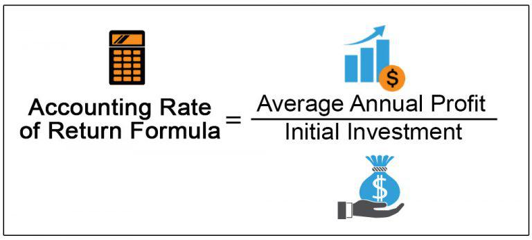

Understanding how investments perform over time is critical for businesses and investors alike. Among the various tools available for evaluating the profitability of potential investments, the Accounting Rate of Return (ARR) stands out due to its simplicity and utility in capital budgeting decisions. ARR serves as a financial metric that provides investors with a straightforward way to assess expected returns on investments, thereby aiding in the allocation of capital towards the most promising opportunities.

The ARR is calculated by dividing the average annual profit by the initial investment cost. This measurement offers investors a quick indication of the potential profitability of an investment, allowing for rapid comparison with alternative projects. While it doesn't account for the time value of money, which is a significant limitation in certain contexts, it remains an invaluable initial screening tool. 

In this article, the concept of ARR is explored, along with its calculation method, inherent advantages and disadvantages, and its practical application in fields such as algorithmic trading. By comprehending the nuances of ARR, investors can enhance their decision-making processes and optimize their investment portfolios.

## Table of Contents

## What is Accounting Rate of Return (ARR)?

The Accounting Rate of Return (ARR) is a financial metric widely used in capital budgeting to evaluate the profitability of prospective investments. It provides a straightforward measure by calculating the expected rate of return based on an investment's average annual profit relative to the initial cost of investment. This simplicity makes ARR a popular tool among businesses looking to assess and compare the financial attractiveness of different projects.

### Formula and Key Components

The ARR is calculated using the following formula:

$$
\text{ARR} = \left(\frac{\text{Average Annual Profit}}{\text{Initial Investment Cost}}\right) \times 100
$$

**Average Annual Profit**: This figure is usually derived from the project's estimated profits over its lifespan, accounting for expenses and depreciation. It reflects the mean profit generated on an annual basis.

**Initial Investment Cost**: This represents the total capital outlay required to initiate the project. It includes equipment, installation, and any other startup costs associated with the investment.

### Evaluating Projects with ARR

The ARR serves as an essential metric for businesses to determine how a project is expected to perform financially. It facilitates decision-making by providing a clear percentage that can be used to compare the projected profitability of multiple projects. When considering potential investments, projects with a higher ARR are typically more appealing, as they suggest a greater return on the initial investment cost.

However, while ARR helps in making comparative assessments, it is crucial to recognize its limitations. Notably, ARR does not [factor](/wiki/factor-investing) in the time value of money, a significant aspect in financial decision-making. Despite this, within the broader scope of financial analysis tools, ARR provides a fundamental perspective on investment profitability, enabling businesses to align their investment choices with their strategic objectives.

## Calculating ARR

The Accounting Rate of Return (ARR) calculation is essential for evaluating the potential profitability of an investment. This process begins with determining two key components: the average annual profit of the investment and the initial capital outlay.

First, calculate the average annual profit. This involves totaling the profits expected each year over the life of the investment and dividing by the number of years. The profits should account for all revenues and subtract operating expenses, excluding any non-cash items like depreciation at this stage.

Second, determine the initial investment cost. This typically includes all upfront expenses required to start the project, such as the purchase of equipment, installation fees, and initial working capital.

ARR is computed using the following formula:

$$
\text{ARR} = \left(\frac{\text{Average Annual Profit}}{\text{Initial Investment}}\right) \times 100
$$

This formula provides the ARR as a percentage, making it easier to compare against other potential projects or investments.

Consider the impact of depreciation, as it reduces taxable income, thereby affecting actual cash flow. To incorporate depreciation, adjust the annual profits to reflect it. Typically, this can mean deducting a straight-line depreciation amount from yearly revenues. 

Here is an illustrative example:

Suppose an investment project requires an initial investment of $250,000 and is expected to generate annual profits of $70,000 over five years. Further assume straight-line depreciation on a $250,000 asset with no residual value over five years:

1. Calculate the yearly depreciation: 
   \[ \text{Depreciation} = \frac{\$250,000}{5} = \$50,000
$$

2. Adjust the annual profit by accounting for depreciation:
   \[ \text{Adjusted Annual Profit} = \$70,000 - \$50,000 = \$20,000
$$

3. Compute the ARR using the adjusted annual profit:
   \[ \text{ARR} = \left(\frac{\$20,000}{\$250,000}\right) \times 100 = 8\%
$$

This example assumes depreciation impacts the cash flow considerably, but some profit calculations may not need adjustments if simpler analysis is required and cash flow taxation impacts are irrelevant. In practice, compare ARR values against benchmarks and consider other metrics to make sound investment decisions.

## Example of ARR Calculation

Consider a project requiring an initial investment of $250,000, with projected annual profits of $70,000 over a duration of five years. The Accounting Rate of Return (ARR) is determined by dividing the average annual profit by the initial investment. The calculation for ARR in this context is as follows:

1. **Average Annual Profit:** Since the project generates a consistent annual profit, the average annual profit is simply the annual profit figure: $70,000.

2. **ARR Calculation:** To find the ARR, divide the average annual profit by the initial investment amount:
$$
   \text{ARR} = \left( \frac{\text{Average Annual Profit}}{\text{Initial Investment}} \right) \times 100

$$

   Plugging in the numbers:
$$
   \text{ARR} = \left( \frac{70,000}{250,000} \right) \times 100 = 28\%

$$

The ARR of 28% indicates that the project is expected to return 28% of its initial cost annually, reflecting its profitability. This snapshot allows businesses to quickly gauge whether an investment is likely to meet required financial objectives compared to other potential opportunities. Considering its simplicity, the ARR provides an initial insight into a project's financial viability, helping in the decision-making process regarding capital allocation. However, it's essential for investors to acknowledge the limitations of ARR, such as its disregard for the time value of money, when using it as a sole criterion for investment analysis.

## Advantages and Disadvantages of ARR

The Accounting Rate of Return (ARR) is often lauded for its simplicity and ease of use in evaluating potential investment opportunities. One of the primary advantages of ARR is that it allows for a straightforward calculation that can be quickly performed without requiring complex computations or statistical analyses. The formula for ARR is given by:

$$
\text{ARR} = \left( \frac{\text{Average Annual Profit}}{\text{Initial Investment}} \right) \times 100
$$

This simplicity empowers managers and investors to make fast comparisons across different investment projects, enabling efficient decision-making. ARR can serve as a useful preliminary screening tool, allowing stakeholders to immediately discard projects that do not meet their minimum return criteria.

Despite its accessibility, ARR has significant limitations that can affect the robustness of investment appraisals. A notable drawback is its negligence of the time value of money, a fundamental concept in finance which dictates that a dollar today is worth more than a dollar in the future due to its potential [earning](/wiki/earning-announcement) capacity. ARR does not consider this factor, potentially leading to misleading conclusions about a project's profitability over time.

Additionally, ARR does not take into account the timing of cash flows throughout the investment period. Two projects with the same average annual profit and initial investment may have vastly different cash flow patterns, affecting their actual financial performance and risk. ARR's omission of detailed cash flow analysis means it cannot effectively evaluate projects with irregular or deferred cash flows, potentially leaving investors exposed to timing risks.

In summary, while ARR provides a quick and easy method for assessing prospective investments, its limitations mean it should be used with caution. It works best as a preliminary evaluation tool and should be complemented with other methods, such as Net Present Value (NPV) or Internal Rate of Return (IRR), which account for the complexities of cash flow timing and the time value of money to ensure a more comprehensive investment analysis. By understanding the advantages and drawbacks of ARR, investors can better integrate it into their financial decision-making processes.

## ARR vs. Required Rate of Return (RRR)

The Accounting Rate of Return (ARR) and the Required Rate of Return (RRR) are both essential financial metrics, but they serve distinct purposes in investment decisions.

The ARR focuses on determining an investment's potential profitability by assessing the average annual profit relative to the initial investment. The formula for ARR is:

$$
ARR = \left( \frac{\text{Average Annual Profit}}{\text{Initial Investment Cost}} \right) \times 100
$$

ARR yields a percentage indicating the expected return on an investment, allowing businesses to compare different projects based on their profitability.

On the other hand, the Required Rate of Return (RRR) represents the minimum acceptable return investors expect to receive to offset the inherent risks of an investment. It considers factors like inflation, opportunity costs, and specific investment risks. The RRR is critical in determining whether an investment aligns with an investor's risk appetite and return objectives.

In comparing ARR and RRR, it's essential to understand their roles:

- **ARR**: Focuses on historic or projected average profitability, allowing for a straightforward comparison of investment options. It does not account for the time value of money, which can be a limitation when evaluating long-term projects.

- **RRR**: Uses the investor's risk profile and market conditions to establish a baseline return. Calculating the RRR involves more complex financial models, such as the Capital Asset Pricing Model (CAPM), which accounts for systematic investment risks:

$$
RRR = R_f + \beta (R_m - R_f)
$$

Where:
- $R_f$ is the risk-free rate,
- $\beta$ is the investment's beta (a measure of systematic risk),
- $R_m$ is the expected market return.

In investment decision-making, ARR can help identify potentially profitable projects, whereas RRR ensures that investments meet the required risk-adjusted return thresholds. A project is considered viable if its ARR exceeds the RRR, ensuring it delivers satisfactory returns relative to its risk level. Combining these metrics allows for a more nuanced investment evaluation, balancing profitability with risk assessments.

## ARR in Algorithmic Trading

Algorithmic trading leverages the power of pre-programmed strategies to execute trades with speed and precision. The evaluation of these algorithms can significantly benefit from the use of financial metrics like the Accounting Rate of Return (ARR). By analyzing the profitability of algorithmic strategies through ARR, investors can make informed decisions regarding the refinement or selection of algorithms.

ARR assesses the effectiveness of [algorithmic trading](/wiki/algorithmic-trading) by placing an emphasis on the overall profitability relative to the costs associated with deploying the algorithm. This involves calculating the average annual returns generated by a trading algorithm and dividing this figure by the initial investment in developing or deploying the algorithm. The formula can be represented as follows:

$$

\text{ARR} = \left( \frac{\text{Average Annual Profit}}{\text{Initial Investment}} \right) \times 100 
$$

In the context of algorithmic trading, the Average Annual Profit could be derived from the net income generated by the algorithm over a specified period, while the Initial Investment encompasses costs such as development, testing, and continual maintenance of the trading strategy.

For instance, consider an algorithm with an initial development cost of $100,000, generating an annual net profit of $20,000. Plugging these values into the formula gives:

$$

\text{ARR} = \left( \frac{20,000}{100,000} \right) \times 100 = 20\% 
$$

This 20% ARR indicates a satisfactory return on the initial investment in the algorithm, suggesting that it might be a viable trading strategy.

Furthermore, ARR can aid in comparing multiple algorithms or changes to an existing algorithm. By observing changes in ARR before and after modifications, developers and investors can gauge whether enhancements have effectively increased profitability. However, while ARR provides a snapshot of algorithmic performance, it is crucial to acknowledge its limitations, particularly the exclusion of the time value of money. Hence, it should be considered alongside other performance metrics like net present value (NPV) or internal rate of return (IRR) for a more rounded analysis.

In summary, ARR is a valuable metric for evaluating algorithmic trading strategies, offering a straightforward method to assess profitability relative to cost, thus assisting investors in optimizing their algorithmic trading investments.

## Conclusion

The Accounting Rate of Return (ARR) serves as a straightforward and accessible metric for evaluating investment profitability. It allows investors and businesses to gauge potential returns by comparing average annual profits with the initial investment cost, thereby offering a clear snapshot of expected financial performance. This simplicity in calculation makes ARR an attractive choice for quick assessments and comparisons between different projects or investments.

Despite its practical benefits, ARR has limitations that must be acknowledged to ensure accurate interpretations. One key limitation is its disregard for the time value of money, a concept that recognizes the changing value of cash over time due to factors like inflation and interest rates. Because ARR averages out profits without considering when they are earned within the investment period, it may not fully reflect the long-term value of an investment. Therefore, relying solely on ARR could lead to skewed decision-making.

To navigate these challenges, it is advisable for investors and businesses to integrate ARR into a broader toolkit of financial metrics. By complementing ARR with other tools such as Net Present Value (NPV) or Internal Rate of Return (IRR), decision-makers can conduct a more comprehensive analysis of an investment’s potential and associated risks. Such a multifaceted approach helps ensure that investment decisions are well-rounded and informed, balancing immediate profitability assessments with considerations for value changes over time.

In conclusion, while ARR does not offer a complete picture in isolation, its ease of use and direct insights make it a valuable component in the financial evaluation process. By employing ARR alongside other analytical techniques, investors can enhance the robustness and reliability of their investment strategies.

## References & Further Reading

[1]: ["Principles of Corporate Finance"](https://www.mheducation.com/highered/product/principles-corporate-finance-brealey-myers/M9781264080946.html) by Richard A. Brealey, Stewart C. Myers, and Franklin Allen

[2]: Gitman, L. J., & Zutter, C. J. (2012). ["Principles of Managerial Finance."](https://archive.org/details/principlesofmana13edgitm_l9n6) 

[3]: ["Financial Management: Theory & Practice"](https://books.google.com/books/about/Financial_Management_Theory_Practice.html?id=yL4aCgAAQBAJ) by Eugene F. Brigham and Michael C. Ehrhardt

[4]: Graham, B., & Dodd, D. L. (2009). ["Security Analysis"](https://www.amazon.com/Security-Analysis-Seventh-Principles-Techniques/dp/1264932405) 

[5]: ["Investment Valuation: Tools and Techniques for Determining the Value of Any Asset"](https://books.google.com/books/about/Investment_Valuation.html?id=5SRHAAAAQBAJ) by Aswath Damodaran