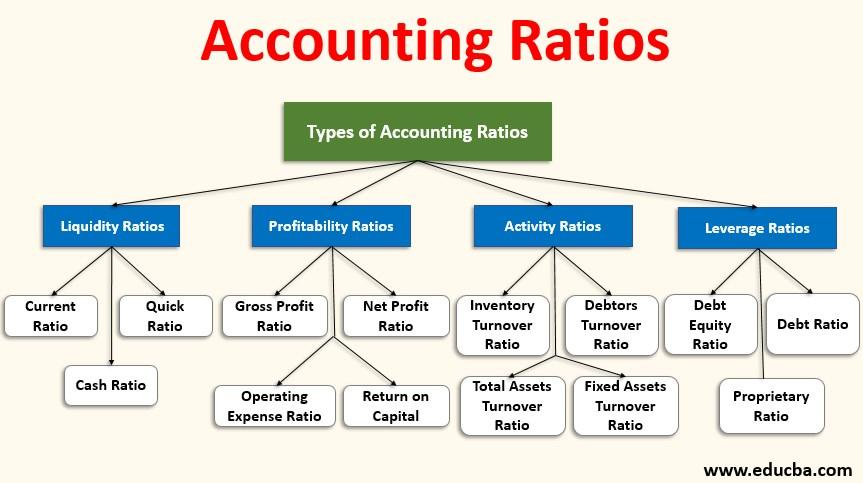

## Table of Contents

## What are accounting ratios?

Accounting ratios are numbers that help people understand a company's financial health by comparing different parts of its financial statements. They are like tools that make it easier to see if a company is doing well or if it has problems. For example, by using ratios, someone can quickly find out if a company makes enough money to pay its debts or if it is growing.

There are many types of accounting ratios, but they usually fall into a few main groups. Some ratios look at how much profit a company makes compared to its sales or costs. Others check if a company has enough money to pay what it owes. There are also ratios that show how well a company uses its resources, like how quickly it turns its inventory into sales. By looking at these ratios, people can make better decisions about the company, like whether to invest in it or lend it money.

## Why are accounting ratios important in financial analysis?

Accounting ratios are important in financial analysis because they help make complex financial information easier to understand. By using ratios, people can quickly see how a company is doing without having to go through all the numbers in the financial statements. For example, if someone wants to know if a company can pay its bills, they can look at the current ratio. This ratio compares what the company owns to what it owes in the short term. If the ratio is high, it means the company likely has enough money to cover its debts.

Ratios also help compare different companies, even if they are different sizes. This is useful for investors who want to decide where to put their money. For instance, the return on equity ratio shows how well a company uses the money that shareholders have invested. By comparing this ratio across different companies, an investor can see which company is making the best use of its investors' money. Overall, accounting ratios turn big, complicated financial data into simple, useful information that helps people make smart decisions about companies.

## What are the main categories of accounting ratios?

Accounting ratios are grouped into main categories to help people understand different parts of a company's financial health. The first category is profitability ratios. These ratios show how well a company is making money. They compare the company's profits to its sales, assets, or equity. For example, the gross profit margin tells you how much money the company makes after paying for the things it sells. The return on assets ratio shows how well the company uses its stuff to make money.

The second category is [liquidity](/wiki/liquidity-risk-premium) ratios. These ratios tell you if a company can pay its short-term bills. They compare what the company owns to what it owes in the short term. The current ratio and the quick ratio are common liquidity ratios. The current ratio looks at all the company's short-term assets compared to its short-term debts. The quick ratio is similar but only counts the most liquid assets, like cash and money the company is owed.

The third category is solvency ratios. These ratios show if a company can pay its long-term debts. They compare the company's debts to its assets or equity. The debt to equity ratio is a common solvency ratio. It shows how much the company relies on borrowed money compared to money from shareholders. Another solvency ratio is the interest coverage ratio, which tells you if the company makes enough money to pay the interest on its debts.

## How do you calculate the current ratio and what does it indicate?

The current ratio is calculated by dividing a company's current assets by its current liabilities. Current assets are things like cash, money the company is owed, and inventory that can be turned into cash within a year. Current liabilities are debts the company needs to pay within a year, like bills and short-term loans. So, if a company has $100,000 in current assets and $50,000 in current liabilities, its current ratio would be 2. This means the company has twice as much in current assets as it has in current liabilities.

The current ratio tells you if a company can pay its short-term bills. A higher current ratio means the company has more money to cover its debts, which is good. Usually, a current ratio of 2 or higher is seen as safe, but this can change depending on the industry. If the current ratio is too low, it might mean the company could have trouble paying its bills on time. But if it's too high, it might mean the company isn't using its money well, like keeping too much cash instead of investing it.

## What is the difference between liquidity ratios and solvency ratios?

Liquidity ratios and solvency ratios both help people understand a company's financial health, but they look at different things. Liquidity ratios tell you if a company can pay its short-term bills. They compare what the company owns that can be turned into cash quickly, like money in the bank or what people owe the company, to what it needs to pay soon, like bills or short-term loans. A common liquidity ratio is the current ratio, which shows if the company has enough short-term assets to cover its short-term debts.

Solvency ratios, on the other hand, look at if a company can pay its long-term debts. They compare the company's total debts to its total assets or the money from shareholders. A common solvency ratio is the debt to equity ratio, which shows how much the company relies on borrowed money compared to money from shareholders. While liquidity ratios focus on the short term, solvency ratios give a bigger picture of the company's financial stability over the long term.

## Can you explain the debt-to-equity ratio and its significance?

The debt-to-equity ratio is a number that shows how much a company uses borrowed money compared to money from its owners. You find it by dividing the company's total debts by the total money from its shareholders, which is called equity. If a company has $100,000 in debt and $50,000 in equity, its debt-to-equity ratio would be 2. This means the company has twice as much debt as equity.

This ratio is important because it tells people if a company is using too much borrowed money. A high debt-to-equity ratio can mean the company might have trouble paying back what it owes, especially if things go wrong. But a low ratio might mean the company isn't using borrowed money to grow, which could be a missed chance. What's considered a good debt-to-equity ratio can be different for each industry, but it helps investors and lenders see if a company is taking on too much risk or not enough.

## How does the gross profit margin ratio help in assessing a company's performance?

The gross profit margin ratio helps people see how well a company is doing by showing how much money it makes after paying for the things it sells. You find it by taking the money left after paying for the cost of goods sold and dividing it by the total sales. If a company sells something for $100 and it costs $60 to make, the gross profit is $40. The gross profit margin would be 40% because $40 divided by $100 is 0.40. This ratio tells you if the company is good at making money from what it sells.

A high gross profit margin means the company keeps a lot of money from each sale, which is good. It shows the company is either selling things for a good price or it's good at keeping the costs of making things low. But if the gross profit margin is low, it might mean the company isn't making enough money from its sales or its costs are too high. By looking at this ratio over time or comparing it to other companies, people can see if the company is getting better or worse at making money from what it sells.

## What are efficiency ratios and how do they measure a company's operational performance?

Efficiency ratios help people see how well a company uses its resources to make money. These ratios look at things like how quickly a company turns its inventory into sales or how fast it collects money from customers. For example, the inventory turnover ratio shows how many times a company sells and replaces its inventory in a year. If this number is high, it means the company is good at selling what it has. Another efficiency ratio is the receivables turnover ratio, which tells you how quickly a company gets paid by its customers. A high number here means the company is good at collecting money.

These ratios are important because they show how well a company is run day-to-day. If a company has high efficiency ratios, it means it's doing a good job of using its resources to make money. This can make the company more profitable and help it grow. On the other hand, if the efficiency ratios are low, it might mean the company is not using its resources well. This could be a sign that the company needs to improve how it manages its inventory or collects money from customers. By looking at these ratios, people can get a better idea of how well the company is doing in its everyday operations.

## How can the return on equity (ROE) ratio be used to evaluate a company's profitability?

The return on equity (ROE) ratio helps people see how well a company is using the money that shareholders have put into it. You find the ROE by dividing the company's net income by the total money from shareholders, which is called equity. If a company makes $10,000 in profit and has $50,000 in equity, the ROE would be 20%. This means for every dollar shareholders have put in, the company makes 20 cents in profit. A high ROE means the company is good at turning the money from shareholders into more money, which is good for investors.

ROE is important because it shows how profitable a company is compared to the money it has from shareholders. If you compare the ROE of different companies, you can see which one is better at making money from the money it has. But, it's also good to look at ROE over time to see if the company is getting better or worse at making money. A company with a high and growing ROE might be a good choice for investors looking for a profitable place to put their money.

## What are the limitations of using accounting ratios for financial analysis?

Accounting ratios are helpful, but they have some problems. One big problem is that they use numbers from the past. This means they can't tell you what will happen in the future. Also, different companies might use different ways to count their money, so comparing them can be hard. For example, one company might count its inventory in a different way than another company, which can make their ratios look different even if they are doing the same thing.

Another problem is that ratios don't tell the whole story. They are just numbers, and they don't explain why things are happening. For example, a low profit margin might mean the company is not making enough money, but it could also mean they are spending a lot on new things to grow. Without more information, it's hard to know what the numbers really mean. So, while ratios are useful, they should be used with other information to get a full picture of a company's health.

## How do industry-specific ratios differ from general accounting ratios?

Industry-specific ratios are numbers that help people understand how well a company is doing compared to other companies in the same kind of business. These ratios are different from general accounting ratios because they focus on things that are important in that specific industry. For example, in the retail industry, people might look at the inventory turnover ratio a lot because it shows how quickly a store sells its products. In the banking industry, people might look at the loan-to-deposit ratio because it shows how much money the bank is lending out compared to what it has from customers.

General accounting ratios, on the other hand, are used to understand a company's financial health no matter what kind of business it is in. These ratios, like the current ratio or the debt-to-equity ratio, help people see if a company can pay its bills or how much it relies on borrowed money. While these ratios are useful for any company, they might not tell you everything you need to know about how well a company is doing in its specific industry. So, using both general and industry-specific ratios can give a fuller picture of a company's performance.

## Can you discuss advanced techniques for integrating multiple accounting ratios in a comprehensive financial analysis?

When you want to understand a company's financial health really well, you can use a bunch of accounting ratios together. This is called a comprehensive financial analysis. Instead of just looking at one ratio, like the current ratio or the debt-to-equity ratio, you look at many ratios at the same time. For example, you might look at the gross profit margin to see how much money the company makes from selling things, the return on equity to see how well it uses the money from shareholders, and the inventory turnover ratio to see how quickly it sells its products. By looking at all these ratios together, you can get a better idea of how the company is doing in different areas.

One way to do this is by using something called a ratio analysis framework. This means you group the ratios into categories like profitability, liquidity, solvency, and efficiency. Then, you look at how these ratios change over time and compare them to other companies in the same industry. For example, if a company's gross profit margin is going up but its inventory turnover is going down, it might mean the company is making more money from each sale but not selling things as quickly. By looking at these patterns, you can see where the company is doing well and where it might need to improve. This helps you make smarter decisions about the company, like whether to invest in it or lend it money.

## What are Accounting Ratios?

Accounting ratios are essential tools for assessing a company’s financial health and operational efficacy. They condense complex financial statements into manageable figures that offer insights into various dimensions of a company’s performance and stability. These ratios fall into core categories such as profitability, liquidity, efficiency, and solvency, each serving a distinct analytical purpose.

Profitability ratios are vital for understanding how effectively a company is generating profit from its operations. Metrics like the net profit margin, calculated as:

$$
\text{Net Profit Margin} = \left( \frac{\text{Net Income}}{\text{Revenue}} \right) \times 100
$$

allow stakeholders to determine the percentage of revenue that translates into profit. Similarly, return on equity (ROE) reveals how well a company utilizes shareholders’ funds to generate earnings:

$$
\text{ROE} = \frac{\text{Net Income}}{\text{Shareholders' Equity}} \times 100
$$

Liquidity ratios, such as the current ratio and quick ratio, provide insights into a company’s ability to meet short-term obligations. The current ratio, for instance, is calculated as:

$$
\text{Current Ratio} = \frac{\text{Current Assets}}{\text{Current Liabilities}}
$$

This ratio indicates whether a company possesses sufficient assets to cover its short-term liabilities, vital information for creditors assessing short-term financial health.

Efficiency ratios, like inventory turnover and asset turnover, measure how adeptly a company utilizes its resources. Inventory turnover, defined by:

$$
\text{Inventory Turnover} = \frac{\text{Cost of Goods Sold}}{\text{Average Inventory}}
$$

assesses how swiftly inventory is sold and replaced over a period, reflecting operational efficiency.

Solvency ratios provide insight into a company’s long-term stability by examining its debt levels. The debt to equity ratio, for example, is given by:

$$
\text{Debt to Equity Ratio} = \frac{\text{Total Liabilities}}{\text{Shareholders' Equity}}
$$

This ratio helps investors understand the balance between debt and equity funding, highlighting potential financial risk.

Accounting ratios play an indispensable role in decision-making processes for investors, creditors, and management. Investors utilize these ratios to gauge potential returns and risks involved, while creditors assess a firm’s ability to repay its debts. Management relies on these metrics to strategize for sustainable growth and operational improvements.

Beyond quantifying financial data, accounting ratios also facilitate a nuanced balance between qualitative and quantitative analysis. They help analysts not only in deducing numeric conclusions but also in understanding the story behind the numbers by taking into account industry trends, economic conditions, and company-specific factors. This dual approach enhances the robustness of financial analysis, paving the way for informed, strategic decision-making.

## How can ratios be incorporated in algorithmic trading?

Algorithmic trading, often referred to as algo-trading, is a method of executing trades using computer algorithms tailored to statistical models. These algorithms rely heavily on quantitative data and mathematical computations to optimize trading decisions, manage risk, and execute orders with minimal human intervention. A critical component of these data-driven strategies is the use of accounting ratios, which enhance trading models by providing insights into a company’s financial health and performance.

Accounting ratios serve as fundamental inputs in [algorithmic trading](/wiki/algorithmic-trading) systems by enabling the identification of undervalued or overvalued stocks. For instance, profitability ratios such as the Price-to-Earnings (P/E) ratio can be leveraged to assess whether a stock is undervalued compared to its peers. A lower P/E ratio might indicate that a stock is undervalued, signaling a potential buy opportunity for the algorithm. 

$$
\text{P/E Ratio} = \frac{\text{Market Price per Share}}{\text{Earnings per Share (EPS)}}
$$

Liquidity ratios, such as the current ratio, help algorithms determine a firm’s ability to cover short-term liabilities, which can impact its stock performance. By incorporating these financial metrics, trading algorithms can generate signals that prompt buy, sell, or hold decisions based on a company’s liquidity status.

$$
\text{Current Ratio} = \frac{\text{Current Assets}}{\text{Current Liabilities}}
$$

In practice, algorithms might implement these ratios as part of a more extensive strategy. Consider a simple Python example where an algorithm selects stocks with a P/E ratio below a specified threshold and a current ratio above a certain level, indicating potential undervaluation and financial stability:

```python
selected_stocks = []

for stock in stock_data:
    pe_ratio = stock['market_price'] / stock['EPS']
    current_ratio = stock['current_assets'] / stock['current_liabilities']

    if pe_ratio < target_pe and current_ratio > target_current_ratio:
        selected_stocks.append(stock)
```

The primary advantage of algorithmic trading is its ability to handle and process vast amounts of financial data instantly and effectively. Algorithms can execute trades much faster than human traders by parsing through real-time market data and recalculating financial ratios continuously. This speed and efficiency enhance profitability by capturing market opportunities promptly.

Moreover, algorithms help reduce human error and emotional bias, ensuring consistent trading outcomes. They also provide scalability, enabling analysts to apply their strategies across multiple markets and asset classes simultaneously.

In conclusion, aligning accounting ratios with algorithmic trading offers significant benefits, facilitating precise, informed, and swift trading decisions. As technology advances and data processing capabilities enhance, accounting ratios will remain vital components of sophisticated trading models.

## References & Further Reading

[1]: Bergstra, J., Bardenet, R., Bengio, Y., & Kégl, B. (2011). ["Algorithms for Hyper-Parameter Optimization."](https://proceedings.neurips.cc/paper/2011/file/86e8f7ab32cfd12577bc2619bc635690-Paper.pdf) Advances in Neural Information Processing Systems 24.

[2]: ["Advances in Financial Machine Learning"](https://www.amazon.com/Advances-Financial-Machine-Learning-Marcos/dp/1119482089) by Marcos Lopez de Prado

[3]: ["Evidence-Based Technical Analysis: Applying the Scientific Method and Statistical Inference to Trading Signals"](https://www.amazon.com/Evidence-Based-Technical-Analysis-Scientific-Statistical/dp/0470008741) by David Aronson

[4]: ["Machine Learning for Algorithmic Trading"](https://github.com/PacktPublishing/Machine-Learning-for-Algorithmic-Trading-Second-Edition) by Stefan Jansen

[5]: ["Quantitative Trading: How to Build Your Own Algorithmic Trading Business"](https://www.amazon.com/Quantitative-Trading-Build-Algorithmic-Business/dp/0470284889) by Ernest P. Chan

[6]: ["Investment Valuation: Tools and Techniques for Determining the Value of Any Asset"](https://books.google.com/books/about/Investment_Valuation.html?id=5SRHAAAAQBAJ) by Aswath Damodaran

[7]: ["Technical Analysis of the Financial Markets: A Comprehensive Guide to Trading Methods and Applications"](https://www.amazon.com/Technical-Analysis-Financial-Markets-Comprehensive/dp/0735200661) by John J. Murphy