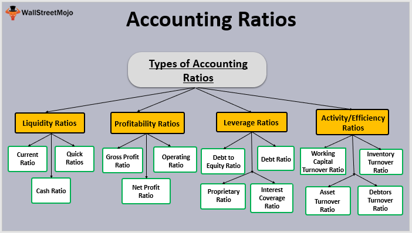

In the finance world, accounting ratios are indispensable tools for analyzing financial statements. They serve as metrics that provide a snapshot of a company's financial health by offering insights into profitability, liquidity, efficiency, and solvency. This article emphasizes the significance of accounting ratios, categorizing them, and illustrating their applications in both traditional financial analysis and modern algorithmic trading.

Understanding key financial ratios enables traders and analysts to make well-informed decisions. These ratios help identify the strengths and weaknesses of a company, guiding investors in risk assessment and investment strategy formulation. Ratios like the current ratio and net profit margin are instrumental in comparing a company's performance against its peers and industry standards.



With technological advancements, algorithmic trading has revolutionized trading strategies by incorporating these vital financial ratios into complex mathematical models. Algorithms rely heavily on quantitative data, and accounting ratios are a cornerstone of this data, providing parameters that enhance the accuracy and efficiency of trading models. These algorithms facilitate swift, data-driven decisions, which are crucial in the fast-paced financial markets.

In this article, we will explore various types of financial ratios and discuss their role and relevance in algorithmic trading. Through this exploration, readers will gain a comprehensive understanding of how these ratios underpin financial analysis and the ways in which they can be leveraged to devise robust algorithmic trading strategies.

## Table of Contents

## What are Accounting Ratios?

Accounting ratios are essential tools for assessing a company’s financial health and operational efficacy. They condense complex financial statements into manageable figures that offer insights into various dimensions of a company’s performance and stability. These ratios fall into core categories such as profitability, liquidity, efficiency, and solvency, each serving a distinct analytical purpose.

Profitability ratios are vital for understanding how effectively a company is generating profit from its operations. Metrics like the net profit margin, calculated as:

$$
\text{Net Profit Margin} = \left( \frac{\text{Net Income}}{\text{Revenue}} \right) \times 100
$$

allow stakeholders to determine the percentage of revenue that translates into profit. Similarly, return on equity (ROE) reveals how well a company utilizes shareholders’ funds to generate earnings:

$$
\text{ROE} = \frac{\text{Net Income}}{\text{Shareholders' Equity}} \times 100
$$

Liquidity ratios, such as the current ratio and quick ratio, provide insights into a company’s ability to meet short-term obligations. The current ratio, for instance, is calculated as:

$$
\text{Current Ratio} = \frac{\text{Current Assets}}{\text{Current Liabilities}}
$$

This ratio indicates whether a company possesses sufficient assets to cover its short-term liabilities, vital information for creditors assessing short-term financial health.

Efficiency ratios, like inventory turnover and asset turnover, measure how adeptly a company utilizes its resources. Inventory turnover, defined by:

$$
\text{Inventory Turnover} = \frac{\text{Cost of Goods Sold}}{\text{Average Inventory}}
$$

assesses how swiftly inventory is sold and replaced over a period, reflecting operational efficiency.

Solvency ratios provide insight into a company’s long-term stability by examining its debt levels. The debt to equity ratio, for example, is given by:

$$
\text{Debt to Equity Ratio} = \frac{\text{Total Liabilities}}{\text{Shareholders' Equity}}
$$

This ratio helps investors understand the balance between debt and equity funding, highlighting potential financial risk.

Accounting ratios play an indispensable role in decision-making processes for investors, creditors, and management. Investors utilize these ratios to gauge potential returns and risks involved, while creditors assess a firm’s ability to repay its debts. Management relies on these metrics to strategize for sustainable growth and operational improvements.

Beyond quantifying financial data, accounting ratios also facilitate a nuanced balance between qualitative and quantitative analysis. They help analysts not only in deducing numeric conclusions but also in understanding the story behind the numbers by taking into account industry trends, economic conditions, and company-specific factors. This dual approach enhances the robustness of financial analysis, paving the way for informed, strategic decision-making.

## Types of Financial Ratios

Financial ratios are categorized into four main types: [liquidity](/wiki/liquidity-risk-premium), profitability, efficiency, and solvency. These ratios are crucial for analyzing a company's financial health and performance.

### Liquidity Ratios

Liquidity ratios assess a firm's ability to meet its short-term obligations. They indicate the company's capacity to convert assets into cash. Two fundamental liquidity ratios are the current ratio and the quick ratio.

- **Current Ratio**: Calculated as Current Assets divided by Current Liabilities ($\text{Current Ratio} = \frac{\text{Current Assets}}{\text{Current Liabilities}}$), this ratio measures the ability of a firm to cover its short-term liabilities with its short-term assets. A ratio above 1 is typically considered satisfactory, indicating good financial health.

- **Quick Ratio**: Also known as the acid-test ratio ($\text{Quick Ratio} = \frac{\text{Current Assets} - \text{Inventories}}{\text{Current Liabilities}}$), excludes inventories from current assets for a more stringent test of liquidity. It reflects the company's ability to meet its current liabilities without relying on the sale of inventory.

### Profitability Ratios

Profitability ratios evaluate a firm's ability to generate income relative to revenue, assets, equity, and other financial metrics. They provide insights into how efficiently a company operates. Two key profitability ratios are the net profit margin and return on equity.

- **Net Profit Margin**: This ratio ($\text{Net Profit Margin} = \frac{\text{Net Income}}{\text{Revenue}} \times 100\%$) shows the percentage of revenue that translates into profit after all expenses. A higher net profit margin indicates more efficient cost management and profitability.

- **Return on Equity (ROE)**: ROE ($\text{ROE} = \frac{\text{Net Income}}{\text{Shareholder's Equity}} \times 100\%$) measures the return generated on shareholders' equity. It is a key indicator of financial performance and how well equity is used to generate profits.

### Efficiency Ratios

Efficiency ratios, also known as activity ratios, assess how effectively a company uses its assets and liabilities. Essential efficiency ratios include inventory turnover and asset turnover.

- **Inventory Turnover**: This ratio ($\text{Inventory Turnover} = \frac{\text{Cost of Goods Sold}}{\text{Average Inventory}}$) indicates how many times a company's inventory is sold and replaced over a period. A higher turnover rate implies effective inventory management.

- **Asset Turnover**: It calculates how efficiently a firm uses its assets to generate sales ($\text{Asset Turnover} = \frac{\text{Net Sales}}{\text{Average Total Assets}}$). A higher ratio indicates better utilization of assets to produce revenue.

### Solvency Ratios

Solvency ratios measure a company's ability to sustain operations and manage its long-term debts. Key solvency ratios include the debt to equity ratio and the interest coverage ratio.

- **Debt to Equity Ratio**: This ratio ($\text{Debt to Equity Ratio} = \frac{\text{Total Debt}}{\text{Total Equity}}$) compares the total debt to shareholders' equity, offering insights into leverage and financial stability. A lower ratio is often preferred, indicating less reliance on debt financing.

- **Interest Coverage Ratio**: It measures a firm's ability to pay interest on its outstanding debt ($\text{Interest Coverage Ratio} = \frac{\text{Earnings Before Interest and Taxes (EBIT)}}{\text{Interest Expense}}$). A higher ratio suggests greater ease in meeting interest obligations. 

Understanding these ratios provides a comprehensive view of a company's financial situation, aiding investors and analysts in making informed decisions.

## The Role of Accounting Ratios in Financial Analysis

Accounting ratios are essential tools leveraged by financial analysts to assess a company's performance over time. These ratios provide a quantitative foundation for evaluating various aspects of a company’s operations, financial health, and strategic position.

Financial analysts use these ratios to perform detailed evaluations by comparing a company's current ratios to its historical data. This practice allows analysts to track performance improvements or declines, identifying patterns and anomalies in financial statements. For instance, a decreasing trend in liquidity ratios such as the current ratio might signal deteriorating financial health, requiring closer scrutiny.

Further, by employing comparative analysis, analysts extend this examination across different industries and companies. This method involves benchmarking a company’s ratios against its peers to determine its relative standing. For example, comparing profitability ratios like return on equity (ROE) or net profit margin with industry averages can reveal if a firm is outperforming or underperforming its competitors. This analysis helps stakeholders assess how efficiently a company is utilizing its resources relative to others in the sector.

Trend analysis is another vital application of accounting ratios. By examining historical ratio data, analysts can forecast future financial conditions. For instance, an upward trend in the asset turnover ratio might indicate improving efficiency in resource utilization, suggesting potential growth in revenue. Conversely, a downward trend in solvency ratios, such as the debt-to-equity ratio, could predict future difficulties in meeting long-term obligations.

Accounting ratios can also serve as early warning signals for potential red flags in a company's financial practices. Unusual or abrupt changes in ratios might indicate financial manipulation or emerging issues, such as liquidity shortages or excessive leverage. For example, a sudden spike in the debt ratio without a corresponding increase in revenue might suggest aggressive borrowing practices that could jeopardize financial stability.

In summary, financial analysts leverage accounting ratios as a critical component of comprehensive financial analysis. These ratios enable the evaluation of a company's performance over time, facilitate industry-wide comparisons, support trend predictions, and highlight potential financial irregularities.

## Incorporating Ratios in Algorithmic Trading

Algorithmic trading, often referred to as algo-trading, is a method of executing trades using computer algorithms tailored to statistical models. These algorithms rely heavily on quantitative data and mathematical computations to optimize trading decisions, manage risk, and execute orders with minimal human intervention. A critical component of these data-driven strategies is the use of accounting ratios, which enhance trading models by providing insights into a company’s financial health and performance.

Accounting ratios serve as fundamental inputs in [algorithmic trading](/wiki/algorithmic-trading) systems by enabling the identification of undervalued or overvalued stocks. For instance, profitability ratios such as the Price-to-Earnings (P/E) ratio can be leveraged to assess whether a stock is undervalued compared to its peers. A lower P/E ratio might indicate that a stock is undervalued, signaling a potential buy opportunity for the algorithm. 

$$
\text{P/E Ratio} = \frac{\text{Market Price per Share}}{\text{Earnings per Share (EPS)}}
$$

Liquidity ratios, such as the current ratio, help algorithms determine a firm’s ability to cover short-term liabilities, which can impact its stock performance. By incorporating these financial metrics, trading algorithms can generate signals that prompt buy, sell, or hold decisions based on a company’s liquidity status.

$$
\text{Current Ratio} = \frac{\text{Current Assets}}{\text{Current Liabilities}}
$$

In practice, algorithms might implement these ratios as part of a more extensive strategy. Consider a simple Python example where an algorithm selects stocks with a P/E ratio below a specified threshold and a current ratio above a certain level, indicating potential undervaluation and financial stability:

```python
selected_stocks = []

for stock in stock_data:
    pe_ratio = stock['market_price'] / stock['EPS']
    current_ratio = stock['current_assets'] / stock['current_liabilities']

    if pe_ratio < target_pe and current_ratio > target_current_ratio:
        selected_stocks.append(stock)
```

The primary advantage of algorithmic trading is its ability to handle and process vast amounts of financial data instantly and effectively. Algorithms can execute trades much faster than human traders by parsing through real-time market data and recalculating financial ratios continuously. This speed and efficiency enhance profitability by capturing market opportunities promptly.

Moreover, algorithms help reduce human error and emotional bias, ensuring consistent trading outcomes. They also provide scalability, enabling analysts to apply their strategies across multiple markets and asset classes simultaneously.

In conclusion, aligning accounting ratios with algorithmic trading offers significant benefits, facilitating precise, informed, and swift trading decisions. As technology advances and data processing capabilities enhance, accounting ratios will remain vital components of sophisticated trading models.

## Case Studies and Examples

The use of financial ratios in trading strategies can be illustrated through several compelling case studies and examples. These instances demonstrate how the application of accounting ratios has been instrumental in making prudent trading decisions and enhancing investment returns.

One notable example is the case of the retail giant Walmart. During the 2008 financial crisis, financial analysts used various liquidity ratios to assess its robustness compared to its peers. The current ratio and quick ratio, which measure a company's ability to cover its short-term liabilities with its short-term assets, indicated that Walmart was better positioned than many competitors. This insight prompted investors to view Walmart as a safer investment during turbulent times. As a result, Walmart's stock experienced relative stability, affirming the importance of liquidity ratios in evaluating financial health during crises.

Another insightful example involves Tesla, where the return on equity (ROE) ratio played a pivotal role. Analysts observed Tesla's ROE to gauge the company’s ability to generate profits from shareholders’ equity. A rising ROE over several quarters suggested efficient management and promising growth prospects, leading to increased investor confidence. Consequently, this metric partly fueled the substantial rise in Tesla's stock price over time, providing a clear example of how profitability ratios can be a decisive [factor](/wiki/factor-investing) in successful trading strategies.

In algorithmic trading, financial ratios serve as essential inputs in model development. For instance, Renaissance Technologies, a pioneer in quant-based trading, integrates various financial ratios into its algorithms to assess stock valuations and market trends. By combining efficiency ratios, such as asset turnover, the firm can estimate the operational efficiency of potential investment targets. This data-driven approach allows for identifying undervalued stocks, contributing to the firm's track record of exceptional returns.

Consider a scenario where an algorithm uses Python to make trading decisions based on financial ratios. Here is a simplified code snippet demonstrating how an algorithm might leverage the Price to Earnings (P/E) ratio:

```python
import yfinance as yf  # For more datasets, visit: https://paperswithbacktest.com/datasets

def get_pe_ratio(ticker):
    stock = yf.Ticker(ticker)
    pe_ratio = stock.info['forwardPE']
    return pe_ratio

def trade_decision(ticker):
    pe = get_pe_ratio(ticker)
    if pe < 15:
        return "Buy"
    elif 15 <= pe <= 25:
        return "Hold"
    else:
        return "Sell"

# Example use
decision = trade_decision("AAPL")
print(f"Trading decision for AAPL: {decision}")
```

This algorithm fetches the forward P/E ratio for a specified stock and makes buy, hold, or sell decisions based on predefined thresholds, illustrating practical usage of ratios in algorithmic trading.

These examples underscore how financial ratios are not only valuable for traditional financial analysis but also indispensable in algorithmic strategies. As stock markets continue to evolve, the integration of these quantitative tools remains critical for achieving improved investment outcomes.

## Challenges and Considerations

Relying solely on accounting ratios without considering market conditions presents several limitations. While ratios provide important numerical insights into a company's financial health, they lack the context necessary to comprehend the full picture. Market conditions, such as economic cycles, industry trends, and geopolitical events, significantly influence a company's performance and stock value. Therefore, failing to incorporate these external factors may lead to skewed interpretations.

One key pitfall in using ratios is the potential for misinterpretation. Ratios like the price-to-earnings (P/E) ratio or return on equity (ROE) might seem straightforward but can be misleading if the underlying assumptions or external variables are not considered. For instance, a high P/E ratio could indicate a potentially overvalued stock, but it might also reflect high growth expectations in a bullish market environment. Conversely, a low ROE might seem unfavorable, yet it could be a result of conservative accounting practices rather than poor operational efficiency.

Furthermore, market [volatility](/wiki/volatility-trading-strategies) has a profound impact on the reliability and relevance of accounting ratios. In highly volatile markets, fluctuations in stock prices and earnings can lead to erratic changes in ratios, obscuring the understanding of a company's true financial performance. Repeated recalibration is necessary to ensure accuracy in ratio analysis, a process that can be resource-intensive and complex.

Emergent financial technologies add another layer of complexity to ratio-based analysis. Algorithmic trading, for example, leverages [artificial intelligence](/wiki/ai-artificial-intelligence) and [machine learning](/wiki/machine-learning) to process vast datasets rapidly. While these technologies can enhance the ability to integrate ratios into trading models, there is a risk of over-reliance on quantitative data. Algorithms may overlook qualitative elements such as management expertise or market sentiment, which are vital for comprehensive analysis.

Addressing these challenges requires a balanced approach incorporating both quantitative and qualitative analyses. Analysts must consider macroeconomic indicators, industry dynamics, and the qualitative aspects of corporate governance. By doing so, they can better contextualize accounting ratios, leading to informed financial decisions that are resilient to market fluctuations and technological shifts.

## Conclusion

Accounting ratios play an essential role in financial analysis and trading strategies by delivering quantifiable insights that drive informed decision-making. Offering a clear view of a company's financial health through measures of profitability, liquidity, efficiency, and solvency, these ratios empower investors, analysts, and management to evaluate performance comprehensively. By distilling complex financial data into digestible metrics, accounting ratios facilitate the identification of trends and anomalies, paving the way for strategic adjustments and long-term planning.

Incorporation of accounting ratios into algorithmic trading systems demonstrates their potential to revolutionize trading strategies. By leveraging quantitative data, algorithms can assess ratios with precision and speed, thereby enhancing the capability to identify undervalued stocks or swiftly react to market movements. Through advanced computational techniques, algorithms interpret financial ratios alongside various market indicators, augmenting the ability to predict trends and optimize investment outcomes efficiently.

As financial landscapes continue to transform with evolving technologies and unpredictable market dynamics, continuous learning and adaptation are imperative. Professionals in finance must remain vigilant, embracing new methodologies and tools to maintain a competitive edge. Staying updated with emerging financial technologies and cultivating a robust understanding of accounting ratios will ensure that analytical models remain relevant and effective amidst the complexities of global financial markets.

## References

1. Fabozzi, F. J., & Drake, P. P. (2009). *Finance: Capital Markets, Financial Management, and Investment Management*. Wiley. This book provides comprehensive coverage of the principles and practices in finance, including detailed discussions on financial ratios.

2. Ross, S. A., Westerfield, R. W., & Jordan, B. D. (2019). *Fundamentals of Corporate Finance*. McGraw-Hill Education. This textbook introduces fundamental concepts in corporate finance, including the use and interpretation of financial ratios.

3. Bodie, Z., Kane, A., & Marcus, A. J. (2018). *Investments*. McGraw-Hill Education. Offers insights into investments, including sections on financial ratios relevant for trading and investment analysis.

4. Damodaran, A. (2012). *Investment Valuation: Tools and Techniques for Determining the Value of Any Asset*. Wiley. A detailed guide on valuation techniques, with discussions on the role of financial ratios in valuation.

5. Hull, J. C. (2018). *Options, Futures, and Other Derivatives*. Pearson. Discusses the application of financial ratios in derivatives trading and risk management.

6. Murphy, J. J. (1999). *Technical Analysis of the Financial Markets: A Comprehensive Guide to Trading Methods and Applications*. New York Institute of Finance. While focusing on technical analysis, this book also highlights how financial ratios interact with technical indicators in trading.

7. Livermore, J. (2001). *How to Trade in Stocks*. Wiley. A classic text on stock trading, offering insights into the application of financial analysis, including ratios, in trading practices.

8. Schilit, H., & Perler, J. (2010). *Financial Shenanigans: How to Detect Accounting Gimmicks & Fraud in Financial Reports*. McGraw-Hill Education. This book discusses how to use financial ratios to detect potential red flags in financial statements.

9. Scholtes, S. (2020). *Algorithmic Trading*. CreateSpace Independent Publishing Platform. An introductory text that explains the use of algorithms in trading, and how financial ratios can enhance algorithmic strategies.

10. Kahn, M. N. (1998). *Technical Analysis Plain and Simple: Charting the Markets in Your Language*. Financial Times Prentice Hall. Discusses the incorporation of financial ratios in technical analysis and algorithmic trading.

These resources provide a robust foundation for understanding the use of accounting ratios in financial analysis and algorithmic trading. They combine theoretical knowledge with practical insights, making them essential reading for students, analysts, and traders alike.

## References & Further Reading

[1]: Bergstra, J., Bardenet, R., Bengio, Y., & Kégl, B. (2011). ["Algorithms for Hyper-Parameter Optimization."](https://proceedings.neurips.cc/paper/2011/file/86e8f7ab32cfd12577bc2619bc635690-Paper.pdf) Advances in Neural Information Processing Systems 24.

[2]: ["Advances in Financial Machine Learning"](https://www.amazon.com/Advances-Financial-Machine-Learning-Marcos/dp/1119482089) by Marcos Lopez de Prado

[3]: ["Evidence-Based Technical Analysis: Applying the Scientific Method and Statistical Inference to Trading Signals"](https://www.amazon.com/Evidence-Based-Technical-Analysis-Scientific-Statistical/dp/0470008741) by David Aronson

[4]: ["Machine Learning for Algorithmic Trading"](https://github.com/PacktPublishing/Machine-Learning-for-Algorithmic-Trading-Second-Edition) by Stefan Jansen

[5]: ["Quantitative Trading: How to Build Your Own Algorithmic Trading Business"](https://www.amazon.com/Quantitative-Trading-Build-Algorithmic-Business/dp/0470284889) by Ernest P. Chan

[6]: ["Investment Valuation: Tools and Techniques for Determining the Value of Any Asset"](https://books.google.com/books/about/Investment_Valuation.html?id=5SRHAAAAQBAJ) by Aswath Damodaran

[7]: ["Technical Analysis of the Financial Markets: A Comprehensive Guide to Trading Methods and Applications"](https://www.amazon.com/Technical-Analysis-Financial-Markets-Comprehensive/dp/0735200661) by John J. Murphy