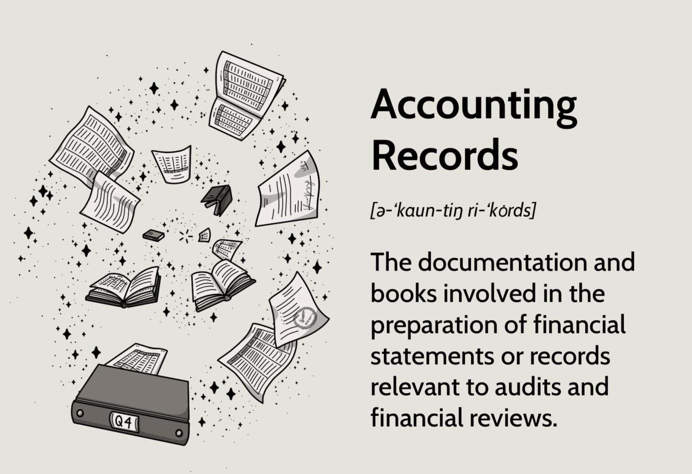

## Table of Contents

## What are accounting records and why are they important?

Accounting records are documents and files that a business uses to keep track of its money. These records include things like receipts, invoices, bank statements, and ledgers. They show all the money coming in and going out of a business. By keeping good accounting records, a business can know exactly how much money it has, how much it owes, and how much others owe it.

These records are important for many reasons. First, they help a business make good decisions. If a business knows its financial situation well, it can plan better for the future. For example, it can decide whether to expand or save money. Second, accounting records are needed for taxes. Governments require businesses to report their finances accurately, and good records make this easier. Finally, these records can help if there are any legal issues. They provide proof of all financial transactions, which can be important in disputes or audits.

## What are the basic components of accounting records?

The basic components of accounting records include journals, ledgers, and financial statements. Journals are where businesses first record their transactions. They act like a diary, noting down each sale, purchase, or payment as it happens. Ledgers then organize these entries into different accounts, like cash, sales, or expenses. This helps businesses see how much money they have in each category. Financial statements, like the income statement and balance sheet, summarize all this information. They show a business's financial health at a specific time or over a period.

These components work together to give a clear picture of a business's finances. Journals capture the raw data of daily transactions. Ledgers sort this data into meaningful categories. And financial statements use the data from ledgers to create reports that business owners, investors, and others can understand. By keeping these records up to date and accurate, a business can manage its money well, plan for the future, and meet legal requirements.

## Can you explain the difference between a journal and a ledger?

A journal is like a diary where a business writes down its money activities every day. When a business buys something, sells something, or pays someone, it writes it in the journal. Each entry in the journal has details like the date, what happened, and how much money was involved. Think of it as the first place where all the money transactions are recorded, just like you might write down your daily activities in a personal diary.

A ledger is different because it organizes the information from the journal into different categories. These categories are called accounts, like a cash account, a sales account, or an expenses account. The ledger takes all the entries from the journal and puts them into these accounts, so it's easier to see how much money the business has in each category. For example, if you want to know how much money the business has spent on supplies, you would look at the supplies account in the ledger. So, while the journal records everything as it happens, the ledger sorts it out to make it easier to understand.

## What are the common types of accounting records used in businesses?

Common types of accounting records used in businesses include journals, ledgers, and financial statements. Journals are like diaries where businesses write down their money activities every day. They record things like sales, purchases, and payments as they happen. This helps keep a daily track of all the money coming in and going out. Ledgers then take the information from the journals and organize it into different accounts. These accounts could be for cash, sales, expenses, or other categories. This makes it easier to see how much money is in each area of the business.

Financial statements are another important type of accounting record. They use the data from the ledgers to create summaries of the business's financial health. The income statement shows how much money the business made and spent over a period of time. The balance sheet shows what the business owns and owes at a specific time. These statements are useful for business owners, investors, and even banks to understand the business's financial situation. By keeping these records, businesses can make better decisions, handle taxes, and deal with any legal issues that might come up.

## How do accounting records help in financial reporting and decision-making?

Accounting records are super important for financial reporting because they give all the information needed to make reports. These reports, like the income statement and balance sheet, show how much money a business made, spent, and what it owns or owes. Without good accounting records, it would be hard to make these reports correctly. They help business owners, investors, and even banks understand the financial health of the business. This is important for things like paying taxes or getting loans.

These records also help a lot with decision-making. When a business keeps good records, it can see where its money is going and coming from. This helps the owners decide things like whether to expand the business, save money, or cut costs. For example, if the records show that the business is spending too much on supplies, the owners might look for cheaper suppliers. Or if the records show that sales are going up, they might decide to hire more people. Good accounting records make it easier to make smart choices for the future of the business.

## What is the role of source documents in accounting records?

Source documents are super important in accounting records. They are the first pieces of paper or digital files that show a business transaction happened. Things like receipts, invoices, and bank statements are all source documents. They give the details about each transaction, like the date, the amount of money, and who was involved. When a business records a transaction in its journal, it uses the information from these source documents. This helps make sure the records are correct and can be checked later if needed.

Source documents also help keep the business honest and follow the rules. If there's ever a question about a transaction, the business can show the source document as proof. This is really important for things like taxes and audits. Without source documents, it would be hard to prove that the numbers in the accounting records are right. They act like a backup, making sure the business can trust its own records and show them to others if they need to.

## How are accounting records maintained in a computerized accounting system?

In a computerized accounting system, businesses use special software to keep track of their money. This software helps them enter all their transactions into the computer instead of writing them down by hand. When a business makes a sale or pays a bill, they type the details into the software. The computer then puts these details into the right places in the journals and ledgers. This makes it easier and faster to keep everything up to date. The software also helps make financial reports like income statements and balance sheets with just a few clicks.

The software keeps all the source documents, like receipts and invoices, stored safely in the computer. This means the business can find them easily if they need to check something or show them to someone else. The system also has ways to make sure the numbers are correct, like checking that everything adds up right. This helps stop mistakes and keeps the records accurate. By using a computerized system, businesses can manage their money better, make decisions faster, and keep everything organized without having to use lots of paper.

## What are subsidiary ledgers and how do they relate to the general ledger?

Subsidiary ledgers are like smaller, detailed notebooks that keep track of specific parts of a business's money. They focus on things like customers, suppliers, or different types of expenses. For example, a business might have a subsidiary ledger just for keeping track of what each customer owes them. This helps the business see exactly who owes what without having to look through the big general ledger.

The general ledger is like the main notebook that has a summary of all the business's money. It shows totals for things like cash, sales, and expenses. The subsidiary ledgers feed into the general ledger. This means that all the details from the subsidiary ledgers are added up and put into the general ledger. So, if you want to see the big picture of the business's money, you look at the general ledger. But if you need to see the details about a specific part, like how much a certain customer owes, you look at the subsidiary ledger.

## What are the legal requirements for maintaining accounting records?

Businesses have to follow rules about keeping their accounting records. These rules can be different depending on where the business is located. In many places, the law says that businesses must keep their records for a certain number of years, usually between 3 to 7 years. This is so the government can check the records if they need to, like for taxes or audits. Businesses also have to make sure their records are correct and honest. If they don't follow these rules, they could get in trouble and have to pay fines or even go to court.

Keeping good records is not just about following the law. It also helps businesses run smoothly. Good records help businesses know how much money they have, how much they owe, and how much others owe them. This makes it easier to pay taxes correctly and deal with any legal issues that might come up. By keeping their records in order, businesses can avoid problems and make better decisions for the future.

## How can errors in accounting records be identified and corrected?

Errors in accounting records can be found by checking the numbers carefully. One way to do this is by using something called a trial balance. This is a list that shows all the money in the accounts to see if they add up right. If they don't, there might be a mistake. Another way is to compare the records with the original source documents, like receipts and invoices, to make sure everything matches. Sometimes, businesses use special software that can spot errors by looking for numbers that don't seem right or by checking that everything follows the rules.

When an error is found, it needs to be fixed. To do this, the business makes a new entry in the journal to correct the mistake. This entry will change the numbers in the ledger to make them right. It's important to write down why the correction was made, so everyone knows what happened. If the error is big or could affect the business a lot, it's a good idea to tell the boss or even an accountant to make sure everything is handled correctly. By fixing errors quickly and carefully, businesses can keep their records accurate and trustworthy.

## What advanced techniques are used for analyzing accounting records?

Advanced techniques for analyzing accounting records include using special software and methods that help businesses understand their money better. One common technique is called ratio analysis. This is when businesses look at numbers in their records to see things like how much profit they are making compared to their sales, or how much money they owe compared to what they own. By using ratios, businesses can see if they are doing well or if they need to make changes. Another technique is trend analysis, where businesses look at their records over time to see if their money is going up or down. This helps them plan for the future and make decisions based on what has happened before.

Another advanced technique is called horizontal and vertical analysis. Horizontal analysis compares numbers from different time periods, like this year's sales to last year's sales, to see how things have changed. Vertical analysis looks at numbers as a part of a whole, like how much of the total expenses come from one specific cost. Both of these help businesses see their financial situation in different ways. Lastly, businesses might use something called variance analysis, where they compare what they expected to happen with what actually happened. If there's a big difference, they can figure out why and fix any problems. These techniques help businesses make smart choices and keep their money in good shape.

## How do international accounting standards affect the maintenance of accounting records?

International accounting standards, like those set by the International Financial Reporting Standards (IFRS), are rules that businesses all over the world follow to keep their money records. These standards make sure that businesses record their money in the same way, no matter where they are. This helps people who want to invest in a business or do business with it understand the records easily. For example, if a business in France wants to work with a business in Japan, both can use the same standards to keep their records, making it easier to compare and understand each other's financial situation.

Following these standards means businesses have to be careful about how they write down their money activities. They need to make sure their records follow the rules set by IFRS or other similar standards. This can affect how they keep their journals, ledgers, and financial statements. For instance, the standards might say how to record things like sales, expenses, or what the business owns and owes. By following these rules, businesses can make sure their records are correct and can be trusted by others, which is important for doing business around the world.

## References & Further Reading

[1]: Bergstra, J., Bardenet, R., Bengio, Y., & Kégl, B. (2011). ["Algorithms for Hyper-Parameter Optimization."](https://dl.acm.org/doi/10.5555/2986459.2986743) Advances in Neural Information Processing Systems 24.

[2]: ["Advances in Financial Machine Learning"](https://www.amazon.com/Advances-Financial-Machine-Learning-Marcos/dp/1119482089) by Marcos Lopez de Prado

[3]: ["Evidence-Based Technical Analysis: Applying the Scientific Method and Statistical Inference to Trading Signals"](https://www.amazon.com/Evidence-Based-Technical-Analysis-Scientific-Statistical/dp/0470008741) by David Aronson

[4]: ["Machine Learning for Algorithmic Trading"](https://github.com/stefan-jansen/machine-learning-for-trading) by Stefan Jansen

[5]: ["Quantitative Trading: How to Build Your Own Algorithmic Trading Business"](https://www.amazon.com/Quantitative-Trading-Build-Algorithmic-Business/dp/1119800064) by Ernest P. Chan