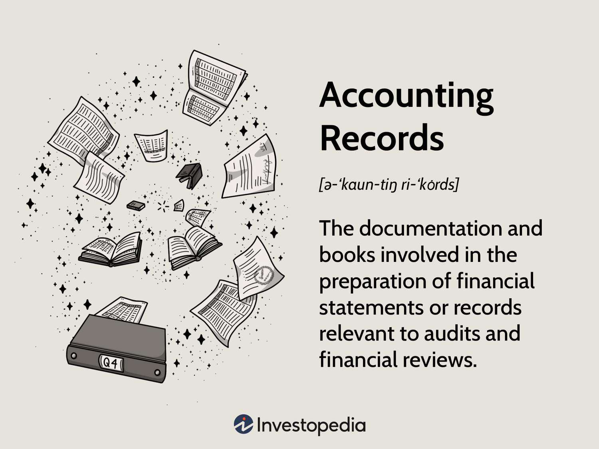

In the rapidly evolving world of finance, understanding financial documentation is critical, particularly within accounting and algorithmic trading. Financial documentation involves the meticulous recording and organization of financial transactions and events. This ensures transparency, accountability, and regulatory compliance, which are paramount in modern financial practices. Proper documentation serves as the foundation for all financial activities, enabling businesses to maintain accurate and reliable records that reflect their economic actions.

Algorithmic trading, a technological advancement that automates trading decisions using sophisticated algorithms, presents new complexities in financial operations. Unlike traditional trading, where human decisions drive transactions, algorithmic trading relies on predefined criteria set within algorithms to execute trades. This revolution in trading requires precise financial documentation systems that can keep pace with the volume and velocity of trades executed by algorithms. Automation in trading necessitates an advanced level of accuracy in recording financial transactions, not only to optimize trading efficiency but also to meet stringent compliance and reporting standards.

This article explores various types of financial documentation and accounting records within the context of algorithmic trading. By understanding these components, finance professionals can better navigate the challenges and opportunities presented by merging traditional accounting practices with automated trading systems.

## Table of Contents

## Understanding Financial Documentation and Its Importance

Financial documentation refers to the meticulous process of recording all financial transactions within a business. This process involves various essential components, such as vouchers, ledgers, invoices, and financial statements, each playing a crucial role in ensuring that all financial activities are thoroughly documented.

Vouchers are fundamental to financial documentation as they provide tangible evidence of transactions, supporting entries in accounting records. These documents typically detail essential information such as transaction dates, involved parties, and amounts. Vouchers are often categorized into different types, including debit vouchers, credit vouchers, and journal vouchers, each serving distinct purposes in the accounting cycle.

Ledgers and journals play a significant role in organizing financial data. Journals are used to categorize initial transactions, while ledgers consolidate these journal entries into comprehensive financial accounts. Together, they facilitate the accurate tracking of a company's financial performance and position.

Invoices are another critical component of financial documentation. They act as official requests for payment in business transactions, ensuring the seller receives due compensation for goods or services rendered. Additionally, invoices contribute to record-keeping by providing a detailed account of sales, purchases, and corresponding monetary exchanges.

Financial statements, such as balance sheets, income statements, and cash flow statements, provide a summarized representation of a company's financial health. These documents are indispensable for stakeholders and regulatory bodies, offering insights into a company's economic status and aiding informed decision-making.

Proper financial documentation is imperative not only for effective internal management but also for audits and compliance with external regulatory standards. Accurate and well-maintained financial records detail a company's financial activities and are critical for demonstrating transparency and accountability. They enable businesses to adhere to legal requirements and facilitate inspections by regulatory authorities.

In summary, financial documentation is a cornerstone of sound business management. Its rigorous implementation ensures the integrity of financial records, supporting both the operational and regulatory demands of a modern business environment.

## Types of Accounting Records

Accounting records serve as the backbone of any financial management system, providing a structured framework for tracking and analyzing a business's financial activities. These records are systematically categorized into several distinct elements, including transactions, journals, general ledgers, trial balances, and financial statements. Each category serves a unique purpose, contributing to the overall integrity and comprehensiveness of financial documentation.

**Transactions:** Transactions form the foundational layer of accounting records, capturing every business event that alters the financial state of an enterprise. These events may include sales, purchases, receipts, and payments. Essentially, a transaction occurs whenever there is an exchange of goods, services, or funds. The meticulous recording of transactions is vital, as it ensures that all subsequent entries into journals and ledgers remain accurate and truthful.

**Journals:** Journals act as the primary recording book wherein transactions are initially logged in chronological order. Each entry in a journal specifies the date, accounts involved, amounts, and a description of the transaction. Journals facilitate the categorization of transactions into specific areas, such as sales, purchases, or cash receipts, making it easier to track and analyze different aspects of financial activity. For example, a sales journal records only sales, allowing accountants to efficiently manage revenue-related transactions.

**General Ledgers:** After transactions are entered into journals, they are subsequently posted to the general ledger. The general ledger serves as a comprehensive financial accounting record, consolidating detailed entries from various journals into specific accounts, such as assets, liabilities, equity, revenues, and expenses. This consolidation enables businesses to have a complete view of their financial standing at any given time. It essentially acts as the central repository of all financial information for an enterprise, facilitating the preparation of financial statements.

**Trial Balances:** Once entries are posted to the general ledger, a trial balance is prepared. This record is a statement that lists all ledger accounts with their respective credit or debit balances at a particular point in time. The main objective of the trial balance is to verify that the total debits equal the total credits, ensuring the books are balanced. If discrepancies are identified, they must be corrected to maintain the integrity of the financial records. This step is crucial as it detects errors, such as omissions or mispostings, early in the accounting cycle.

**Financial Statements:** Finally, financial statements are prepared using the data from the general ledger and trial balance. These statements provide a summarized representation of a business's financial health and performance. The primary financial statements include the balance sheet, income statement, and cash flow statement. A balance sheet details the company’s assets, liabilities, and shareholders' equity at a specific point in time. The income statement outlines the company's revenues and expenses over a period, revealing profit or loss, while the cash flow statement showcases the inflow and outflow of cash within the organization. These statements are critical for informing management decisions, attracting investors, and ensuring compliance with regulatory requirements.

Each category of accounting records plays an integral role in the financial documentation process, ensuring that an organization's financial status is accurately represented and understood by both internal and external stakeholders.

## The Role of Vouchers in Accounting

Vouchers are fundamental elements in the accounting system, serving as authentic documents that attest to the occurrence and legitimacy of financial transactions. These documents encapsulate critical details such as transaction dates, the parties involved, and the monetary amounts, providing a foundational basis for the entries recorded in accounting [books](/wiki/algo-trading-books). The presence of vouchers is indispensable for ensuring the accuracy, transparency, and compliance of financial records, safeguarding against errors and fraud.

Vouchers are primarily classified into three types: debit vouchers, credit vouchers, and journal vouchers. Each type plays a distinct role within the accounting lifecycle:

1. **Debit Vouchers**: These vouchers are issued when a payment is made or an expense is incurred. They serve as evidence for disbursements from an organization’s accounts, often accompanied by supporting documents such as receipts or invoices, which substantiate the nature and purpose of the expenditures.

2. **Credit Vouchers**: Conversely, credit vouchers are generated for transactions that increase a company's funds. These transactions could involve revenue from sales or any other form of income that strengthens the financial position of a business. Credit vouchers confirm the source and legitimacy of the incoming funds.

3. **Journal Vouchers**: These documents are used for recording non-cash entries, adjustments, or transfers between accounts that do not immediately involve cash inflow or outflow. Journal vouchers are crucial for maintaining the integrity of financial reporting by ensuring that all recorded adjustments adhere to double-entry bookkeeping principles.

The meticulous management of these vouchers is paramount. Accurate record-keeping of vouchers enhances the reliability of the financial accounting system. Automated accounting systems often incorporate voucher management features, enabling real-time tracking and storage, which contributes significantly to compliance with regulatory standards and audits.

In an increasingly digitized financial environment, the integration of voucher management with modern software systems can optimize accuracy and efficiency. Ensuring that vouchers are properly scrutinized and critically evaluated before being entered into accounting software fosters an environment of trust and legitimacy, thereby upholding the overarching objectives of accounting: accuracy, transparency, and accountability.

## Algorithmic Trading and Financial Documentation

Algorithmic trading employs sophisticated algorithms to make swift trading decisions, significantly boosting the efficiency and speed of transactions. This process uses quantitative models and mathematical computations to perform trades in fractions of a second, reducing human error and capitalizing on market movements. Algorithms evaluate multiple market data points, such as price, timing, and [volume](/wiki/volume-trading-strategy), to execute trades under pre-defined conditions. The benefits include reduced transaction costs, enhanced efficiency, and the ability to process vast data sets more effectively than manual trading.

However, the intricacies of [algorithmic trading](/wiki/algorithmic-trading) demand comprehensive documentation systems. These systems must seamlessly integrate with digital trading platforms to manage the substantial data flow generated by automated strategies. Effective financial documentation ensures the integrity and reliability of the trading process, necessitating real-time maintenance of vouchers and accounting records. Each transaction must be documented with precision to meet compliance requirements and support the seamless functioning of automated systems.

The accuracy of financial records in algorithmic trading is crucial not only for internal analysis and strategy optimization but also for adhering to external regulatory standards. Automated systems necessitate a robust framework for documenting trades, which include crucial details like transaction time stamps, algorithmic adjustments, and pricing at execution. These records are pivotal in addressing compliance audits, validating trading strategies, and managing financial risks associated with high-frequency trading.

Implementing a sophisticated documentation process involves the use of advanced technologies capable of capturing and processing data instantaneously. Real-time data logging and audit trails form the backbone of such systems, highlighting any discrepancies and facilitating swift resolution. Additionally, leveraging [machine learning](/wiki/machine-learning) and [artificial intelligence](/wiki/ai-artificial-intelligence) in these systems can enhance data accuracy and provide predictive insights, further refining the trading process.

The integration of comprehensive financial documentation practices in algorithmic trading isn't merely about regulatory compliance but also about building a transparent and efficient trading environment. By maintaining meticulous records, financial professionals can leverage data-driven insights to optimize algorithms, refine trading strategies, and achieve a competitive edge in the financial markets.

## Challenges and Opportunities in Algo Trading

The integration of algorithmic trading into modern financial systems introduces several challenges, primarily focused on data management, regulatory compliance, and maintaining documentation accuracy. As trading algorithms execute high-frequency trades, they generate vast volumes of data that require efficient management and storage solutions. This necessitates the adoption of advanced data processing techniques and infrastructure to handle large datasets effectively, ensuring data integrity and reducing latency in execution.

Regulatory compliance within algorithmic trading is another critical challenge. Regulatory bodies such as the Securities and Exchange Commission (SEC) and the Financial Industry Regulatory Authority (FINRA) impose stringent requirements to ensure fair and transparent trading practices. Firms must implement systems to ensure that trading algorithms adhere to these regulations, including pre-trade risk assessments and post-trade surveillance, while maintaining comprehensive audit trails.

Ensuring accuracy in financial documentation is paramount. Given the automated nature of algorithmic trading, the risk of errors in execution and record-keeping is elevated. Robust documentation practices are essential to capture detailed trade information, including timestamps, counterparty details, and execution prices, allowing firms to account for and reconcile discrepancies swiftly. This transparency aids in auditing processes and supports compliance obligations.

Technological advancements like artificial intelligence (AI) and blockchain offer significant opportunities to overcome these challenges. AI can enhance data processing capabilities, enabling real-time analysis and anomaly detection, thus improving decision-making efficacy and reducing the risk of erroneous trades. Blockchain technology provides a secure, immutable ledger for transaction recording, ensuring accuracy and transparency. Smart contracts, running on blockchain platforms, can automate compliance checks and documentation processes, reducing human intervention and minimizing errors.

Accountants and finance professionals must adapt to these technological shifts by developing expertise in these domains. While maintaining core accounting principles, they need to leverage technological tools to facilitate efficient financial management. Continuous professional development and a willingness to embrace new technologies are essential for navigating the complexities of algorithmic trading, ensuring accuracy and compliance while capitalizing on the opportunities technology presents.

## Conclusion

In the dynamic arena of algorithmic trading, mastering financial documentation and accounting records is non-negotiable for success. Ensuring transactional transparency and accuracy depends on how well finance professionals can integrate traditional accounting practices with modern technological solutions. This integration not only enhances efficiency but also solidifies compliance with complex regulatory requirements.

As algorithmic trading continues to evolve, the necessity for accurate, real-time financial documentation becomes paramount. Algorithms analyze and execute trades at speeds unmatched by manual processes, but these operations require a robust backing of meticulously maintained accounting records. Errors or delays in documentation can have significant consequences, potentially impacting both compliance and financial performance.

Technological advancements, such as artificial intelligence and blockchain, offer transformative opportunities to streamline the financial documentation processes. AI-powered tools can automate routine accounting tasks, identify anomalies in real-time, and predict market trends, thus reducing the potential for human error. Simultaneously, blockchain technology provides a decentralized, transparent, and immutable ledger, enhancing the integrity and security of financial records.

The financial landscape is undergoing rapid and continual change, urging professionals in the field to adopt a proactive stance toward learning and adaptation. Continued education and skill development are vital for keeping pace with technological innovations and the corresponding shifts in accounting practices. Professionals must remain agile, embracing new tools and methodologies that offer enhanced precision and efficiency.

Ultimately, balancing these demands is critical for long-term success in finance and trading. As the sector matures, those who effectively blend traditional expertise with cutting-edge technology will be positioned to thrive in an increasingly competitive environment.

## References & Further Reading

[1]: Bergstra, J., Bardenet, R., Bengio, Y., & Kégl, B. (2011). ["Algorithms for Hyper-Parameter Optimization."](https://dl.acm.org/doi/10.5555/2986459.2986743) Advances in Neural Information Processing Systems 24.

[2]: ["Advances in Financial Machine Learning"](https://www.amazon.com/Advances-Financial-Machine-Learning-Marcos/dp/1119482089) by Marcos Lopez de Prado

[3]: ["Evidence-Based Technical Analysis: Applying the Scientific Method and Statistical Inference to Trading Signals"](https://www.amazon.com/Evidence-Based-Technical-Analysis-Scientific-Statistical/dp/0470008741) by David Aronson

[4]: ["Machine Learning for Algorithmic Trading"](https://github.com/stefan-jansen/machine-learning-for-trading) by Stefan Jansen

[5]: ["Quantitative Trading: How to Build Your Own Algorithmic Trading Business"](https://www.amazon.com/Quantitative-Trading-Build-Algorithmic-Business/dp/1119800064) by Ernest P. Chan