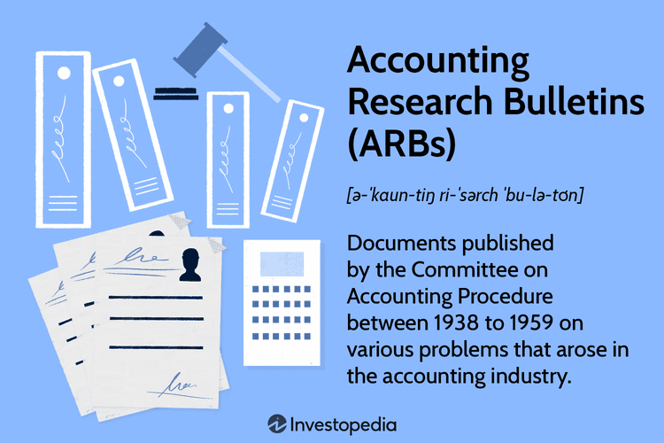

The integration of accounting standards and financial innovations is crucial in today’s rapidly evolving financial landscape. As the financial world grows increasingly complex, the ability to effectively align historical accounting practices with modern technological advancements becomes vital. This intersection is prominently seen through the lens of Accounting Research Bulletins (ARBs) and algorithmic trading.

Accounting Research Bulletins, developed in the mid-20th century, played a pivotal role in the establishment of foundational accounting principles. These bulletins were essential in addressing the challenges of financial reporting, aiming for consistency and comparability across financial statements. Their significance lies not only in their historical impact but also in their influence on the evolution of accounting standards, building a bridge to contemporary frameworks such as Generally Accepted Accounting Principles (GAAP) and International Financial Reporting Standards (IFRS).

On the other end of the spectrum, algorithmic trading represents a leap into modern financial technology, utilizing complex algorithms to automate trading decisions. This innovation offers unprecedented speed and precision, reshaping how securities are bought and sold in financial markets. The rise of algorithmic trading underscores a paradigm shift in investment strategies, marked by increased market liquidity and expanded opportunities for sophisticated trading practices.

Understanding ARBs and the rise of algorithmic trading is essential for professionals navigating today’s financial reporting and investment landscapes. Analyzing the development and integration of these elements offers not only a historical perspective but also insights into future challenges and opportunities in accounting and trading standards. By examining both historical precedents and technological advancements, we aim to shed light on the continuous evolution of financial standards and their implications for future practices.

## Table of Contents

## Accounting Research Bulletins: A Historical Overview

The Accounting Research Bulletins (ARBs) were instrumental documents promulgated by the Committee on Accounting Procedure (CAP) under the guidance of the American Institute of Accountants, now known as the American Institute of Certified Public Accountants (AICPA). From 1939 to 1959, CAP issued ARBs to address a range of pressing accounting challenges and ambiguities within the industry. These bulletins played a pivotal role in the establishment of standardized accounting practices, especially in critical areas such as inventory valuation, tax allocation, and the treatment of intangible assets. 

One prominent impact of ARBs was the enhancement of financial statement comparability. By establishing guidelines to address inconsistencies in accounting methods, ARBs sought to create uniformity across the financial statements of different firms. This was particularly important for stakeholders, such as investors and regulators, who required reliable and comparable financial information to make informed decisions.

Despite the substantial influence of ARBs in shaping accounting practices, they lacked binding authority. ARBs served primarily as guidelines rather than mandates, which limited their enforceability. This intrinsic limitation eventually led to their replacement by more formalized and authoritative accounting standards. 

Notwithstanding this limitation, the significance of ARBs lay in their pioneering efforts to standardize accounting principles, influencing subsequent developments in accounting standards. Key examples of ARBs include Bulletin No. 43, which related to the allocation of income taxes, and Bulletin No. 45, concerning the preparation of consolidated financial statements. These bulletins underscore the ARBs’ contribution to achieving consistency and transparency in financial reporting, laying the foundation upon which modern accounting standards were built. Ultimately, ARBs served as a crucial transitional framework, bridging early accounting practices and the more structured standards that followed.

## The Evolution of Accounting Standards Post-ARBs

In 1959, the establishment of the Accounting Principles Board (APB) marked a pivotal transition from the earlier framework provided by the Accounting Research Bulletins (ARBs). The APB's formation aimed to develop a cohesive set of accounting principles in response to the growing complexities within the financial landscape and the limitations noted in the ARBs' authoritative reach. The APB was integral in continuing the pursuit of standardized accounting practices, though it faced challenges that eventually led to its evolution into more formalized bodies.

The Financial Accounting Standards Board (FASB), inaugurated in 1973, took over the responsibilities of the APB with an enhanced mandate to establish and improve standards of financial accounting and reporting. FASB's introduction of the Generally Accepted Accounting Principles (GAAP) significantly advanced these efforts. GAAP served as a comprehensive framework designed to ensure financial reporting's consistency, relevance, and transparency.

FASB's processes evolved through extensive public consultations, incorporating a rigorous due process to ensure that a wide array of stakeholders could contribute to and influence the development of accounting standards. This participatory approach facilitated the integration of diverse perspectives, enhancing the credibility and effectiveness of the standards.

Globally, the principles initially proposed by the ARBs significantly influenced the development of accounting standards across various jurisdictions. The emergence of the International Financial Reporting Standards (IFRS) is a testament to this influence. IFRS, designed to ensure that companies' financial statements are comparable across international borders, reflects the evolution of comprehensive and binding accounting regulations that began with ARBs.

The transition from ARBs to bodies like FASB and IFRS illustrates a profound shift towards more intricate and enforceable accounting frameworks. This evolution underscores the field's commitment to adapting to economic changes, technological advances, and the global nature of business, ensuring that accounting practices remain robust, transparent, and functional in an ever-evolving financial environment.

## Algorithmic Trading: The New Frontier in Financial Markets

Algorithmic trading, or algo trading, has emerged as a transformative force within financial markets. This advanced trading technique leverages computer algorithms to automate the process of buying and selling securities, capitalizing on speed and precision far superior to traditional manual trading methods. The use of algorithms allows for rapid execution of trades, often within milliseconds, a capability that is harnessed by high-frequency trading ([HFT](/wiki/high-frequency-trading-strategies)) platforms to exploit minute price discrepancies.

At its core, algo trading is driven by sophisticated algorithms that process vast amounts of market data in real-time, identifying profitable trading opportunities based on pre-determined criteria. These criteria can range from statistical [arbitrage](/wiki/arbitrage), which exploits pricing inefficiencies, to [momentum](/wiki/momentum) trading strategies that follow the direction of market trends. By executing these trades automatically, algo trading offers increased accuracy, reducing the possibility of human error and emotional bias.

The adoption of [algorithmic trading](/wiki/algorithmic-trading) in modern financial markets has significantly enhanced market [liquidity](/wiki/liquidity-risk-premium). Liquidity refers to the ease with which assets can be bought or sold in the market without affecting the asset's price. Algo trading contributes to this ease by increasing the [volume](/wiki/volume-trading-strategy) and frequency of trades, which in turn can lower transaction costs and narrow bid-ask spreads. Additionally, the ability to swiftly adjust trading positions enables the implementation of complex strategies that were previously impractical, allowing traders to manage risk and optimize their portfolios more effectively.

Despite its advantages, algorithmic trading introduces several challenges that must be carefully managed. One major concern is the potential for increased market [volatility](/wiki/volatility-trading-strategies). The swift and simultaneous execution of large volumes of trades by numerous algorithms can lead to abrupt price movements, as seen in events like the 2010 "Flash Crash." Moreover, the competitive nature of high-frequency trading presents regulatory challenges. There is ongoing debate regarding the fairness and market impact of HFT, with regulators seeking ways to ensure that it does not undermine market integrity.

Furthermore, understanding the underlying mechanisms of algo trading is paramount for investors and regulators. For investors, comprehending how these algorithms function can aid in developing effective trading strategies and making informed decisions. For regulators, it is crucial to establish a balanced regulatory framework that fosters innovation while safeguarding against systemic risks. 

In summary, algorithmic trading embodies a significant technological advancement, reshaping the landscape of financial markets. While its capacity to enhance liquidity and trading efficiency is undeniable, the accompanying regulatory and volatility challenges necessitate a nuanced understanding for effective management. As technology continues to advance, the integration of innovative methods within existing financial frameworks will be essential in maintaining market stability and integrity.

## Comparative Insights: Traditional Accounting Practices and Modern Trading

While Accounting Research Bulletins (ARBs) addressed the challenge of standardizing accounting practices, modern algorithmic trading has emerged to meet the fast-paced demands of today's financial markets. Each field, despite appearing distinct in purpose and function, emphasizes transparency, ethical practices, and regulatory compliance. The shift from ARBs to more formalized accounting standards, like those established by the Financial Accounting Standards Board (FASB), mirrors the transition in trading practices from manual operations to highly automated systems.

ARBs laid the foundation for consistent accounting by addressing issues such as inventory valuation and tax allocation. This historical focus on standardization was crucial in ensuring that financial statements were comparable and reliable, thereby enhancing transparency and ethical financial reporting. Similarly, algorithmic trading aims to improve market efficiencies and transparency by executing trades with precision and speed, thus reducing human error and potential manipulation.

The evolution of accounting standards from ARBs to structured frameworks like Generally Accepted Accounting Principles (GAAP) highlights a progressive journey toward more rigorous and binding regulations. Similarly, the advent of algorithmic trading represents a technological leap from traditional trading floors to digital platforms where algorithms can assess and execute trades in fractions of a second.

Analyzing these transitions sheds light on managing technological advancements while adhering to robust financial standards. For example, the regulatory landscape for algo trading is continually evolving to address concerns such as market volatility and potential unfair advantages gained through high-frequency trading. This reflects a parallel with accounting standards, which have been iteratively developed to address new financial instruments and reporting challenges in an evolving economic environment.

Such comparative insights emphasize the need for a critical balance between fostering innovation and maintaining regulatory oversight. While technological advancements present opportunities for enhanced efficiency and accuracy, they also require vigilant regulation to ensure ethical practice and market stability. Therefore, both accounting standards and trading practices must adapt continually, aiming towards a framework that ensures transparency, fairness, and accountability.

In summary, both traditional accounting practices and modern trading systems illustrate the ongoing interplay between innovation and regulation. Understanding these dynamics is crucial for financial professionals seeking to navigate and lead within these ever-changing landscapes.

## Future Directions in Accounting and Trading Standards

Emerging technologies such as blockchain and [artificial intelligence](/wiki/ai-artificial-intelligence) (AI) are poised to redefine the landscape of accounting and trading standards, presenting both opportunities and challenges. Blockchain, with its decentralized ledger capabilities, offers unmatched transparency and security in financial transactions and record-keeping. This technology can automate and streamline audits by providing immutable, real-time data, thus reducing the risk of errors and fraud. Accounting professionals must adapt to these transformative changes by learning to harness blockchain's potential for enhancing accountability and accuracy in financial statements.

In tandem, the rise of AI has profound implications for accounting and trading. Machine learning algorithms are capable of analyzing large datasets to detect patterns and anomalies, leading to more informed decision-making. AI-powered tools in accounting can automate repetitive tasks such as bookkeeping, tax calculations, and compliance checks, thereby increasing efficiency and reducing human error. These advancements necessitate the integration of AI within existing accounting frameworks to address emerging complexities.

The development and implementation of sustainability and Environmental, Social, and Governance ([ESG](/wiki/esg-investing)) reporting standards are gaining traction in the accounting sector. As stakeholders increasingly demand greater transparency in corporate social responsibility, accountants are tasked with incorporating ESG criteria into financial reporting. This shift requires the establishment of cohesive standards and metrics to accurately assess and report on non-financial factors, driving companies to align their practices with sustainable development goals.

In trading, AI and [machine learning](/wiki/machine-learning) continue to revolutionize algorithmic trading capabilities. High-frequency trading platforms leverage sophisticated algorithms to execute trades at unprecedented speeds, capitalizing on market inefficiencies. Future advancements are likely to focus on refining these algorithms to improve predictive accuracy and risk management. Such innovations necessitate ongoing regulatory oversight to mitigate potential risks, such as market manipulation and systemic volatility.

Efforts in both accounting and trading prioritize accuracy, reliability, and transparency as fundamental principles. As new technologies emerge, maintaining these values is critical to fostering trust and integrity in financial markets. Continuous research and development will be essential to integrating technological advancements while developing robust standards that address new challenges. The future of accounting and trading will be characterized by a delicate balance between innovation and regulation, ensuring that technological progress does not compromise the foundational tenets of the financial industry.

## Conclusion

The exploration of Accounting Research Bulletins (ARBs) and algorithmic trading illustrates the dynamic and evolving nature of the accounting and financial sectors over the decades. Historically, ARBs laid the foundation for the development of standardized accounting practices. Their evolution into more formalized structures such as Generally Accepted Accounting Principles (GAAP) and International Financial Reporting Standards (IFRS) reflects the need for consistent and transparent financial reporting—an essential [factor](/wiki/factor-investing) in fostering trust and accountability in financial markets.

Similarly, the rise of algorithmic trading epitomizes the technological transformation within financial markets. The transition from traditional trading methods to sophisticated, automated strategies demonstrates the sector's ability to adapt to technological advancements that increase efficiency and accuracy. However, along with these advancements come new challenges, including regulatory considerations and the potential for increased market volatility.

For professionals in the fields of accounting and finance, staying informed and adaptable is crucial. The continuous evolution spurred by technological, economic, and regulatory changes demands a proactive approach to both harness opportunities and mitigate risks. By understanding the historical precedents set by ARBs and the modern implications of algorithmic trading, practitioners can make informed decisions that align with the evolving landscape.

Ultimately, the relationship between ARBs and algorithmic trading not only highlights the adaptive capabilities inherent in accounting and finance but also underscores the journey towards innovation and standardization. This evolution is critical for maintaining robust, transparent, and efficient markets that serve the needs of both investors and the broader economy. As we look to the future, these insights will guide the development of frameworks that address emerging challenges and opportunities, ensuring that the financial sector remains resilient and forward-looking.

## References & Further Reading

[1]: ["The Evolution of U.S. Generally Accepted Accounting Principles (GAAP)"](https://www.researchgate.net/publication/376131815_The_Evolution_of_Generally_Accepted_Accounting_Principles_A_Focused_Look_into_the_International_Financial_Reporting_Standards) - Journal of Accountancy

[2]: ["Accounting Standards Codification"](https://asc.fasb.org/) - Financial Accounting Standards Board

[3]: Malkiel, B. G. (2013). ["The Efficient Market Hypothesis and Its Critics"](https://www.princeton.edu/~ceps/workingpapers/91malkiel.pdf) - Journal of Economic Perspectives

[4]: ["Algorithmic Trading and Information"](https://faculty.haas.berkeley.edu/hender/ATInformation.pdf) in *High-Frequency Trading and Electronic Financial Markets* by Charles Taylor 

[5]: Lopez de Prado, M. (2018). ["Advances in Financial Machine Learning"](https://www.amazon.com/Advances-Financial-Machine-Learning-Marcos/dp/1119482089) - Wiley

[6]: ["The Impact and Implications of Algorithmic Trading in the United States"](https://www.sec.gov/files/Algo_Trading_Report_2020.pdf) - U.S. Securities and Exchange Commission Report

[7]: ["Historical Background of ARBs and Its Progression"](https://en.wikipedia.org/wiki/Discovery_and_development_of_angiotensin_receptor_blockers) - Accounting.com

[8]: Chan, E. P. (2009). ["Quantitative Trading: How to Build Your Own Algorithmic Trading Business"](https://github.com/ftvision/quant_trading_echan_book) - Wiley

[9]: ["Conceptual Framework for Financial Reporting"](https://www.ifrs.org/content/dam/ifrs/publications/pdf-standards/english/2021/issued/part-a/conceptual-framework-for-financial-reporting.pdf) - International Financial Reporting Standards (IFRS)

[10]: Cartea, Á., Jaimungal, S., & Penner, J. (2015). ["Algorithmic and High-Frequency Trading"](https://assets.cambridge.org/97811070/91146/frontmatter/9781107091146_frontmatter.pdf) - Cambridge University Press