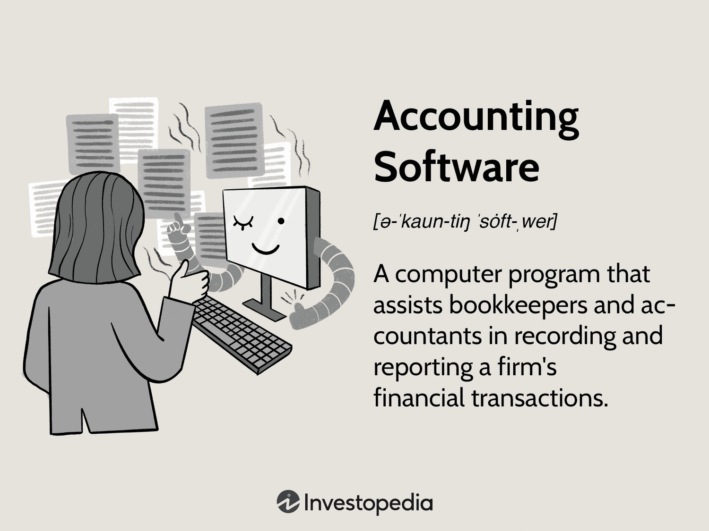

In this digital age, technology has significantly transformed the financial landscape, influencing how businesses manage their operations and investments. Two notable innovations driving this change are accounting software and algorithmic trading. These technologies have revolutionized traditional financial practices, offering businesses increased efficiency, accuracy, and strategic capabilities.

Accounting software has evolved from basic ledger systems to sophisticated platforms that automate complex financial processes. This software enables businesses to manage their financial data with greater precision and speed, reducing the reliance on manual accounting methods. By automating routine tasks, accounting software minimizes human error, enhances compliance with regulatory standards, and provides real-time financial tracking, all essential for informed decision-making.



On the other hand, algorithmic trading employs computer algorithms to execute trades autonomously based on pre-set strategies. This approach eliminates emotional biases, enhances execution speed, and ensures precision, making it a valuable asset in today's fast-paced financial markets. Algorithms can be tailored to respond to market conditions, leveraging data-driven insights to maximize trading efficiency.

This article aims to explore various types of accounting software, discuss their benefits, and examine how they integrate with algorithmic trading to create an advanced financial management ecosystem. By leveraging these technologies, businesses can gain a competitive advantage, streamline operations, and position themselves for future growth and innovation.

## Table of Contents

## Types of Accounting Software

Accounting software is a critical component of modern business operations, providing a range of solutions from basic, ready-made applications to sophisticated, highly customized systems that meet specific organizational requirements. At the most fundamental level, these software solutions support businesses in streamlining their financial activities, enhancing accuracy, and ensuring compliance with relevant regulations.

General ledger software forms the bedrock of most accounting systems. It offers a comprehensive framework for recording and managing financial transactions, categorizing them into debits and credits, and generating critical financial statements like the balance sheet and income statement. This functionality is crucial for businesses of all sizes, providing clarity and consistency in financial reporting.

Billing and invoicing software automates the creation and management of client invoices. This type of software improves cash flow by ensuring that invoices are accurate, consistent, and sent out promptly. Advanced billing systems may also include features for recurring billing, payment reminders, and integration with online payment systems, reducing the administrative burden on accounting staff.

Payroll management systems are essential for businesses with employees. They automate the calculation of wages, salaries, deductions, and taxes, simplifying the often complex process of payroll management. Automated payroll systems significantly reduce the risk of errors and ensure compliance with labor laws and tax regulations, which can vary significantly by jurisdiction.

Enterprise Resource Planning (ERP) systems represent a more integrated approach to accounting software. These systems go beyond basic accounting functions to include modules for managing various aspects of business operations, such as human resources, supply chain, and customer relations. ERPs provide a unified platform that facilitates real-time data sharing across departments, improving overall operational efficiency and decision-making.

The choice of accounting software is influenced primarily by the size and complexity of a business and its accounting needs. Small businesses and startups might opt for simple, off-the-shelf solutions that provide core functionalities at a manageable cost. In contrast, larger enterprises often require robust, customizable systems that can accommodate intricate financial processes and high volumes of transactions. Additionally, industry-specific requirements can dictate the need for tailored features, such as inventory management or project costing, in sectors like manufacturing or construction.

In summary, selecting the appropriate type of accounting software is a strategic decision that requires careful consideration of a business's current needs, future growth, and industry-specific requirements. By leveraging the right tools, businesses can achieve greater efficiency, accuracy, and compliance in their financial operations.

## Benefits of Accounting Software

Accounting software significantly enhances the efficiency of financial management processes by automating routine tasks, thereby reducing the time and costs typically associated with manual accounting. Automation minimizes the need for manual data entry and calculations, decreasing the likelihood of human error while providing more accurate financial records. This precision is vital for generating financial reports that comply with regulatory standards, which can be crucial for businesses aiming to adhere to financial regulations and avoid potential penalties.

Real-time financial tracking is another key advantage offered by accounting software. It enables businesses to continuously monitor financial transactions and update their records instantaneously. This capability allows for timely insights into cash flow, expenditure, and revenue, permitting more informed decision-making. Furthermore, accounting software typically includes robust audit trail features, which track every transaction and change within the system, providing a clear history of financial activities. This feature is indispensable for maintaining transparency and integrity in financial reporting.

Moreover, the ability to easily retrieve past data for analysis further elevates the utility of accounting software. This functionality supports businesses in performing trend analyses, forecasting, and strategic planning by providing quick access to historical financial data. Easy data retrieval also facilitates efficient auditing processes, as auditors can quickly obtain and verify the necessary information without navigating cumbersome paper trails.

In practical terms, utilizing accounting software can involve employing specific functions or API calls. For instance, a Python script employing libraries such as pandas or NumPy could analyze financial data to generate real-time insights or forecast future trends, as demonstrated below:

```python
import pandas as pd
import numpy as np

# Sample DataFrame representing financial data
data = {
    'date': pd.date_range(start='2023-01-01', periods=5, freq='M'),
    'revenue': [20000, 25000, 30000, 35000, 40000],
    'expenses': [5000, 7000, 6000, 8000, 7500]
}

df = pd.DataFrame(data)

# Calculating net income
df['net_income'] = df['revenue'] - df['expenses']

# Predict future revenue using a simple trend line
X = np.arange(len(df))
y = df['revenue'].values
poly_fit = np.polyfit(X, y, 1)
trend_fn = np.poly1d(poly_fit)

# Forecast next month's revenue
next_month = len(df)
next_month_forecast = trend_fn(next_month)

print(f"Forecasted Revenue for next month: ${next_month_forecast:.2f}")
```

In summary, accounting software provides substantial benefits by ensuring accuracy, enhancing compliance, enabling real-time tracking, and facilitating data analysis, all of which contribute to a more streamlined and effective financial management process.

 to Algorithmic Trading

Algorithmic trading, commonly referred to as 'algo trading,' leverages computer programs to execute trades automatically based on pre-defined trading strategies. This method of trading has become integral to modern financial markets due to its ability to process complex data and execute trades at a speed and precision unattainable by humans. 

One of the primary advantages of [algorithmic trading](/wiki/algorithmic-trading) is speed. Algorithms can analyze multiple markets and execute orders in milliseconds, which is crucial in markets where prices can change rapidly within seconds. This speed gives traders an edge by allowing them to capitalize on short-lived market inefficiencies that occur due to price discrepancies or sudden market movements.

Precision is another significant benefit. Algorithmic trading eliminates the possibility of human error during trade execution. A computer program precisely follows the coded instructions, ensuring that trading strategies are implemented as intended. This precision helps avoid common pitfalls associated with manual trading, such as mistimed entries or exits and incorrect order quantities.

Moreover, algorithmic trading reduces emotional involvement in trading decisions. Human traders are often subject to behavioral biases, such as fear and greed, which can lead to impulsive decisions. Algorithms, on the other hand, execute trades based purely on logic and data, following the predetermined criteria of the trading strategy without being affected by market emotions.

Algorithms are designed to operate based on various criteria, which can include price movements, timing, or specific market trends. For example, a simple moving average crossover strategy might be programmed to buy a security when a short-term moving average crosses above a long-term moving average, and sell when the reverse occurs. Similarly, [arbitrage](/wiki/arbitrage) algorithms can automatically identify and exploit price discrepancies between different exchanges.

Python is often the preferred language for developing algorithmic trading strategies due to its extensive libraries and ease of use. For instance, a basic skeleton for an algorithmic trading strategy using a moving average crossover could be implemented as follows:

```python
import pandas as pd

def moving_average_crossover_strategy(data, short_window, long_window):
    signals = pd.DataFrame(index=data.index)
    signals['Signal'] = 0.0

    # Calculate short and long moving averages
    signals['Short_MA'] = data['Price'].rolling(window=short_window, min_periods=1, center=False).mean()
    signals['Long_MA'] = data['Price'].rolling(window=long_window, min_periods=1, center=False).mean()

    # Create signals
    signals['Signal'][short_window:] = np.where(signals['Short_MA'][short_window:] 
                                                 > signals['Long_MA'][short_window:], 1.0, 0.0)

    # Generate trading orders
    signals['Positions'] = signals['Signal'].diff()

    return signals
```

In this example, the function `moving_average_crossover_strategy` takes a dataset with price data and calculates the short-term and long-term moving averages. It generates buy and sell signals based on the crossover of these averages. 

The adoption of algorithmic trading continues to grow as technological advancements enhance the capability and sophistication of trading algorithms, contributing to the efficiency and dynamism of global financial markets.

## Types of Algorithmic Trading Strategies

Algorithmic trading involves a variety of strategies designed to exploit market inefficiencies and execute trades with precision. Each strategy comes with its distinct approach and level of complexity, making them suitable for different market conditions and trader expertise levels.

### Trend-Following
Trend-following strategies aim to capitalize on the [momentum](/wiki/momentum) of market trends. By using indicators such as moving averages and the Relative Strength Index (RSI), these strategies identify and follow the prevailing market direction. They are relatively straightforward and can be effective in trending markets but may lead to losses during sideways or choppy market conditions.

### Arbitrage
Arbitrage strategies exploit price discrepancies across different markets or instruments. Traders buy low and sell high simultaneously in different markets to lock in profits with minimal risk. These opportunities can arise from exchange rate differences or discrepancies in derivatives pricing. Arbitrage opportunities are often short-lived and require rapid execution and sophisticated technology to be successful.

### Market Making
Market making involves providing [liquidity](/wiki/liquidity-risk-premium) to the markets by quoting both buy and sell prices for financial instruments. Market makers earn profits through the bid-ask spread, which is the difference between the buying and selling prices. This strategy requires a deep understanding of market dynamics and the ability to manage inventory risk efficiently.

### Mean Reversion
The mean reversion strategy is based on the statistical principle that prices and returns eventually move back to their historical average. This strategy involves identifying overbought or oversold conditions and trading accordingly. While mean reversion can be profitable, it requires precise timing and risk management to avoid significant losses during strong trends.

### Statistical Arbitrage
Statistical arbitrage, a sophisticated and quantitative approach, utilizes mathematical models and statistical methods to exploit pricing inefficiencies between correlated financial instruments. This strategy often involves pairs trading, where traders take opposing positions in two correlated stocks. It requires advanced computational tools and ongoing model calibration to be effective.

Each of these strategies provides unique advantages and challenges. Implementing them successfully involves understanding their mechanics, market conditions, and inherent risks. Advanced algorithmic tools and ongoing market analysis are crucial to optimize performance and ensure strategic alignment with overall trading goals.

## Integrating Accounting Software with Algorithmic Trading

Integrating accounting software with algorithmic trading can significantly enhance the management of financial operations and trading activities for businesses. This combination leverages the strengths of both systems to deliver enhanced insights and automate complex tasks efficiently.

Firstly, integrating accounting software offers accurate real-time financial tracking, which is crucial in a trading environment where decisions are often time-sensitive. With direct access to financial data, businesses can track their financial performance promptly and adjust trading strategies accordingly. This integration allows for dynamic updates to financial statements and ensures that all trading activities are reflected accurately in the financial records.

Moreover, the integration supports strategic decision-making by providing comprehensive financial insights. By combining financial data from accounting software with trading data, businesses gain a holistic view of their financial health. This comprehensive insight aids in evaluating performance metrics, risk assessments, and capital allocations, facilitating informed strategic decisions.

Additionally, seamless integration supports compliance and enhances operational efficiency. Regulatory compliance in financial markets is stringent, and integrated systems can help ensure that financial activities align with legal requirements. Accounting software can automate the generation of regulatory reports, reducing the risk of non-compliance. Moreover, the integration eliminates data silos, reducing manual data entry efforts and minimizing errors, further enhancing the efficiency of financial operations.

In implementing this integration, businesses must use robust software solutions capable of processing high volumes of data and executing complex trading strategies. The use of APIs (Application Programming Interfaces) often facilitates this integration by allowing different software to communicate and share data seamlessly. Modern accounting systems frequently offer built-in integrations with trading platforms, providing a streamlined approach to combining these functionalities.

Ultimately, businesses that effectively integrate accounting software with algorithmic trading can achieve a more efficient, accurate, and strategic approach to financial management, positioning themselves advantageously in the financial marketplace.

## Challenges and Considerations

Algorithmic trading presents several challenges, particularly in the context of technological infrastructure and the inherent risks associated with technical failures. To effectively employ algorithmic trading, businesses must possess advanced technological capabilities, including high-speed internet connections, powerful computational hardware, and sophisticated software platforms that can handle large volumes of data and complex calculations in real-time. Technical failures, such as system crashes or software bugs, can lead to significant financial losses, emphasizing the need for reliable systems and regular maintenance.

Data security is another critical concern for businesses engaging in algorithmic trading. Ensuring the protection of sensitive financial information is paramount, as breaches can result in data loss, financial fraud, and reputational damage. Regular system updates and security patches are necessary to guard against cyber threats, and robust encryption protocols should be employed to secure data transmission and storage.

To select appropriate software and trading strategies, businesses must conduct a thorough analysis of their specific needs, the prevailing market conditions, and the resources at their disposal. The choice of software should align with the company's size, complexity of operations, and budget constraints. Likewise, trading strategies must be tailored to the business's risk tolerance, investment goals, and market dynamics. For example, a corporation with ample capital and a high tolerance for risk might opt for [statistical arbitrage](/wiki/statistical-arbitrage), while a smaller firm might prefer trend-following strategies to minimize exposure.

Ultimately, the successful implementation of algorithmic trading and accounting software requires a strategic approach that balances technological capabilities with market insights. By addressing these challenges, businesses can optimize their trading operations and enhance their financial management practices.

## Conclusion

The integration of accounting software with algorithmic trading marks a pivotal advancement in financial management. This synthesis not only facilitates more streamlined operational processes but also significantly enhances decision-making capabilities. By automating complex trading strategies with accurate financial data, businesses can achieve unprecedented levels of precision and efficiency. Algorithmic trading reduces the latency in transaction execution and eliminates human error and emotional biases, while accounting software ensures that comprehensive financial reports are readily available for strategic analysis.

Despite the transformative benefits, challenges such as the need for substantial technological infrastructure, potential technical failures, and data security risks remain. Businesses must vigilantly address these challenges to fully capitalize on the advantages offered by this integration. Additionally, the careful selection of appropriate software and trading algorithms is crucial. This involves a detailed understanding of market dynamics and business-specific financial requirements to ensure harmonious and effective integration.

As technology continues to evolve, staying abreast of the latest advancements is crucial for companies seeking to maintain a competitive edge. Embracing these integrated systems facilitates better compliance with regulatory standards, enabling businesses to adapt to an increasingly fast-paced financial environment. Ultimately, organizations that successfully implement and adapt to these technological tools will likely outperform their competitors, positioning themselves as leaders in the market.

## References & Further Reading

[1]: Bergstra, J., Bardenet, R., Bengio, Y., & Kégl, B. (2011). ["Algorithms for Hyper-Parameter Optimization."](https://dl.acm.org/doi/10.5555/2986459.2986743) Advances in Neural Information Processing Systems 24.

[2]: ["Advances in Financial Machine Learning"](https://www.amazon.com/Advances-Financial-Machine-Learning-Marcos/dp/1119482089) by Marcos Lopez de Prado

[3]: ["Evidence-Based Technical Analysis: Applying the Scientific Method and Statistical Inference to Trading Signals"](https://www.amazon.com/Evidence-Based-Technical-Analysis-Scientific-Statistical/dp/0470008741) by David Aronson

[4]: ["Machine Learning for Algorithmic Trading"](https://github.com/stefan-jansen/machine-learning-for-trading) by Stefan Jansen

[5]: ["Quantitative Trading: How to Build Your Own Algorithmic Trading Business"](https://www.amazon.com/Quantitative-Trading-Build-Algorithmic-Business/dp/1119800064) by Ernest P. Chan