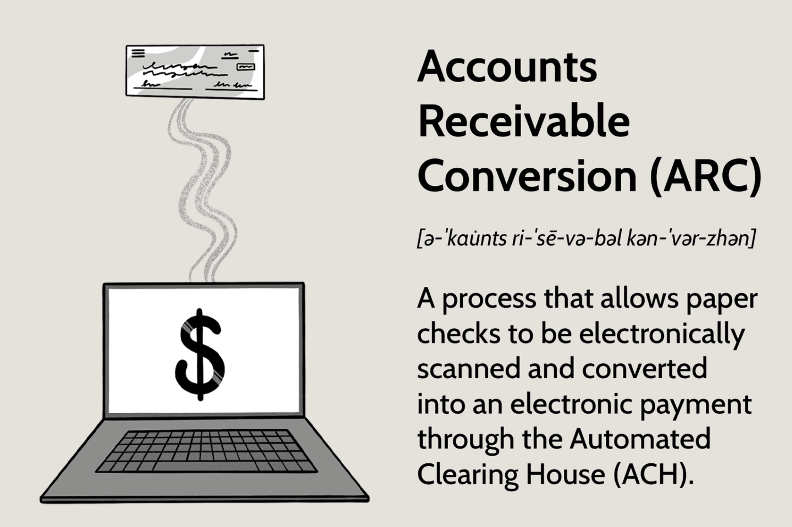

Accounting standards, principles, and financial reporting are foundational to the financial industry. These elements ensure the integrity, transparency, and consistency of financial information, facilitating informed decision-making by stakeholders such as investors, regulators, and management. Accounting standards, encompassing frameworks like Generally Accepted Accounting Principles (GAAP) and International Financial Reporting Standards (IFRS), provide structured guidelines for recognizing, measuring, and disclosing financial transactions. Additionally, core accounting principles, including accrual basis, conservatism, consistency, and materiality, play crucial roles in shaping the reliability and comparability of financial statements across different entities and jurisdictions.

In parallel, algorithmic trading has risen in prominence within the financial markets, revolutionizing the way trades are executed. Employing sophisticated mathematical models and computational algorithms, this form of trading enhances speed and precision, significantly reducing human error. The ability to analyze vast data volumes swiftly and execute trades at optimal times has made algorithmic trading an indispensable tool in modern finance.



Integrating accounting standards with algorithmic trading holds significant potential for enhancing transparency and accuracy. As algorithmic systems rely heavily on data-driven decisions, the accuracy of financial reports becomes critical in optimizing trading strategies. Accurate financial reporting ensures that trading algorithms make informed decisions based on reliable financial health indicators, ultimately improving performance and strategy optimization. By aligning accounting frameworks with the technical rigors of algo trading, financial markets can achieve higher levels of trust and transparency, beneficial for regulators and market participants alike. This integration also aids in strategic planning and risk management, thereby fortifying the robustness of financial strategies employed by trading entities.

The convergence of accounting with algorithmic trading represents an evolutionary stride in the financial industry, promising a paradigm where technology and transparency underpin future market dynamics.

## Table of Contents

## Understanding Accounting Standards and Principles

Accounting standards and principles form the foundation of reliable and comparable financial reporting, essential for stakeholders in making informed economic decisions. These standards are frameworks that ensure financial statements accurately reflect a company's financial health and performance, offering comparability across different entities and jurisdictions.

### Definition and Purpose

**Accounting Standards**: These are authoritative guidelines that govern the preparation and presentation of financial statements. The two most widely recognized accounting standards are the Generally Accepted Accounting Principles (GAAP) and the International Financial Reporting Standards (IFRS).

- **GAAP** is predominantly used in the United States, providing a comprehensive set of accounting guidelines that companies must adhere to for financial reporting. It ensures consistency in financial documentation, allowing investors and regulators to compare financial information easily.

- **IFRS**, on the other hand, is used globally by over 140 jurisdictions. It aims to provide a standardized method for interpreting financial statements, promoting transparency and comparability on an international scale.

### Core Accounting Principles

The effectiveness of accounting standards is underpinned by several core accounting principles that ensure the quality and reliability of financial reporting:

1. **Accrual Basis**: This principle mandates that transactions and events are recorded when they occur, irrespective of cash flow. This means that revenues and expenses are recognized when they are earned or incurred, providing a more accurate reflection of a company's financial position.

2. **Conservatism**: This principle advocates for caution in reporting, where potential expenses and liabilities should be recognized immediately, but revenues should only be recorded when there is a certainty of realization. This ensures that financial statements do not overstate assets or income.

3. **Consistency**: Consistent application of accounting methods over periods is crucial for comparability. If changes are necessary, they must be disclosed and justified, allowing stakeholders to understand the impact of such changes on financial reporting.

4. **Materiality**: This principle states that all significant data capable of influencing the decisions of users of financial statements should be disclosed. Only transactions relevant to an investor's decision-making process are required, simplifying reporting and focussing on pertinent information.

### Role in Ensuring Reliability and Comparability

The adherence to these standards and principles ensures that financial statements are not only reliable but also comparable across different periods and enterprises. They provide the necessary checks and balances that help maintain the integrity of financial reporting, ensuring stakeholders can trust the financial information presented to them.

For example, by following the accrual basis of accounting, a company's financial statements present a more truthful picture of its operational performance, avoiding distortions in accounting for cash flows that could mislead stakeholders about the company's real economic activities.

In summary, accounting standards and principles are critical tools that facilitate transparency, accountability, and efficiency in financial reporting, forming the backbone for comparing financial statements across the global financial landscape. These frameworks enable stakeholders to make sound financial decisions, fostering confidence in the markets.

## Financial Reporting in Algorithmic Trading

Algorithmic trading, characterized by the use of computer algorithms to manage trading processes, necessitates precise financial reporting for optimal functionality. Financial statements—namely balance sheets, income statements, and cash flow statements—play pivotal roles in informing these trading algorithms. Accurate financial data contributes to effective decision-making and strategy optimization in [algorithmic trading](/wiki/algorithmic-trading).

A balance sheet provides a snapshot of a company's financial position at a specific time, detailing assets, liabilities, and shareholders' equity. This information is crucial for algorithms assessing a company's value and potential risks. For instance, low debt levels may indicate financial stability, while high asset levels might suggest growth potential. Trading algorithms use this data to predict stock price movements and adjust trading strategies accordingly.

Income statements provide insights into a company's revenue, expenses, and profits over a period. By analyzing trends in net income or operating expenses, algorithms can identify patterns relevant for future performance predictions. An increase in revenue without a proportional rise in expenses or cost indicates efficiency and profitability, which can influence buy or sell signals.

Cash flow statements, which detail a company's inflows and outflows of cash, help algorithms assess [liquidity](/wiki/liquidity-risk-premium) and cash management practices. Understanding a company’s ability to generate cash allows algorithms to evaluate its financial health and sustainability. For instance, positive cash flow may signal a good investment, prompting algorithms to initiate buying actions.

The impact of accurate financial reporting extends to performance enhancement and strategy optimization in algorithmic trading. High-quality financial data ensures that algorithms make informed decisions, thereby reducing the likelihood of errors and financial losses. For example, by utilizing current and precise income statement data, an algorithm can better forecast earnings, tailor trading positions, and manage risks effectively.

Moreover, precise financial reporting supports regulatory compliance, which is essential in avoiding penalties and maintaining market confidence. Algorithms that incorporate reliable financial data contribute to transparency and market efficiency, facilitating fair trading practices.

Financial reporting also plays a vital role in developing predictive models within algorithmic trading. Using [machine learning](/wiki/machine-learning), traders can create algorithms to forecast market trends based on historical financial data. Here is a simple Python example of how financial data might feed into an algorithmic model for predicting stock movements:

```python
import pandas as pd
from sklearn.model_selection import train_test_split
from sklearn.linear_model import LinearRegression

# Sample financial data loading
data = pd.read_csv('financial_data.csv')

# Features: Revenue, Expenses, Cash Flow
X = data[['Revenue', 'Expenses', 'CashFlow']]
# Target: Future stock price movement
y = data['StockPrice']

# Split data into training and testing sets
X_train, X_test, y_train, y_test = train_test_split(X, y, test_size=0.2, random_state=42)

# Initialize and train the model
model = LinearRegression()
model.fit(X_train, y_train)

# Predict future stock prices
predictions = model.predict(X_test)
```

In conclusion, precise financial reporting underpins the effective operation of algorithmic trading. By leveraging detailed financial statements, trading algorithms can enhance strategic decision-making, maintain compliance, and foster market transparency, all of which contribute to optimized trading performance.

## Benefits of Integrating Accounting with Algo Trading

Integrating accounting with algorithmic trading offers several benefits that enhance the efficiency and accuracy of financial operations within the trading industry. One of the primary advantages lies in strategic planning and risk management, facilitated by robust financial analytics. Reliable financial data derived from standardized accounting practices can equip trading algorithms with precise inputs needed for optimal decision-making. Accurate data enhances the predictive capabilities of trade algorithms, minimizing risks associated with market [volatility](/wiki/volatility-trading-strategies). By utilizing financial analytics, traders can implement strategies that preemptively address potential losses and optimize portfolio performance.

Another significant benefit is the improved compliance with financial regulations and increased market transparency. Algorithmic trading must adhere to stringent regulatory standards, and the integration of accounting ensures that financial reporting meets these requirements. Accounting practices, guided by standards such as Generally Accepted Accounting Principles (GAAP) or International Financial Reporting Standards (IFRS), ensure that financial information is consistently accurate and verifiable. This adherence not only bolsters credibility among investors and regulators but also aids in preventing fraud and ensuring ethical trading practices.

A noteworthy example of the successful integration of accounting with algorithmic trading is demonstrated by the case of Renaissance Technologies, a renowned quantitative investment firm. Known for its Medallion Fund, Renaissance Technologies effectively utilizes sophisticated algorithms alongside meticulous financial accounting to generate consistent returns. The firm’s algorithms are known to benefit from accurate financial inputs, enabling precise risk assessments and strategic investments.

In conclusion, integrating accounting with algorithmic trading enhances financial analytics, boosts compliance, and promotes transparency. This integration is pivotal for firms aiming to maintain a competitive advantage in increasingly complex financial markets.

## Challenges in Aligning Accounting with Algorithmic Trading

The integration of accounting procedures with algorithmic trading presents several challenges that professionals in the financial industry must contend with. One significant challenge arises from the complexities of standardizing accounting procedures across different jurisdictions. Accounting standards, such as Generally Accepted Accounting Principles (GAAP) and International Financial Reporting Standards (IFRS), vary across countries, leading to discrepancies in financial reporting. These differences can hinder the seamless integration of accounting data with algotrading systems, which require consistent and comparable data to function effectively. For example, what may be recognized as revenue under GAAP might not meet the criteria under IFRS, resulting in inconsistencies when data is aggregated across regions.

Technical and operational challenges also pose considerable obstacles to maintaining data integrity and accuracy in the context of algorithmic trading. Algotrading requires real-time data processing and analysis, which can be compromised by discrepancies in accounting data due to errors or delays in data input and processing. Ensuring data integrity demands a robust IT infrastructure capable of handling large volumes of data with minimal latency. Additionally, data accuracy is critical, as inaccuracies can lead to flawed algorithmic decisions. This necessitates the implementation of precise data validation and verification processes, often requiring significant investment in both technology and human resources.

Moreover, there is a necessity for continuous adaptation to evolving accounting standards and trading technologies. As financial regulations and technologies evolve, so too must the systems that integrate accounting with algorithmic trading. This requires ongoing investment in both technology upgrades and staff training to ensure that professionals are equipped with the latest knowledge and tools. Continuous adaptation is not only a technical challenge but also an organizational one, as it involves altering existing processes and workflows to accommodate new standards and technologies.

Overall, aligning accounting with algorithmic trading is a multifaceted challenge that requires navigating complex regulatory landscapes, maintaining data integrity and accuracy, and continually adapting to new developments in accounting standards and trading technologies. Addressing these challenges is vital for the advancement and successful operation of integrated financial systems.

## Conclusion

The integration of accounting standards and principles with algorithmic trading is vital for developing robust financial strategies. This merger not only ensures enhanced transparency and accuracy but also provides a solid foundation for making informed decisions that align with global accounting norms. By leveraging accurate and consistent financial data, trading algorithms can be optimized to function more efficiently, thereby ensuring better strategic planning and risk management.

Continuous education and adaptability to technological advancements are paramount for professionals in the financial industry. As trading technologies and accounting standards evolve, staying abreast of these changes is essential. This ongoing learning process will equip financial professionals with the necessary skills to navigate and integrate new advancements effectively.

Looking to the future, the role of accounting in algorithmic trading is poised for expansion. As financial markets become increasingly complex and interlinked, the demand for flawless integration of financial reporting with trading strategies will grow. This trend signifies an exciting evolution, where the marriage of accounting expertise with cutting-edge trading technology will become indispensable, driving greater efficiency and accuracy in financial markets worldwide. Embracing this evolution, and preparing for future challenges, will be essential for stakeholders aiming to capitalize on the potential within the algorithmic trading space.

## References & Further Reading

[1]: ["International Financial Reporting Standards (IFRS)"](https://www.investopedia.com/terms/i/ifrs.asp) - The official IFRS website offering resources and guidance on international accounting standards.

[2]: ["Generally Accepted Accounting Principles (GAAP)"](https://www.investopedia.com/terms/g/gaap.asp) - An overview of GAAP, principally used in the United States for financial reporting.

[3]: Lopez de Prado, M. (2018). ["Advances in Financial Machine Learning."](https://www.amazon.com/Advances-Financial-Machine-Learning-Marcos/dp/1119482089) Wiley.

[4]: Jansen, S. (2020). ["Machine Learning for Algorithmic Trading."](https://github.com/stefan-jansen/machine-learning-for-trading) Packt Publishing.

[5]: Chan, E. P. (2008). ["Quantitative Trading: How to Build Your Own Algorithmic Trading Business."](https://github.com/ftvision/quant_trading_echan_book) Wiley.

[6]: Aronson, D. R. (2006). ["Evidence-Based Technical Analysis: Applying the Scientific Method and Statistical Inference to Trading Signals."](https://onlinelibrary.wiley.com/doi/book/10.1002/9781118268315) Wiley.

[7]: Focardi, S. M., & Fabozzi, F. J. (2004). ["The Mathematics of Financial Modeling and Investment Management."](https://archive.org/details/mathematicsoffin0000foca) John Wiley & Sons, Inc.

[8]: Khan, M. A., Graves, A., Ross, H., & Ptaszynski, J. G. (2015). ["Financial Accounting: IFRS, Fourth Edition."](https://pubmed.ncbi.nlm.nih.gov/32898304/) Pearson.