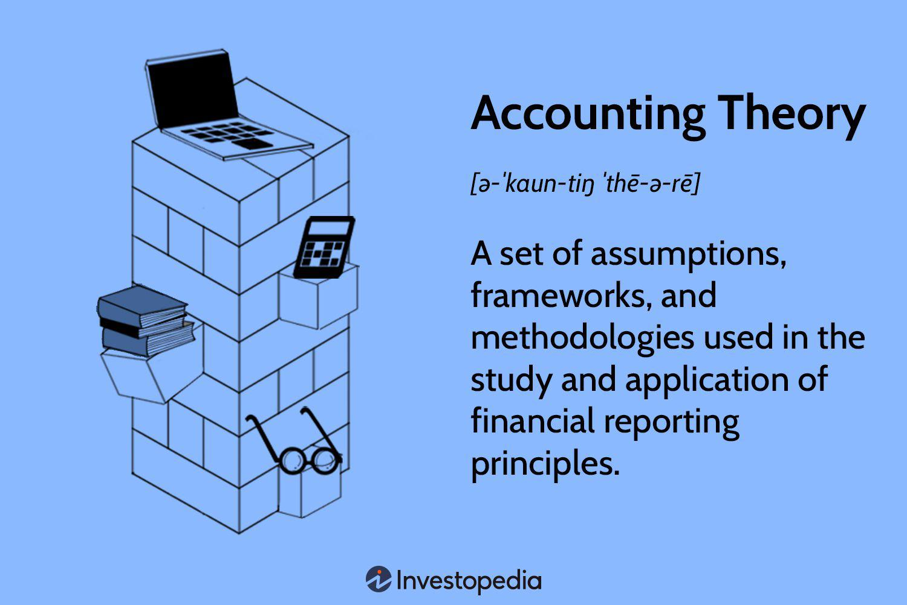

In today's dynamic financial landscape, the integration of financial reporting, accounting theory, and algorithmic trading is pivotal for businesses and traders. Financial markets have grown increasingly complex, necessitating the precision and reliability of financial reporting to maintain transparency and trust among stakeholders. Financial accounting, guided by rigorous accounting theory, serves as the foundation for delivering transparent and accurate financial information.

Accounting theory provides the conceptual framework that guides the creation and application of financial reporting standards, such as Generally Accepted Accounting Principles (GAAP) and International Financial Reporting Standards (IFRS). These standards ensure that financial statements are consistent, comparable, and reliable, which is essential for stakeholders making informed decisions about resource allocation and financial management.



As algorithmic trading gains momentum, the reliance on precise financial data has increased significantly. Algorithmic trading involves using complex algorithms to execute trades at high speeds, demanding real-time, accurate financial data. This necessitates strict adherence to accounting standards to guarantee the integrity of the data used in these trading strategies. By integrating accounting systems with trading platforms, businesses can ensure compliance with regulatory frameworks, enhance decision-making capabilities, and evaluate the performance of trading strategies effectively.

This article explores the connections between financial reporting, accounting theory, and algorithmic trading, demonstrating how each component contributes to maintaining financial integrity and strategic advantage in the modern marketplace. As the financial environment continues to evolve, businesses and traders must adapt and integrate these elements to achieve sustained success and stability.

## Table of Contents

## Understanding Financial Reporting and Accounting Theory

Financial reporting is the structured communication of a company's financial information to its stakeholders, enabling transparency and comparability in financial statements. These reports adhere to standardized guidelines to ensure that financial data is consistent and facilitates informed decision-making by investors, creditors, and other interested parties. The integrity of financial reporting is maintained through adherence to principles and standards such as Generally Accepted Accounting Principles (GAAP) and International Financial Reporting Standards (IFRS), which provide a uniform framework globally.

Accounting theory underpins the development and application of these financial reporting standards by offering a comprehensive conceptual framework. This theoretical foundation encompasses several key elements:

1. **Assumptions**: Fundamental assumptions in accounting include the economic entity assumption, which treats the business as separate from its owners, and the monetary unit assumption, which assumes that currency remains stable over time. These assumptions provide a basis for constructing financial statements across diverse entities.

2. **Methodologies**: Accounting theory prescribes methodologies for measuring and reporting financial information. This includes conventions such as accrual accounting versus cash accounting, which determines when transactions are recognized in financial statements, and methods for valuing assets and liabilities.

3. **Regulatory Framework**: The regulatory framework ensures that financial statements are relevant, reliable, comparable, and understandable. Regulatory bodies such as the Financial Accounting Standards Board (FASB) and the International Accounting Standards Board (IASB) work to update and adapt standards to meet evolving business practices and technological advancements.

The evolution of accounting theory is ongoing, responding to new business activities, financial instruments, and technological progress. For instance, the rise of digital currencies, advancements in data analytics, and increased globalization necessitate continuous updates to accounting standards. This adaptability ensures that financial reporting remains effective and relevant in representing a company's financial status accurately.

Incorporating updates from accounting theory, such as the principles-based approach of IFRS versus the rules-based approach of GAAP, allows for more nuanced financial reporting. This supports the diversity in business environments and transactions. Ultimately, the objective is to enhance the clarity and usefulness of financial information, providing stakeholders with a true reflection of the economic realities faced by businesses.

## Financial Accounting and Its Role in Business Decision-Making

Financial accounting is a critical component of business strategy, primarily through the preparation and analysis of financial statements such as the balance sheet, income statement, and cash flow statement. These statements provide a comprehensive snapshot of a company's financial health and operational performance, allowing stakeholders, including managers, investors, and creditors, to make informed decisions.

The balance sheet offers a detailed view of a company's assets, liabilities, and equity, highlighting its financial position at a specific point in time. This statement is crucial for assessing the [liquidity](/wiki/liquidity-risk-premium) and capital structure of the business, facilitating decisions related to resource allocation and financial management. For example, the formula for the balance sheet is:

$$
\text{Assets} = \text{Liabilities} + \text{Equity}
$$

The income statement outlines the revenues and expenses over a period, thereby indicating the company's profitability. It helps in evaluating the efficiency of resource utilization and determining areas that require strategic improvement. The basic components of the income statement can be summed up as:

$$
\text{Net Income} = \text{Revenue} - \text{Expenses}
$$

The cash flow statement tracks the inflows and outflows of cash, which is essential for assessing the company's liquidity and operational viability. This statement helps identify whether the business generates sufficient cash to sustain operations, invest in growth, and return value to shareholders.

Accurate financial accounting not only aids in internal decision-making but also enhances the ability to make comparative analyses across industries. This benchmarking process helps businesses understand their competitive standing and operational efficiency. By utilizing standardized reporting practices like those dictated by GAAP and IFRS, companies can ensure that their financial statements are comparable, reinforcing credibility and stakeholder confidence. 

Ultimately, financial accounting is indispensable for aligning business strategies with financial realities, enabling companies to navigate complex market environments with greater clarity and foresight.

## Integration of Accounting with Algorithmic Trading

Algorithmic trading, characterized by the use of computer algorithms to execute a large number of trades at high speeds, is fundamentally dependent on the availability of precise, timely financial data. This requires a seamless integration between accounting systems and trading platforms to ensure accuracy in data transmission and compliance with financial regulations, thereby enhancing decision-making capabilities.

The integration process involves harmonizing accounting data with trading strategies. This not only facilitates real-time monitoring of trading activities but also supports the assessment of trading strategies through the lens of financial accounting metrics such as profitability, liquidity ratios, and return on investment (ROI). These metrics are crucial for evaluating the performance of trading strategies, guiding strategic improvements, and ensuring robust risk management. For instance, a trading strategy with a negative ROI might prompt an algorithmic adjustment to mitigate losses, thereby enhancing overall strategy effectiveness.

Compliance with established accounting frameworks like Generally Accepted Accounting Principles (GAAP) and International Financial Reporting Standards (IFRS) is vital for [algorithmic trading](/wiki/algorithmic-trading) entities. These standards guide the transparent and accurate presentation of financial information, ensuring that stakeholders, including investors and regulatory bodies, can trust the reported data. This transparency not only enhances investor confidence but also aligns with regulatory requirements, mitigating legal risks and maintaining corporate integrity.

Algorithmic trading systems can employ advanced accounting software that integrates with trading platforms to automate data collection, processing, and reporting. This integration is crucial for managing the voluminous data generated through high-frequency trading, enabling organizations to maintain regulatory compliance effortlessly. For example, a Python script could be used to extract, transform, and load (ETL) data across systems efficiently:

```python
import pandas as pd

# Load data from trading platform
trades_df = pd.read_csv('trades_data.csv')

# Connect with accounting system
accounting_df = pd.read_excel('accounting_data.xlsx')

# Merge and reconcile data
merged_df = pd.merge(trades_df, accounting_df, how='inner', on='transaction_id')

# Validate compliance with accounting standards
conformity_check = merged_df.apply(lambda row: check_compliance(row), axis=1)

def check_compliance(row):
    # Complex logic for GAAP and IFRS compliance
    if row['revenue'] < row['cost']:
        return False
    return True

# Generate compliance report
compliance_report = conformity_check.sum() / len(conformity_check) * 100
print(f"Compliance rate: {compliance_report}%")
```

In summary, the integration of accounting with algorithmic trading enhances the accuracy and transparency of financial data. By applying rigorous financial accounting principles, businesses can ensure strategic alignment, optimize resource allocation, and uphold robust compliance in the fast-paced trading environment. This synergy between accounting and trading systems is indispensable for sustaining competitive advantages and fostering trust among stakeholders.

## Regulatory Implications and Compliance

Complying with regulatory standards is a cornerstone for maintaining corporate integrity, minimizing legal risks, and instilling confidence among investors. Regulatory frameworks like Generally Accepted Accounting Principles (GAAP) and International Financial Reporting Standards (IFRS) are pivotal in ensuring the accurate representation of financial activities, a requisite element in the high-velocity environment of algorithmic trading. GAAP and IFRS provide comprehensive guidelines that facilitate transparent financial reporting and enhance comparability across various jurisdictions.

In algorithmic trading, the rapid execution of transactions necessitates adherence to these standards, ensuring that financial data is recorded and reported accurately. Regulatory compliance mandates that trading activities are not only methodically documented but also aligned with established accounting principles, creating a reliable financial narrative for stakeholders. This adherence to standards helps assure investors of the authenticity of financial statements, fostering an environment of trust and reliability.

To efficiently manage regulatory compliance, advanced accounting systems are crucial. These systems integrate real-time data from trading activities, ensuring that all necessary regulatory requirements are fulfilled promptly and accurately. By automating data processing and report generation, these systems help in minimizing errors and enhancing the efficiency of compliance processes. They also provide the scalability needed to accommodate the growing [volume](/wiki/volume-trading-strategy) and complexity of transactions typical in algorithmic trading.

The integration of sophisticated accounting technologies with trading platforms not only supports compliance but also improves strategic decision-making. By providing timely and precise financial insights, these systems enable organizations to adapt to dynamic market conditions while maintaining compliance with financial regulations. Thus, regulatory compliance, supported by advanced accounting systems, is vital for sustaining corporate credibility and fostering equitable trading practices.

## Challenges in Adopting Accounting Principles in Algo Trading

Algorithmic trading introduces significant challenges in maintaining accurate and timely financial accounting, primarily due to the sheer volume and rapid pace of transactions. Each trade can generate vast amounts of data that need real-time processing to ensure financial records accurately reflect the trading activities. The velocity and volume of trades necessitate advanced accounting systems capable of handling high-frequency data, ensuring that all transactions are promptly recorded, analyzed, and reported.

To tackle these challenges, financial institutions must implement sophisticated accounting systems. These systems must integrate seamlessly with trading platforms to provide real-time data processing capabilities. Such integration enables the instantaneous capture of transaction details, which is essential for maintaining up-to-date financial records and ensuring compliance with financial regulations. Moreover, these systems must facilitate the accurate reconciliation of trading accounts, a complex task exacerbated by the [high frequency](/wiki/high-frequency-trading) and volume of trades inherent in algorithmic strategies.

Professionals working at the intersection of accounting and algorithmic trading require a unique blend of expertise. They must possess a deep understanding of accounting principles and be adept with the technological aspects of algorithmic trading. This multifaceted skill set demands continuous education and adaptation to keep pace with the rapid advancements in both accounting practices and trading technologies. Professionals must be well-versed in using advanced analytics and computational techniques to process and interpret trading data efficiently.

The landscape of accounting standards and trading regulations is continually evolving, presenting another layer of complexity. As accounting standards like GAAP and IFRS are updated to accommodate new financial instruments and market practices, professionals must stay informed and ensure that the accounting systems remain compliant. Similarly, regulatory frameworks for trading are consistently refined to enhance transparency and reduce systemic risk, necessitating frequent system updates and staff training to align with new regulatory requirements.

Overall, the convergence of accounting and algorithmic trading underscores the need for robust systems and skilled professionals who can navigate this intricate environment. Maintaining accurate financial accounting in the context of high-speed trading is not just a technical challenge but also a strategic priority for institutions seeking to stay competitive and compliant in the fast-evolving financial markets.

## Conclusion

The convergence of financial reporting, accounting theory, and algorithmic trading underscores the necessity for an integrated strategy to ensure financial integrity and strategic decision-making. This interconnected relationship highlights several critical aspects that contemporary financial entities must navigate to maintain competitive and regulatory advantages in the ever-evolving financial landscape.

Firstly, accurate financial accounting is foundational to this integration. It encompasses precise documentation and analysis, essential for transparency and compliance with standardized frameworks like Generally Accepted Accounting Principles (GAAP) and International Financial Reporting Standards (IFRS). These standards instill confidence in investors and stakeholders by ensuring that financial statements reflect true and fair views of organizational performance.

Algorithmic trading, characterized by its high-speed and data-driven execution, further accentuates the need for rigorous accounting practices. The success of algorithmic strategies depends heavily on the availability of accurate, real-time financial data. This precision not only facilitates improved trading outcomes but also ensures adherence to stringent regulatory measures, thereby safeguarding against potential legal and financial repercussions.

Looking forward, the dynamic nature of financial markets necessitates continuous adaptation and integration of these components. Financial platforms and accounting systems must evolve in tandem with market changes, technological advancements, and regulatory updates. This evolution calls for sophisticated systems capable of handling real-time data processing and analysis, coupled with professionals skilled in both accounting principles and advanced trading technologies.

In conclusion, the symbiotic relationship between financial reporting, accounting theory, and algorithmic trading is pivotal for achieving sustained success and stability in trading operations. By embracing an integrated approach, businesses can navigate the complexities of the financial environment, ensuring resilience and strategic advantage in an increasingly competitive market.

## References & Further Reading

[1]: 'Financial Reporting and Analysis: Using Financial Accounting Information' by Charles H. Gibson provides comprehensive insights into the principles and practices of financial reporting and the use of this information in decision-making processes. This resource is beneficial for understanding how financial reports offer a foundation for analysis and strategy development.

[2]: Penman, S. H. (2007). 'Financial Statement Analysis and Security Valuation.' McGraw-Hill explores the intricate relationships between financial statements and how they contribute to security valuation. This book is essential for those interested in enhancing their financial analysis skills and understanding the impact of financial reporting on market valuations.

[3]: 'Algorithmic Trading and DMA: An introduction to direct access trading strategies' by Barry Johnson offers an in-depth look into the mechanics of algorithmic trading, emphasizing the significance of direct market access in executing trading strategies efficiently. This reference provides valuable insights for anyone looking to understand the technological and strategic aspects of algorithmic trading within financial markets.

[4]: 'International Financial Reporting Standards (IFRS)' outlines the global accounting standards designed to bring consistency and transparency to financial reporting across international borders. These standards are crucial for ensuring comparability and reliability of financial statements globally, particularly significant in the context of multinational corporations and international investors.

[5]: 'Generally Accepted Accounting Principles (GAAP)' discusses the framework of accounting standards and procedures used in the United States. GAAP ensures that financial reporting is consistent, fair, and transparent, providing a solid foundation for accurate financial analysis and decision-making, particularly within the U.S. market.

