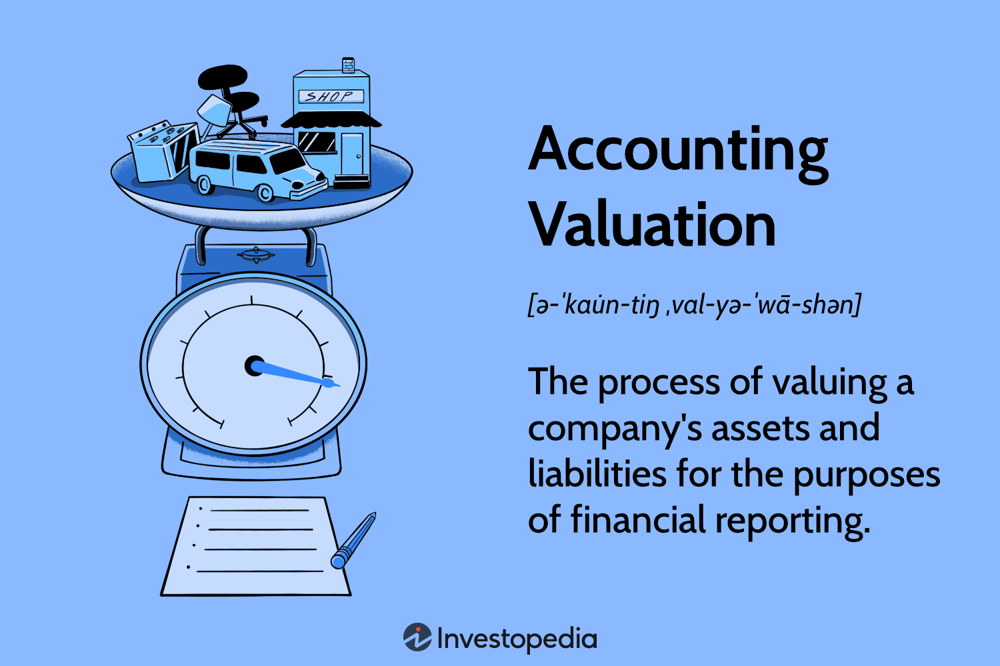

## Table of Contents

## What is accounting valuation and why is it important?

Accounting valuation is the process of figuring out how much a company's assets, liabilities, and equity are worth. It's like putting a price tag on everything a business owns and owes. This helps people understand the financial health of the company. It's important because it gives a clear picture of what the company is worth at a specific time.

Knowing the value of a company's assets and liabilities is crucial for making good business decisions. For example, if a company wants to sell something it owns, it needs to know how much it's worth. Also, investors and lenders look at these valuations to decide if they want to put money into the company or lend it money. Without accurate accounting valuation, it would be hard to make smart choices about buying, selling, or investing in a business.

## How does accounting valuation differ from market valuation?

Accounting valuation and market valuation are two different ways to figure out how much a company or its assets are worth. Accounting valuation looks at the numbers in the company's books. It uses rules and standards to value things like buildings, machines, and debts. This method gives a snapshot of what the company thinks its assets and liabilities are worth at a certain time.

Market valuation, on the other hand, looks at what people are willing to pay for the company or its assets in the open market. It's based on what buyers and sellers agree on, which can be influenced by things like how well the company is doing, what's happening in the economy, and what people think about the future. Market valuation can change a lot and might be different from the accounting valuation because it reflects what's happening in the real world, not just what's written down in the company's records.

Both methods are important, but they serve different purposes. Accounting valuation helps with keeping track of the company's financial health and making sure everything is reported correctly. Market valuation is more useful for investors and others who want to know what the company might be worth if they were to buy or sell it right now.

## What are the basic principles of accounting valuation?

Accounting valuation follows some basic rules to make sure that the numbers on a company's [books](/wiki/algo-trading-books) are fair and accurate. One big rule is the cost principle, which says that assets should be recorded at the price the company paid for them. This keeps things simple and easy to check. Another rule is the going concern principle, which means the company is expected to keep operating and not go out of business soon. This affects how assets and liabilities are valued because it assumes the company will use its assets over time.

Another important rule is the matching principle, which says that expenses should be recorded in the same period as the revenues they help to earn. This helps give a true picture of the company's profit or loss for a specific time. The conservatism principle is also key, telling accountants to be careful and choose the lower value when there's doubt about an asset's worth. This helps avoid overstating the company's financial health.

Lastly, the consistency principle says that once a company picks a way to value its assets, it should keep using that method. This makes it easier to compare financial statements from different years. These principles work together to make sure that accounting valuation is done in a way that's clear, reliable, and useful for understanding a company's financial situation.

## What are the different methods used for asset valuation in accounting?

There are several ways to figure out how much a company's assets are worth in accounting. One common method is the cost approach, where assets are valued at what the company paid for them, minus any wear and tear or damage over time. This is simple and easy to understand because it's based on real money spent. Another method is the market approach, which looks at what similar assets are selling for in the market right now. This can give a good idea of what the asset might be worth if the company decided to sell it.

Another way to value assets is the income approach, which looks at the money the asset can make in the future. This method is often used for things like rental properties or businesses, where the value comes from the income they generate. The replacement cost method is also used sometimes, where the value is based on how much it would cost to replace the asset with a new one that does the same job. Each of these methods has its own use, and the best one to use can depend on the type of asset and what the company needs to know.

## How do accountants determine the value of liabilities?

Accountants figure out the value of liabilities by looking at how much the company owes and when it needs to pay it back. They start with the original amount of the debt, like a loan or a bill. If the company has to pay interest on the debt, accountants add that to the value of the liability. They also think about when the money is due. If it's due soon, it might be worth more than if it's due far in the future because of things like inflation or the chance the company might not be able to pay.

Sometimes, the value of a liability can change over time. For example, if a company has a loan with a variable [interest rate](/wiki/interest-rate-trading-strategies), the amount they owe can go up or down. Accountants keep track of these changes and update the value of the liability on the company's books. They also use something called the present value method for long-term liabilities, which means they figure out how much the future payments are worth in today's money. This helps give a fair picture of what the company really owes right now.

## What role does depreciation play in accounting valuation?

Depreciation is a big part of accounting valuation because it helps show how much an asset loses value over time. When a company buys something like a machine or a building, it doesn't stay new forever. It gets old and worn out, so it's worth less than when it was first bought. Depreciation lets accountants spread out the cost of the asset over the years it's used. This way, the company's financial statements show a more accurate picture of what the asset is really worth as it gets older.

Using depreciation also helps match the cost of the asset with the money it helps the company make. If a machine is used to make products that the company sells, the cost of the machine should be spread out over the time it's used to make those products. This makes the company's profit and loss statements more fair and useful. Without depreciation, the company might look like it's making more money than it really is, because the full cost of the asset would be counted all at once, instead of over time.

## How does the choice of inventory valuation method affect financial statements?

The way a company chooses to value its inventory can really change how its financial statements look. There are different methods like FIFO (First In, First Out), LIFO (Last In, First Out), and average cost. Each method can make the company's profits and the value of its inventory look different. For example, if prices are going up, using FIFO might show higher profits because the older, cheaper inventory is sold first. But if the company uses LIFO, it might show lower profits because the newer, more expensive inventory is sold first.

These differences matter a lot because they affect how much tax the company has to pay and how investors see the company. If a company shows higher profits with FIFO, it might have to pay more in taxes. But it might also look more attractive to investors who see those higher profits. On the other hand, using LIFO might lower the tax bill but could make the company look less profitable to investors. So, the choice of inventory valuation method is important and can have a big impact on the company's financial health and how it's viewed by others.

## What are the implications of fair value accounting on financial reporting?

Fair value accounting means that companies have to show the value of their assets and liabilities based on what they're worth in the market right now, not just what they paid for them. This can make financial reports more up-to-date and useful because they show what things are really worth at that moment. But it can also make the numbers go up and down a lot, especially if the market is changing fast. This can make it harder for people to understand the company's financial health because the values can change from one report to the next.

Using fair value accounting can also affect how much tax a company has to pay and how investors see the company. If the market value of an asset goes up, the company might have to pay more in taxes because it looks like they made more money. But if the market value goes down, it can make the company look less profitable, which might scare off investors. So, while fair value accounting can give a more accurate picture of what things are worth, it can also make financial reports less predictable and more complicated to understand.

## How do international accounting standards impact valuation practices?

International accounting standards, like those set by the International Accounting Standards Board (IASB), help make sure that companies all over the world value their assets and liabilities in a similar way. These standards are called IFRS, which stands for International Financial Reporting Standards. When companies follow IFRS, it's easier for people to compare financial statements from different countries. This is important for investors who might want to put money into companies in different parts of the world. IFRS also tries to make sure that the numbers in financial reports are fair and accurate, which helps everyone trust the information more.

But using international standards can also make things more complicated. Different countries might have their own rules that don't match up perfectly with IFRS. This can make it hard for companies to switch to the international way of doing things. Also, some people think that IFRS can be too flexible, which might let companies choose how to value things in a way that makes them look better than they really are. So, while international standards can help make financial reports more useful and trustworthy, they can also bring new challenges for companies trying to follow them.

## What advanced techniques are used for valuing complex financial instruments?

Valuing complex financial instruments can be tricky, so accountants use some advanced techniques to figure out their worth. One common method is the discounted cash flow (DCF) analysis. This means looking at all the money the instrument is expected to bring in over time and then figuring out what that money is worth right now. It's like saying, "If I'm going to get $100 in the future, how much is that worth to me today?" This method takes into account things like interest rates and how risky the investment is. Another technique is the option pricing model, like the Black-Scholes model, which is used for things like stock options. This model looks at things like the price of the stock, how much the price might change, and how long until the option can be used to figure out its value.

Another advanced technique is the Monte Carlo simulation. This method uses a computer to run lots of different scenarios to see how the value of the financial instrument might change. It's like playing out many different futures to see what might happen. This can be really helpful for valuing things that are hard to predict, like certain types of bonds or derivatives. Each of these methods helps accountants get a better handle on the value of complex financial instruments, but they all need a lot of information and some smart math to work right.

## How can accounting valuation affect a company's tax obligations?

Accounting valuation can change how much tax a company has to pay. When a company figures out the value of its assets and liabilities, it affects how much profit or loss it shows on its financial statements. If the value of an asset goes up, it might make the company look like it made more money, which means it could have to pay more in taxes. On the other hand, if the value of an asset goes down, it might lower the company's profit, which could mean less tax to pay. So, the way a company values its things can make a big difference in its tax bill.

Different ways of valuing things can also lead to different tax results. For example, if a company uses the FIFO method for its inventory, it might show higher profits and pay more taxes when prices are going up. But if it uses the LIFO method, it might show lower profits and pay less in taxes. The choice of method can be important because it affects how much money the company has to give to the government. This is why companies often think carefully about how they value their assets and liabilities, because it can save them money on taxes.

## What are the current trends and future directions in accounting valuation methodologies?

The world of accounting valuation is always changing, and right now, one big trend is the use of technology. More and more, accountants are using software and data analytics to help them figure out the value of assets and liabilities. These tools can look at a lot of information quickly and help make better guesses about what things are worth. Another trend is the focus on fair value accounting, which means valuing things based on what they're worth in the market right now. This can make financial reports more up-to-date but also more unpredictable because market values can change a lot.

Looking to the future, we might see even more use of [artificial intelligence](/wiki/ai-artificial-intelligence) and machine learning in accounting valuation. These technologies could help accountants make even better predictions about the value of complex financial instruments. There's also a push for more global standards, like IFRS, to make it easier to compare financial statements from different countries. But as these standards become more common, there might be more challenges in making sure everyone follows them the same way. Overall, the future of accounting valuation seems to be about using new technology and trying to make financial reports more accurate and useful for everyone.

## What are the key valuation methods?

Valuation methods are essential tools in financial analysis, helping stakeholders determine the value of a company or asset. These methods are broadly classified into intrinsic, relative, market, and algorithmic approaches.

Intrinsic valuation, epitomized by the Discounted Cash Flow (DCF) analysis, is a cornerstone method. DCF computes the present value of expected future cash flows, applying a risk-adjusted discount rate to account for the time value of money. This approach is centered on the formula:

$$
\text{DCF} = \sum \frac{C_t}{(1 + r)^t}
$$

where $C_t$ represents the cash flow at time $t$, and $r$ is the discount rate reflecting the investment's risk. By focusing on the fundamental drivers of value, DCF offers insights into an asset’s inherent worth, independent of market fluctuations.

Relative valuation offers a contrasting perspective by comparing a firm’s financial metrics against peers, facilitating an understanding of market positioning. Commonly employed metrics include the Price-to-Earnings (P/E) ratio and Enterprise Value to EBITDA (EV/EBITDA) ratio. These ratios assess valuation through a market context lens, enabling investors to gauge whether a company is overvalued or undervalued relative to its industry.

Market valuation is particularly applicable in sectors where tangible asset values align with current market conditions, such as real estate. This method relies on recent sale prices of comparable assets to determine market value, providing a straightforward approach in settings where market data is ample.

Algorithmic approaches represent a modern advancement in valuation methods, integrating [machine learning](/wiki/machine-learning) and big data analytics. These techniques enhance traditional valuation by facilitating real-time financial analysis and pattern recognition, crucial for adapting to dynamic market conditions. Algorithms can automatically adjust models based on new information, refining forecasts with increasing accuracy. Here is a basic example of a Python code snippet that could be used in an [algorithmic trading](/wiki/algorithmic-trading) strategy:

```python
import pandas as pd
from sklearn.linear_model import LinearRegression

# Load historical pricing data
data = pd.read_csv('historical_data.csv')
features = data[['feature1', 'feature2', 'feature3']]
target = data['price']

# Train a simple linear regression model
model = LinearRegression()
model.fit(features, target)

# Predict future prices
predicted_prices = model.predict(features)

# Implement trading strategy based on predicted prices
buy_signals = predicted_prices > data['threshold']
sell_signals = predicted_prices < data['threshold']
```

This code demonstrates how machine learning can be leveraged to predict price movements, thereby informing buy or sell decisions. The flexibility and precision of algorithmic approaches make them indispensable in modern finance, where speed and accuracy are paramount.

Collectively, these valuation methods empower investors with diverse tools to assess value, each with unique applications tailored to specific market conditions and asset classes.

## References & Further Reading

[1]: ["Advances in Financial Machine Learning"](https://www.amazon.com/Advances-Financial-Machine-Learning-Marcos/dp/1119482089) by Marcos Lopez de Prado

[2]: ["Quantitative Trading: How to Build Your Own Algorithmic Trading Business"](https://www.amazon.com/Quantitative-Trading-Build-Algorithmic-Business/dp/1119800064) by Ernest P. Chan

[3]: ["Machine Learning for Algorithmic Trading"](https://github.com/stefan-jansen/machine-learning-for-trading) by Stefan Jansen

[4]: ["Corporate Valuation: Measuring the Value of Companies in Turbulent Times"](https://www.amazon.com/Corporate-Valuation-Measuring-Companies-Turbulent/dp/1119003334) by Phillip R. Daves and Michael C. Ehrhardt

[5]: ["Damodaran on Valuation: Security Analysis for Investment and Corporate Finance"](https://archive.org/details/damodaranonvalua0000damo) by Aswath Damodaran 

[6]: ["Evidence-Based Technical Analysis: Applying the Scientific Method and Statistical Inference to Trading Signals"](https://www.amazon.com/Evidence-Based-Technical-Analysis-Scientific-Statistical/dp/0470008741) by David Aronson