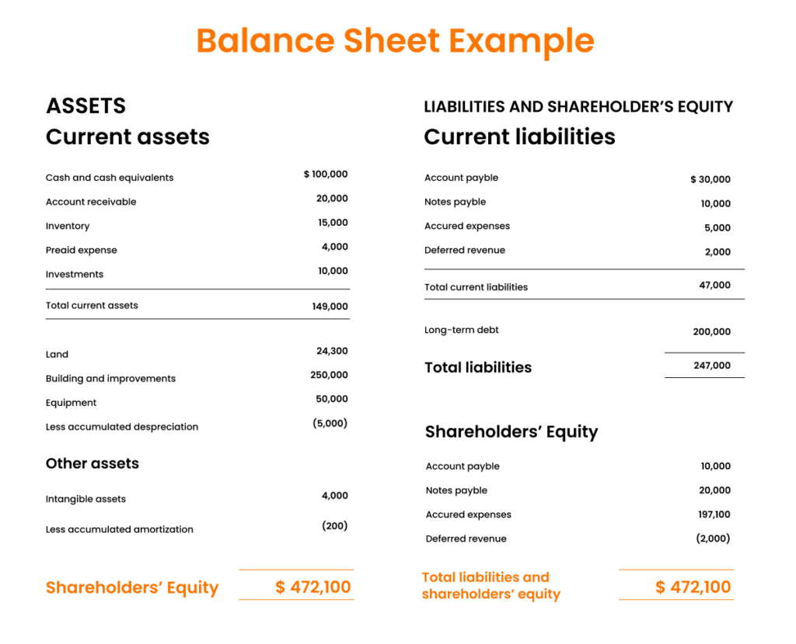

## Table of Contents

## What is accounts payable?

Accounts payable is the money a business owes to its suppliers for goods or services that it has received but not yet paid for. It's like a running tab that a company keeps with its vendors. When a company buys something on credit, the amount it owes goes into the accounts payable section of its financial records. This helps the company keep track of what it needs to pay and when.

Managing accounts payable is important for a business because it helps maintain good relationships with suppliers. If a company pays its bills on time, suppliers are more likely to offer good terms and discounts. On the other hand, if payments are late, it can harm the company's credit and make it harder to get supplies in the future. Keeping a close eye on accounts payable also helps a business manage its cash flow, making sure it has enough money to cover its expenses.

## How does accounts payable appear on the balance sheet?

Accounts payable shows up on the balance sheet as a liability. It's the money a company owes to its suppliers for things it bought but hasn't paid for yet. On the balance sheet, you'll find it under the section called "current liabilities" because it's money the company needs to pay within a year.

The balance sheet is like a snapshot of what a company owns and owes at a certain time. On one side, you see the company's assets, like cash and inventory. On the other side, you see its liabilities, like accounts payable, and its equity. When you look at the balance sheet, accounts payable helps you understand how much the company needs to pay soon, which is important for knowing if the company has enough money to cover its bills.

## Why is accounts payable considered a liability?

Accounts payable is considered a liability because it represents money that a company owes to others. When a company buys things from suppliers but doesn't pay for them right away, the amount it owes is recorded as accounts payable. This is money the company has to pay in the future, so it counts as a liability on the balance sheet.

Liabilities are important because they show what a company needs to pay back. If a company has a lot of accounts payable, it means it has a lot of bills coming due soon. Keeping track of these liabilities helps a company make sure it has enough money to cover its expenses and stay in good standing with its suppliers.

## What is the difference between accounts payable and accounts receivable?

Accounts payable and accounts receivable are two important parts of a company's financial records, but they are different. Accounts payable is the money a company owes to its suppliers for things it bought but hasn't paid for yet. It's like a bill that the company needs to pay soon. When a company gets goods or services on credit, the amount it owes goes into accounts payable. This is shown as a liability on the balance sheet because it's money the company needs to pay back.

On the other hand, accounts receivable is the money that customers owe to the company for goods or services they bought but haven't paid for yet. It's like the company is waiting to get paid. When a company sells something on credit, the amount it expects to receive goes into accounts receivable. This is shown as an asset on the balance sheet because it's money the company expects to get in the future. So, accounts payable is money the company owes, while accounts receivable is money the company is owed.

## How do businesses record accounts payable?

Businesses record accounts payable when they buy things from suppliers but don't pay for them right away. When a company gets an invoice from a supplier, it writes down the amount it owes in its accounting system. This amount goes into the accounts payable section of the company's records. It's like keeping a list of all the bills the company needs to pay soon.

Every time the company pays one of these bills, it takes the amount off the accounts payable list. This helps the company keep track of what it still owes and what it has already paid. At the end of each month or accounting period, the company adds up all the amounts in accounts payable to see the total it owes. This total shows up on the balance sheet as a current liability, which means it's money the company needs to pay within a year.

## What are the common terms of payment for accounts payable?

When businesses buy things from suppliers, they often agree on how and when they will pay. Common terms of payment for accounts payable include "net 30," which means the company has 30 days to pay the bill after getting the invoice. Another common term is "net 60," which gives the company 60 days to pay. Sometimes, suppliers offer a discount if the company pays early, like "2/10, net 30," which means the company can take a 2% discount if it pays within 10 days, otherwise, it has 30 days to pay the full amount.

These payment terms help businesses manage their cash flow. If a company has a lot of bills due at the same time, it might choose suppliers with longer payment terms to spread out when it needs to pay. On the other hand, if a company can pay early and get a discount, it might choose to do that to save money. Understanding and managing these terms is important for keeping good relationships with suppliers and making sure the company has enough money to cover its expenses.

## How does accounts payable affect a company's cash flow?

Accounts payable affects a company's cash flow because it's money the company needs to pay out. When a company buys things from suppliers but doesn't pay right away, it can use its cash for other things in the meantime. This can help the company's cash flow because it doesn't have to pay all its bills at once. But, the company still needs to keep enough cash to pay these bills when they're due. If the company doesn't manage its accounts payable well, it might run out of cash and not be able to pay its suppliers on time.

Managing accounts payable well can help a company keep its cash flow smooth. If a company can take advantage of discounts for paying early, it can save money and have more cash to use. On the other hand, if the company stretches out its payments too long, it might upset its suppliers and hurt its credit. So, it's important for a company to balance using its cash for other things with making sure it can pay its bills on time. This helps the company keep good relationships with suppliers and maintain a healthy cash flow.

## What strategies can a company use to manage accounts payable effectively?

A company can manage its accounts payable effectively by keeping a close eye on when bills are due and making sure it has enough money to pay them on time. One good strategy is to use payment terms to its advantage. For example, if a supplier offers a discount for paying early, the company can pay those bills first to save money. If another supplier gives more time to pay, the company can use that extra time to keep its cash longer for other needs. This helps the company keep its cash flow smooth and avoid running out of money.

Another strategy is to keep good relationships with suppliers. If a company pays its bills on time, suppliers are more likely to offer good terms and be understanding if the company ever needs a little more time to pay. It's also helpful to talk to suppliers about any problems early, so they don't get upset. Using technology can also help. Many companies use software to keep track of their accounts payable, which makes it easier to see when bills are due and plan payments. This way, the company can make sure it always has enough money to cover its bills and keep its cash flow healthy.

## How can discrepancies in accounts payable be identified and resolved?

Discrepancies in accounts payable can be identified by regularly checking the company's records against the invoices from suppliers. If the amounts don't match, or if there are invoices that the company hasn't recorded, that's a sign of a discrepancy. Another way to spot problems is by using software that keeps track of accounts payable. This software can help find mistakes by showing when amounts don't add up or when payments are missing. It's also important to have someone in the company who checks the accounts payable regularly to catch any errors early.

Once a discrepancy is found, it needs to be fixed quickly. The first step is to talk to the supplier to see if there was a mistake on their side, like sending the wrong invoice. If the problem is on the company's side, like not recording an invoice, the company needs to update its records to match the correct amount. Sometimes, it might be helpful to do a full review of the accounts payable to make sure there are no other mistakes. By fixing discrepancies fast and keeping good records, a company can avoid bigger problems and keep its relationships with suppliers strong.

## What are the implications of late payments on accounts payable?

When a company pays its accounts payable late, it can cause problems. Suppliers might get upset and stop offering good deals or even stop doing business with the company. This can make it harder for the company to get the things it needs to keep working. Also, if a company is late paying its bills a lot, it can hurt its credit score. A bad credit score can make it harder for the company to borrow money or get new suppliers in the future.

Late payments can also mess up a company's cash flow. If the company doesn't pay its bills on time, it might have to pay extra fees or interest, which means less money for other things. This can make it hard for the company to plan its spending and might lead to bigger money problems down the road. So, it's really important for a company to pay its accounts payable on time to keep its business running smoothly and avoid these issues.

## How does accounts payable relate to working capital management?

Accounts payable is a big part of working capital management. Working capital is the money a company uses to run its day-to-day business, like paying for supplies and keeping the lights on. When a company buys things from suppliers but doesn't pay right away, the money it owes goes into accounts payable. This means the company can use its cash for other things in the meantime, which can help its working capital. But, the company still needs to make sure it has enough money to pay these bills when they're due.

If a company manages its accounts payable well, it can keep its working capital healthy. This means paying bills on time to keep good relationships with suppliers and taking advantage of discounts for early payments to save money. On the other hand, if the company pays its bills too late, it might have to pay extra fees or interest, which can hurt its working capital. So, it's important for a company to balance using its cash for other needs with making sure it can pay its bills on time. This helps the company keep its business running smoothly and its working capital in good shape.

## What advanced analytics can be applied to optimize accounts payable processes?

Advanced analytics can help a company make its accounts payable processes better. One way is by using data to see how long it takes to pay bills and find out if there are any delays. This can help the company figure out where it can speed things up, like by using software to handle invoices faster or by talking to suppliers about better payment terms. Another way is by looking at past data to predict when bills will come in and how much they will be. This helps the company plan its cash flow better and make sure it always has enough money to pay its bills on time.

Another useful thing advanced analytics can do is help find mistakes or fraud in accounts payable. By checking the data, the company can spot any strange patterns or amounts that don't match up. This can help catch problems early and fix them before they get worse. Also, analytics can help the company see if it's getting the best deals from its suppliers. By looking at how much it's paying and comparing it to other options, the company can find ways to save money and get better terms. This all helps the company manage its accounts payable more smoothly and keep its cash flow healthy.

## What is the key to understanding the balance sheet?

The balance sheet, also known as the statement of financial position, provides a snapshot of a company's financial standing at a specific point in time. It serves as a fundamental component of financial statements that gives stakeholders insight into a company's assets, liabilities, and shareholders' equity. These three sections collectively offer a comprehensive view of the company’s financial condition.

Assets are what the company owns and are divided into two primary categories based on their [liquidity](/wiki/liquidity-risk-premium): current and non-current assets. Current assets include items such as cash, accounts receivable, and inventory, which are expected to be converted into cash or consumed within a year. Non-current assets, also known as long-term assets, encompass property, plant, and equipment (PP&E), intangible assets, and long-term investments, which are not readily convertible into cash within the year.

Liabilities represent the financial obligations of the company or what it owes to external parties. They are also split into current and non-current categories. Current liabilities include obligations that are due within a year, such as accounts payable, short-term debt, and accrued expenses. Accounts payable is a primary component of current liabilities, indicating amounts the company owes to suppliers for goods and services received. Non-current liabilities, on the other hand, consist of longer-term obligations such as bonds payable and long-term lease obligations.

Shareholders' equity is the residual interest in the assets of the company after deducting liabilities. It reflects the net value or book value of the company, which can be calculated using the formula:

$$
\text{Shareholders' Equity} = \text{Total Assets} - \text{Total Liabilities}
$$

This section comprises components such as common stock, preferred stock, retained earnings, and additional paid-in capital. Shareholders' equity gives an indication of the company's capacity to return value to its shareholders, either through dividends or growth in market value. 

Understanding the balance sheet is essential for assessing a company's financial health, helping investors and business professionals make informed decisions based on the company's financial position.

## References & Further Reading

[1]: Arnott, R. D., Hsu, J., & Moore, P. (2005). ["Fundamental Indexation."](https://papers.ssrn.com/sol3/papers.cfm?abstract_id=604842) Financial Analysts Journal, 61(2), 83-99.

[2]: ["Advances in Financial Machine Learning"](https://www.amazon.com/Advances-Financial-Machine-Learning-Marcos/dp/1119482089) by Marcos Lopez de Prado

[3]: Fama, E. F., & French, K. R. (2004). ["The Capital Asset Pricing Model: Theory and Evidence."](https://www.aeaweb.org/articles?id=10.1257/0895330042162430) Journal of Economic Perspectives, 18(3), 25-46.

[4]: ["Machine Learning for Algorithmic Trading"](https://github.com/stefan-jansen/machine-learning-for-trading) by Stefan Jansen

[5]: Jensen, M. C. (1972). ["Capital Markets: Theory and Evidence."](https://papers.ssrn.com/sol3/delivery.cfm/delivery.cfm/SSRN_ID350429_code030321410.pdf?abstractid=350429) The Bell Journal of Economics and Management Science, 3(2), 357-398.