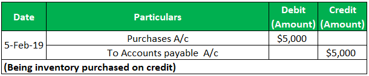

Accounts Payable (AP) and algorithmic trading are two pivotal components in the financial landscape that cater to business operations and trading efficiencies. Accounts Payable represents the amounts a company owes to its suppliers or vendors for goods and services received on credit. The accurate recording of AP is crucial for businesses to manage cash flow effectively, ensuring they meet their short-term liabilities without straining their financial resources. Mismanagement in AP can lead to liquidity issues, damaged supplier relationships, and potential inefficiencies in operational practices.

Algorithmic trading, on the other hand, refers to using algorithms – sets of predefined rules often based on mathematical models and statistical analyses – to execute trading orders. This method leverages computing power to execute trades with precision and speed, often beyond human capabilities. In today's fast-paced financial markets, algo trading is significant due to its ability to reduce transaction costs, eliminate human emotions from trading decisions, and enhance market liquidity. 



The intersection of accurate AP management and algorithmic trading offers finance professionals insights into operational efficiencies and smarter capital management. By understanding and applying these concepts, businesses can ensure robust financial health and traders can optimize their strategies. The precise, data-driven approach in both areas allows companies to gain a competitive edge whether they're in supply chain management, financial planning, or trading.

In this article, we explore practical examples and strategies for effective AP management and algorithmic trading. By breaking down processes, methods, and tools used in these fields, we aim to provide readers with actionable insights and a deeper understanding of how these financial mechanisms can drive success.

## Table of Contents

## Understanding Accounts Payable (AP)

Accounts payable (AP) is a fundamental component of a company's balance sheet, representing the money owed by the business to its suppliers for goods and services received but not yet paid for. It is considered a short-term liability, as these obligations typically must be settled within a specific period, often 30 to 90 days, to maintain good supplier relationships and a firm credit rating. Efficient management of accounts payable is crucial for sustaining healthy cash flow and financial stability.

### The Role of AP in Financial Operations

Accounts payable plays a critical role in managing a company's working capital. By postponing payment, a business can keep cash within the operation for a more extended period, enhancing [liquidity](/wiki/liquidity-risk-premium). Moreover, effective AP management allows firms to optimize their credit terms and potentially benefit from early payment discounts, thereby reducing overall expenses.

### Recording Accounts Payable

The process of recording AP involves several steps to ensure accuracy and timeliness. Upon receipt of an invoice, the business must verify that the invoice details match the purchase order and the delivery receipt. This verification process can involve several documents and is an essential step to prevent discrepancies and overpayment.

Entries in the accounts payable ledger are typically made when the invoice is approved. This record includes the amount owed, the due date, and information about the creditor. The use of the accrual basis of accounting necessitates that expenses be recorded in the period they are incurred, not necessarily when they are paid, which provides a more accurate financial picture.

### Common Practices and Standards

Effective AP management relies on the adoption of standardized practices such as maintaining an accurate and up-to-date ledger, implementing a robust invoice approval process, and ensuring timely reconciliation of accounts. Automation tools are increasingly essential in managing AP efficiently, reducing the potential for human error, and speeding up processing times. These tools can include dedicated AP software that integrates seamlessly with accounting systems to provide real-time insights and reporting capabilities.

### Workflow and Documentation

The typical workflow for AP includes receiving an invoice, verifying it against purchase orders and receipts, entering it into the ledger, and scheduling the payment according to the agreed terms. Documentation is crucial, as it provides the audit trail needed for internal controls and compliance. It may involve maintaining digital or physical copies of invoices, contracts, purchase orders, and delivery receipts.

### Challenges in AP Management

Businesses can face several challenges in managing accounts payable, including issues with cash flow timing, discrepancies between purchase orders and invoices, and maintaining good supplier relationships. Delays in the AP process can result in late fees, strained supplier relationships, and missed discount opportunities. Furthermore, manual entry systems are susceptible to errors and can be time-consuming, underscoring the necessity of automation and efficient workflow design.

By understanding and effectively managing accounts payable, companies can improve their operational efficiency, reduce costs, and maintain strong supplier partnerships, which ultimately contributes to better overall financial health.

## Examples of Recording Accounts Payable

Accounts payable (AP) represents a critical component of a company’s financial structure, ensuring that obligations to creditors and suppliers are met timely. Accurate recording of AP is vital, as it influences cash flow management, financial planning, and overall organizational health. This section explores practical examples and case studies of businesses excelling in AP management, software solutions facilitating these processes, and tips for small businesses establishing their AP systems.

### Practical Examples of AP Recording

1. **Manufacturing Firms:**
   Manufacturing companies often handle substantial amounts of raw materials and components from various suppliers. These transactions are recorded in a detailed ledger where each transaction includes the supplier’s name, invoice number, amount due, and due date. By maintaining a precise record of these transactions, firms avoid overdue payments, thereby maintaining good supplier relationships.

2. **Retail Businesses:**
   Retailers manage numerous small transactions. To efficiently handle these, they utilize batch processing of payments at the end of each month, leveraging electronic data interchange (EDI) systems to update AP entries automatically. This approach minimizes errors and enhances efficiency.

3. **Service Providers:**
   Service-oriented businesses might handle fewer, larger bills. They often record AP by matching purchase orders with invoices, using a three-way match system. This method ensures accuracy and legitimacy of the transactions before payment processing, thus safeguarding the company from fraudulent or erroneous invoices.

### Case Studies of Efficient AP Management

**XYZ Corporation:** By integrating automated AP software, XYZ Corporation successfully reduced invoice processing time by 70%. The software allowed for automatic data capture and real-time tracking of payment schedules, enhancing their cash flow predictability. Following implementation, the company reported improved relationships with vendors due to reliable and timely payments.

**GreenTech Innovations:** This company adopted cloud-based AP software, resulting in a 40% reduction in paperwork. The transition facilitated remote access for their finance team, streamlining approval processes and increasing overall efficiency. GreenTech Innovations also noted improved financial forecasting accuracy, as they could better predict outgoing cash flows and manage liquidity.

### Software Solutions for AP Management

Modern software solutions play a pivotal role in automating and managing AP processes. Tools like **QuickBooks, SAP Concur**, and **Xero** offer features such as digital invoice management, automated payment scheduling, and integration with banking systems. These tools help reduce manual entries, decrease error rates, and offer enhanced reporting capabilities.

```python
# Example of Automated AP Entry Using Python
import pandas as pd

# Example Ledger Pre-Population
invoice_data = {
    'Invoice Number': ['INV001', 'INV002', 'INV003'],
    'Supplier': ['Supplier A', 'Supplier B', 'Supplier C'],
    'Amount Due': [1000, 1500, 1200],
    'Due Date': ['2023-10-01', '2023-10-05', '2023-10-10']
}

ap_ledger = pd.DataFrame(invoice_data)

# Calculate Days Until Due Date
ap_ledger['Days Until Due'] = (pd.to_datetime(ap_ledger['Due Date']) - pd.to_datetime('today')).dt.days

print(ap_ledger)
```

### Impact of Accurate AP Recording

Accurate management of AP directly influences a company’s financial planning capability. Timely recording and payment of invoices ensure a trustworthy credit standing and improve supplier relationships. This reliability can translate into better credit terms and discounts, ultimately enhancing profitability and liquidity. Furthermore, accurate AP records contribute to precise financial statements, aiding in strategic decision-making and compliance with financial regulations.

### Tips for Small Businesses

- **Standardize Processes:** Small businesses should standardize their AP processes to ensure consistency. This includes setting specific days each month for reviewing and processing bills.

- **Leverage Technology:** Utilize affordable AP software solutions that cater to small business needs, enabling automation of routine tasks and reducing human error.

- **Monitor Cash Flow:** Regularly review outstanding payables and their impact on cash flow to adjust business strategies accordingly.

- **Vendor Communication:** Maintain open communication with suppliers to negotiate favorable terms and ensure smooth operation continuity.

In conclusion, well-managed AP records are not merely a financial obligation but a strategic asset, influencing an organization’s cash flow management and overall financial stability. Accurate AP practices contribute significantly to robust financial health, paving the way for both operational efficiency and enhanced business planning.

 to Algorithmic Trading

Algorithmic trading, often referred to as algo trading, is a modern method of executing trades using pre-programmed instructions accounting for variables such as timing, price, and [volume](/wiki/volume-trading-strategy). Its significance in today's financial markets is profound, as it enables traders to execute orders at speeds and frequencies that are impossible for human traders. By utilizing algorithms, traders can automate complex trading strategies with precision, thereby optimizing execution efficiency and minimizing human intervention. 

Algo trading employs mathematical models and algorithms to automate the process of trading. These algorithms analyze multiple market variables and execute orders based on predefined criteria. The fundamental components of an algorithm include logic and conditions that help decide when to buy or sell a security. Once these components determine the appropriate [course](/wiki/best-algorithmic-trading-courses) of action, the algorithm carries out the trade automatically.

One of the key benefits of [algorithmic trading](/wiki/algorithmic-trading) is its ability to enhance efficiency. Algorithms can process large volumes of data and execute trades quickly, which helps to capture potential trading opportunities within milliseconds. This capability is particularly advantageous in high-frequency trading scenarios, where competitors strive to exploit small price movements over brief time frames. Additionally, algorithmic trading significantly reduces human error. By eliminating the emotional and psychological factors that can influence trading decisions, it offers a more disciplined and systematic approach.

Common strategies in algo trading include [trend following](/wiki/trend-following), where algorithms detect and exploit market trends; [arbitrage](/wiki/arbitrage), which seeks to profit from price discrepancies across different markets or instruments; and mean reversion, which assumes that prices will revert to their historical averages over time. Each of these strategies leverages the computational power of algorithms to identify profitable trading opportunities based on historical and real-time market data.

The proliferation of algorithmic trading technologies has accelerated considerably over recent years, driven by advancements in computing power, data availability, and [machine learning](/wiki/machine-learning) techniques. As markets become more complex and data-rich, algorithms have evolved to incorporate sophisticated models that can handle vast datasets and execute trades with increased accuracy and speed. Furthermore, the integration of [artificial intelligence](/wiki/ai-artificial-intelligence) and machine learning in trading algorithms has allowed traders to develop more adaptive and predictive trading systems.

In summary, algorithmic trading is a pivotal advancement in financial markets, facilitating faster and more efficient trade execution while minimizing the risk of human error. With ongoing technological innovation, the capacity of algorithmic trading to transform market dynamics and trading paradigms continues to expand.

## Examples of Algorithmic Trading Strategies

Algorithmic trading employs a variety of strategies that leverage computational power and historical data to execute trades with precision and speed. Here, we explore several notable algorithmic trading strategies, along with their real-world applications, and the integral role of data and analytics.

### Trend Following

Trend following is a widely used strategy based on the premise that assets which have been appreciating in value will continue to do so, and those that have been depreciating will keep losing value. This strategy does not attempt to predict market trends, but rather to exploit them once they have been established. A common approach to trend following is using moving averages to generate buy or sell signals. For example, when a short-term moving average crosses above a long-term moving average, it signals a buy, and vice versa for a sell signal.

#### Real-World Application

Hedge funds and proprietary trading firms, like Winton Group and Man AHL, have utilized trend-following algorithms extensively. These organizations employ complex models that process vast amounts of data to detect and profit from trends across various asset classes globally.

### Arbitrage

Arbitrage involves capturing price discrepancies of the same asset in different markets or forms, aiming for risk-free profit. This strategy exploits inefficiencies between related markets that occur temporarily due to mispricing.

#### Real-World Application

High-frequency trading ([HFT](/wiki/high-frequency-trading-strategies)) firms, such as Jump Trading or Virtu Financial, commonly engage in arbitrage. These firms deploy sophisticated algorithms that operate across multiple markets to execute millions of transactions within fractions of a second, capturing fleeting arbitrage opportunities.

### Mean Reversion

Mean reversion is based on the hypothesis that the price of an asset will tend to revert to its average over time. Traders utilizing this strategy attempt to identify when an asset is overbought or oversold and execute trades assuming a return to the mean.

#### Real-World Application

Investment firms like Two Sigma Investments use mean reversion strategies alongside machine learning models to predict short-term price movements, identifying profitable opportunities when prices deviate significantly from historical norms.

### Data and Analytics

Data plays a crucial role in algorithmic trading. The effectiveness of an algorithmic strategy heavily relies on the quality and timeliness of data. Traders use historical data not only for [backtesting](/wiki/backtesting) but also to train models, optimize parameters, and refine strategies. 

#### Backtesting and Strategy Refinement

Backtesting involves applying a trading strategy to historical data to evaluate its performance. This process allows traders to adjust algorithms by observing theoretical profit and loss under varied market conditions. Below is a simple example in Python using historical stock data:

```python
import pandas as pd

# Sample data loading
data = pd.read_csv('stock_data.csv')
data['signal'] = 0

# Simple moving average crossover strategy
short_window = 40
long_window = 100

# Generate signals
data['short_mavg'] = data['close'].rolling(window=short_window, min_periods=1, center=False).mean()
data['long_mavg'] = data['close'].rolling(window=long_window, min_periods=1, center=False).mean()

# Signal generation
data['signal'][short_window:] = np.where(data['short_mavg'][short_window:] > data['long_mavg'][short_window:], 1, 0)
data['positions'] = data['signal'].diff()

# Display signals
print(data[['date', 'close', 'signal', 'positions']].head())
```

### Ethical and Regulatory Considerations

Despite the advantages, algorithmic trading poses ethical and regulatory challenges. Algorithms can exacerbate market [volatility](/wiki/volatility-trading-strategies) and lead to events like flash crashes. Regulatory bodies, like the SEC in the United States, impose rules to ensure fairness and stability in financial markets, seeking to minimize potential negative impacts of algorithmic trading. Transparency, fairness, and the prevention of market manipulation remain key regulatory concerns.

In summary, algorithmic trading strategies are diverse and complex, offering numerous benefits through the use of data and technology. However, they necessitate careful consideration of ethical standards and regulatory requirements to ensure sustainable and responsible market behavior.

## Synergies Between Accounts Payable and Algorithmic Trading

Accounts payable (AP) management and algorithmic trading (algo trading) are often seen as distinct elements of financial management and trading operations. Nonetheless, they possess synergies that can profoundly enhance both domains when integrated effectively.

**Informing Trading Strategies with AP Insights**

Accounts payable is critical in maintaining a company's cash flow and liquidity. By analyzing AP data, businesses can derive insights into their payment cycles, supplier terms, and outstanding obligations. This financial behavior can inform trading strategies by providing a clearer picture of when a business might have surplus capital for investment or trading activities. For instance, if a firm's AP data reveals a consistent pattern of early payments, this might indicate strong cash reserves, suggesting potential opportunities for investment in short-term trading positions.

**Role of AP Data in Algo Trading Models**

Financial data derived from accounts payable can be a valuable input for algorithmic trading models. This data can include payment patterns, creditor terms, and seasonal cash flow variations. By integrating these insights, traders can fine-tune algorithms to better schedule trades based on anticipated cash flow availability. For example, an algo trading system could be programmed to execute larger trades during periods of historically lower AP obligations.

**Case Studies of Integration**

Several businesses have successfully integrated AP management into their algo trading systems to optimize capital allocation. Consider a retail firm that uses AP data to forecast quarterly cash flow availability. By linking this information to its trading algorithms, the firm can effectively adjust its trading volume and risk exposure in accordance with its financial forecasts. Such integration ensures that the firm maintains enough liquidity to meet its obligations while pursuing profit through trading.

**Technological Advancements Bridging Business and Trading**

Technological advancements have made it feasible to bridge the gap between business operations and trading. With the rise of data analytics and machine learning, AP data can be seamlessly integrated into trading platforms. For example, using Python libraries such as Pandas for data manipulation and Scikit-learn for predictive modeling, firms can develop sophisticated models that link business operations with trading actions:

```python
import pandas as pd
from sklearn.linear_model import LinearRegression

# Example: Forecasting cash flow based on AP data
ap_data = pd.read_csv('ap_data.csv')
features = ap_data[['payment_day', 'invoice_amount', 'creditor_term']]
target = ap_data['cash_flow']

model = LinearRegression().fit(features, target)

# Predict future cash flow
future_ap = [[15, 20000, 30]]  # example new data
predicted_cash_flow = model.predict(future_ap)
```

**Future Trends in Convergence**

Looking ahead, the convergence of accounts payable management and algorithmic trading is likely to be driven by further advancements in artificial intelligence and big data. As systems become more integrated, the distinction between financial management and trading will blur, enabling more dynamic capital allocation strategies. Future trends may include the development of unified platforms that manage operational finances and execute trades based on real-time financial conditions.

In conclusion, integrating accounts payable insights with algorithmic trading fosters a more holistic approach to financial management, enhancing capital efficiency and strategic decision-making. As technology evolves, the potential for synergy between these domains will undoubtedly expand, offering businesses new avenues for optimizing their financial operations.

## Conclusion

In closing, understanding and effectively managing both accounts payable (AP) and algorithmic trading are pivotal for achieving financial success in today's dynamic business and trading environments. Mastery over AP management ensures businesses maintain a healthy cash flow and meet their financial obligations effectively, thereby securing their operational stability. On the other hand, algorithmic trading has revolutionized the financial markets by automating trading strategies, increasing efficiency, and minimizing human errors.

Businesses are encouraged to leverage technological solutions to streamline these processes. For instance, advancements in AP automation software can significantly reduce manual errors and improve efficiency in managing payables. Similarly, traders can utilize cutting-edge algorithmic trading platforms that offer sophisticated tools for strategy development and execution.

Both fields continue to evolve rapidly with technological advancements. Staying informed about the latest developments in AP management tools and algorithmic trading technologies is crucial. Businesses and traders must be proactive in adopting new strategies and systems that can enhance their operations and financial outcomes.

For those interested in further exploration, numerous resources are available online, including industry reports, scholarly articles, and training courses on platforms like Coursera and LinkedIn Learning. Additionally, engaging with professional networks and forums can provide valuable insights and real-world perspectives from experts in these domains. By continually educating themselves, businesses and individuals can harness these tools for enhanced financial management and trading performance.

## References & Further Reading

[1]: Bergstra, J., Bardenet, R., Bengio, Y., & Kégl, B. (2011). ["Algorithms for Hyper-Parameter Optimization."](https://papers.nips.cc/paper/4443-algorithms-for-hyper-parameter-optimization) Advances in Neural Information Processing Systems 24.

[2]: ["Advances in Financial Machine Learning"](https://www.amazon.com/Advances-Financial-Machine-Learning-Marcos/dp/1119482089) by Marcos Lopez de Prado

[3]: ["Evidence-Based Technical Analysis: Applying the Scientific Method and Statistical Inference to Trading Signals"](https://www.amazon.com/Evidence-Based-Technical-Analysis-Scientific-Statistical/dp/0470008741) by David Aronson

[4]: ["Machine Learning for Algorithmic Trading"](https://github.com/stefan-jansen/machine-learning-for-trading) by Stefan Jansen

[5]: ["Quantitative Trading: How to Build Your Own Algorithmic Trading Business"](https://www.amazon.com/Quantitative-Trading-Build-Algorithmic-Business/dp/1119800064) by Ernest P. Chan