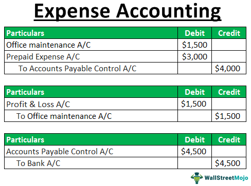

In the dynamic landscape of financial management, grasping essential concepts such as expenses, financial accounting, accounts payable, and algorithmic trading is crucial for businesses aiming to optimize their operations. Expenses and financial accounting form the backbone of a company's financial health, providing the data necessary to make informed strategic decisions. Managing expenses effectively ensures that a company maintains a healthy cash flow, contributing to sustainable business growth and stability.

Accounts payable represents a company's obligations to its suppliers and vendors, reflecting short-term liabilities that need precise management to maintain liquidity. Proper management of accounts payable is vital in preserving cash flow and strengthening supplier relationships, which are critical elements of a firm's operational success.



The technological advancement of algorithmic trading ushers in a new era of trading opportunities. By employing sophisticated algorithms, companies can execute trades with greater speed and efficiency, minimizing human error and optimizing decision-making processes. This form of trading significantly influences financial planning and operations by providing more data-driven insights.

This article explores the integration of accounts payable with expense management and the transformative impact of algorithmic trading strategies. By understanding how these elements interact, businesses can achieve significant efficiencies and optimize their financial processes. Leveraging these technologies and financial concepts can afford companies a competitive edge in an ever-evolving marketplace, paving the way for enhanced strategic planning and operational success.

## Table of Contents

## Understanding Financial Accounting and Expenses

Financial accounting is a foundational aspect of financial management that involves the systematic recording, summarizing, and reporting of a company's financial transactions. This process is essential for understanding a company’s financial position and performance over time. The primary aim of financial accounting is to provide stakeholders, such as investors, creditors, and management, with accurate and transparent financial information that can aid in decision-making.

Expenses are a critical component of financial accounting and refer to the outflows of resources that occur as a part of business operations. These are typically costs incurred by a company in its efforts to generate revenue. Examples include salaries, rent, utilities, and the cost of goods sold. Understanding expenses is crucial for assessing a company's profitability and operational efficiency.

Proper expense management is vital for maintaining healthy cash flow and financial stability. Cash flow management involves planning and controlling the movement of cash into and out of a business, ensuring that it can meet its obligations as they come due while also taking advantage of opportunities for growth. Effective expense management can prevent overspending, reduce waste, and optimize operational productivity, thereby enhancing the company’s ability to generate profits.

Accrual accounting is a fundamental principle in financial accounting that significantly impacts how expenses are recognized. Unlike cash accounting, which records expenses only when cash changes hands, accrual accounting records expenses when they are incurred, regardless of when payment is made. This approach provides a more accurate picture of a company's financial health during any given period because it matches incomes and expenses more precisely to the periods in which they are actually incurred.

For example, if a company receives an electricity bill in December for usage in November, accrual accounting would record this expense in November, matching it to the period in which the resource was consumed. This principle enhances the accuracy and reliability of financial reports, as it aligns expenses with revenues in the same period, fostering a better understanding of a company’s actual financial performance.

Overall, financial accounting and efficient management of expenses and resources are essential for companies aiming for long-term sustainability and growth. Properly implemented, these practices provide enhanced transparency, better decision-making capabilities, and the potential for improved profitability.

## Accounts Payable in Financial Management

Accounts payable (AP) represents the short-term obligations a company has towards its vendors or suppliers. These liabilities arise when a business receives goods or services but defers payment to a future date. Efficient management of accounts payable is a cornerstone for maintaining [liquidity](/wiki/liquidity-risk-premium) and optimizing cash flow within an organization.

Effective AP management directly influences a company's cash position and ensures the business remains capable of meeting its financial commitments. It involves monitoring and controlling outflows of cash, ensuring that payments are made within appropriate timelines to avoid late fees or strained supplier relationships. Additionally, efficient AP management can leverage early payment discounts, further optimizing cash flow.

Central to successful AP management is the establishment of strong vendor relationships, which can lead to favorable credit terms and better negotiation positions. Companies that actively engage with and support their suppliers may benefit from improved supply chain reliability and trust, thereby enhancing financial stability.

The advent of modern tools and software has transformed how businesses manage their accounts payable processes. Automation and digitization reduce manual errors, streamline operations, and provide real-time insights into financial data. These technologies can offer significant efficiencies; for example, digital invoice processing and electronic payment systems minimize the need for extensive paperwork and reduce processing times.

Furthermore, these systems provide valuable analytics that aids in strategic decision-making. By analyzing payment cycles, outstanding liabilities, and financial performance metrics, companies can identify trends and optimize their payables strategies. Such insights enable more strategic planning and can contribute to overall business resiliency and flexibility.

In summary, AP management is a critical component of financial management that supports operational efficiency, financial stability, and supplier relationships. Through the adoption of modern technologies, businesses can enhance their AP processes, ensuring they not only meet immediate liabilities but also position themselves advantageously for future success.

## Algorithmic Trading: A Technological Edge

Algorithmic trading is a highly sophisticated method employed in financial markets, utilizing computer algorithms to execute trades based on pre-determined criteria. This method harnesses the power of technology to process large volumes of data rapidly and execute commands at speeds unattainable by human traders. Algorithmic trading is not only about executing trades at high speed but also about optimizing trading strategies through comprehensive data analysis and reduction of manual errors.

The primary objective of [algorithmic trading](/wiki/algorithmic-trading) is to capitalize on the efficiency and accuracy offered by computerized systems. These algorithms can analyze multiple market conditions, observe price trends, and evaluate historical data to make informed trading decisions. The effectiveness of algorithmic trading is largely enhanced by its ability to ingest vast datasets and perform intricate calculations seamlessly.

For example, algorithms can implement strategies such as moving averages, [arbitrage](/wiki/arbitrage) opportunities, and [statistical arbitrage](/wiki/statistical-arbitrage) with precision. Consider the moving average crossover strategy:
$$
\text{Buy when}: MA_{\text{short-term}} > MA_{\text{long-term}}
$$
$$
\text{Sell when}: MA_{\text{short-term}} < MA_{\text{long-term}}
$$

This simplistic model highlights how algorithms can leverage historical price data to signal trading actions.

Moreover, integrating financial principles such as expense accounting into algorithmic trading can refine decision-making. Expense accounting provides insights into the cost structures and profitability thresholds which can feed into algorithmic models to forecast financial outcomes more reliably. For instance, this integration can ensure trading models account for transaction costs, thereby refining profitability estimates.

Python, a popular programming language for algorithmic trading, offers libraries like `pandas` for data manipulation, `numpy` for numerical computations, and `matplotlib` for data visualization, enabling developers to construct and test trading strategies using historical data.

```python
import pandas as pd
import numpy as np

# Simulating a simple moving average strategy
data = pd.read_csv('stock_prices.csv')  # Sample stock price data
data['SMA_50'] = data['Price'].rolling(window=50).mean()
data['SMA_200'] = data['Price'].rolling(window=200).mean()

# Generating buy/sell signals
data['Buy_Signal'] = np.where(data['SMA_50'] > data['SMA_200'], 1, 0)
data['Sell_Signal'] = np.where(data['SMA_50'] < data['SMA_200'], 1, 0)
```
The above code snippet demonstrates how a simple moving average strategy could be implemented, where buy and sell signals are generated based on the crossing of short-term and long-term moving averages.

Algorithmic trading's ability to integrate intricate data sets and advanced mathematical models marks it as a cornerstone in modern financial markets. Its integration with financial accounting allows traders to enhance strategy accuracy, manage risks effectively, and maintain operational efficiency.

## Integrating Financial Accounting with Algorithmic Trading

Algorithmic trading significantly enhances decision-making processes by utilizing precise financial accounting data. The synergy between these domains primarily revolves around the quality and accuracy of financial records, which are essential for formulating robust trading strategies.

Accurate records of expenses and liabilities form the backbone of algorithmic trading systems. These records are crucial for developing models that predict market behavior and make informed trading decisions. By maintaining detailed and up-to-date financial statements, traders can ensure that their algorithms have a solid foundation for analysis. This precision helps in forecasting short-term and long-term trends, optimizing entry and [exit](/wiki/exit-strategy) points for trades, and managing financial risks more effectively.

Financial accounting captures various transactions, including expenses and liabilities, in a manner that aligns with generally accepted accounting principles (GAAP). When integrated into algorithmic trading systems, this precise data collection supports advanced computational models that require accurate input data for generating predictions. The reliability of these predictions directly impacts the profitability of trades and the ability to manage risk adequately.

Furthermore, leveraging financial aspects such as cash flow analysis, credit risk assessments, and profitability analysis enhances algorithmic trading strategies. By understanding cash flows, trading algorithms can predict liquidity issues and adjust trading operations accordingly. Analyzing credit risks can aid in the selection of trading opportunities, ensuring that algorithms are aligned with the company’s financial risk appetite.

Integrating financial accounting with algorithmic trading not only enhances profitability but also contributes to strategic risk management. Algorithms equipped with accurate financial insights can identify potential market disruptions and adjust trading positions accordingly, thereby mitigating potential losses. This integration represents a sophisticated approach to trading that relies on the seamless flow of accurate financial data to inform strategic decisions and risk assessments.

In conclusion, the precise integration of financial accounting with algorithmic trading is indispensable for modern trading operations. It enhances the accuracy of predictions and risk management capabilities, thereby offering a significant edge in the competitive landscape of financial markets.

## Challenges and Considerations

Integrating accounts payable (AP) data into algorithmic trading presents several challenges that necessitate diligent management to ensure accuracy and compliance. One of the core issues is maintaining data accuracy amidst continuous data flow between financial systems and trading platforms. Discrepancies in data, often arising from manual data entry errors or mismatches between AP systems and trading algorithms, can lead to flawed trading decisions. Therefore, automated data integration and validation systems are essential to minimize these errors.

Regulatory compliance is another critical aspect. Financial markets are subject to stringent regulations aimed at ensuring transparency and preventing malpractices. When AP data is utilized within trading algorithms, it becomes imperative to ensure that these systems are in full compliance with existing financial regulations such as GDPR in data protection and Sarbanes-Oxley Act for corporate governance. Non-compliance can result in penalties and reputational damage, necessitating robust compliance frameworks.

Regular auditing forms a crucial part of this integration process. Audits help verify the integrity and accuracy of the financial data being used and the algorithms processing it. This ongoing auditing is vital not just for regulatory compliance, but also for maintaining the confidence of stakeholders in the financial information reported by the company.

Strategic risk management is also necessary to mitigate potential operational risks. Algorithmic trading inherently includes market risk due to the rapid execution speed and [volume](/wiki/volume-trading-strategy) of trades. Enhanced risk management strategies should be implemented to handle such scenarios. These strategies may include the use of stop-loss orders, diversification of trade portfolios, and continuous monitoring of market conditions to promptly adapt trading algorithms.

In summary, while integrating accounts payable data into algorithmic trading offers notable advantages, it requires ongoing commitment to data accuracy, regulatory compliance, and risk management practices to realize its full potential.

## Conclusion

Effective financial management that integrates accounts payable and algorithmic trading can lead to substantial benefits for organizations. By leveraging these integrations, companies can enhance operational efficiency and increase profitability. This synthesis of financial management practices and advanced trading technologies can streamline processes, reduce costs, and optimize the utilization of resources.

Key to this integration is recognizing the complementary roles that accounts payable and algorithmic trading play. Accounts payable ensures smooth cash flow by effectively managing short-term obligations, while algorithmic trading enhances decision-making and execution in financial markets. When combined, these systems provide a robust framework that supports strategic financial planning and execution.

Continuous advancements in technology, particularly in areas like [artificial intelligence](/wiki/ai-artificial-intelligence) and [machine learning](/wiki/machine-learning), promise further improvements. These technologies can enhance data processing and analysis capabilities, allowing for more precise algorithmic trading strategies and more efficient financial transactions. As a result, businesses can achieve a higher degree of financial agility and responsiveness, positioning themselves advantageously in competitive markets.

In summary, the integration of accounts payable management with algorithmic trading is not only feasible but also beneficial for fostering financial resilience and exploiting market opportunities. Companies that effectively manage these integrations stand to gain a lasting competitive edge in their operational frameworks.

## References & Further Reading

[1]: ["The Basics of Algorithmic Trading"](https://www.investopedia.com/articles/active-trading/101014/basics-algorithmic-trading-concepts-and-examples.asp) - Investopedia

[2]: ["Advances in Financial Machine Learning"](https://www.amazon.com/Advances-Financial-Machine-Learning-Marcos/dp/1119482089) by Marcos Lopez de Prado

[3]: ["Quantitative Trading: How to Build Your Own Algorithmic Trading Business"](https://github.com/LucindaYa/quant-resources/blob/master/Quantitative%20Trading%20How%20to%20Build%20Your%20Own%20Algorithmic%20Trading%20Business.pdf) by Ernest P. Chan

[4]: ["Financial Accounting: An Introduction"](https://archive.org/details/financialaccount0000weet) - Financial Times

[5]: ["Essential Guide to Algorithmic Trading"](https://www.quantstart.com/articles/Top-5-Essential-Beginner-Books-for-Algorithmic-Trading/) by Yang, Kevin Peter, et al.

[6]: ["Accounts Payable: The Basics"](https://www.business.org/finance/accounting/accounts-payable-process/) - Harvard Business Review