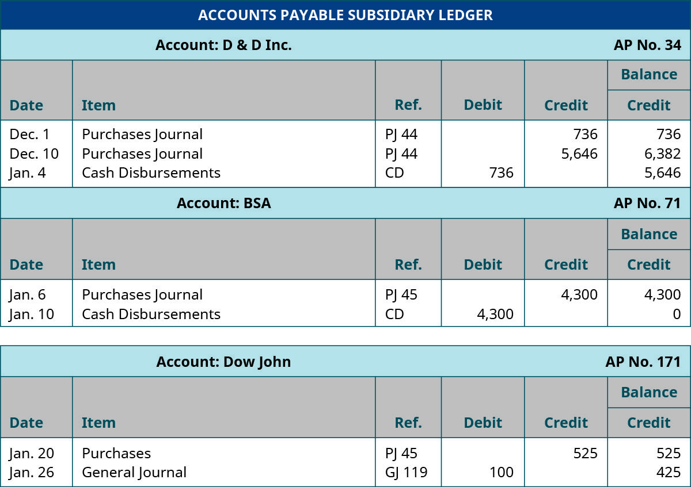

Accounts payable and algorithmic trading are two key elements in the financial landscape that significantly impact business operations and trading efficiencies. Understanding accounts payable (AP) is essential for businesses to manage their liabilities effectively. It allows companies to maintain good supplier relationships and ensure smooth cash flow—a critical aspect in avoiding disruptions in operations or the procurement chain. Effective AP management not only helps in meeting financial commitments on time but also optimizes working capital management.

On the other hand, algorithmic trading represents a technological advancement in the financial markets, utilizing mathematical models and computing power to execute trades at high speeds. This approach offers the advantages of reduced transaction costs and enhanced market liquidity. Algorithmic trading systems use complex algorithms to analyze market data and execute trades with precise timing, thereby maximizing profit opportunities while minimizing human error.



This article examines the synergy between these two components, demonstrating how understanding and managing accounts payable alongside algorithmic trading strategies can provide companies with competitive advantages. By integrating insights from accounts payable into algorithmic trading models, businesses can optimize their financial strategies and enhance operational efficiencies. Furthermore, we present practical examples, case studies, and strategies of effective accounts payable management and algorithmic trading, offering actionable insights into how these can be leveraged for financial success.

## Table of Contents

## Understanding Accounts Payable (AP)

Accounts payable (AP) is a central aspect of a company's financial operations, appearing on the balance sheet as short-term liabilities. This account records the amounts owed to suppliers for goods or services that have been received but not yet paid for. Proper management of accounts payable is vital for sustaining a company's financial liquidity and optimizing its working capital. AP management involves several key activities that ensure monetary obligations are met efficiently and supplier relationships remain strong.

One of the primary responsibilities in managing accounts payable is the accurate recording of transactions. This accuracy is achieved by verifying invoice details against purchase orders and delivery receipts. Such verification prevents discrepancies and ensures that the company pays only for goods and services that have been received according to agreed terms. Discrepancies, if left unchecked, can lead to unwanted financial variations and a potential breakdown in supplier trust.

Standardizing AP processes can significantly enhance efficiency and reduce errors. Automation tools, such as automated invoice management systems, play a crucial role here. These systems digitize and streamline the handling of invoices, reducing the time and human error associated with manual processing. Automated solutions can auto-match invoices with purchase orders and delivery notes, flagging inconsistencies immediately for review. This not only aids in maintaining smooth operations but also frees up resources for other strategic functions.

Despite the advantages of automation, challenges in accounts payable management persist. One common issue is dealing with cash flow discrepancies. Managing timing differences between outgoing payments to suppliers and incoming payments from clients is fundamental to maintaining healthy [liquidity](/wiki/liquidity-risk-premium). Poor cash flow management can lead to delayed payments to suppliers, damaging relationships and potentially leading to less favorable payment terms in the future.

Another challenge is maintaining good supplier relationships, which is often achieved by timely payment and clear communication regarding any delays or disputes. Suppliers are more inclined to offer flexible terms and better pricing if a company demonstrates reliability in fulfilling its financial obligations.

In conclusion, effective accounts payable management is not merely about tracking liabilities. It involves strategic planning and the use of technology to automate and streamline processes, thereby enhancing financial stability and supplier relationships. Automated systems can mitigate errors and inefficiencies, but maintaining open communication and managing cash flows are equally critical to successful AP management.

## Examples of Recording Accounts Payable

Manufacturing firms operate with extensive supplier networks, requiring precise accounts payable (AP) management to prevent overdue payments and associated financial penalties. Maintaining detailed ledgers is crucial; these records should capture invoice dates, supplier information, and payment terms to facilitate timely settlements and budgeting decisions. A precise and well-organized ledger ensures that all transactions are accounted for and discrepancies can be quickly resolved, minimizing disruptions in production and maintaining good supplier relationships.

Retail businesses, handling numerous transactions daily, often implement batch processing and electronic data interchange (EDI) systems. Batch processing allows retailers to collect and process invoices in groups, reducing manual entry errors and speeding up the accounting process. EDI systems enable seamless communication between businesses and their suppliers, automating the exchange of invoices, purchase orders, and delivery notices. This not only streamlines the AP process but also enhances accuracy, as data is directly transferred between systems without manual intervention.

Service providers typically employ matching systems, where invoices are cross-verified with purchase orders and delivery receipts. This three-way matching process ensures the legitimacy and accuracy of transactions before any payments are made, safeguarding against fraud and discrepancies. By validating each transaction against agreed terms, companies can foster trust with their suppliers and avert financial discrepancies.

Software solutions such as QuickBooks and SAP Concur are instrumental in facilitating comprehensive AP management. QuickBooks provides a user-friendly interface for digital invoice handling and can automatically schedule payments, ensuring timely settlements without manual tracking. SAP Concur offers sophisticated features like expense management, which integrates seamlessly with AP processes to provide a holistic view of outflows and streamline financial reconciliation tasks.

Accurate AP recording is critical for a firm's financial health. It influences financial planning by providing insights into cash flow needs and helps maintain a trustworthy credit standing, which is essential for negotiating favorable terms with suppliers. Effective AP management also strengthens supplier relationships by ensuring that payments are consistently made according to agreed-upon terms, fostering long-term partnerships conducive to mutual growth.

## Examples of Algorithmic Trading Strategies

Algorithmic trading utilizes sophisticated algorithms to automate trading processes and maximize trading efficiency by executing pre-programmed instructions based on real-time market data. It relies on various strategies that cater to different market conditions, with each strategy offering unique advantages. Below are some prominent [algorithmic trading](/wiki/algorithmic-trading) strategies:

1. **Trend Following**: This strategy capitalizes on established market trends, leveraging indicators like moving averages to make trading decisions. By not attempting to predict market changes but instead reacting to them, traders can ride existing trends. For instance, a common method is the use of a simple moving average (SMA) or exponential moving average (EMA) crossover. A basic example in Python might be:

    ```python
    import pandas as pd
    import numpy as np

    def moving_average_crossover(prices, short_window, long_window):
        signals = pd.DataFrame(index=prices.index)
        signals['price'] = prices
        signals['short_mavg'] = prices.rolling(window=short_window, min_periods=1, center=False).mean()
        signals['long_mavg'] = prices.rolling(window=long_window, min_periods=1, center=False).mean()
        signals['signal'] = 0.0
        signals['signal'][short_window:] = np.where(signals['short_mavg'][short_window:] > signals['long_mavg'][short_window:], 1.0, 0.0)  
        signals['positions'] = signals['signal'].diff()
        return signals
    ```

2. **Arbitrage**: This strategy seeks to take advantage of price discrepancies for the same asset across different markets or in different forms. Traders often look for temporary mispricings to buy low in one market and sell high in another. Arbitrage strategies usually require high-frequency trading capabilities due to the small margins and need for speed. A simplified example is exploiting the price difference between a stock on two different exchanges.

3. **Mean Reversion**: This strategy operates on the belief that prices and returns eventually move back to their mean or average level. It uses statistical measures to identify when an asset is mispriced relative to historical averages, signaling a trading opportunity. A key formula used in mean reversion is the calculation of the Z-score, given by:
$$
    Z = \frac{(X_t - \mu)}{\sigma}

$$

    where $X_t$ is the current price, $\mu$ is the mean of historical prices, and $\sigma$ is the standard deviation. A high or low Z-score indicates an overbought or oversold condition, respectively.

4. **Data Analytics and Backtesting**: These are integral to the development and refinement of algorithmic strategies. Backtesting involves applying a trading strategy to historical data to evaluate its effectiveness. This process helps in understanding the potential returns and risks associated with a strategy before applying it in real-time trading. Data analytics allows traders to uncover patterns and insights from large datasets, optimizing algorithms for better performance. Techniques like machine learning are increasingly used to enhance prediction accuracy and adaptiveness of trading algorithms.

By effectively implementing these strategies, traders can exploit various market dynamics, enhance their trading performance, and maintain a competitive edge in fast-paced trading environments.

## Synergies Between Accounts Payable and Algorithmic Trading

Accounts payable (AP) and algorithmic trading, while seemingly distinct, can be integrated to enhance financial decision-making and optimize capital allocation. AP data provides a comprehensive view of a company's short-term liabilities and cash flow status, which are crucial for making informed trading decisions. Analyzing AP data helps identify periods of high capital availability, thereby enabling more strategic timing of investments or trades. For instance, a trader aware of impending bulk payments to suppliers may delay significant trades until after these liabilities are settled, maximizing cash flow utilization.

Integrating insights from AP into algorithmic trading models can considerably refine these models, enhancing their predictive accuracy and timing. By inputting cash flow trends derived from AP into trading algorithms, traders can better align their trading activities with the company's financial status. This alignment can lead to more strategic trade executions and reduced risks associated with cash flow fluctuations.

Successful case studies show how companies have seamlessly blended AP management with trading systems. These integrations are often facilitated through platforms that utilize real-time data analytics. For example, algorithms can be designed to halt or adjust trading strategies during cash-intensive periods, thereby optimizing the allocation of available capital.

Technological advancements further bridge these two areas. Machine learning and big data analytics play pivotal roles in processing and analyzing vast amounts of AP and market data, allowing for more precise modeling and forecasting. By harnessing these technologies, companies can develop sophisticated systems in which AP insights dynamically inform trading strategies. For instance, a [machine learning](/wiki/machine-learning) model could be trained to find correlations between cash flow patterns and market conditions, thus predicting optimal trading windows.

Looking forward, there is an expected trend towards increased convergence between AP management and algorithmic trading, driven by advancements in AI and big data. This convergence will likely lead to the development of advanced algorithmic models that not only execute trades but also consider financial health indicators derived from AP data. As these technologies evolve, businesses have the potential to achieve unparalleled efficiency and precision in financial management and trading operations.

## Conclusion

Effective management of accounts payable (AP) and algorithmic trading is essential for financial success. The integration of automation within accounts payable processes plays a pivotal role in enhancing operational efficiency. By automating tasks such as invoice processing and payment scheduling, businesses can significantly reduce errors and speed up transaction times. This streamlining not only alleviates manual workload but also minimizes the chances of discrepancies, thereby bolstering the accuracy and reliability of financial records.

On the other hand, algorithmic trading platforms are instrumental in refining the execution and development of trading strategies. These platforms leverage advanced computing algorithms to make swift, data-driven decisions that capitalize on market efficiencies and reduce human error. The use of such technology allows traders to backtest strategies to determine their potential profitability, adjust parameters, and implement trades with unprecedented precision and speed.

Staying updated with the latest developments in both accounts payable automation and algorithmic trading is crucial for maximizing operational and financial outcomes. The rapid pace of technological advancement necessitates continuous learning and adaptation. By regularly consulting online resources, industry reports, and participating in professional networks, businesses can remain at the forefront of these fields, benefiting from emerging trends and innovations.

Furthermore, continual education in these areas permits businesses and individuals to effectively harness these tools for enhanced financial management and trading performance. This ongoing learning process may involve formal education, attending workshops, and engaging with industry experts. By maintaining a commitment to education and knowledge expansion, stakeholders can ensure they are equipped to navigate the complexities of modern financial landscapes, yielding optimal financial strategies and operations.

## References & Further Reading

Bergstra, J., Bardenet, R., Bengio, Y., & Kégl, B. (2011). "Algorithms for Hyper-Parameter Optimization." Advances in Neural Information Processing Systems 24. This paper explores methods for optimizing hyper-parameters, essential in enhancing the performance of machine learning models, a crucial aspect in algorithmic trading strategies.

"Advances in Financial Machine Learning" by Marcos Lopez de Prado offers a comprehensive guide to applying machine learning techniques to solve financial problems. It presents cutting-edge methodologies that facilitate the development of more accurate trading models through the use of sophisticated algorithms.

"Evidence-Based Technical Analysis: Applying the Scientific Method and Statistical Inference to Trading Signals" by David Aronson emphasizes a scientific approach to technical analysis, offering a robust framework for evaluating trading signals and reducing reliance on subjective judgment.

"Machine Learning for Algorithmic Trading" by Stefan Jansen provides a detailed examination of deploying machine learning in trading. The book illustrates how these techniques can improve trading strategies, emphasizing data-driven decision-making processes.

"Quantitative Trading: How to Build Your Own Algorithmic Trading Business" by Ernest P. Chan guides readers on establishing their own quantitative trading practice. Chan discusses key topics such as developing, testing, and deploying algorithmic strategies, providing practical insights for aspiring quantitative traders.