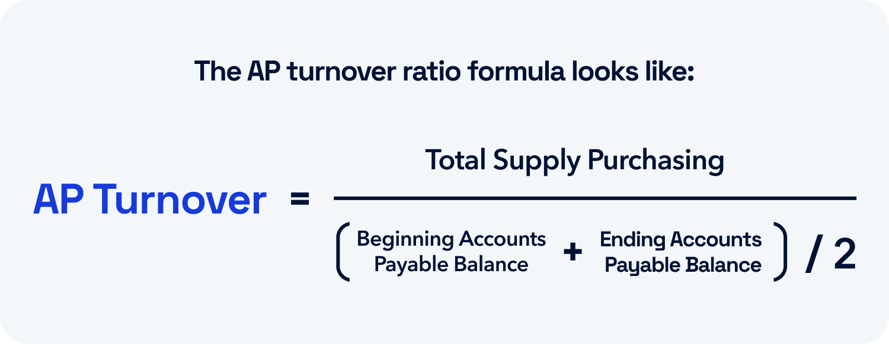

## Table of Contents

## What is the Accounts Payable Turnover Ratio?

The Accounts Payable Turnover Ratio is a financial metric that shows how quickly a company pays off its suppliers. It is calculated by dividing the total purchases made from suppliers by the average accounts payable during a period. This ratio helps businesses understand how efficiently they manage their cash flow and pay their bills.

A higher Accounts Payable Turnover Ratio means the company is paying its suppliers more frequently, which could indicate good relationships with suppliers or strong cash management. On the other hand, a lower ratio might suggest that the company is taking longer to pay its bills, which could be a sign of cash flow problems or a strategy to use the supplier's money for longer. By monitoring this ratio, a company can make better decisions about its payment practices and financial health.

## How is the Accounts Payable Turnover Ratio calculated?

The Accounts Payable Turnover Ratio is calculated by dividing the total purchases made from suppliers by the average accounts payable amount during a period. To find the total purchases, you can use the cost of goods sold (COGS) from the income statement and add any increase in inventory from the balance sheet, or subtract any decrease in inventory. The average accounts payable is found by adding the accounts payable at the beginning of the period to the accounts payable at the end of the period, then dividing by two.

For example, if a company's COGS is $500,000 and the inventory increased by $50,000 during the year, the total purchases would be $550,000. If the accounts payable at the beginning of the year was $100,000 and at the end of the year it was $150,000, the average accounts payable would be ($100,000 + $150,000) / 2 = $125,000. The Accounts Payable Turnover Ratio would then be $550,000 / $125,000 = 4.4. This means the company pays its suppliers about 4.4 times a year.

## Why is the Accounts Payable Turnover Ratio important in finance?

The Accounts Payable Turnover Ratio is important in finance because it helps businesses see how fast they pay their bills. By knowing this, a company can manage its money better. If the ratio is high, it means the company pays its suppliers quickly. This can be good because it might mean the company has a good relationship with its suppliers or that it is good at managing its cash. But, if the ratio is too high, it might mean the company is not using its cash wisely and could be missing out on using that money for other things.

On the other hand, if the ratio is low, it means the company is taking longer to pay its bills. This could be a sign that the company is having trouble with cash flow, which is not good. But, it could also be a strategy to keep more cash on hand for longer. By looking at this ratio, a company can make better decisions about when to pay its bills and how to manage its money. This helps the company stay healthy and keep good relationships with its suppliers.

## What does a high Accounts Payable Turnover Ratio indicate?

A high Accounts Payable Turnover Ratio means a company is paying its suppliers quickly. This can be a good sign because it shows the company has enough money to pay its bills on time. It also means the company might have a good relationship with its suppliers, who like getting paid fast. This can help the company get better deals or faster service from its suppliers.

However, a very high ratio might not always be good. It could mean the company is not using its money wisely. Instead of paying suppliers so quickly, the company could use that money for other things like investing in new projects or saving for future needs. So, while a high ratio can show good cash management, it's important to balance paying bills quickly with using money in the best way possible.

## What does a low Accounts Payable Turnover Ratio suggest?

A low Accounts Payable Turnover Ratio means a company is taking longer to pay its bills. This could be a sign that the company is having trouble with its cash flow. When a company doesn't have enough money coming in, it might struggle to pay its suppliers on time. This can be a warning sign that the company needs to look at its finances and find ways to bring in more money or cut costs.

On the other hand, a low ratio might also be a strategy. Some companies choose to pay their bills slowly to keep more cash on hand for longer. This can help them use the money for other things like investing in new projects or saving for future needs. But, if they take too long to pay, it might upset their suppliers, who might then offer less favorable terms or stop doing business with them. So, while a low ratio can be part of a smart money plan, it needs to be managed carefully.

## How can a company improve its Accounts Payable Turnover Ratio?

A company can improve its Accounts Payable Turnover Ratio by making sure it has enough money to pay its bills on time. One way to do this is by managing cash flow better. This means keeping track of when money comes in and goes out, and making sure there's always enough to cover the bills. Another way is to speed up how quickly customers pay their invoices. If customers pay faster, the company will have more money to pay its own bills.

Another way to improve the ratio is by negotiating better payment terms with suppliers. If suppliers agree to let the company pay later, the company can use its money for other things before paying the bills. But, it's important to keep good relationships with suppliers, so the company should still try to pay on time when it can. By doing these things, a company can pay its bills more quickly and improve its Accounts Payable Turnover Ratio.

## What are the common industry benchmarks for the Accounts Payable Turnover Ratio?

Industry benchmarks for the Accounts Payable Turnover Ratio can vary a lot depending on the type of business. For example, in retail, the ratio might be higher because stores need to pay their suppliers quickly to keep their shelves stocked. On the other hand, in manufacturing, the ratio might be lower because they might have longer payment terms with their suppliers. A good rule of thumb is that a ratio between 6 and 10 is often seen as normal for many industries. But, it's always a good idea to compare a company's ratio to others in the same industry to see if it's doing well.

It's also important to remember that what's considered a good ratio can change over time. Economic conditions, like a recession, can make companies hold onto their cash longer, which might lower the average ratio across an industry. Also, different countries might have different norms for how quickly companies pay their bills. So, when looking at the Accounts Payable Turnover Ratio, it's helpful to look at trends over time and compare to similar companies to get a full picture of how well a company is doing.

## How does the Accounts Payable Turnover Ratio relate to cash flow management?

The Accounts Payable Turnover Ratio is a key part of cash flow management because it shows how quickly a company pays its bills. When a company pays its suppliers fast, it means it has good cash flow. This is important because it helps the company keep good relationships with its suppliers and make sure it always has the things it needs to do business. If the ratio is high, it means the company is using its cash to pay bills quickly, which can be good for keeping suppliers happy but might mean the company isn't using its money in the best way for other things.

On the other hand, if the ratio is low, it means the company is taking longer to pay its bills. This could be a sign that the company is having trouble with its cash flow and doesn't have enough money coming in to pay its bills on time. But, it could also be a strategy to keep more cash on hand for longer. By understanding and managing the Accounts Payable Turnover Ratio, a company can make better decisions about when to pay its bills and how to use its money to keep its cash flow healthy.

## Can the Accounts Payable Turnover Ratio be manipulated, and if so, how?

Yes, the Accounts Payable Turnover Ratio can be manipulated by a company. One way to do this is by changing when they pay their bills. If a company wants to show a higher ratio, it can pay its suppliers faster than usual. This makes it look like the company is good at managing its cash, even if it's not. On the other hand, if a company wants to show a lower ratio, it can delay paying its bills. This might make it look like the company is having cash flow problems, even if it's not.

Another way to manipulate the ratio is by changing how they report their purchases. If a company wants to show a higher ratio, it can include more in its total purchases number. This makes the ratio look better because the top number in the calculation is bigger. If a company wants to show a lower ratio, it can leave out some purchases. This makes the ratio look worse because the top number is smaller. By doing these things, a company can make its Accounts Payable Turnover Ratio look better or worse than it really is.

## What are the limitations of using the Accounts Payable Turnover Ratio as a financial metric?

The Accounts Payable Turnover Ratio can be a helpful tool to see how fast a company pays its bills, but it has some limits. One big limit is that it doesn't tell the whole story about a company's money situation. For example, if a company pays its bills quickly, it might look like it's doing well, but it could also mean the company is not using its money in the best way. It might be paying too soon and missing out on using that money for other things. Also, the ratio can be different in different industries, so comparing companies in different fields might not be fair.

Another limit is that the ratio can be changed on purpose by the company. A company might pay its bills faster or slower just to make the ratio look better or worse. This can make it hard to trust the ratio as a true measure of how well the company is doing with its money. It's also important to remember that the ratio doesn't show if the company is getting good deals from its suppliers or if it's having trouble getting the money it needs to pay its bills. So, while the Accounts Payable Turnover Ratio can give some useful information, it's best to use it along with other financial measures to get a full picture of a company's health.

## How does the Accounts Payable Turnover Ratio impact supplier relationships?

The Accounts Payable Turnover Ratio can have a big impact on how a company gets along with its suppliers. If a company pays its bills quickly, it shows the suppliers that the company is good at managing its money and values their relationship. This can make suppliers happy and more likely to offer good deals or faster service. When suppliers know they will get paid on time, they feel more secure and are more willing to work closely with the company.

On the other hand, if a company takes a long time to pay its bills, it can upset the suppliers. They might start to worry about getting their money and could offer less favorable terms or even stop doing business with the company. This can make it harder for the company to get what it needs to keep running smoothly. So, managing the Accounts Payable Turnover Ratio well is important for keeping good relationships with suppliers and making sure the company can keep doing business without problems.

## What advanced analytical techniques can be used to enhance the interpretation of the Accounts Payable Turnover Ratio?

To get a better understanding of the Accounts Payable Turnover Ratio, companies can use advanced analytical techniques like trend analysis. This means looking at how the ratio changes over time. By doing this, a company can see if it's getting better or worse at paying its bills. It can also compare its ratio to other companies in the same industry to see how it's doing compared to others. This helps the company know if it needs to change how it manages its money.

Another technique is to use regression analysis. This helps the company see how different things, like how fast customers pay or how much inventory the company has, affect the Accounts Payable Turnover Ratio. By understanding these connections, the company can make better decisions about when to pay its bills and how to use its money. Using these advanced techniques can give a fuller picture of the company's financial health and help it manage its cash flow better.

## What is the Accounts Payable Turnover Ratio and how can it be understood?

The Accounts Payable Turnover Ratio is a significant metric used to assess a company's efficiency in managing its short-term financial obligations, particularly how swiftly it pays off its suppliers. This ratio is computed using the following formula:

$$
\text{Accounts Payable Turnover Ratio} = \frac{\text{Total Credit Purchases}}{\text{Average Accounts Payable}}
$$

This calculation provides an indication of a company's [liquidity](/wiki/liquidity-risk-premium), reflecting its ability to manage cash flow effectively. Credit purchases encompass all procurements made on credit rather than cash, signifying the reliance on vendor credit lines. Average accounts payable is determined by taking the sum of the opening and closing accounts payable over a period, usually a fiscal year, and dividing by two.

Understanding the Accounts Payable Turnover Ratio is vital for businesses as it highlights how well they are managing their working capital. High turnover ratios generally suggest that a company is efficient in paying suppliers promptly, facilitating robust supplier relations and maintaining an efficient cash flow cycle. Conversely, a low ratio may indicate potential liquidity challenges, slow payment processes, or strained supplier relationships, which can affect business operations severely.

A company with a well-managed accounts payable system often experiences better overall financial health. Efficient cash flow management and liquidity assure stakeholders that the business can sustain operations without unnecessary financial strain. Therefore, regular monitoring and analysis of this ratio are crucial for maintaining optimal financial strategy and operational efficiency.

## What is the importance in financial analysis?

Analyzing the Accounts Payable Turnover Ratio is crucial for understanding a company's efficiency in its financial operations. This metric reflects how effectively a company manages its short-term financial obligations, specifically regarding the speed at which it pays its suppliers. A high Accounts Payable Turnover Ratio generally indicates that a company is settling its debts promptly. This swift payment not only implies strong relationships with suppliers but also suggests effective cash flow management.

The formula for calculating the Accounts Payable Turnover Ratio is:

$$
\text{Accounts Payable Turnover Ratio} = \frac{\text{Total Credit Purchases}}{\text{Average Accounts Payable}}
$$

By interpreting this ratio, investors and financial analysts can gauge a company's financial stability. A high ratio signifies that the company is capable of meeting its short-term liabilities without delay, which is a positive sign of financial health. Efficient management of accounts payable contributes to maintaining favorable credit terms with suppliers, allowing the company to potentially negotiate better deals and ensure the smooth operation of its supply chain.

Moreover, this ratio is a reliable indicator of a company’s liquidity and operational efficiency. It provides vital data for assessing how quickly a company turns its working capital into cash, thereby offering insights into the broader financial architecture of the business. Investors often look at this metric to determine investment viability, as consistent, high turnover ratios typically point to a company with effective financial practices and stable cash flows.

In conclusion, the Accounts Payable Turnover Ratio is an indispensable tool in financial analysis. It not only highlights the financial health of a company but also assists stakeholders in making informed decisions based on its ability to manage and fulfill short-term financial commitments.

## What is the meaning of the Accounts Payable Turnover Ratio?

A high Accounts Payable Turnover Ratio is typically a positive indicator, revealing that a company settles its obligations to suppliers promptly. This efficiency in settling debts not only strengthens a company's supplier relationships but also highlights its effective cash management strategies. Companies with a high ratio are often seen as financially stable, possessing robust operational performance. Conversely, a low turnover ratio suggests that a company might be experiencing financial distress or inefficiencies in managing its liabilities. Delays in payments could create friction with suppliers, potentially leading to stricter credit terms or even supply chain disruptions.

Understanding industry standards and benchmarks is crucial when interpreting this ratio, as acceptable turnover ratios can vary significantly across different sectors. For instance, sectors with rapid inventory turnover, such as retail or consumer goods, might naturally have higher accounts payable turnover ratios compared to industries that deal with long-term projects, such as construction or aerospace. Each industry operates within unique economic cycles and liquidity demands, thereby establishing different norms for financial metrics like the accounts payable turnover ratio.

To place the performance of a company within the context of its industry, analysts often refer to these benchmarks: 

$$
\text{Accounts Payable Turnover Ratio} = \frac{\text{Total Credit Purchases}}{\text{Average Accounts Payable}}
$$

This formula helps to evaluate the efficiency of a company's payment practices. Analysts typically compare a company's ratio against industry averages to gauge whether it outperforms, underperforms, or aligns with industry norms. For example, a technology company with a significantly lower ratio than the industry average may need to explore its cash cycle management and payment strategies.

Comparing companies within the same industry using these standards provides a more nuanced view of each company's financial health and operational efficiency. By recognizing the expected benchmarks, businesses can better strategize on maintaining competitive turnover ratios while ensuring financial stability. Investors and stakeholders rely on these comparisons to make informed decisions regarding investments and partnerships, emphasizing the importance of the accounts payable turnover ratio in financial analysis.

## References & Further Reading

[1]: ["Advances in Financial Machine Learning"](https://www.amazon.com/Advances-Financial-Machine-Learning-Marcos/dp/1119482089) by Marcos Lopez de Prado

[2]: ["Evidence-Based Technical Analysis: Applying the Scientific Method and Statistical Inference to Trading Signals"](https://www.amazon.com/Evidence-Based-Technical-Analysis-Scientific-Statistical/dp/0470008741) by David Aronson

[3]: ["Machine Learning for Algorithmic Trading"](https://github.com/stefan-jansen/machine-learning-for-trading) by Stefan Jansen

[4]: ["Quantitative Trading: How to Build Your Own Algorithmic Trading Business"](https://www.amazon.com/Quantitative-Trading-Build-Algorithmic-Business/dp/1119800064) by Ernest P. Chan

[5]: Hillier, D., Ross, S., Westerfield, R., Jaffe, J., & Jordan, B. (2013). "Corporate Finance", McGraw-Hill Education. 

[6]: ["Financial Management: Theory & Practice"](https://faculty.cengage.com/titles/9781305632295) by Eugene F. Brigham and Michael C. Ehrhardt