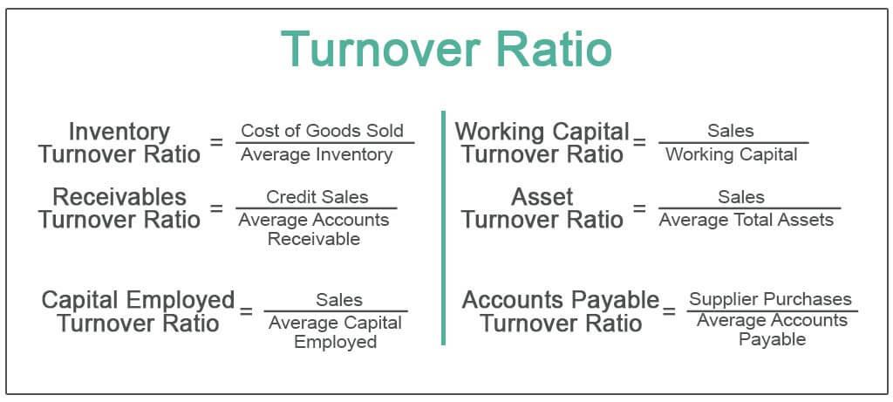

Financial trading is a pivotal element of the global economy, driving economic growth and enabling the exchange of goods and services across borders. This dynamic field involves the buying and selling of financial instruments such as stocks, bonds, currencies, and derivatives, facilitating capital allocation and risk management. A crucial aspect of successful trading lies in effective financial analysis, which aids traders and investors in making informed decisions.

Financial analysis encompasses various metrics that provide insights into a company's financial health and operational efficiency. One such key metric is the Accounts Payable Turnover Ratio, which reflects how efficiently a company manages its short-term liabilities by measuring the speed at which it pays its suppliers. This ratio is essential for understanding liquidity and cash flow management, influencing a company's ability to maintain healthy supplier relationships and operational stability.



Incorporating these analytical tools into trading practices highlights the intersection of financial analysis, accounts payable, and algorithmic trading. Algorithmic trading, which uses computer programs to execute trades at high speeds and volumes, relies heavily on quantitative metrics and data analysis to predict market movements and optimize trading strategies. By integrating financial metrics such as the Accounts Payable Turnover Ratio, traders can refine these algorithms to enhance decision-making processes.

This article will examine the importance of the Accounts Payable Turnover Ratio within financial analysis, offering a comprehensive understanding of its role in evaluating a company's financial practices. Through this exploration, businesses and investors can better appreciate how effective financial management translates into successful trading practices and financial performance.

## Table of Contents

## Understanding the Accounts Payable Turnover Ratio

The Accounts Payable Turnover Ratio is a significant metric used to assess a company's efficiency in managing its short-term financial obligations, particularly how swiftly it pays off its suppliers. This ratio is computed using the following formula:

$$
\text{Accounts Payable Turnover Ratio} = \frac{\text{Total Credit Purchases}}{\text{Average Accounts Payable}}
$$

This calculation provides an indication of a company's [liquidity](/wiki/liquidity-risk-premium), reflecting its ability to manage cash flow effectively. Credit purchases encompass all procurements made on credit rather than cash, signifying the reliance on vendor credit lines. Average accounts payable is determined by taking the sum of the opening and closing accounts payable over a period, usually a fiscal year, and dividing by two.

Understanding the Accounts Payable Turnover Ratio is vital for businesses as it highlights how well they are managing their working capital. High turnover ratios generally suggest that a company is efficient in paying suppliers promptly, facilitating robust supplier relations and maintaining an efficient cash flow cycle. Conversely, a low ratio may indicate potential liquidity challenges, slow payment processes, or strained supplier relationships, which can affect business operations severely.

A company with a well-managed accounts payable system often experiences better overall financial health. Efficient cash flow management and liquidity assure stakeholders that the business can sustain operations without unnecessary financial strain. Therefore, regular monitoring and analysis of this ratio are crucial for maintaining optimal financial strategy and operational efficiency.

## Importance in Financial Analysis

Analyzing the Accounts Payable Turnover Ratio is crucial for understanding a company's efficiency in its financial operations. This metric reflects how effectively a company manages its short-term financial obligations, specifically regarding the speed at which it pays its suppliers. A high Accounts Payable Turnover Ratio generally indicates that a company is settling its debts promptly. This swift payment not only implies strong relationships with suppliers but also suggests effective cash flow management.

The formula for calculating the Accounts Payable Turnover Ratio is:

$$
\text{Accounts Payable Turnover Ratio} = \frac{\text{Total Credit Purchases}}{\text{Average Accounts Payable}}
$$

By interpreting this ratio, investors and financial analysts can gauge a company's financial stability. A high ratio signifies that the company is capable of meeting its short-term liabilities without delay, which is a positive sign of financial health. Efficient management of accounts payable contributes to maintaining favorable credit terms with suppliers, allowing the company to potentially negotiate better deals and ensure the smooth operation of its supply chain.

Moreover, this ratio is a reliable indicator of a company’s liquidity and operational efficiency. It provides vital data for assessing how quickly a company turns its working capital into cash, thereby offering insights into the broader financial architecture of the business. Investors often look at this metric to determine investment viability, as consistent, high turnover ratios typically point to a company with effective financial practices and stable cash flows.

In conclusion, the Accounts Payable Turnover Ratio is an indispensable tool in financial analysis. It not only highlights the financial health of a company but also assists stakeholders in making informed decisions based on its ability to manage and fulfill short-term financial commitments.

## Interpreting the Accounts Payable Turnover Ratio

A high Accounts Payable Turnover Ratio is typically a positive indicator, revealing that a company settles its obligations to suppliers promptly. This efficiency in settling debts not only strengthens a company's supplier relationships but also highlights its effective cash management strategies. Companies with a high ratio are often seen as financially stable, possessing robust operational performance. Conversely, a low turnover ratio suggests that a company might be experiencing financial distress or inefficiencies in managing its liabilities. Delays in payments could create friction with suppliers, potentially leading to stricter credit terms or even supply chain disruptions.

Understanding industry standards and benchmarks is crucial when interpreting this ratio, as acceptable turnover ratios can vary significantly across different sectors. For instance, sectors with rapid inventory turnover, such as retail or consumer goods, might naturally have higher accounts payable turnover ratios compared to industries that deal with long-term projects, such as construction or aerospace. Each industry operates within unique economic cycles and liquidity demands, thereby establishing different norms for financial metrics like the accounts payable turnover ratio.

To place the performance of a company within the context of its industry, analysts often refer to these benchmarks: 

$$
\text{Accounts Payable Turnover Ratio} = \frac{\text{Total Credit Purchases}}{\text{Average Accounts Payable}}
$$

This formula helps to evaluate the efficiency of a company's payment practices. Analysts typically compare a company's ratio against industry averages to gauge whether it outperforms, underperforms, or aligns with industry norms. For example, a technology company with a significantly lower ratio than the industry average may need to explore its cash cycle management and payment strategies.

Comparing companies within the same industry using these standards provides a more nuanced view of each company's financial health and operational efficiency. By recognizing the expected benchmarks, businesses can better strategize on maintaining competitive turnover ratios while ensuring financial stability. Investors and stakeholders rely on these comparisons to make informed decisions regarding investments and partnerships, emphasizing the importance of the accounts payable turnover ratio in financial analysis.

## Factors Affecting the Accounts Payable Turnover Ratio

The Accounts Payable Turnover Ratio, a crucial measure of a company’s financial management, is influenced by several key factors. Understanding these can help businesses optimize their financial processes and maintain healthy relationships with suppliers.

**Payment Terms:** One of the primary factors affecting the Accounts Payable Turnover Ratio is the payment terms negotiated with suppliers. These terms define how quickly a company is required to settle its obligations. Longer payment terms generally lead to a lower turnover ratio because the company is taking more time to pay its suppliers. Conversely, shorter payment terms can increase the turnover ratio, suggesting more frequent payments. Companies can optimize this factor by negotiating favorable payment terms that balance cash flow needs with maintaining good supplier relationships.

**Supplier Relationships:** Strong, collaborative relationships with suppliers can positively impact a company’s turnover ratio. Businesses that cultivate strong supplier relationships may be offered more favorable terms or be prioritized during supply shortages. Healthy supplier relationships facilitate trust and reliability, allowing for smoother transactions and potentially better payment terms. Companies can build these relationships by consistently meeting payment obligations and maintaining open communication with their suppliers.

**Efficiency of Accounts Payable Processes:** The efficiency with which a company processes its accounts payable can also affect the turnover ratio. Efficient accounts payable processes ensure timely invoice processing and payment, reducing the likelihood of delays. Implementing automated systems for invoice processing can help streamline these processes by reducing errors and increasing the speed of transactions. For instance, using software tools like QuickBooks or SAP can provide real-time tracking of accounts payable, automatically calculate due payments, and enable quick reconciliations.

**Example Python Code for Improving Process Efficiency:**

```python
import pandas as pd

# Sample invoice data
invoices = pd.DataFrame({
    'Supplier': ['A', 'B', 'C'],
    'Amount': [1000, 1500, 1200],
    'Due Date': pd.to_datetime(['2023-10-10', '2023-10-15', '2023-10-20']),
    'Payment Status': ['Pending', 'Pending', 'Paid']
})

# Function to calculate days until due
def calculate_days_until_due(due_date):
    return (due_date - pd.Timestamp.now()).days

# Apply function to DataFrame
invoices['Days Until Due'] = invoices['Due Date'].apply(calculate_days_until_due)

# Display the invoices that are pending and due soon
due_soon = invoices[(invoices['Payment Status'] == 'Pending') & (invoices['Days Until Due'] < 5)]
print(due_soon)
```

This code snippet provides a simple utility to identify pending invoices that are due soon, enabling businesses to prioritize payments and avoid late fees, which can further affect the turnover ratio.

**Conclusion:** By optimizing payment terms, fostering strong supplier relationships, and improving the efficiency of accounts payable processes, a company can enhance its Accounts Payable Turnover Ratio. This can lead to an improved financial position, operational efficiency, and overall business success.

## Improving the Accounts Payable Turnover Ratio

Improving the Accounts Payable Turnover Ratio involves implementing strategic approaches that focus on optimizing payment terms, enhancing accounts payable processes, and establishing strong supplier relationships. Each of these strategies can contribute significantly to a company's financial efficiency and operational success.

Firstly, negotiating better payment terms is crucial. Companies can achieve this by working closely with suppliers to extend the time frame for payments without incurring additional costs. Longer payment terms offer companies more time to manage their cash flow effectively, ensuring they have sufficient capital to cover other operational needs. Additionally, businesses can explore early payment discounts offered by suppliers, allowing them to benefit from cost savings in exchange for prompt payments.

Streamlining accounts payable processes is another essential strategy. Implementing automated systems that facilitate invoice processing can reduce errors and enhance the speed of transactions. For instance, using software to manage invoices and payments can minimize manual interventions and accelerate payment cycles. Automation not only improves accuracy but also provides real-time data insights, enabling businesses to make informed decisions regarding their cash flow management.

Strengthening supplier relationships is a pivotal [factor](/wiki/factor-investing) that influences the turnover ratio. Establishing transparent communication and trust with suppliers can lead to mutually beneficial agreements. By nurturing these relationships, companies are more likely to negotiate favorable terms, gain flexibility during financial constraints, and secure reliable supply chains. Building strong partnerships encourages suppliers to offer better payment conditions and could result in preferential treatment during market fluctuations.

By adopting these strategies, companies can achieve a more favorable Accounts Payable Turnover Ratio. Improved payment terms and efficient processes can enhance a company's liquidity and cash flow, leading to reduced operational costs and the ability to negotiate improved supplier terms. Ultimately, optimizing this ratio strengthens a company's financial health and operational resilience, facilitating sustained business growth and success.

## Successful Companies with High Accounts Payable Turnover Ratios

Examining companies with high accounts payable turnover ratios provides valuable insights into effective financial management strategies that drive operational success. Companies like Globetech Solutions and Sunrise Retail exemplify these practices by maintaining commendably high turnover ratios, which directly contribute to their robust financial health and competitiveness in their respective industries.

Globetech Solutions, a leading player in the tech industry, has consistently reported high accounts payable turnover ratios over the past several years. This performance reflects their strategic efforts in enhancing supplier relationships and optimizing payment terms. By negotiating favorable terms with suppliers, Globetech not only ensures timely payments but also takes advantage of early payment discounts, thereby improving their cash flow and reducing costs. Their finance team employs advanced software solutions to streamline accounts payable processes, effectively reducing processing time and errors. This practice demonstrates the importance of integrating technology into financial management to bolster efficiency and effectiveness.

Sunrise Retail, a prominent name in the retail sector, showcases another successful model of maintaining high accounts payable turnover ratios. The company emphasizes building strong, long-term partnerships with its suppliers, which allows it to benefit from prioritized service and better terms. Sunrise Retail's approach includes implementing a robust accounts payable system that provides real-time data and analytics. This system enables them to forecast cash flow accurately and make informed financial decisions. By maintaining an agile supply chain and efficient inventory management, Sunrise Retail ensures it meets customer demand without overextending its credit, showcasing a fine balance between operational efficiency and financial prudence.

These case studies underscore the significance of effective management of accounts payable in achieving business success. Both companies illustrate how strategic planning, technological integration, and strong supplier relationships lead to commendable financial performance. Their experiences serve as benchmarks for other organizations seeking to improve their accounts payable turnover ratios, highlighting the profound impact that well-managed financial processes can have on overall business success.

## Conclusion

The Accounts Payable Turnover Ratio is a crucial metric in financial analysis, offering valuable insights into a company's payment behavior and overall financial health. By indicating how efficiently a company pays its suppliers, this ratio becomes a key indicator of liquidity and operational efficiency. An elevated turnover ratio suggests robust cash flow management and strong supplier relationships, factors essential for overall financial stability. 

Improving this ratio can significantly enhance a company's trading practices and financial performance. For instance, negotiated better payment terms might lead to quicker payments, improving supplier confidence and potential discounts, which further reduces costs. Streamlining accounts payable processes can lead to fewer errors and faster processing times, thereby boosting the turnover ratio. Strengthening supplier relationships ensures reliability in procurement, which can lead to improved terms and reduced friction in supply chain management.

Overall, understanding and applying the principles surrounding the Accounts Payable Turnover Ratio empower businesses and investors to make informed decisions. By optimizing this ratio, companies can effectively manage liquidity, reduce operational costs, and improve their strategic position in the market. This ultimately supports better financial outcomes and sustainable growth.

## References & Further Reading

[1]: ["Advances in Financial Machine Learning"](https://www.amazon.com/Advances-Financial-Machine-Learning-Marcos/dp/1119482089) by Marcos Lopez de Prado

[2]: ["Evidence-Based Technical Analysis: Applying the Scientific Method and Statistical Inference to Trading Signals"](https://www.amazon.com/Evidence-Based-Technical-Analysis-Scientific-Statistical/dp/0470008741) by David Aronson

[3]: ["Machine Learning for Algorithmic Trading"](https://github.com/stefan-jansen/machine-learning-for-trading) by Stefan Jansen

[4]: ["Quantitative Trading: How to Build Your Own Algorithmic Trading Business"](https://www.amazon.com/Quantitative-Trading-Build-Algorithmic-Business/dp/1119800064) by Ernest P. Chan

[5]: Hillier, D., Ross, S., Westerfield, R., Jaffe, J., & Jordan, B. (2013). "Corporate Finance", McGraw-Hill Education. 

[6]: ["Financial Management: Theory & Practice"](https://faculty.cengage.com/titles/9781305632295) by Eugene F. Brigham and Michael C. Ehrhardt