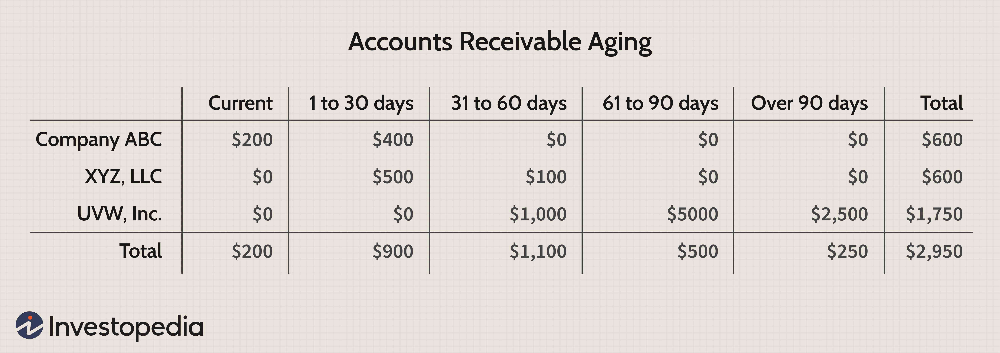

In today's dynamic financial environment, mastering the complexities of aging report accounts, receivable management, cash flow, and algorithmic trading is essential for businesses aiming to optimize their financial operations. Accounts receivable aging provides insights into the health of a company's receivables by categorizing invoices based on their duration outstanding. This categorization serves as a valuable tool in evaluating the credit risk posed by customers, ultimately impacting a firm's cash flow.

Effective cash flow management is vital, as it ensures a company's ability to cover operational expenses and invest in growth opportunities. By coordinating these processes, companies can position themselves strategically in the market.



Meanwhile, algorithmic trading, or algo trading, has revolutionized investment strategies by utilizing automated, pre-programmed instructions to execute trades swiftly and efficiently. This technological advancement allows businesses to harness data-driven insights, enhancing decision-making processes and risk management.

Understanding and leveraging the connections between these financial components can significantly reinforce a business's financial health. They offer a pathway to more informed strategic decisions, enabling businesses to respond proactively to market trends and customer behaviors. By integrating accounts receivable management and algorithmic trading into their financial strategies, organizations are better positioned to sustain growth and operational efficiency.

## Table of Contents

## Understanding Accounts Receivable Aging

Accounts receivable aging is an essential financial tool employed by businesses to assess and categorize a company's receivables based on how long an invoice has been outstanding. This method provides a clear snapshot of the financial health of a firm's customer base by highlighting how quickly clients are paying off their debts. 

The aging report is typically organized into time buckets, such as 0-30 days, 31-60 days, 61-90 days, and over 90 days past due. This systematic categorization enables businesses to identify which invoices are overdue and by how long. By doing so, companies can pinpoint potential credit risks among their clients and take proactive measures to mitigate those risks. For instance, a growing number of invoices past due for more than 90 days could indicate that a customer is experiencing financial strain, signifying higher credit risk.

Regular analysis of aged receivables reports not only aids in assessing customer financial health but also plays a crucial role in identifying payment patterns. By observing these trends, businesses can refine their credit policies and collection strategies to improve cash flow. For example, if a pattern of late payments emerges with specific clients, a company might decide to tighten credit terms or increase efforts to collect outstanding debts.

Moreover, the insights garnered from these reports assist in streamlining collection efforts. Companies can prioritize their collection activities, focusing more resources on customers with higher outstanding amounts or those whose debts are significantly overdue. This targeted approach can enhance the efficiency of the collections process, ultimately improving the organization’s cash flow and reducing bad debt write-offs.

In summary, accounts receivable aging is a critical tool for gauging customer creditworthiness, managing credit risks, and enhancing the effectiveness of collection efforts. By systematically monitoring and analyzing these reports, businesses can make informed financial decisions that support overall financial health.

## The Importance of Cash Flow Management

Effective cash flow management is vital for ensuring a company's ability to cover operational expenses and seize growth opportunities. Cash flow, the net amount of cash being transferred into and out of a business, serves as a measure of a company’s [liquidity](/wiki/liquidity-risk-premium), efficiency, and overall financial health. An organization that effectively manages its cash flow can maintain financial stability and invest in future-driven projects.

Accounts receivable aging plays a pivotal role in cash flow management. This tool allows companies to categorize their receivables based on the duration an invoice remains unpaid, typically segmented into periods such as 0-30 days, 31-60 days, and beyond. Such categorization is crucial for identifying overdue payments, which can impact cash flow by tying up funds that could otherwise be used for business operations or investment opportunities.

For instance, if a significant portion of a company's receivables is overdue, it can strain the available cash resources, as delayed payments reduce the available cash reserves necessary to meet immediate financial obligations. By regular monitoring of these aging reports, businesses can identify trends that signify potential collection issues, enabling them to take timely corrective action.

Maintaining a positive cash flow is essential not only for ongoing operational efficiency but also for enabling organizations to strategically reinvest in their business. This might include upgrading technology, expanding product lines, or entering new markets. Positive cash flow provides the necessary capital for these initiatives without relying excessively on external funding, which can incur additional costs or risks.

One of the mathematical representations of cash flow can be expressed as:

$$
\text{Cash Flow} = \text{Operating Cash Flow} + \text{Investing Cash Flow} + \text{Financing Cash Flow}
$$

In a Python script, one could simulate a simple cash flow calculation as follows:

```python
def calculate_cash_flow(operating_cash, investing_cash, financing_cash):
    return operating_cash + investing_cash + financing_cash

# Example
operating_cash = 50000
investing_cash = -15000
financing_cash = 10000

total_cash_flow = calculate_cash_flow(operating_cash, investing_cash, financing_cash)
print(f"Total Cash Flow: ${total_cash_flow}")
```

In summary, efficient cash flow management, supported by thorough accounts receivable aging analysis, ensures that companies can sustain operations, avert financial challenges, and focus on long-term strategic growth.

## Integrating Algo Trading into Financial Strategies

Algorithmic trading, also known as algo trading, involves the use of automated systems and pre-programmed algorithms to execute trading orders. These systems leverage mathematical models and statistical analysis to make trading decisions at speeds and frequencies that are beyond human capabilities. The adoption of [algorithmic trading](/wiki/algorithmic-trading) strategies can significantly enhance a business's investment approaches, offering improved risk management and optimized execution.

One of the primary benefits of integrating algo trading into financial strategies is the ability to effectively manage risks associated with investment portfolios. By using sophisticated algorithms, businesses can diversify their investments, reduce exposure to volatile markets, and minimize human errors. These systems are capable of processing vast amounts of market data, identifying patterns, and executing trades based on specific criteria, such as price movements and historical data trends.

Algorithmic trading also enhances decision-making processes through the use of data analysis and market trend examination. By continuously monitoring market conditions, these systems can rapidly adjust trading strategies in response to real-time changes. This adaptability is crucial for maintaining competitive edges in fast-paced financial markets. Leveraging [machine learning](/wiki/machine-learning) and [artificial intelligence](/wiki/ai-artificial-intelligence), algorithmic trading models can improve over time by learning from past trading outcomes, thereby refining their strategies to deliver better performance.

For example, a basic algorithmic trading strategy might involve tracking the moving average of a given stock. If the current price exceeds the moving average over a certain period, the algorithm might trigger a buy order. A simple Python script to calculate a moving average crossover strategy could look like this:

```python
import pandas as pd

# Load stock data
data = pd.read_csv('stock_data.csv')

# Calculate moving averages
data['Short_MA'] = data['Close'].rolling(window=40).mean()
data['Long_MA'] = data['Close'].rolling(window=100).mean()

# Generate buy/sell signals
data['Signal'] = 0
data['Signal'][40:] = np.where(data['Short_MA'][40:] > data['Long_MA'][40:], 1, 0)

# Determine positions
data['Position'] = data['Signal'].diff()

# Print data with signals and positions
print(data[['Close', 'Short_MA', 'Long_MA', 'Signal', 'Position']])
```

This script calculates 40-day and 100-day moving averages for a stock's closing prices and generates buy signals when the short-term moving average crosses above the long-term moving average. The position changes indicate trading actions—buy when the position shifts to 1, and sell when it shifts to -1.

In summary, algorithmic trading brings precision, efficiency, and a data-informed approach to financial strategy formulation. By embracing these advanced technological methods, businesses can enhance their trading performance, capitalize on market opportunities, and effectively navigate the complexities of financial markets.

## Synergies between Accounts Receivable and Algo Trading

Both accounts receivable management and algorithmic trading are anchored in data-driven decision-making processes. This shared foundation offers businesses unique opportunities to leverage insights from aging reports to refine their trading strategies. By analyzing the patterns and trends highlighted in accounts receivable aging, companies can make informed predictions about cash flow and liquidity, which are critical in shaping their market interactions.

Aging reports, which categorize accounts receivable based on the duration invoices remain unpaid, provide valuable insights into customer payment behaviors and credit risk profiles. This information can be instrumental for algorithmic trading, which relies on market patterns and statistical modeling to execute trades. An algorithm could be designed to use data from aging reports as a predictive input for cash flow assessments, aiding in decisions related to investment [volume](/wiki/volume-trading-strategy) and timing.

For instance, businesses can deploy algorithms that trigger trading operations based on specific thresholds in the aging data. If the aged receivables indicate a rise in overdue payments, the algorithm might reduce exposure in volatile markets or reallocate investments to more stable assets. Conversely, consistently healthy receivables aging patterns may signal the availability of additional capital for strategic investments in higher-risk trades.

By harmonizing accounts receivable insights with algo trading strategies, businesses can create a more integrated approach to financial management. This alignment ensures that operational strategies are responsive to both internal financial conditions and external market developments. The utilization of these tools allows for enhanced agility and adaptability in financial operations, subsequently supporting a business's overall strategic objectives.

## Best Practices for Optimizing Financial Operations

Automating accounts receivable processes is a strategic move that can significantly improve both accuracy and efficiency in managing aged debts. By reducing manual input and utilizing software solutions, errors commonly associated with human interventions can be minimized. Automation tools can handle various tasks, such as invoice generation, tracking payment statuses, and sending reminders for overdue accounts. This not only helps in faster invoice settlements but also enhances cash flow predictability. Furthermore, integrating artificial intelligence in automating these processes can provide deeper insights into payment trends and customer behaviors, offering a proactive approach to managing receivables.

Leveraging real-time data analytics plays a crucial role in optimizing both cash flow management and trading strategies. Such data analytics tools enable businesses to access and analyze vast amounts of data instantaneously, leading to timely and informed decisions. For instance, real-time insights can alert businesses to potential cash flow issues by highlighting payment bottlenecks or identifying long-standing outstanding invoices. In terms of trading, real-time analytics can monitor market fluctuations, offering immediate data for algorithmic trading, which requires split-second decisions based on current market conditions. Access to current data ensures businesses can adapt quickly to changes, maintaining liquidity and competitive trading positions.

Regularly reviewing financial strategies is essential to ensure alignment with prevailing market trends and evolving customer behaviors. The financial ecosystem is dynamic, with external factors like economic shifts, regulatory changes, and consumer preferences influencing a company’s financial standing. By systematically assessing and updating financial strategies, businesses can adapt to these changes, exploiting new opportunities or mitigating risks. This includes revisiting accounts receivable policies to reflect changes in customer payment patterns or adjusting trading algorithms in response to shifts in market [volatility](/wiki/volatility-trading-strategies). Continuous review not only safeguards against potential pitfalls but fosters a culture of agility and responsiveness within financial operations. By embedding these best practices, companies can secure a robust financial structure that supports sustainable growth and operational resilience.

## Conclusion

Integrating accounts receivable aging and algorithmic trading into financial strategies can enhance operational efficiency and decision-making. These tools enable businesses to maintain a healthier cash flow by identifying overdue payments promptly, thereby allowing for more effective cash management. Moreover, algorithmic trading offers precise, data-driven insights into market trends, empowering companies to develop informed strategies that reduce risk exposure.

By leveraging accounts receivable aging, companies can gain a clearer understanding of their financial standing and credit risks, ensuring that resources are allocated efficiently. Simultaneously, algorithmic trading can optimize investment portfolios through advanced quantification and analytics, leading to better alignment with strategic objectives and market conditions.

The synergy between these components not only aids in managing cash flow but also positions businesses to capitalize on growth opportunities while ensuring financial resilience. The combination of proactive receivables management and sophisticated trading strategies provides a comprehensive framework for sustaining and advancing financial health in a competitive environment.

Ultimately, adopting these practices facilitates a proactive approach to financial management, allowing businesses to dynamically adjust to market and customer dynamics, ensuring long-term growth and stability.

## References & Further Reading

[1]: ["Advances in Financial Machine Learning"](https://www.amazon.com/Advances-Financial-Machine-Learning-Marcos/dp/1119482089) by Marcos Lopez de Prado

[2]: ["Evidence-Based Technical Analysis: Applying the Scientific Method and Statistical Inference to Trading Signals"](https://www.amazon.com/Evidence-Based-Technical-Analysis-Scientific-Statistical/dp/0470008741) by David Aronson

[3]: ["Machine Learning for Algorithmic Trading"](https://github.com/stefan-jansen/machine-learning-for-trading) by Stefan Jansen

[4]: ["Quantitative Trading: How to Build Your Own Algorithmic Trading Business"](https://www.amazon.com/Quantitative-Trading-Build-Algorithmic-Business/dp/1119800064) by Ernest P. Chan

[5]: Brigham, E. F., & Ehrhardt, M. C. (2016). ["Financial Management: Theory & Practice."](https://books.google.com/books/about/Financial_Management_Theory_Practice.html?id=yL4aCgAAQBAJ) Cengage Learning.

[6]: ["Credit and Collection Guidebook: Third Edition"](https://www.amazon.com/Credit-Collection-Guidebook-Steven-Bragg/dp/1938910958) by Steven M. Bragg