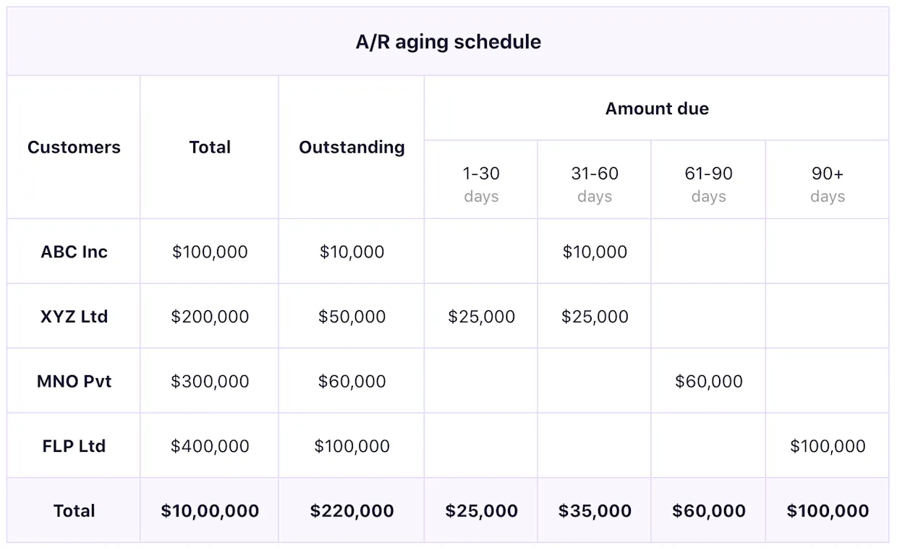

## Table of Contents

## What is accounts receivable aging?

Accounts receivable aging is a report that businesses use to keep track of how long customers have owed them money. It shows a list of all the money that customers owe, sorted by how old the debt is. This helps businesses see which customers are paying on time and which ones are taking longer to pay.

By using an aging report, a business can see if there are any problems with getting paid. If a lot of customers are taking a long time to pay, the business might need to change how it asks for payments or even stop doing business with customers who don't pay on time. This report is important because it helps the business manage its money better and make sure it gets paid for the goods or services it has provided.

## Why is accounts receivable aging important for a business?

Accounts receivable aging is important for a business because it helps them see how well they are getting paid by their customers. By looking at the aging report, a business can tell if customers are paying on time or if they are taking too long. This is important because if a lot of customers are slow to pay, the business might not have enough money to pay its own bills or to buy new things to sell.

The aging report also helps a business decide what to do about customers who are not paying on time. If the report shows that some customers always pay late, the business might need to change how it asks for payments or even stop selling to those customers. This can help the business make sure it gets the money it is owed and keeps its finances healthy.

## How does accounts receivable aging help in managing cash flow?

Accounts receivable aging helps a business manage its cash flow by showing how quickly customers are paying their bills. If the report shows that many customers are paying on time, the business can expect to have a steady flow of money coming in. This helps the business plan better because it knows when it will have money to pay its own bills or to buy new things to sell.

On the other hand, if the aging report shows that many customers are taking a long time to pay, the business might not have enough money coming in to cover its costs. This can cause problems with cash flow, making it hard for the business to pay its bills on time. By keeping an eye on the aging report, the business can take action to get paid faster, like sending reminders or offering discounts for early payment, which helps keep the cash flowing smoothly.

## What are the typical time periods used in an aging report?

An aging report usually divides the money customers owe into different time periods. The most common time periods are 0-30 days, 31-60 days, 61-90 days, and over 90 days. These time periods help the business see how old the debts are and which customers are taking longer to pay.

By using these time periods, a business can quickly see if there are any problems with getting paid. For example, if a lot of money is in the over 90 days category, it might mean that the business needs to do something to get those customers to pay faster. This helps the business manage its money better and make sure it has enough cash to keep running smoothly.

## How do you calculate the aging of accounts receivable?

To calculate the aging of accounts receivable, you start by looking at the date each customer's bill was sent out. Then, you see how many days have passed since that date until today. You put each customer's bill into different time groups, like 0-30 days, 31-60 days, 61-90 days, and over 90 days. This helps you see how old each bill is.

Once you have sorted the bills into these time groups, you add up all the money owed in each group. This gives you a clear picture of how much money is owed and how long it has been owed. By doing this, you can see if there are any problems with customers paying late and take steps to get paid faster.

## What does a high amount in the oldest aging category indicate?

A high amount in the oldest aging category, like over 90 days, means that a lot of customers are taking a long time to pay their bills. This can be a big problem for a business because it might not have enough money coming in to pay its own bills or to buy new things to sell.

If a business sees a lot of money in the oldest aging category, it needs to do something to get those customers to pay faster. This could mean sending reminders, offering discounts for early payment, or even stopping business with customers who always pay late. By fixing this problem, the business can make sure it has enough cash to keep running smoothly.

## How can a business use aging reports to improve collection strategies?

A business can use aging reports to see which customers are taking a long time to pay their bills. By looking at the report, the business can find out if there are any customers who always pay late. If there are, the business can start sending reminders to those customers to pay faster. It can also offer discounts for early payment to encourage customers to pay sooner. This helps the business get the money it needs to keep running smoothly.

If the aging report shows that a lot of money is in the oldest category, like over 90 days, the business might need to take stronger action. It could stop doing business with customers who never pay on time. The business might also hire a collection agency to help get the money back. By using the aging report to see where the problems are, the business can make better plans to get paid faster and keep its cash flow healthy.

## What are the common challenges faced when managing accounts receivable aging?

Managing accounts receivable aging can be hard because it's tough to keep track of all the money customers owe. Sometimes, customers forget to pay on time, or they might not have enough money to pay right away. This can make it hard for a business to know when it will get paid and can cause problems with cash flow. If a lot of customers are paying late, the business might not have enough money to pay its own bills or to buy new things to sell.

Another challenge is figuring out what to do when customers don't pay on time. It can be hard to decide if the business should send reminders, offer discounts, or even stop doing business with late-paying customers. If the business is too strict, it might lose customers, but if it's too lenient, it might not get paid at all. Finding the right balance is important but can be tricky. By using aging reports, a business can see where the problems are and make better plans to get paid faster, but it still takes a lot of work to manage everything well.

## How does accounts receivable aging impact financial reporting and analysis?

Accounts receivable aging helps a business see how much money customers owe and how long they have owed it. This information is important for financial reporting because it shows how well the business is doing at getting paid. If a lot of money is in the oldest aging category, like over 90 days, it might mean the business is having trouble getting paid on time. This can make the business look less healthy in its financial reports because it might not have enough money coming in to pay its own bills.

For financial analysis, accounts receivable aging helps a business understand its cash flow better. By looking at the aging report, the business can see if it needs to change how it asks for payments or if it should stop doing business with customers who always pay late. This helps the business make better plans to keep its cash flow healthy. If the aging report shows that most customers are paying on time, the business can feel more confident about its financial health and make better decisions about how to spend its money.

## What advanced techniques can be used to analyze accounts receivable aging data?

One advanced technique to analyze accounts receivable aging data is using data analytics and visualization tools. These tools can help a business see patterns and trends in how customers pay their bills. For example, a business can use charts and graphs to see if certain customers always pay late or if there are times of the year when more customers take longer to pay. By looking at this data, the business can make better plans to get paid faster, like sending reminders or offering discounts at the right times.

Another technique is using predictive analytics. This means using computer programs to guess how customers will pay in the future based on how they have paid in the past. If the program sees that a customer usually pays late, the business can take action to get paid faster, like asking for payment sooner or even asking for payment before sending out goods or services. This helps the business manage its money better and make sure it has enough cash to keep running smoothly.

## How can technology and software enhance the management of accounts receivable aging?

Technology and software can make managing accounts receivable aging a lot easier for a business. Special software can keep track of all the money customers owe and sort it into different time groups, like 0-30 days, 31-60 days, and so on. This helps the business see quickly which customers are paying on time and which ones are taking longer. The software can also send out reminders to customers automatically, so the business doesn't have to do it by hand. This saves time and makes sure that reminders are sent out on time, which can help the business get paid faster.

Another way technology helps is by using data to make smart guesses about how customers will pay in the future. This is called predictive analytics. The software looks at how customers have paid in the past and uses that information to predict when they will pay next. If the software sees that a customer usually pays late, the business can ask for payment sooner or even ask for payment before sending out goods or services. This helps the business manage its money better and make sure it has enough cash to keep running smoothly.

## What are the best practices for maintaining an effective accounts receivable aging system?

To keep an effective accounts receivable aging system, a business should always keep its records up to date. This means entering new bills and payments right away so the aging report shows the right information. The business should also check the aging report often to see if there are any problems with customers paying late. If the report shows that a lot of money is in the oldest category, like over 90 days, the business needs to do something to get those customers to pay faster. This could mean sending reminders, offering discounts for early payment, or even stopping business with customers who always pay late.

Another important practice is using technology to help manage the aging system. Special software can make it easier to keep track of all the money customers owe and sort it into different time groups. The software can also send out reminders automatically, which saves time and makes sure that reminders are sent out on time. This helps the business get paid faster and keep its cash flow healthy. By using these best practices, a business can make sure its accounts receivable aging system works well and helps it manage its money better.

## What is the Importance of Cash Flow Management?

Effective cash flow management is vital for ensuring a company's ability to cover operational expenses and seize growth opportunities. Cash flow, the net amount of cash being transferred into and out of a business, serves as a measure of a company’s [liquidity](/wiki/liquidity-risk-premium), efficiency, and overall financial health. An organization that effectively manages its cash flow can maintain financial stability and invest in future-driven projects.

Accounts receivable aging plays a pivotal role in cash flow management. This tool allows companies to categorize their receivables based on the duration an invoice remains unpaid, typically segmented into periods such as 0-30 days, 31-60 days, and beyond. Such categorization is crucial for identifying overdue payments, which can impact cash flow by tying up funds that could otherwise be used for business operations or investment opportunities.

For instance, if a significant portion of a company's receivables is overdue, it can strain the available cash resources, as delayed payments reduce the available cash reserves necessary to meet immediate financial obligations. By regular monitoring of these aging reports, businesses can identify trends that signify potential collection issues, enabling them to take timely corrective action.

Maintaining a positive cash flow is essential not only for ongoing operational efficiency but also for enabling organizations to strategically reinvest in their business. This might include upgrading technology, expanding product lines, or entering new markets. Positive cash flow provides the necessary capital for these initiatives without relying excessively on external funding, which can incur additional costs or risks.

One of the mathematical representations of cash flow can be expressed as:

$$
\text{Cash Flow} = \text{Operating Cash Flow} + \text{Investing Cash Flow} + \text{Financing Cash Flow}
$$

In a Python script, one could simulate a simple cash flow calculation as follows:

```python
def calculate_cash_flow(operating_cash, investing_cash, financing_cash):
    return operating_cash + investing_cash + financing_cash

# Example
operating_cash = 50000
investing_cash = -15000
financing_cash = 10000

total_cash_flow = calculate_cash_flow(operating_cash, investing_cash, financing_cash)
print(f"Total Cash Flow: ${total_cash_flow}")
```

In summary, efficient cash flow management, supported by thorough accounts receivable aging analysis, ensures that companies can sustain operations, avert financial challenges, and focus on long-term strategic growth.

## References & Further Reading

[1]: ["Advances in Financial Machine Learning"](https://www.amazon.com/Advances-Financial-Machine-Learning-Marcos/dp/1119482089) by Marcos Lopez de Prado

[2]: ["Evidence-Based Technical Analysis: Applying the Scientific Method and Statistical Inference to Trading Signals"](https://www.amazon.com/Evidence-Based-Technical-Analysis-Scientific-Statistical/dp/0470008741) by David Aronson

[3]: ["Machine Learning for Algorithmic Trading"](https://github.com/stefan-jansen/machine-learning-for-trading) by Stefan Jansen

[4]: ["Quantitative Trading: How to Build Your Own Algorithmic Trading Business"](https://www.amazon.com/Quantitative-Trading-Build-Algorithmic-Business/dp/1119800064) by Ernest P. Chan

[5]: Brigham, E. F., & Ehrhardt, M. C. (2016). ["Financial Management: Theory & Practice."](https://books.google.com/books/about/Financial_Management_Theory_Practice.html?id=yL4aCgAAQBAJ) Cengage Learning.

[6]: ["Credit and Collection Guidebook: Third Edition"](https://www.amazon.com/Credit-Collection-Guidebook-Steven-Bragg/dp/1938910958) by Steven M. Bragg