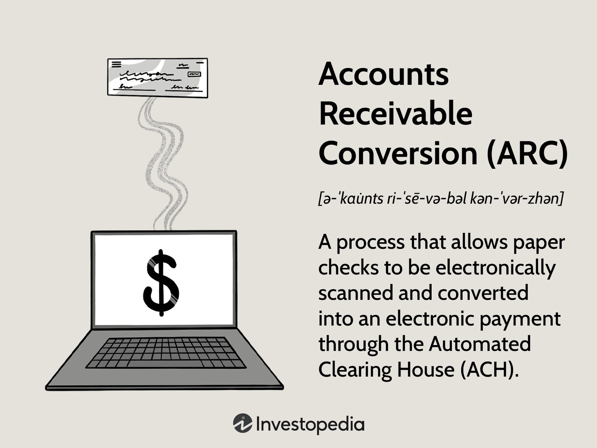

## Table of Contents

## What is accounts receivable conversion?

Accounts receivable conversion is the process of turning the money that customers owe a business into cash. When a business sells goods or services on credit, it creates accounts receivable, which are amounts of money that the business expects to receive in the future. Converting these receivables into cash is important because it helps the business have money to use for daily operations, pay bills, and invest in growth.

To convert accounts receivable into cash, businesses often use methods like sending invoices to customers and following up to make sure they pay on time. Sometimes, businesses may also sell their accounts receivable to a third party at a discount, a process known as factoring. This can provide immediate cash, but it means the business will receive less money than the full amount owed. Effective management of accounts receivable conversion is crucial for maintaining a healthy cash flow and ensuring the business can continue to operate smoothly.

## Why is accounts receivable conversion important for businesses?

Accounts receivable conversion is important for businesses because it helps them get the money they need to run their operations smoothly. When a business sells something on credit, it has to wait to get paid. By converting these receivables into cash quickly, the business can use that money to pay its own bills, buy more supplies, or invest in new projects. Without this cash, the business might struggle to keep going.

It also helps businesses manage their cash flow better. Cash flow is like the blood of a business - it needs to keep moving to keep the business healthy. If a business has a lot of money tied up in accounts receivable, it might not have enough cash on hand to cover its day-to-day expenses. By converting receivables into cash, the business can make sure it always has enough money to operate, which is crucial for its survival and growth.

## How does accounts receivable conversion work?

Accounts receivable conversion is when a business turns the money it is owed into cash. When a business sells something to a customer and lets them pay later, it creates an account receivable. The business needs to get this money back to use it for things like paying bills or buying more supplies. To do this, the business sends an invoice to the customer, telling them how much they owe and when they need to pay. The business might also follow up with reminders to make sure the customer pays on time.

Sometimes, a business might sell its accounts receivable to another company, which is called factoring. When a business does this, it gets the money right away, but it has to give the factoring company a discount. This means the business gets less money than it would if it waited for the customer to pay. Factoring can be helpful if the business really needs cash quickly, but it's not always the best choice because of the discount. Managing accounts receivable well is important because it helps the business keep enough cash to run smoothly and grow.

## What are the common methods of converting accounts receivable into cash?

One common way to convert accounts receivable into cash is by sending invoices to customers. When a business sells something on credit, it creates an invoice that tells the customer how much they need to pay and by when. The business then follows up with reminders to make sure the customer pays on time. This method is straightforward and allows the business to get the full amount of money it is owed, but it can take time for the payments to come in.

Another method is called factoring. In this approach, the business sells its accounts receivable to a third party, known as a factoring company, for a quick cash payment. The factoring company then collects the money from the customers. While this method gives the business immediate cash, it comes at a cost because the factoring company takes a discount on the total amount of the receivables. Factoring can be helpful when a business needs money quickly, but it means they won't get the full amount they are owed.

Both methods have their pros and cons. Sending invoices and waiting for payment can keep more money in the business's pocket, but it might lead to cash flow problems if customers are slow to pay. Factoring provides immediate cash but at a lower amount. Choosing the right method depends on the business's needs and its ability to manage its cash flow effectively.

## What are the benefits of converting accounts receivable quickly?

Converting accounts receivable quickly helps a business have money to use right away. When a business sells something on credit, it has to wait to get paid. By getting the money faster, the business can use it to pay its bills, buy more supplies, or even grow the business. This is really important because without enough cash, a business might struggle to keep running smoothly.

Having quick access to cash also helps a business manage its money better. If a lot of money is tied up waiting for customers to pay, the business might not have enough cash on hand to cover daily expenses. By converting receivables into cash quickly, the business can make sure it always has enough money to operate. This is key for keeping the business healthy and able to grow.

## What are the potential risks associated with accounts receivable conversion?

Converting accounts receivable into cash quickly can help a business, but it also has some risks. One big risk is that the business might not get all the money it is owed. If the business chooses to sell its receivables to a factoring company, it has to give the company a discount. This means the business gets less money than it would if it waited for the customers to pay. Another risk is that if the business relies too much on factoring, it might end up losing a lot of money over time because of the discounts.

Another risk is that if the business focuses too much on getting cash quickly, it might not pay enough attention to who it sells to on credit. If the business gives credit to customers who don't pay on time or at all, it could lose money. Also, if the business is always chasing quick cash, it might not have good relationships with its customers. Customers might feel pressured and decide to buy from other businesses instead. Balancing the need for quick cash with good customer relationships and careful credit management is important to avoid these risks.

## How can a business evaluate the effectiveness of its accounts receivable conversion strategy?

A business can evaluate the effectiveness of its accounts receivable conversion strategy by looking at how quickly it turns its receivables into cash. One way to do this is by calculating the average collection period, which tells how many days it takes to collect payment from customers after a sale. If the number of days is going down over time, it means the business is getting better at converting receivables into cash. The business can also compare its collection period to other businesses in the same industry to see if it is doing well or if there is room for improvement.

Another way to evaluate the strategy is by looking at the cost of converting receivables. If the business uses factoring, it needs to check how much money it is losing from the discounts given to the factoring company. If the cost of factoring is too high, the business might want to find other ways to get cash, like sending invoices and following up with customers directly. By comparing the costs and benefits of different methods, the business can decide if its current strategy is working well or if it needs to make changes to be more effective.

## What role do factoring companies play in accounts receivable conversion?

Factoring companies help businesses get cash quickly by buying their accounts receivable. When a business sells something on credit, it has to wait to get paid. But if it sells those receivables to a factoring company, it gets the money right away. The factoring company then collects the money from the customers. This can be really helpful for a business that needs cash fast to pay bills or buy more supplies.

However, using a factoring company means the business won't get all the money it is owed. The factoring company takes a discount, so the business gets less money than if it waited for the customers to pay. This discount is the cost of getting the cash quickly. Businesses need to think about whether the quick cash is worth the cost, and they should compare this method with other ways of getting money, like sending invoices and waiting for payment.

## How does the use of technology impact accounts receivable conversion processes?

Technology makes accounts receivable conversion easier and faster. When a business uses technology, it can send invoices to customers quickly through email or online systems. This means the business can get paid faster because the customer gets the invoice right away. Also, technology helps businesses keep track of when invoices are due and send reminders to customers automatically. This can help make sure customers pay on time, which means the business can turn its receivables into cash more quickly.

Technology also helps businesses use factoring more efficiently. With online platforms, a business can easily connect with factoring companies and sell its receivables without a lot of paperwork. This makes the process of getting quick cash simpler and faster. By using technology, a business can manage its accounts receivable better, get paid faster, and keep its cash flow healthy.

## What are the best practices for managing accounts receivable to optimize conversion?

To manage accounts receivable well and turn them into cash faster, a business should start by setting clear credit terms for its customers. This means telling customers when they need to pay and what will happen if they don't pay on time. By having clear rules, the business can help make sure customers pay quickly. It's also important to check the credit history of customers before selling to them on credit. This can help the business avoid selling to customers who might not pay on time or at all.

Sending invoices quickly and following up with reminders is another good practice. When a business sends an invoice right after a sale, the customer gets it sooner and can pay sooner. Using technology to send invoices by email or through online systems can make this process faster and easier. Also, sending reminders automatically can help make sure customers don't forget to pay. By doing these things, a business can get its money faster and keep its cash flow healthy.

## How do different industries approach accounts receivable conversion differently?

Different industries have different ways of handling accounts receivable conversion because they have different needs and ways of working. For example, in the manufacturing industry, companies often sell big, expensive things on credit. This means they have a lot of money tied up in accounts receivable. To get cash quickly, they might use factoring a lot because they need the money to buy materials and keep making things. They also have to be careful about who they give credit to because if a customer doesn't pay, it can be a big problem.

In the healthcare industry, things are a bit different. Hospitals and clinics often have to wait for insurance companies to pay them. This can take a long time, so they need good systems to keep track of when payments are due and to follow up with insurance companies. They might not use factoring as much because the amounts they are owed can be smaller and more spread out. Instead, they focus on sending invoices quickly and making sure they have good relationships with insurance companies to get paid faster.

## What advanced strategies can be employed to enhance accounts receivable conversion rates?

One advanced strategy to enhance accounts receivable conversion rates is to use data analytics to predict which customers are likely to pay late or not at all. By looking at past payment behavior and other data, a business can figure out which customers might need extra attention. This can help the business focus its efforts on getting paid faster from these customers, maybe by offering them early payment discounts or setting up payment plans. Another part of this strategy is using technology to automate the process of sending invoices and reminders. This can help make sure that invoices go out quickly and that customers get reminders at the right times, which can speed up how fast the business gets paid.

Another strategy is to use dynamic discounting, where the business offers different discounts based on how quickly a customer pays. For example, a customer might get a bigger discount if they pay within 10 days instead of the usual 30 days. This can encourage customers to pay faster, which helps the business get its money sooner. Also, using supply chain financing can be helpful. In this approach, a third party pays the business's suppliers early, and the business pays the third party back when it gets paid by its customers. This can help the business manage its cash flow better and keep its suppliers happy, which can lead to better terms and faster payments in the future.

## References & Further Reading

[1]: ["Automated Clearing House (ACH) Payments and You"](https://www.investopedia.com/terms/a/ach.asp) by National Automated Clearing House Association (NACHA)

[2]: Kharpal, A. (2020). ["Algorithmic Trading: How Robots are Taking Over the Markets"](https://www.wesleyanbusinessreview.com/issue-vii-features/the-tiktok-conundrum). CNBC.

[3]: Peterson, P., & Silverstein, A. (2017). ["Accounts Receivable Management Best Practices"](https://www.researchgate.net/publication/313840465_Accounts_Receivables_Management_Insight_and_Challenges) by John G. Salek

[4]: de Chalendar, E. (2019). ["The role of Artificial Intelligence in Algorithmic Trading: A Comprehensive Analysis"](https://www.aeaweb.org/articles?id=10.1257/aer.20190623). MPRA Paper No. 96997.

[5]: Lee, C. M., & Ready, M. J. (1991). ["Inferring Trade Direction from Intraday Data"](https://onlinelibrary.wiley.com/doi/full/10.1111/j.1540-6261.1991.tb02683.x) The Review of Financial Studies, 4(3), 733-746.

[6]: ["Rise of the Machines: Algorithmic Trading in the Foreign Exchange Market"](https://onlinelibrary.wiley.com/doi/abs/10.1111/jofi.12186) by the Bank of Canada

[7]: Treleaven, P., Galas, M., & Lalchand, V. (2013). ["Algorithmic Trading Review"](https://www.researchgate.net/publication/262239006_Algorithmic_Trading_Review). The Computer Journal, 56(1), 2–20.