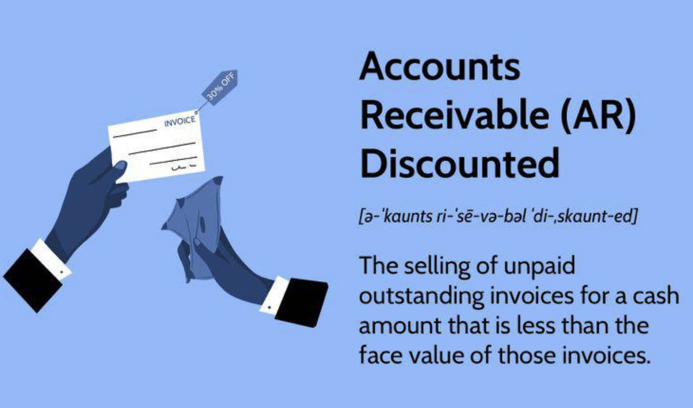

## Table of Contents

## What is accounts receivable discounting?

Accounts receivable discounting is a way for businesses to get money faster by selling their invoices to a third party at a lower price. When a company sells something to a customer, it usually has to wait to get paid. But if the company needs money right away, it can sell those invoices to a discounting company. The discounting company gives the business most of the money from the invoice quickly, but keeps a small part as a fee for the service.

This can help a business manage its cash flow better. Instead of waiting 30 or 60 days to get paid, the business can use the money from the discounting company to pay its own bills or invest in new projects. However, the business will receive less money than the full amount of the invoice because of the discount fee. It's a trade-off between getting money faster and receiving a bit less money overall.

## How does accounts receivable discounting differ from factoring?

Accounts receivable discounting and factoring are both ways for a business to get money faster by using their invoices, but they work a bit differently. In accounts receivable discounting, a business uses its invoices as a way to get a loan from a bank or a financial company. The business still handles collecting the money from its customers. The bank or financial company gives the business most of the money from the invoices right away, but keeps a small part as a fee. The business pays back the loan plus interest when it gets the money from its customers.

Factoring is different because the business sells its invoices to a factoring company, and the factoring company takes over collecting the money from the customers. The business gets most of the money from the invoices right away, but the factoring company keeps a fee for its service. The main difference is that with factoring, the factoring company deals with the customers to collect the money, while with accounts receivable discounting, the business still deals with its customers. Both methods help a business get money faster, but they involve different steps and relationships with customers.

## What are the main benefits of accounts receivable discounting for a business?

Accounts receivable discounting can help a business get money faster. When a business sells something, it usually has to wait to get paid. But with discounting, the business can get most of the money right away by using its invoices as a way to get a loan. This can help the business pay its bills on time or invest in new projects without waiting for customers to pay.

Another benefit is that the business still gets to keep control over its relationship with customers. With discounting, the business is the one that collects the money from its customers, not the bank or financial company. This can be important for businesses that want to keep a good relationship with their customers and handle their own collections. So, accounts receivable discounting can help a business manage its cash flow better while still keeping control over customer relationships.

## What are the potential risks and drawbacks of using accounts receivable discounting?

One risk of using accounts receivable discounting is that it can cost the business money. When a business uses its invoices to get a loan, it has to pay a fee to the bank or financial company. This means the business gets less money than it would have if it waited for its customers to pay. Over time, these fees can add up and affect the business's profits. It's a trade-off between getting money faster and paying more in the long run.

Another drawback is that accounts receivable discounting might not work for every business. If a business's customers often pay late or don't pay at all, the bank or financial company might not want to give a loan based on those invoices. This can limit the business's options for getting money quickly. Also, if the business can't pay back the loan on time, it could face extra fees or damage its credit, making it harder to get loans in the future.

## Who are the typical users of accounts receivable discounting?

Accounts receivable discounting is often used by small and medium-sized businesses that need money quickly. These businesses might sell things to customers but have to wait a long time to get paid. By using discounting, they can get most of the money from their invoices right away, which helps them pay their own bills or invest in new projects without waiting.

Another group that uses accounts receivable discounting is businesses that want to keep control over their customer relationships. With discounting, the business still deals with its customers and collects the money, which can be important for maintaining good relationships. This makes it a good choice for companies that value customer service and want to handle collections themselves.

## What is the process of setting up an accounts receivable discounting agreement?

To set up an accounts receivable discounting agreement, a business first needs to find a bank or financial company that offers this service. The business then shows the bank its invoices and financial records to prove that its customers are reliable and will pay on time. The bank looks at these documents to decide if it wants to give the business a loan based on the invoices. If the bank agrees, it will offer the business a discounting agreement, which includes details like the amount of money the business can get, the fee the bank will charge, and the terms for paying back the loan.

Once the agreement is set, the business can start using its invoices to get money quickly. The business sends its invoices to the bank, and the bank gives the business most of the money from those invoices right away. The business keeps control over collecting the money from its customers. When the customers pay, the business uses that money to pay back the loan to the bank, along with the fee and any interest. This way, the business can manage its cash flow better while still handling its customer relationships.

## How is the discount rate determined in accounts receivable discounting?

The discount rate in accounts receivable discounting is figured out by looking at a few things. One big thing is how risky it is for the bank or financial company to give the business a loan. If the business's customers often pay late or don't pay at all, the bank might see it as more risky and charge a higher discount rate. Another thing is how long the business has to wait for its customers to pay. If it takes a long time, the bank might charge more because it has to wait longer to get its money back.

The bank also looks at how much money it costs them to give out loans. This includes things like their own costs and what they could earn if they used their money for something else. All these things together help the bank decide on a discount rate that makes sense for them and the business. The discount rate is important because it affects how much money the business gets right away and how much it has to pay back later.

## What documentation is required for accounts receivable discounting?

To set up an accounts receivable discounting agreement, a business needs to show the bank or financial company some important documents. These include the invoices that the business wants to use to get a loan. The invoices show how much money the business is owed by its customers and when it expects to get paid. The business also needs to give the bank its financial records, like balance sheets and income statements. These records help the bank see if the business is doing well and if its customers are likely to pay on time.

The bank might also ask for more information about the business's customers, like credit reports or payment history. This helps the bank understand how reliable the customers are. If the bank agrees to the discounting agreement, it will give the business a contract that explains the terms, like the discount rate and how long the business has to pay back the loan. By providing all this documentation, the business can show the bank that it's a good choice for accounts receivable discounting.

## How does accounts receivable discounting impact a company's financial statements?

When a company uses accounts receivable discounting, it can change its financial statements in a few ways. On the balance sheet, the company will show the loan it gets from the bank as a liability. This means the company owes money to the bank. At the same time, the company's cash goes up because it gets most of the money from its invoices right away. So, the company's cash and liabilities both go up, but its accounts receivable might stay the same because it still has to collect the money from its customers.

On the income statement, the company will show the discount fee it pays to the bank as an expense. This fee reduces the company's profit because it's a cost of getting the money quickly. The company might also show interest on the loan as an expense if it has to pay interest to the bank. Overall, accounts receivable discounting can help a company manage its cash flow better, but it also means the company has to deal with new liabilities and expenses on its financial statements.

## What are the legal and regulatory considerations for accounts receivable discounting?

When a business wants to use accounts receivable discounting, it needs to follow certain legal and regulatory rules. One important thing is to have a clear agreement with the bank or financial company. This agreement should explain things like the discount rate, how long the business has to pay back the loan, and what happens if the business can't pay on time. The business also needs to make sure it's following any laws about lending and borrowing money, like the Truth in Lending Act in the United States, which requires clear information about loan terms.

Another thing to think about is how the discounting might affect the business's taxes. In some places, the discount fee might be seen as an expense that the business can deduct from its taxes. But the rules can be different in different countries or states, so it's important for the business to check with a tax expert. Also, if the business operates in different countries, it needs to follow the rules in each place where it does business. This can make things more complicated, but it's important to stay on the right side of the law.

## How can technology enhance the efficiency of accounts receivable discounting?

Technology can make accounts receivable discounting easier and faster for businesses. With special software, a business can quickly send its invoices to the bank or financial company. This software can also keep track of which invoices have been sent and how much money the business should get. It can even help the business figure out the best time to use discounting to get money quickly. All of this saves time and reduces mistakes that can happen when people do everything by hand.

Another way technology helps is by making it easier for the business to talk to the bank and its customers. With online systems, the business can see when the bank gets the invoices and when the money is sent. The business can also use these systems to remind customers when payments are due. This can help the business get paid faster and keep good relationships with its customers. Overall, using technology can make accounts receivable discounting smoother and more efficient for everyone involved.

## What advanced strategies can be employed to optimize the use of accounts receivable discounting?

One advanced strategy to optimize the use of accounts receivable discounting is to carefully choose which invoices to discount. A business can look at its customers and pick the ones that usually pay on time. By focusing on these reliable customers, the business can get a better discount rate from the bank because the risk is lower. Another smart move is to use discounting only when the business really needs cash quickly. This way, the business can save money on fees and interest by not using discounting all the time.

Another strategy is to use technology to make the process smoother. Special software can help the business keep track of its invoices and see when it's the best time to use discounting. This can save time and reduce mistakes. The business can also use online systems to talk to the bank and its customers more easily. This helps the business get paid faster and keep good relationships with everyone involved. By using these strategies, a business can make the most out of accounts receivable discounting and manage its cash flow better.

## References & Further Reading

[1]: ["Advances in Financial Machine Learning"](https://www.amazon.com/Advances-Financial-Machine-Learning-Marcos-ebook/dp/B079KLDW21) by Marcos Lopez de Prado

[2]: ["Machine Learning for Algorithmic Trading"](https://github.com/stefan-jansen/machine-learning-for-trading) by Stefan Jansen

[3]: ["Quantitative Trading: How to Build Your Own Algorithmic Trading Business"](https://www.amazon.com/Quantitative-Trading-Build-Algorithmic-Business/dp/1119800064) by Ernest P. Chan

[4]: ["Evidence-Based Technical Analysis: Applying the Scientific Method and Statistical Inference to Trading Signals"](https://www.amazon.com/Evidence-Based-Technical-Analysis-Scientific-Statistical/dp/0470008741) by David Aronson 

[5]: Bergstra, J., Bardenet, R., Bengio, Y., & Kégl, B. (2011). ["Algorithms for Hyper-Parameter Optimization."](https://proceedings.neurips.cc/paper/2011/file/86e8f7ab32cfd12577bc2619bc635690-Paper.pdf) Advances in Neural Information Processing Systems 24.