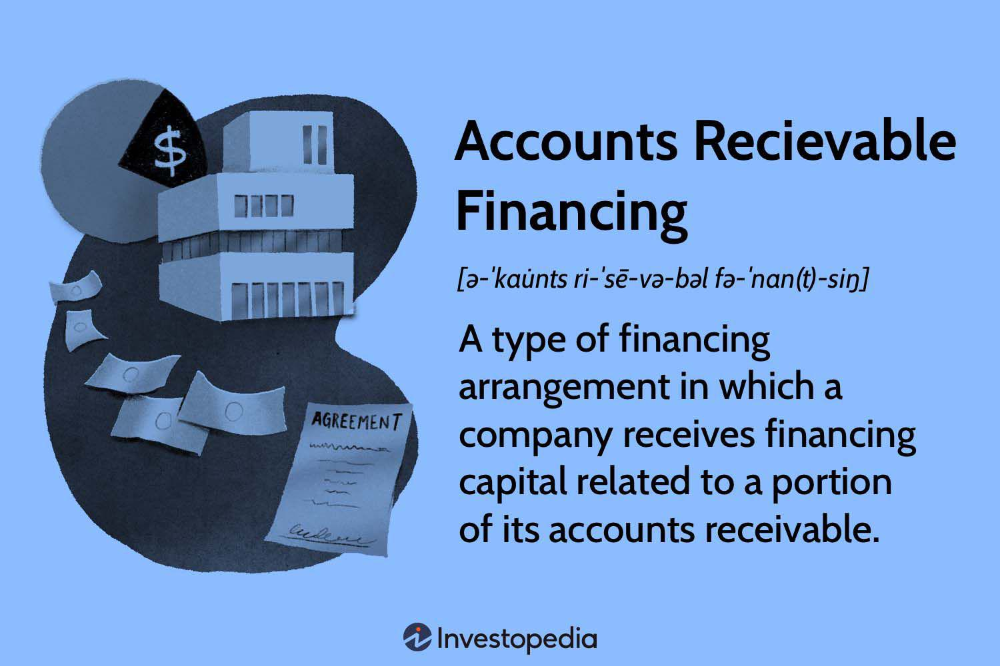

## Table of Contents

## What is accounts receivable financing?

Accounts receivable financing is a way for businesses to get money quickly by using the money they are owed by customers. Instead of waiting for customers to pay their invoices, a business can sell these invoices to a finance company. The finance company gives the business most of the money right away, and then collects the full amount from the customers later. This can help a business have cash on hand to pay for things like supplies, employees, or other expenses without waiting for payments to come in.

This type of financing is often used by businesses that have long payment terms with their customers. For example, if a company sells products to another business that takes 60 or 90 days to pay, the seller might need cash sooner. By using accounts receivable financing, the seller can get money quickly and keep their business running smoothly. However, it's important for businesses to understand that the finance company will charge a fee for this service, so the business will get less money than the full amount of the invoices.

## How does accounts receivable financing work?

Accounts receivable financing works by letting a business sell its unpaid invoices to a finance company. When a business sells something to a customer, it sends an invoice that says how much the customer owes and when they need to pay. Instead of waiting for the customer to pay, the business can sell this invoice to a finance company. The finance company gives the business most of the money right away, usually around 70-90% of the invoice's total. This helps the business have cash to use for things like paying employees or buying supplies.

The finance company then waits for the customer to pay the full amount of the invoice. Once the customer pays, the finance company takes the money they gave to the business plus a fee, and gives the rest back to the business. This fee is how the finance company makes money. It's important for the business to know that they won't get the full amount of the invoice because of this fee. But, accounts receivable financing can be a good way for a business to get money quickly and keep running smoothly, especially if they have to wait a long time for customers to pay.

## What are the benefits of accounts receivable financing for a business?

Accounts receivable financing helps businesses get money quickly. When a business sells something, it has to wait for the customer to pay. This can take a long time, sometimes 60 or 90 days. But with accounts receivable financing, the business can sell the invoice to a finance company and get most of the money right away. This means the business doesn't have to wait to get paid and can use the money to pay for things like supplies or employees.

Another benefit is that it can help a business grow. If a business needs money to buy more products or start a new project, accounts receivable financing can give them the cash they need without waiting. This can help the business take on new opportunities and expand. Even though the business has to pay a fee to the finance company, the quick access to cash can be worth it for many businesses.

## What are the different types of accounts receivable financing?

There are two main types of accounts receivable financing: factoring and invoice discounting. Factoring is when a business sells its invoices to a finance company, called a [factor](/wiki/factor-investing). The factor gives the business most of the money right away, usually around 70-90% of the invoice's total. The factor then collects the full amount from the customer. Once the customer pays, the factor takes their fee and gives the rest of the money to the business. Factoring is good for businesses that need quick cash and don't mind the factor dealing with their customers.

Invoice discounting is different because the business still collects the money from the customer. The business uses the invoices as a way to borrow money from a finance company. The finance company gives the business most of the money from the invoices, and the business pays it back when the customer pays. The business has to pay a fee to the finance company, but they keep control over their customer relationships. Invoice discounting is good for businesses that want to keep their customer interactions private and have a good credit history.

## Who can benefit from using accounts receivable financing?

Small businesses and growing companies can really benefit from accounts receivable financing. If a business sells things to customers but has to wait a long time to get paid, it can be hard to pay for things like supplies or employees. Accounts receivable financing lets the business get money quickly by selling their invoices to a finance company. This means the business doesn't have to wait to get paid and can keep running smoothly.

Companies that are expanding or need money for new projects can also find accounts receivable financing helpful. If a business wants to buy more products or start something new, they might need cash right away. By using accounts receivable financing, they can get the money they need without waiting for customers to pay. Even though they have to pay a fee to the finance company, the quick access to cash can be worth it for many businesses.

## What are the costs associated with accounts receivable financing?

The main cost of accounts receivable financing is the fee that the finance company charges. When a business sells its invoices to a finance company, it gets most of the money right away, but not all of it. The finance company keeps a part of the money as a fee for giving the business quick cash. This fee can be a percentage of the invoice's total, usually between 1% to 5%, depending on things like how long the customer takes to pay and how risky the finance company thinks the invoices are.

There might also be other costs to think about. Some finance companies charge extra fees for things like setting up the financing or handling the invoices. If the customer doesn't pay the invoice on time, the business might have to pay more fees or even have to pay back the money the finance company gave them. It's important for a business to understand all these costs before deciding to use accounts receivable financing, so they can make sure it's a good choice for them.

## How does accounts receivable financing differ from traditional bank loans?

Accounts receivable financing and traditional bank loans are two different ways for a business to get money. With accounts receivable financing, a business sells its unpaid invoices to a finance company and gets most of the money right away. The finance company then collects the full amount from the customers later. This is good for businesses that need quick cash and don't want to wait for customers to pay. On the other hand, a traditional bank loan is when a bank gives a business a lump sum of money that the business has to pay back over time, usually with interest. The business keeps control over its invoices and customer relationships, but it might take longer to get the loan approved and the money.

Another big difference is how easy it is to get the money. Accounts receivable financing can be easier to get because it's based on the value of the invoices, not just the business's credit history. This means even businesses with less perfect credit can use it. Traditional bank loans often need a good credit history and a lot of paperwork. They might also take longer to approve. So, accounts receivable financing can be a faster and more flexible option for businesses that need money quickly and are okay with giving up some of their invoice money to a finance company.

## What are the risks involved in accounts receivable financing?

One risk of accounts receivable financing is that the business might not get all the money from the invoices. The finance company takes a fee for giving the business quick cash, so the business ends up with less money than if they waited for the customer to pay. If the customer doesn't pay the invoice on time or at all, the business might have to pay back the money the finance company gave them. This can be a problem if the business was counting on that money to pay for things like supplies or employees.

Another risk is that using accounts receivable financing can make it harder for the business to get other types of financing later. If a business uses this kind of financing a lot, other lenders might see it as a sign that the business is having money problems. This could make it harder for the business to get a traditional bank loan or other types of credit in the future. It's important for a business to think about these risks and make sure accounts receivable financing is the right choice for them.

## How can a business qualify for accounts receivable financing?

To qualify for accounts receivable financing, a business needs to have invoices that it can sell to a finance company. The business should have customers who pay their invoices on time and have a good history of making sales. The finance company will look at the business's customers to see if they are likely to pay the invoices. If the customers are reliable and the invoices are for real sales, the business has a better chance of qualifying.

The business also needs to show that it can manage its money well. The finance company might check the business's financial records to make sure it is not in too much debt and can handle the costs of accounts receivable financing. Even if the business has some credit problems, it can still qualify if its invoices are strong. The main thing is that the business has invoices that the finance company thinks are worth buying.

## What role does creditworthiness play in accounts receivable financing?

Creditworthiness is important for accounts receivable financing, but it's not the only thing that matters. The finance company looks at the business's customers more than the business itself. If the customers have a good history of paying their invoices on time, the finance company is more likely to buy the invoices. This means a business with less perfect credit can still qualify for accounts receivable financing if its customers are reliable.

However, the business's own creditworthiness can still play a role. The finance company might check the business's financial records to make sure it can handle the costs of the financing. If the business is in too much debt or has other money problems, it might be harder to qualify. But overall, the strength of the invoices and the reliability of the customers are more important than the business's credit score.

## How does accounts receivable financing impact a company's financial statements?

When a company uses accounts receivable financing, it can change how its financial statements look. On the balance sheet, the company will have less accounts receivable because it sold some of its invoices to the finance company. Instead, it will have more cash, which is good for the company's [liquidity](/wiki/liquidity-risk-premium). The company might also have a new liability if it used invoice discounting, where it borrowed money against the invoices and has to pay it back.

On the income statement, the company might see a change in its expenses. The fee that the finance company charges for the financing will show up as an expense, which can lower the company's net income. But, the company can use the cash it got from the financing to pay for things like supplies or employees, which can help keep the business running smoothly. So, while accounts receivable financing can affect the financial statements, it can also help the company manage its cash flow better.

## What are the latest trends and innovations in accounts receivable financing?

One of the latest trends in accounts receivable financing is the use of technology to make the process easier and faster. Many finance companies now use online platforms where businesses can upload their invoices and get money quickly. This makes it easier for businesses to manage their cash flow without waiting for customers to pay. Some platforms even use [artificial intelligence](/wiki/ai-artificial-intelligence) to check the invoices and decide how much money to give the business. This can make the whole process faster and more accurate.

Another trend is the growth of invoice financing for small businesses. More finance companies are offering accounts receivable financing to small businesses that might not have been able to get it before. This is because technology has made it easier for finance companies to check the invoices and see if they are worth buying. Small businesses can now get quick cash to help them grow and take on new opportunities. This trend is helping more businesses use accounts receivable financing to manage their money better.

## What are some real-world applications and case studies?

Several companies have successfully integrated [algorithmic trading](/wiki/algorithmic-trading) systems with accounts receivable (AR) management, demonstrating significant strategic advancements and enhanced financial efficiency. These integrations leverage predictive models and [machine learning](/wiki/machine-learning) algorithms to optimize cash flow and credit management.

**Case Study 1: TechFinance Inc.**

TechFinance Inc., a global technology firm, incorporated an algorithmic trading system into its AR management process. By utilizing predictive analytics and machine learning, the company developed models to accurately forecast cash flow and assess the creditworthiness of its clients. The predictive model employed by TechFinance can be represented with the formula:

$$
\text{Cash Flow Forecast} = \sum_{i=1}^{n} (P_i \times C_i)
$$

where $P_i$ represents the probability of payment for each invoice and $C_i$ denotes the value of the invoice.

Post-integration, TechFinance reported a 20% improvement in collection rates and a 15% reduction in days sales outstanding (DSO). The algorithmic system's ability to provide real-time insights allowed the company to make informed adjustments to credit terms, thus optimizing working capital.

**Case Study 2: RetailCorp**

RetailCorp, a large retail chain, integrated AR management with state-of-the-art algorithmic trading platforms. By leveraging machine learning algorithms, RetailCorp developed a system that dynamically adjusts credit limits and payment terms based on customer purchasing behavior and market conditions. The use of such algorithms enabled RetailCorp to enhance its cash flow predictability and strategically manage its liquidity.

The integration resulted in decreased financing costs by 10% and an improved net profit margin by 5%. Additionally, the access to real-time data analytics facilitated timely decision-making and better forecasting of future cash flows.

**Algorithm Example:**

RetailCorp employed Python-based machine learning code to model customer behavior patterns:

```python
from sklearn.ensemble import RandomForestClassifier

# Sample dataset of customer behavior
X = customer_data[['purchase_frequency', 'average_order_value', 'days_to_payment']]
y = customer_data['credit_score']

# Train a Random Forest Classifier
clf = RandomForestClassifier(n_estimators=100, random_state=42)
clf.fit(X, y)

# Predict credit score and adjust credit limits
predicted_credit_score = clf.predict(new_customer_data)
```

**Case Study 3: ManufacDealers Ltd.**

A leading industrial manufacturer, ManufacDealers Ltd., used algorithmic trading systems to enhance its AR portfolio management. The integration of machine learning into their AR processes allowed for predictive scoring of invoices and early detection of potential defaults. ManufacDealers observed a significant reduction in bad debt provision, with bad debt losses dropping by 25% over a fiscal year.

By applying algorithms for sentiment analysis based on payment patterns and market signals, ManufacDealers effectively recalibrated credit policies and reduced risks associated with delayed collections.

**Outcomes and Strategic Improvements:**

In conclusion, the integration of algorithmic trading systems with AR management has resulted in notable strategic improvements across various industries. Companies experienced enhanced cash flow visibility, reduced credit risk, and improved operational efficiency. The implementation of predictive models and machine learning algorithms emerged as critical tools in achieving these outcomes, providing a competitive edge in managing finance more strategically and effectively.

## References & Further Reading

1. **"Accounts Receivable Financing: A Path to Liquidity" by Peter A. Wilson (2018)**  
   This book provides comprehensive insights into the structuring and impact of accounts receivable financing on business liquidity. It covers various financial models and their applications in managing cash flows.

2. **"Algorithmic Trading and DMA: An Introduction to Direct Access Trading Strategies" by Barry Johnson (2010)**  
   Johnson's work is essential for understanding the intricacies of algorithmic trading. It focuses on the application of algorithms to enhance trading efficiency, accuracy, and decision-making.

3. **"The Handbook of Credit Risk Management: Origins, Rating, and Mitigation" by Sylvain Bouteillé and Diane Coogan-Pushner (2012)**  
   This handbook explores credit risk management strategies, including those that leverage predictive models and algorithmic approaches to optimize accounts receivable processes.

4. **"Machine Learning for Financial Engineering" by Marcos Lopez de Prado (2018)**  
   Lopez de Prado's book investigates into the use of machine learning algorithms for financial engineering, offering insights into improving cash flow forecasting and enhancing decision-making in business finance.

5. **"Journal of Corporate Finance"**  
   This journal frequently features articles on innovative financing strategies and the use of technology in corporate finance. It is a valuable resource for understanding how accounts receivable management integrates with algorithmic trading.

6. **"The Use of Predictive Analytics in Cash Flow Forecasting" by J.P. Morgan (2021)**  
   This report examines how predictive analytics and machine learning are applied in cash flow forecasting and credit management, offering practical case studies of successful implementation.

7. **"Risk Management and Financial Institutions" by John Hull (2015)**  
   Hull's book provides a fundamental understanding of financial institutions' risk management, addressing the role of algorithms in managing financial operations.

8. **IEEE Xplore Digital Library**  
   This digital library offers access to numerous papers on algorithmic trading systems and data analytics. It is a resource for technical papers on model development and the integration of financial technologies.

9. **"Financial Modeling" by Simon Benninga (2014)**  
   Benninga's book offers practical modeling techniques for financial analysis, useful for professionals looking to integrate accounts receivable strategies with algorithmic models.

10. **"Management Science"**  
   This academic journal covers operations research and data-driven decision-making strategies, providing articles on the computational aspects of integrating accounts receivable management with algo trading systems.

