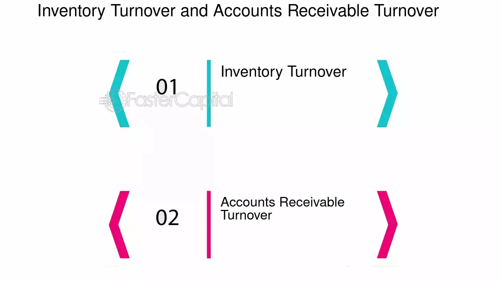

## Table of Contents

## What is accounts receivable?

Accounts receivable is the money that a business is owed by its customers for goods or services that have been delivered but not yet paid for. When a company sells something on credit, it records the amount as accounts receivable on its balance sheet. This means the company expects to receive this money in the future, usually within a short period like 30 or 60 days.

Managing accounts receivable is important for a business because it affects cash flow. If customers take too long to pay, the business might struggle to pay its own bills. Companies often have a system to keep track of these amounts and may send reminders or invoices to make sure they get paid on time. Good management of accounts receivable helps a business stay financially healthy.

## What is inventory turnover?

Inventory turnover is a way to see how fast a business sells and replaces its stock of goods. It tells you how many times a company has sold and replaced its inventory during a certain time, like a year. To find the inventory turnover, you divide the cost of goods sold by the average inventory. A higher number means the business is selling its goods quickly, which is good because it means the products are popular and not sitting on the shelves too long.

A low inventory turnover might mean that the products aren't selling well, or the company is holding onto too much stock. This can be a problem because it ties up money that could be used for other things. Businesses want to keep their inventory moving to make sure they have fresh stock and to keep their cash flow healthy. By watching their inventory turnover, companies can make better decisions about what to buy and how much to keep on hand.

## Why are accounts receivable important for a business?

Accounts receivable are important for a business because they represent money that the business will get in the future. When a business sells something and lets the customer pay later, it records this as accounts receivable. This money is important because it helps the business know how much cash it can expect to have coming in. If a business knows it will get money soon, it can plan better for things like paying bills or buying new stock.

Good management of accounts receivable also helps keep the business running smoothly. If customers pay on time, the business has the cash it needs to operate. But if customers are slow to pay, it can cause problems. The business might not have enough money to pay its own bills or to buy more things to sell. That's why businesses keep a close eye on their accounts receivable, sending reminders or invoices to make sure they get paid on time. This helps the business stay financially healthy and keep its cash flow strong.

## How do you calculate inventory turnover?

Inventory turnover is a way to see how fast a business sells and replaces its stock of goods. To calculate it, you take the cost of goods sold and divide it by the average inventory. The cost of goods sold is the total cost of all the products a business sold during a certain time, like a year. The average inventory is the average value of the stock the business had during that same time. You can find the average inventory by adding the value of the inventory at the start of the year to the value at the end of the year, then dividing by two.

A high inventory turnover number means the business is selling its goods quickly. This is good because it shows that the products are popular and not sitting on the shelves too long. On the other hand, a low inventory turnover might mean that the products aren't selling well, or the company is holding onto too much stock. By keeping an eye on inventory turnover, a business can make better decisions about what to buy and how much to keep on hand, helping to keep the business running smoothly and efficiently.

## What does a high accounts receivable turnover ratio indicate?

A high accounts receivable turnover ratio means that a business is getting paid quickly by its customers. This is good because it shows that the business is doing a good job of collecting money that it is owed. When customers pay on time, the business has more cash to use for things like paying bills, buying new stock, or growing the business.

Having a high accounts receivable turnover ratio also means that the business is managing its credit sales well. It shows that the business has good credit policies and that it is not letting too much money sit in accounts receivable for too long. This helps keep the business financially healthy and makes sure it has the cash it needs to keep running smoothly.

## How can a company improve its inventory turnover rate?

A company can improve its inventory turnover rate by making sure it sells its products faster. One way to do this is by offering sales or discounts to get rid of old stock. If customers see a good deal, they might buy more, which helps move the inventory out the door. Another way is to keep a close eye on what's selling and what's not. If some items aren't selling well, the company can order less of those and more of the popular items. This way, the company can make sure it has the right products that people want to buy.

Another important thing a company can do is to work on its supply chain. This means making sure that new stock comes in just when it's needed, not too early or too late. If the company can get new products in quickly, it can keep its shelves full of fresh items that customers want. Also, the company can use technology to help manage its inventory better. With good software, the company can see exactly what's in stock and what's selling, which helps them make smart decisions about what to order and when. By doing these things, a company can improve its inventory turnover rate and keep its business running smoothly.

## What are the common challenges faced in managing accounts receivable?

Managing accounts receivable can be tough for businesses. One big challenge is getting customers to pay on time. Sometimes, customers might forget to pay or they might not have the money right away. This can make it hard for the business to know when it will get its money. If too many customers are slow to pay, the business might not have enough cash to pay its own bills or to buy more things to sell.

Another challenge is keeping track of all the money that's owed. It can be a lot of work to keep up with who owes what and when it's due. If the business doesn't have a good system to manage this, it might miss payments or not follow up with customers who are late. This can lead to even more delays in getting paid. Good record-keeping and clear communication with customers are really important to make sure the business gets its money on time.

Sometimes, businesses also face the challenge of dealing with bad debts. This happens when a customer can't pay what they owe. If this happens a lot, it can hurt the business's cash flow and make it harder to plan for the future. To avoid this, businesses need to be careful about who they sell to on credit and make sure they have a plan for what to do if a customer can't pay.

## How does inventory turnover affect a company's cash flow?

Inventory turnover affects a company's cash flow because it shows how quickly a company sells its products and turns them into cash. If a company has a high inventory turnover, it means it's selling its goods fast. This is good because it means the company is getting money back quickly and can use that cash to buy more stock, pay bills, or invest in the business. When products move off the shelves quickly, the company doesn't have a lot of money tied up in unsold goods, which helps keep the cash flow strong.

On the other hand, if a company has a low inventory turnover, it means its products are not selling as fast. This can be a problem because the company has more money stuck in inventory that isn't turning into cash. If the company has too much stock sitting around, it might not have enough cash to pay for other things it needs. So, keeping a good inventory turnover rate helps a company manage its cash flow better and stay financially healthy.

## What are the best practices for optimizing accounts receivable processes?

To optimize accounts receivable processes, a company should start by setting clear credit policies. This means deciding who can buy on credit and how long they have to pay. By having strict rules, the company can make sure it only sells to customers who are likely to pay on time. It's also important to send invoices quickly and make sure they are clear and easy to understand. If customers know exactly what they owe and when it's due, they are more likely to pay on time. Another good practice is to follow up with customers who are late on payments. Sending reminders or making phone calls can help get the money in faster.

Using technology can also help a lot. There are software programs that can keep track of all the money that's owed and send out reminders automatically. This can save time and make sure nothing gets missed. It's also a good idea to look at the accounts receivable regularly to see if there are any problems. If the company notices that some customers are always late, it might need to change its credit policies or work with those customers to find a better way to pay. By keeping a close eye on accounts receivable and using these best practices, a company can make sure it gets paid on time and keeps its cash flow strong.

## How can advanced analytics be used to forecast inventory turnover?

Advanced analytics can help a business predict how fast it will sell its products by looking at past data and finding patterns. For example, the business can use data from old sales to see which products sell quickly and which ones don't. By using special computer programs, the business can make guesses about future sales based on things like the time of year, what's popular right now, and even what the weather might be like. This helps the business know how much stock to keep on hand so it doesn't run out of popular items or have too much of the slow-selling ones.

Using advanced analytics also means the business can keep an eye on how well its inventory is moving in real time. If the business sees that some products are not selling as fast as expected, it can quickly change its plans. Maybe it can put those items on sale or order less of them next time. By keeping a close watch on inventory turnover with advanced analytics, the business can make smarter decisions about what to buy and when, which helps keep the cash flow strong and the shelves full of the right products.

## What role does technology play in managing accounts receivable and inventory turnover?

Technology helps a lot when it comes to managing accounts receivable and inventory turnover. For accounts receivable, special software can keep track of all the money that customers owe. This software can send out invoices and reminders automatically, so the business doesn't have to do it by hand. It can also show the business which customers are late on payments, so they can follow up quickly. This makes it easier for the business to get paid on time and keep its cash flow strong.

For inventory turnover, technology can help the business see how fast its products are selling. By using computer programs, the business can look at past sales data to predict what will sell well in the future. This helps the business know how much stock to keep on hand, so it doesn't run out of popular items or have too much of the slow-selling ones. With real-time data, the business can quickly change its plans if it sees that some products are not selling as fast as expected. This way, the business can make sure it always has the right products on the shelves and keeps its cash flow healthy.

## How do industry standards for accounts receivable and inventory turnover vary across different sectors?

Industry standards for accounts receivable and inventory turnover can be very different depending on the type of business. For example, in the retail industry, where stores sell things like clothes or electronics, inventory turnover is usually high. This is because these items are popular and people buy them quickly. Retail businesses need to keep their shelves full of new products, so they aim for a high turnover rate. On the other hand, in industries like heavy machinery or car manufacturing, inventory turnover might be lower. These products are more expensive and don't sell as fast, so companies in these sectors might keep their stock for longer periods.

Accounts receivable standards also vary across industries. In sectors like healthcare or construction, where big projects or services take a long time to complete, accounts receivable turnover might be lower. This means it takes longer for these businesses to get paid by their customers. In contrast, businesses in the food service industry, like restaurants, usually have a higher accounts receivable turnover. They get paid quickly because people pay for their meals right away. Understanding these differences helps businesses set realistic goals and manage their cash flow better.

## What is Understanding Inventory Turnover?

Inventory turnover is a fundamental metric used to assess a company's efficiency in managing its stock of goods. This financial ratio is determined by dividing the cost of goods sold (COGS) by the average inventory over a designated time frame. The formula is as follows:

$$
\text{Inventory Turnover} = \frac{\text{Cost of Goods Sold}}{\text{Average Inventory}}
$$

Where:

- **Cost of Goods Sold (COGS)** is the total cost of manufacturing or purchasing the products that a company has sold during a period.
- **Average Inventory** is typically calculated as the sum of the beginning and ending inventory for a period, divided by two.

A high inventory turnover ratio is indicative of efficient inventory management, suggesting that a company is effective in selling its goods and minimizing overstock situations. This efficiency can lead to lower holding costs and reduced risk of inventory obsolescence.

Conversely, a low inventory turnover ratio may signal potential issues such as overstocking, accumulating unsold products, or inefficiencies in sales operations. Such a scenario can result in increased holding costs and decreased [liquidity](/wiki/liquidity-risk-premium) as capital is tied up in unsold inventory.

Managing inventory turnover is essential for companies aiming to optimize resource allocation. Companies strive for an optimal turnover rate that reflects effective inventory management practices without jeopardizing stock availability for customer demand. An ideal ratio varies by industry; hence, businesses often benchmark their turnover against industry averages.

Overall, this metric aids in understanding a company’s operational efficiency and its ability to adapt inventory levels to meet market demands without incurring unnecessary costs.

## What is the significance of accounts receivable turnover?

Accounts receivable turnover is an important metric that evaluates how efficiently a company collects payments from its credit sales. It is quantified by dividing a firm's net credit sales by its average accounts receivable. Mathematically, this can be expressed as:

$$
\text{Accounts Receivable Turnover} = \frac{\text{Net Credit Sales}}{\text{Average Accounts Receivable}}
$$

A higher accounts receivable turnover ratio indicates that a company has effective credit collection processes and is promptly converting its receivables into cash. This efficiency in collecting debts helps enhance the company's cash flow, which is vital for sustaining everyday operations and investing in growth opportunities. 

To assess the effectiveness of a company’s receivables management, it is crucial to compare its accounts receivable turnover ratio with those of its industry peers. Such benchmarking helps ensure that the company maintains a competitive edge in its credit collection practices. A lower ratio, when compared with competitors, might indicate that the company is experiencing difficulties in collecting its receivables, potentially due to either loose credit policies or inefficient collection practices.

Efficient management of accounts receivables is essential not only for enhancing liquidity but also for minimizing bad debts. By ensuring timely collections, companies can reduce the risk associated with uncollected receivables, thereby safeguarding their revenues. Moreover, optimizing operational cash flows through effective receivable management allows businesses to allocate resources more strategically and avoid the ripple effects of cash shortfalls.

## References & Further Reading

[1]: Bergstra, J., Bardenet, R., Bengio, Y., & Kégl, B. (2011). ["Algorithms for Hyper-Parameter Optimization."](https://dl.acm.org/doi/10.5555/2986459.2986743) Advances in Neural Information Processing Systems 24.

[2]: ["Advances in Financial Machine Learning"](https://www.amazon.com/Advances-Financial-Machine-Learning-Marcos/dp/1119482089) by Marcos Lopez de Prado

[3]: ["Evidence-Based Technical Analysis: Applying the Scientific Method and Statistical Inference to Trading Signals"](https://www.amazon.com/Evidence-Based-Technical-Analysis-Scientific-Statistical/dp/0470008741) by David Aronson

[4]: ["Machine Learning for Algorithmic Trading"](https://github.com/stefan-jansen/machine-learning-for-trading) by Stefan Jansen

[5]: ["Quantitative Trading: How to Build Your Own Algorithmic Trading Business"](https://www.amazon.com/Quantitative-Trading-Build-Algorithmic-Business/dp/1119800064) by Ernest P. Chan